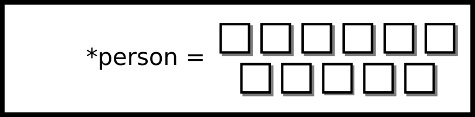
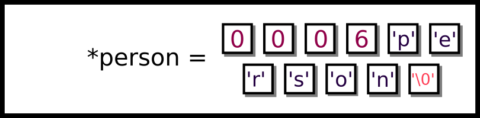

---
bibliography:
- introc/introc.bib
link-citations: true
title: "**CS341 系统编程课程手册**"
---

- [[#^the-c-programming-language|C 编程语言]]
  - [[#^history-of-c|C 的历史]]
    - [[#^features|特性]]
  - [[#^crash-course-introduction-to-c|C 速成导论]]
    - [[#^preprocessor|预处理器]]
  - [[#^language-facilities|语言设施]]
    - [[#^keywords|关键字]]
    - [[#^c-data-types|C 数据类型]]
    - [[#^operators|运算符]]
  - [[#^the-c-and-linux|C 与 Linux]]
    - [[#^everything-is-a-file|一切皆文件]]
    - [[#^system-calls|系统调用]]
    - [[#^c-system-calls|C 系统调用]]
  - [[#^common-c-functions|常用 C 函数]]
    - [[#^handling-errors|错误处理]]
    - [[#^input-output|输入／输出]]
    - [[#^stdin-oriented-functions|面向 stdin 的函数]]
    - [[#^string-h|string.h]]
  - [[#^c-memory-model|C 内存模型]]
    - [[#^structs|结构体]]
    - [[#^strings-in-c|C 中的字符串]]
    - [[#^places-for-strings|字符串的存放位置]]
  - [[#^pointers|指针]]
    - [[#^pointer-basics|指针基础]]
    - [[#^pointer-arithmetic|指针算术]]
    - [[#^so-what-is-a-void-pointer|那么 void 指针到底是什么？]]
  - [[#^common-bugs|常见 bug]]
    - [[#^nul-bytes|NUL 字节]]
    - [[#^double-frees|重复释放]]
    - [[#^returning-pointers-to-automatic-variables|返回指向自动变量的
      指针]]
    - [[#^insufficient-memory-allocation|内存分配不足]]
    - [[#^buffer-overflow-underflow|缓冲区溢出／下溢]]
    - [[#^strings-require-strlens1-bytes|字符串需要 strlen(s)+1
      个字节]]
    - [[#^using-uninitialized-variables|使用未初始化的变量]]
    - [[#^assuming-uninitialized-memory-will-be-zeroed|假定未初始化的内存会被
      清零]]
  - [[#^logic-and-program-flow-mistakes|逻辑与程序流程错误]]
    - [[#^equal-vs-equality|等于与相等]]
    - [[#^undeclared-or-incorrectly-prototyped-functions|未声明或原型错误的
      函数]]
    - [[#^extra-semicolons|多余的分号]]
  - [[#^topics|主题]]
  - [[#^questionsexercises|问题／练习]]
  - [[#^rapid-fire-pointer-arithmetic|速答：指针算术]]
    - [[#^rapid-fire-solutions|速答答案]]


# C 编程语言 ^the-c-programming-language

**如果你想教会人们系统，就别去召集程序员、给问题分类、
然后提 PR。而是教会他们去渴望那广阔而无尽的
C。** —— ** Antoine de Saint-Exupéry（经编辑）**

注意：本章很长，涉及大量细节。对于你已经有经验的
部分，完全可以略过。

C 是做严肃系统编程的事实标准编程语言。
为什么？因为大多数内核的 API 都是通过 C
暴露的。Linux 内核
（<a href="#ref-Love">[7]</a>）以及 MacOS 所基于的 XNU 内核
（<a href="#ref-xnukernel">[4]</a>）都是用 C 写的，并提供了 C API
—— 应用程序编程接口。Windows 内核用的是 C++，
但对初学的系统程序员来说，在 Windows 上做系统编程
要比在 UNIX 上难得多。C 没有类
和"资源获取即初始化"（RAII）这类抽象来帮你清理内存。
C 同时也给了你多得多的把脚打在自己身上的机会，
但它也让你能在细得多的粒度上做事。

## C 的历史 ^history-of-c

C 是 Dennis Ritchie 和 Ken Thompson 于 1973 年在贝尔实验室
开发的
（<a href="#ref-Ritchie:1993:DCL:155360.155580">[8]</a>）。
那时我们已经有了 Fortran、ALGOL 和 LISP
这些编程语言中的明珠。C 的目标有两重。
第一，它是为当时最流行的计算机
（比如 PDP-11）量身打造的。第二，它试图
去掉一些偏底层的构造（管理寄存器、
以及为跳转编写汇编），从而创造一门能够
以过程式（而不是像 LISP 那样数学式）
表达程序、同时代码可读的语言。所有这些
还要在依然能与操作系统对接的前提下做到。
听上去是个艰巨的工程。最初它只是
在贝尔实验室内部与 UNIX 操作系统一起使用。

第一次"真正"的标准化是 Brian Kernighan 和 Dennis
Ritchie 的书（<a href="#ref-kernighan1988c">[6]</a>）。
直到今天它仍被广泛视为唯一一套可移植的 C
指令集合。K&R 那本书被认为是学习 C 的
事实标准。C 有过从 ANSI 到 ISO 的不同标准，
不过作为语言规范，最终还是 ISO largely 胜出。
我们将主要聚焦于扩展了 ISO 的 POSIX C 库。
现在把房间里的大象请出去：Linux 内核并不符合 POSIX。
主要原因是 Linux 开发者不想为合规
支付费用。还有一点是，他们不想与
一大堆不同的标准完全合规，因为那意味着
要付出更高的维护成本来保持合规。

我们将以 C99 为目标，因为它是大多数计算机
都认可的标准，但有时也会用到一些较新的 C11 特性。我们
还会讲到像 `getline` 这样的顺带特性，因为它们
在 GNU C 库中用得非常广泛。我们会先通过
语言设施给出一个相当全面的概览。如果你
已经用过基于 C 的语言，完全可以略过。

### 特性 ^features

- 速度。程序与系统之间几乎没有隔阂。

- 简单。C 及其标准库由一组简单的
  可移植函数构成。

- 手工内存管理。C 让程序能够自己管理
  它的内存。不过，如果程序有内存
  错误，这也可能成为缺点。

- 无处不在。通过外部函数接口（FFI）以及各种类型的
  语言绑定，大多数其他语言都能调用 C 函数，
  反之亦然。标准库也无处不在。C 经受住了
  时间的考验，作为一门流行语言，它看起来
  哪儿也不会去。

## C 速成导论 ^crash-course-introduction-to-c

学习 C 的正统方式是从 hello world 程序开始。
Kernighan 和 Ritchie 当年提出的原始例子
至今没有变。

``` objectivec
#include <stdio.h>
int main(void) {
  printf("Hello World\n");
  return 0;
}
```

1.  `#include` 指令会把你操作系统里某个位置的
    `stdio.h` 文件（它代表 **st**an**d**ard **i**nput 和
    **o**utput，即**标准输入输出**）的内容拷贝过来，
    并把它替换到 `#include` 所在的位置。

2.  `int main(void)` 是一个函数声明。第一个词 `int`
    告诉编译器这个函数的返回类型。左括号
    之前的部分（`main`）是函数名。在 C 里，
    一个程序中不能有两个函数同名，
    因为 C 没有函数重载。不过，两个共享
    库是可以导出相同符号名的，动态链接器
    会用它找到的第一个。然后，参数列表跟在
    后面。当我们为普通函数 `(void)` 提供
    参数列表时，这意味着如果该函数被
    以非零个实参调用，编译器应当报错。
    对于像 `void func()` 这样的普通函数声明，
    意味着该函数可以像 `func(1, 2, 3)` 这样
    被调用，因为中间没有分隔符。`main` 是一个
    特殊函数。声明 `main` 有很多种方式，
    但标准的几种是 `int main(void)`、`int main()` 和
    `int main(int argc, char *argv[])`。

3.  `printf("Hello World\n");` 是一次函数调用。`printf` 被定义
    为 `stdio.h` 的一部分。该函数已经编译好，
    住在这台机器的别处 —— 也就是 C 标准
    库所在的位置。只要记得包含头文件，
    并用合适的参数调用该函数（一个字符串字面量
    `"Hello World\n"`）。当标准输出是终端时，它通常是
    行缓冲的，所以没有换行符的话文本可能
    待在缓冲区里而不会立刻出现。当程序
    正常退出时缓冲区仍会被刷新。

4.  `return 0`。`main` 必须返回一个整数。按照约定，
    `return 0` 表示成功，其他任何值表示失败。下面是
    一些有特殊含义的退出码／状态：
    <a href="http://tldp.org/LDP/abs/html/exitcodes.html">http://tldp.org/LDP/abs/html/exitcodes.html</a>。
    一般来说，假定 0 表示成功。

``` bash
$ gcc main.c -o main
$ ./main
Hello World
$
```

1.  `gcc` 是 GNU Compiler Collection 的缩写，
    它自带一大堆开箱可用的编译器。编译器
    从扩展名推断出你正在编译一个 .c 文件。

2.  `./main` 告诉你的 shell 执行当前
    目录中名为 main 的程序。该程序随后
    打印出 "hello world"。

不过，如果系统编程真像写 hello world 那么容易，
我们的工作就会轻松得多。

### 预处理器 ^preprocessor

什么是预处理器？预处理是编译器在**真正**
编译程序**之前**执行的一次复制粘贴操作。
下面是一个替换的例子。

``` objectivec
// Before preprocessing
#define MAX_LENGTH 10
char buffer[MAX_LENGTH]

// After preprocessing
char buffer[10]
```

不过预处理器也有副作用。一个问题是
预处理器需要能正确地做词法切分，这意味着
试图用预处理器重新定义 C 语言的内部机制
可能根本做不到。另一个问题是它们无法无限
嵌套 —— 深度是有上限的，到某个
界限就必须停下。宏也只是简单的
文本替换，不带语义。例如，看一下
如果一个宏试图做行内修改会发生什么。

``` objectivec
#define min(a,b) a < b ? a : b
int main() {
  int x = 4;
  if(min(x++, 5)) printf("%d is six", x);
  return 0;
}
```

宏是简单的文本替换，所以上面那个例子会展开成

``` objectivec
x++ < 5 ? x++ : 5
```

在这个例子里，输出什么并不明显，但它会是 6。
你能试着弄清为什么吗？另外，还要考虑
运算符优先级起作用的边界情况。

``` objectivec
int x = 99;
int r = 10 + min(99, 100); // r is 100!
// This is what it is expanded to
int r = 10 + 99 < 100 ? 99 : 100
// Which means
int r = (10 + 99) < 100 ? 99 : 100
```

某些参数带来的灵活性还有一些
逻辑问题。一个常见的困惑来源是静态
数组和 `sizeof` 运算符。

``` objectivec
#define ARRAY_LENGTH(A) (sizeof((A)) / sizeof((A)[0]))
int static_array[10]; // ARRAY_LENGTH(static_array) = 10
int* dynamic_array = malloc(10); // ARRAY_LENGTH(dynamic_array) = 2 or 1 consistently
```

这个宏有什么问题？好吧，如果传入
的是静态数组它是能工作的，因为 `sizeof`
静态数组会返回该数组占用的字节数，
除以 `sizeof(an_element)` 就会得到
条目数。但如果传入的是指向某块内存的指针，
对指针取 `sizeof` 再除以第一个
条目的大小，就不总能给出数组的长度了。

## 语言设施 ^language-facilities

### 关键字 ^keywords

C 有一大堆关键字。下面是一些截至 C99
你应该略知一二的构造。

1.  `break` 是一个用于 case 语句或循环
    语句的关键字。用在 case 语句中时，
    程序会跳到该块的末尾。\

    ``` objectivec
    switch(1) {
      case 1: /* Goes to this switch */
        puts("1");
        break; /* Jumps to the end of the block */
      case 2: /* Ignores this program */
        puts("2");
        break;
    } /* Continues here */
    ```

    In the context of a loop, using it breaks out of the inner-most
    loop. The loop can be either a `for`, `while`, or `do-while`
    construct\

    ``` objectivec
    while(1) {
      while(2) {
        break; /* Breaks out of while(2) */
      } /* Jumps here */
      break; /* Breaks out of while(1) */
    } /* Continues here */
    ```

2.  `const` 是一个语言级构造，告诉编译器
    这份数据应当保持常量。如果试图
    更改一个 const 变量，程序将无法编译。`const` 的
    行为稍有不同：放在类型前面时，
    编译器会重新排列 type 和 const 的顺序。然后编译器
    会使用一个
    <a href="https://en.wikipedia.org/wiki/Operator_associativity">https://en.wikipedia.org/wiki/Operator_associativity</a>。
    意思是该指针剩下的部分是常量。这
    被称为 const-correctness。\

    ``` objectivec
    const int i = 0; // Same as "int const i = 0"
    char *str = ...; // Mutable pointer to a mutable string
    const char *const_str = ...; // Mutable pointer to a constant string
    char const *const_str2 = ...; // Same as above
    const char *const const_ptr_str = ...;
    // Constant pointer to a constant string
    ```

    But, it is important to know that this is a compiler imposed
    restriction only. There are ways of getting around this, and the
    program will run fine with defined behavior. In systems programming,
    the only type of memory that you can’t write to is system
    write-protected memory.

    ``` objectivec
    const int i = 0; // Same as "int const i = 0"
    (*((int *)&i)) = 1; // i == 1 now
    const char *ptr = "hi";
    *ptr = '\0'; // Will cause a Segmentation Violation
    ```

3.  `continue` 是一个只存在于循环
    构造中的控制流语句。Continue 会跳过
    循环体的剩余部分，并把程序计数器
    设回循环开头。

    ``` objectivec
    int i = 10;
    while(i--) {
      if(1) continue; /* This gets triggered */
      *((int *)NULL) = 0;
    } /* Then reaches the end of the while loop */
    ```

4.  `do {} while();` 是另一个循环构造。这些循环
    先执行循环体，然后在循环底部检查条件。如果
    条件为零，就执行下一条语句 —— 程序
    计数器被设为循环之后的第一条指令。否则，
    循环体被执行。

    ``` objectivec
    int i = 1;
    do {
      printf("%d\n", i--);
    } while (i > 10) /* Only executed once */
    ```

5.  `enum` 用来声明一个枚举。枚举是一种
    可以取有限多个值的类型。如果你有一个
    枚举却没有指定任何数值，C 编译器会
    为该枚举生成一个唯一的编号（在
    当前枚举的上下文中），并用它来做比较。
    声明一个枚举实例的语法是
    `enum <type> varname`。这样做的额外好处是
    编译器可以对表达式做类型检查，确保
    你只在比较同类型的值。

    ``` objectivec
    enum day{ monday, tuesday, wednesday,
      thursday, friday, saturday, sunday};

    void process_day(enum day foo) {
      switch(foo) {
        case monday:
          printf("Go home!\n"); break;
        // ...
      }
    }
    ```

    It is completely possible to assign enum values to either be
    different or the same. It is not advisable to rely on the compiler
    for consistent numbering, if you assign numbers. If you are going to
    use this abstraction, try not to break it.

    ``` objectivec
    enum day{
      monday = 0,
      tuesday = 0,
      wednesday = 0,
      thursday = 1,
      friday = 10,
      saturday = 10,
      sunday = 0};

    void process_day(enum day foo) {
      switch(foo) {
        case monday:
          printf("Go home!\n"); break;
        // ...
      }
    }
    ```

6.  `extern` 声明一个变量但不定义它。它告诉
    编译器该变量存在，且定义在另一个源
    文件或库中，于是文件能编译通过，
    链接器稍后再把这个名字连到它的定义上。

    ``` objectivec
    // file1.c
    extern int panic;

    void foo() {
      if (panic) {
        printf("NONONONONO");
      } else {
        printf("This is fine");
      }
    }

    //file2.c

    int panic = 1;
    ```

7.  `for` 是一个关键字，允许你带着初始化
    条件、循环不变式和更新条件来做迭代。它的意图
    是等价于一个 while 循环，只是语法不同。

    ``` objectivec
    for (initialization; check; update) {
      //...
    }

    // Typically
    int i;
    for (i = 0; i < 10; i++) {
      //...
    }
    ```

    As of the C89 standard, one cannot declare variables inside the
    `for` loop initialization block. This is because there was a
    disagreement in the standard for how the scoping rules of a variable
    defined in the loop would work. It has since been resolved with more
    recent standards, so people can use the for loop that they know and
    love today.

    ``` objectivec
    for(int i = 0; i < 10; ++i) {
    ```

    The order of evaluation for a `for` loop is as follows.

    1.  执行初始化语句。

    2.  检查不变式。如果为假，终止循环并执行
        下一条语句。如果为真，继续进入循环体。

    3.  执行循环体。

    4.  执行更新语句。

    5.  跳回检查不变式这一步。

8.  `goto` 是一个允许你做条件跳转的关键字。
    不要在你的程序里用 `goto`。原因是
    当它和多个分支串在一起时，会让你的代码
    变得无穷倍地难懂，这被称为意大利面
    代码。不过在某些场景下用它还是
    可以接受的，比如 Linux 内核里的
    错误检查代码。当为清理再加一个
    栈帧并不是个好主意时，通常会在内核
    场景中用到这个关键字。内核清理的
    典型例子如下。

    ``` objectivec
    void setup(void) {
    Doe *deer;
    Ray *drop;
    Mi *myself;

    if (!setupdoe(deer)) {
      goto finish;
    }

    if (!setupray(drop)) {
      goto cleanupdoe;
    }

    if (!setupmi(myself)) {
      goto cleanupray;
    }

    perform_action(deer, drop, myself);

    cleanupray:
    cleanup(drop);
    cleanupdoe:
    cleanup(deer);
    finish:
    return;
    }
    ```

9.  `if else else-if` 是控制流关键字。用法有
    几种：(1) 裸 if；(2) 带 else 的 if；(3) 带
    else-if 的 if；(4) 同时带 else if 和 else 的
    if。注意 else 会与最近的 if 配对。
    一个与 if 和 else 不匹配有关的
    微妙 bug 是
    <a href="https://en.wikipedia.org/wiki/Dangling_else">https://en.wikipedia.org/wiki/Dangling_else</a>。
    语句总是从 if 执行到 else。如果
    中间任何一个条件为真，if 块就执行那个
    动作并跳到该块的末尾。

    ``` objectivec
    // (1)

    if (connect(...))
      return -1;

    // (2)
    if (connect(...)) {
      exit(-1);
    } else {
      printf("Connected!");
    }

    // (3)
    if (connect(...)) {
      exit(-1);
    } else if (bind(..)) {
      exit(-2);
    }

    // (4)
    if (connect(...)) {
      exit(-1);
    } else if (bind(..)) {
      exit(-2);
    } else {
      printf("Successfully bound!");
    }
    ```

10. `inline` 是一个编译器关键字，告诉编译器
    可以省略 C 函数的调用过程，把代码"粘贴"进
    调用方。也就是说，编译器被提示可以直接
    用函数体替换掉这次调用。这并不总是
    值得显式推荐，因为编译器通常足够聪明，
    知道什么时候该替你 `inline` 一个函数。

    ``` objectivec
    static inline int max(int a, int b) {
      return a > b ? a : b;
    }

    int main() {
      printf("Max %d", max(a, b));
      // printf("Max %d", a > b ? a : b);
    }
    ```

11. `restrict` 是一个关键字，告诉编译器这个特定的
    内存区域不应与任何其他内存区域重叠。
    它的用途是告诉程序的使用者：如果这些
    内存区域发生重叠，就是未定义行为。注意 memcpy
    在内存区域重叠时是未定义行为。如果你的程序中
    可能出现这种情况，就考虑改用 memmove。

    ``` objectivec
    memcpy(void * restrict dest, const void* restrict src, size_t bytes);

    void add_array(int *a, int * restrict c) {
      *a += *c;
    }
    int *a = malloc(3*sizeof(*a));
    a[0] = 1; a[1] = 2; a[2] = 3;
    add_array(a + 1, a); // Well defined
    add_array(a, a); // Undefined
    ```

12. `return` 是一个会退出当前函数的控制流运算符。
    如果该函数是 `void` 那就只是退出函数。
    否则，后面会跟一个参数作为返回值。

    ``` objectivec
    int process() {
      if (connect(...)) {
        return -1;
      } else if (bind(...)) {
        return -2;
      }
      return 0;
    }
    ```

13. `signed` 是一个很少用到的修饰符，它强制一个类型
    是有符号的而不是无符号的。它如此少用
    的原因是类型默认就是有符号的，需要加上
    `unsigned` 修饰符才能变成无符号，但在某些
    你想让编译器默认使用有符号类型的情形下
    它可能有用，比如下面这样。

    ``` objectivec
    int count_bits_and_sign(signed representation) {
      //...
    }
    ```

14. `sizeof` 是一个在编译期求值的运算符，
    它的值是该表达式所含的字节数。当
    编译器推断出类型时，下面这段代码会
    变成这样。

    ``` objectivec
    char a = 0;
    printf("%zu", sizeof(a++));
    ```

    ``` objectivec
    char a = 0;
    printf("%zu", 1);
    ```

    Which then the compiler is allowed to operate on further. The
    compiler must have a complete definition of the type at
    compile-time - not link time - or else you may get an odd error.
    Consider the following.

    ``` objectivec
    // file.c
    struct person;

    printf("%zu", sizeof(person));

    // file2.c

    struct person {
      // Declarations
    }
    ```

    This code will not compile because sizeof is not able to compile
    `file.c` without knowing the full declaration of the `person`
    struct. That is typically why programmers either put the full
    declaration in a header file or we abstract the creation and the
    interaction away so that users cannot access the internals of our
    struct. Additionally, if the compiler knows the full length of an
    array object, it will use that in the expression instead of having
    it decay into a pointer.

    ``` objectivec
    char str1[] = "will be 11";
    char* str2 = "will be 8";
    sizeof(str1) //11 because it is an array
    sizeof(str2) //8 because it is a pointer
    ```

    Be careful using sizeof for the length of a string!

15. `static` 是一个有三层含义的类型说明符。

    1.  与全局变量或函数声明一起使用时，
        意味着该变量或该函数的作用域
        仅限于本文件。

    2.  与函数内变量一起使用时，表示声明该
        变量具有静态分配 —— 也就是该变量
        在程序启动时分配一次，而不是每次程序
        运行时都分配，并且它的生命周期被延长到
        与程序相同。

    3.  用在数组参数（C99）的方括号里时，
        比如 `void f(int a[static 10])`，它承诺调用者传入一个
        至少含有那么多元素的指针。

    ``` objectivec
    // visible to this file only
    static int i = 0;

    static int _perform_calculation(void) {
      // ...
    }

    char *print_time(void) {
      static char buffer[200]; // Shared every time a function is called
      // ...
    }
    ```

16. `struct` 是一个允许你把多种类型
    配对成一种新结构的关键字。C 的结构体
    是连续的内存区域，其中的各个成员
    你可以像访问独立变量那样访问。注意元素
    之间可能有填充，因此每个变量都是内存对齐的
    （起始于一个是其大小整数倍的
    内存地址）。

    ``` objectivec
    struct hostname {
      const char *port;
      const char *name;
      const char *resource;
    }; // You need the semicolon at the end
    // Assign each individually
    struct hostname facebook;
    facebook.port = "80";
    facebook.name = "www.google.com";
    facebook.resource = "/";

    // You can use static initialization in later versions of c
    struct hostname google = {"80", "www.google.com", "/"};
    ```

17. `switch case default` 开关本质上就是被"神化"了的跳转
    语句。也就是说，你取一个字节或一个整数，
    程序的控制流就跳到那个位置。注意
    switch 语句的各个 case 之间会贯穿
    落。这意味着如果执行从某个 case 开始，
    控制流会继续流向所有后续的 case，
    直到遇到 break 语句。\

    ``` objectivec
    switch(/* char or int */) {
      case INT1: puts("1");
      case INT2: puts("2");
      case INT3: puts("3");
    }
    ```

    If we give a value of 2 then\

    ``` objectivec
    switch(2) {
      case 1: puts("1"); /* Doesn't run this */
      case 2: puts("2"); /* Runs this */
      case 3: puts("3"); /* Also runs this */
    }
    ```

    One of the more famous examples of this is Duff’s device which
    allows for loop unrolling. You don’t need to understand this code
    for the purposes of this class, but it is fun to look at
    (<a href="#ref-duff">[1]</a>).

    ``` objectivec
    send(to, from, count)
    register short *to, *from;
    register count;
    {
      register n=(count+7)/8;
      switch(count%8){
      case 0:	do{	*to = *from++;
      case 7:		*to = *from++;
      case 6:		*to = *from++;
      case 5:		*to = *from++;
      case 4:		*to = *from++;
      case 3:		*to = *from++;
      case 2:		*to = *from++;
      case 1:		*to = *from++;
        }while(--n>0);
      }
    }
    ```

    This piece of code highlights that switch statements are goto
    statements, and you can put any code on the other end of a switch
    case. Most of the time it doesn’t make sense, some of the time it
    just makes too much sense.

18. `typedef` 为一个类型声明别名。常与结构体一起
    使用，以避免不得不在类型中写 'struct'
    所带来的视觉杂乱。

    ``` objectivec
    typedef float real;
    real gravity = 10;
    // Also typedef gives us an abstraction over the underlying type used.
    // In the future, we only need to change this typedef if we
    // wanted our physics library to use doubles instead of floats.

    typedef struct link link_t;
    //With structs, include the keyword 'struct' as part of the original types
    ```

    In this class, we regularly typedef functions. A typedef for a
    function can be this for example

    ``` objectivec
    typedef int (*comparator)(void*,void*);

    int greater_than(void* a, void* b){
        return a > b;
    }
    comparator gt = greater_than;
    ```

    This declares a function type comparator that accepts two `void*`
    params and returns an integer.

19. `union` 是一种新的类型说明符。联合体是一块
    被许多变量共用的内存。它用来在保持
    一致性的同时，获得在类型之间切换的
    灵活性，而不需要维护一堆跟踪这些位的
    函数。考虑一个我们有着不同
    像素值的例子。

    ``` objectivec
    union pixel {
      struct values {
        char red;
        char blue;
        char green;
        char alpha;
      } values;
      uint32_t encoded;
    }; // Ending semicolon needed
    union pixel a;
    // When modifying or reading
    a.values.red;
    a.values.blue = 0x0;

    // When writing to a file
    fprintf(picture, "%d", a.encoded);
    ```

20. `unsigned` 是一个类型修饰符，强制它所修改的
    变量具备 `unsigned` 行为。Unsigned 只能
    与原始的 int 类型一起使用（像 `int` 和 `long`）。
    无符号算术伴随着很多行为上的差异。
    大体上说，除非你的代码
    涉及位移，否则了解无符号与
    有符号算术在行为上的差别并不重要。

21. `void` 是一个有双重含义的关键字。用于
    函数或参数定义时，它表示该函数
    明确不返回值，或不接受参数 respectively。
    下面声明了一个既不接受参数也不返回
    任何值的函数。

    ``` objectivec
    void foo(void);
    ```

    The other use of `void` is the generic pointer type `void *`. A
    `void *` pointer is just a memory address. `void` is an incomplete
    type, meaning that you cannot dereference a `void *`, but it can be
    converted to any other object pointer type without a cast. Standard
    C does not allow pointer arithmetic on a `void *`, although gcc and
    clang permit it as an extension (see the Pointers section).

    ``` objectivec
    int *array = void_ptr; // No cast needed
    ```

22. `volatile` 是一个编译器关键字。这意味着编译器
    不应把它的值优化掉。考虑下面这个简单的
    函数。\

    ``` objectivec
    int flag = 1;
    pass_flag(&flag);
    while(flag) {
        // Do things unrelated to flag
    }
    ```

    The compiler may, since the internals of the while loop have nothing
    to do with the flag, optimize it to the following even though a
    function may alter the data.\

    ``` objectivec
    while(1) {
        // Do things unrelated to flag
    }
    ```

    If you use the volatile keyword, the compiler is forced to keep the
    variable in and perform that check. This is useful for cases where
    you are doing multi-process or multi-threaded programs so that we
    can affect the running of one sequence of execution with another.

23. `while ` 代表传统的 `while` 循环。循环
    顶部有一个条件，在每次执行循环体
    之前都会检查它。如果条件求值为非零
    值，循环体就会被执行。

### C 数据类型 ^c-data-types

C 里有许多数据类型。你可能已经意识到，
它们要么是整数，要么是浮点数，其他类型都是
这两者的变体。

1.  `char` 表示恰好一个字节的数据。一个
    字节里的比特数可能有变化。`unsigned char` 和 `signed char` 的大小
    总是相同的，这对所有数据类型的
    `unsigned` 和 `signed` 版本都成立。它们必须对齐
    在某个边界上（意味着你
    不能使用两个地址之间的比特）。其余类型
    都会假定一个字节为 8 比特。

2.  `short (short int)` 至少为两个字节。它对齐在
    一个两字节边界上，意味着地址必须能被
    2 整除。

3.  `int` 至少为两个字节。同样对齐到
    一个两字节边界（<a href="#ref-ISON1124">[5]</a>）。在大多数
    机器上这将是 4 字节。

4.  `long (long int)` 至少为四个字节，对齐到
    一个四字节边界。在某些机器上这可以是 8 字节。

5.  `long long` 至少为八个字节，对齐到一个八字节
    边界。

6.  `float` 表示 IEEE 严格规定的 IEEE-754 单精度浮点
    数（<a href="#ref-4610935">[3]</a>）。在大多数机器上这将是四字节，
    对齐到一个四字节边界。

7.  `double` 表示由同一标准规定的 IEEE-754 双精度浮点
    数，它对齐到最近的八字节边界。

如果你想要定长整数类型，以便写出更可移植的代码，
可以使用 stdint.h 中定义的类型，形式为
\[u\]int*width*\_t，其中 u（可选）表示
符号性，width 可以是 8、16、32 和 64 中的任意一个。

### 运算符 ^operators

运算符是 C 语言中作为语言文法一部分
定义的语言构造。下面这些运算符按
优先级从低到高（按文中顺序）列出。

- `[]` 是下标运算符。`a[n] == *(a + n)`，其中 `n` 是一个
  数值类型，`a` 是一个指针类型。

- `->` 是结构体解引用（或箭头）运算符。如果你有一个
  指向结构体 `*p` 的指针，你可以用它访问其中一个
  元素。`p->element`。

- `.` 是结构体引用运算符。如果你有一个对象 `a`
  那么你可以访问某个元素 `a.element`。

- `+/-a` 是一元正号和负号运算符。它们分别保持或
  取反其下方整数或浮点类型的
  符号。

- `*a` 是解引用运算符。如果你有一个指针 `*p`，你可以
  用它访问位于该内存地址的元素。如果
  你在读，返回值将是底层类型的大小。
  如果你在写，值会带上一个偏移量被写入。

- `&a` 是取地址运算符。它接受一个元素并返回
  它的地址。

- `++` 是自增运算符。你可以在前置或后置
  位置使用它，也就是被自增的变量可以
  位于运算符之前或之后。`a = 0; ++a == 1` 和 `a = 0; a++ == 0`
  （两种情况下，之后 `a` 都是 1）。

- `--` 是自减运算符。它的语义与自增
  运算符相同，只是把变量的值
  减一。

- `sizeof` 是 sizeof 运算符，它在
  编译期求值。关键字一节中也提到过它。

- `a <mop> b`，其中 `<mop> in {+, -, *, %, /}` 是算术二元
  运算符。如果两个操作数都是数值类型，这些操作
  就分别是加、减、乘、取模和除法。如果左
  操作数是指针而右操作数是整数类型，那么
  只能使用加或减，此时会启用指针算术
  的规则。

- `>>/<<` 是位移运算符。右边的操作数必须是
  整数类型，其符号性会被忽略，除非它是带符号的
  负数，那样行为是未定义的。左边的
  运算符决定了很多语义。如果是左移，
  右侧总会引入零。如果是右移，
  则有几种不同的情况。

  - 如果左边的操作数是有符号的，那么该整数会被
    符号扩展。这意味着如果该数的符号位被置起，
    那么任何右移都会在左侧引入一。如果该数
    的符号位没有被置起，任何右移都会在左侧
    引入零。

  - 如果操作数是无符号的，那么无论哪种情况
    左侧都会引入零。

  ``` objectivec
  unsigned short uns = -127; // 1111111110000001
  short sig = 1; // 0000000000000001
  uns << 2; // 1111111000000100
  sig << 2; // 0000000000000100
  uns >> 2; // 0011111111100000
  sig >> 2; // 0000000000000000
  ```

  注意按字长做位移（比如在 64 位
  架构中移 64 位）会导致未定义行为。

- `<=/>=` 是大于等于／小于等于的关系
  运算符。它们的用法正如其名。

- `</>` 是大于／小于关系运算符。它们同样
  如其名所示那样工作。

- `==/=` 是等于／不等于关系运算符。它们
  同样如其名所示那样工作。

- `&&` 是逻辑与运算符。如果第一个操作数为零，
  第二个不会被求值，整个表达式求值为 0。
  否则，它产出第二个操作数的 1-0 值。

- `||` 是逻辑或运算符。如果第一个操作数不为零，
  那么第二个不会被求值，整个表达式
  求值为 1。否则，它产出第二个操作数的 1-0 值。

- `!` 是逻辑非运算符。如果操作数为零，
  它返回 1。否则，它返回 0。

- `&` 是按位与运算符。如果某个比特在两个
  操作数中都被置起，那么在输出中它
  被置起。否则不会。

- `|` 是按位或运算符。如果某个比特在任一
  操作数中被置起，那么在输出中它
  被置起。否则不会。

- `  ` 是按位非运算符。如果某个比特在输入中
  被置起，它在输出中就不会被置起，反之亦然。

- `?:` 是三目／条件运算符。你把一个布尔
  条件放在 ? 之前，如果它求值为非零，就返回
  冒号之前的元素，否则返回之后的
  元素。`1 ? a : b == a` 和 `0 ? a : b == b`。

- `a, b` 是逗号运算符。`a` 被求值，然后 `b` 被
  求值，并返回 `b`。在一串由逗号
  分隔的多条语句中，所有语句都从左到右
  求值，并返回最右边的表达式。

## C 与 Linux ^the-c-and-linux

到目前为止，我们已经覆盖了 C 的语言
基础。现在我们要把注意力转向 C 以及
可以用来与操作系统交互的 POSIX 系列函数。
我们会讲到可移植的函数，例如 `fwrite` 和 `printf`。我们
将在 POSIX 模型下、并在更具体的
GNU/Linux 下剖析并审视它们的内部实现。
这种理念中有若干条让其余内容
更容易理解的地方，所以先把这些
列出来。

### 一切皆文件 ^everything-is-a-file

POSIX 的一句箴言是一切皆文件。虽然这句话
近来已经有些过时，而且更进一步说是错的，
但它仍是我们今天使用的惯例。这句话
的含义是一切都是一个文件
描述符，也就是一个整数。例如，这里有一个文件对象、
一个网络套接字和一个内核对象。它们
都是内核文件描述符表中记录的
引用。

``` objectivec
int file_fd = open(...);
int network_fd = socket(...);
int kernel_fd = epoll_create1(...);
```

而对这些对象的操作是通过系统调用完成的。
在继续之前还有最后一件事要注意：文件描述符
仅仅是*指针*。想象一下例子中的
每个文件描述符实际上都指向对象表中的
某个条目，而操作系统随意从中挑选
（也就是文件描述符表）。对象可以被
分配和释放、关闭和打开等等。程序
通过系统调用和库函数所规定的 API
来与这些对象交互。

### 系统调用 ^system-calls

在深入常用 C 函数之前，我们需要知道
什么是系统调用。如果你是个学生并且已经完成了
HW0，完全可以略过本节。

系统调用是由内核执行的一次操作。首先，
程序把系统调用号和它的参数放进寄存器，
然后执行一条陷入指令。接着内核在内核
空间里执行这次调用，在那里它可以执行
用户代码无法执行特权操作。在上一个
例子中，我们拿到了一个文件描述符
对象的访问权。现在我们还可以往那个
代表文件的对象写入一些字节，而操作系统
会尽力把这些字节写到磁盘上。

``` objectivec
write(file_fd, "Hello!", 6);
```

当我们说内核会尽力而为时，这其中包括
该操作可能因为若干原因而失败的可能性。
其中一些是：文件已不再有效、硬盘
坏了、系统被打断了等等。程序员与外部
系统通信的方式就是系统调用。有一点
很重要：系统调用很昂贵。它们在时间和
CPU 周期上的代价近来有所下降，但仍应
尽量少用。

### C 系统调用 ^c-system-calls

接下来几节要讨论的许多 C 函数
都是抽象层，它们会根据当前平台去
调用正确的底层系统调用。比如它们
在 Windows 上的实现可能与其他操作系统
的完全不同。尽管如此，我们还是会在
Linux 实现的语境下学习它们。

## 常用 C 函数 ^common-c-functions

要查找关于任何函数的更多信息，请查阅
man 手册。注意 man 手册是分节组织的。
第 2 节是系统调用。第 3 节是 C 库。在
网络上，用 Google `man 7 open`。在
shell 中，用 `man -S2 open` 或 `man -S3 printf`。

### 错误处理 ^handling-errors

在深入所有这些函数的关键细节之前，要
知道 C 中大多数函数通过返回值
报告错误。这与 C++ 或 Java 之类用异常
处理错误的编程语言相抵触。有若干条
反对异常的理由。

1.  异常让控制流更难理解。

2.  面向异常的语言需要保留栈回溯并维护
    跳转表。

3.  异常可能是复杂的对象。

同样也有若干条支持异常的理由。

1.  异常可以从好几层深处传来。

2.  异常有助于减少全局状态。

3.  异常区分了业务逻辑和正常流程。

无论利弊如何，我们仍然采用前一种，
因为要与 FORTRAN 之类的语言保持向后
兼容
（<a href="#ref-fortran72">[2]</a>）。每个线程都会拿到
`errno` 的一份拷贝，因为它存放在每个线程栈的
栈顶 —— 线程稍后再讲。做法是调用一个
可能返回错误的函数，如果按 man 手册
该函数返回了错误，那么就该由程序员
去检查 errno。

``` objectivec
#include <errno.h>

FILE *f = fopen("/does/not/exist.txt", "r");
if (NULL == f) {
    fprintf(stderr, "Errno is %d\n", errno);
    fprintf(stderr, "Description is %s\n", strerror(errno));
}
```

还有一个快捷函数 `perror`，它会打印出
errno 的英文描述。另外，函数也可能
直接在返回值里返回错误码。

``` objectivec
int s = getnameinfo(...);
if (0 != s) {
     fprintf(stderr, "getnameinfo: %s\n", gai_strerror(s));
}
```

务必查一下 man 手册中关于返回码的
特性说明。

### 输入／输出 ^input-output

本节我们会把标准库里所有基础的输入输出
函数过一遍，并对照系统调用。每个进程
在开始执行时都有三条数据流：标准输入
（供程序输入），标准输出（供程序
输出），以及标准错误
（供错误和调试信息）。通常，标准输入
来自程序运行所在的终端，标准输出
也是同一个终端。不过程序员可以使用重定向，
使得他们的程序能够把输出发送给
文件、或从文件接收输入，也
可以和其他程序之间来回。

它们分别由文件描述符 0 和 1 指定。
2 被保留给标准错误，按库的惯例它是
无缓冲的
（即 IO 操作会立即执行）。

#### 面向 stdout 的流 ^stdout-oriented-streams

标准输出或者说面向 stdout 的流是指
唯一选项就是写到 stdout 的流。`printf` 是
大多数人熟悉的这一类函数。它的第一个参数
是一个格式字符串，其中包含待打印数据的
占位符。常见的格式说明符
如下。

1.  `%s` 把该参数当作 C 字符串指针处理，
    持续打印所有字符直到遇到
    NUL 字符

2.  `%d` 把该参数打印为整数

3.  `%p` 把该参数打印为内存地址。

出于性能考虑，`printf` 会缓存数据直到
它的缓存满了或打印出一个换行符。下面
是一个打印东西的例子。

``` objectivec
char *name = ... ; int score = ...;
printf("Hello %s, your result is %d\n", name, score);
printf("Debug: The string and int are stored at: %p and %p\n", name, &score );
// name already is a char pointer and points to the start of the array.
// We need "&" to get the address of the int variable
```

由上一节可知，`printf` 调用了系统调用 `write`。
`printf` 是一个 C 库函数，而 `write` 是一个系统调用。

printf 的缓冲语义有点复杂。ISO 定义了
三种类型的流（<a href="#ref-ISON1124">[5]</a>）。

- 无缓冲：流的内容会尽快
  到达它的目的地。

- 行缓冲：流的内容在
  给出一个换行符后就到达目的地。

- 全缓冲：流的内容在
  缓冲区满了时就到达目的地。

标准错误被定义为"非全缓冲"
（<a href="#ref-ISON1124">[5]</a>）。标准输出和标准输入
只在且仅在流的目的地不是交互式设备时
才被定义为全缓冲。通常，标准错误是
无缓冲的；如果输出是终端，标准输入
和输出是行缓冲的，否则是全缓冲的。这
和 printf 有关，因为 printf 只是使用
FILE 接口提供的抽象，并用上述语义来决定
何时写入。可以通过在流上调用
fflush() 来强制一次写入。

要打印字符串和单个字符，使用 `puts(char *name )` 和
`putchar(char c )`

``` objectivec
puts("Current selection: ");
putchar('1');
```

#### 其他流 ^other-streams

要打印到其他文件流，使用
`fprintf( _file_ , "Hello %s, score: %d", name, score);`，其中 \_file\_
要么是预定义的（'stdout' 或 'stderr'），要么是由 `fopen` 或 `fdopen`
返回的一个 FILE 指针。还有一个等价的
printf 版本可以与文件描述符配合使用，
叫作 dprintf。直接用
`dprintf(int fd, char* format_string, ...);`。

要把数据打印进 C 字符串，使用 `sprintf`，更好的选择是 `snprintf`，最
好的选择是 `asprintf`。`sprintf` 不做任何边界检查，
所以只在输出能保证放进缓冲区时才用它
—— 比如打印一个 32 位整数，
它连符号位和 NUL 字节算起也永远不超过 12 字节。`snprintf`
会被告知缓冲区大小，永远
不会写超出它。它返回本会被
写入的字符数（不含结尾的那个字节），
所以返回值大于或等于缓冲区大小就意味着
输出被截断了。`asprintf`
是最好的：它在堆上分配一块足以容纳
整个结果的缓冲区，所以输出永远不会被截断或溢出，
代价是一次堆分配，调用者之后必须
`free`。

``` objectivec
// Fixed length: sprintf is OK because the output always fits
char int_string[20];
sprintf(int_string, "%d", integer);

// Variable length: snprintf never overflows, but may truncate
char result[200];
int len = snprintf(result, sizeof(result), "%s:%d", name, score);
if (len >= (int) sizeof(result)) {
  // Output was truncated
}

// Variable length: asprintf allocates exactly enough memory
char *message = NULL;
if (asprintf(&message, "%s:%d", name, score) == -1) {
  // Allocation failed
}
// ...
free(message);
```

### 面向 stdin 的函数 ^stdin-oriented-functions

标准输入或者说面向 stdin 的函数直接从 stdin 读取。
这些函数中的大多数因为设计不佳
已被弃用。这些函数把 stdin 当作
一个我们可以从中读取字节的文件。
最臭名昭著的违规者之一是 `gets`。`gets`
在 C99 标准中已被弃用，并已从最新的
C 标准（C11）中移除。之所以被弃用
是因为没有办法控制被读取的长度，
因此缓冲区很容易被写溢出。当有人
恶意地这样劫持程序的控制
流时，这就称为缓冲区溢出。

程序应当改用 `fgets` 或 `getline`。下面是
一个最多从标准输入读取 10 个字符的
简单例子。

``` objectivec
char *fgets (char *str, int num, FILE *stream);

ssize_t getline(char **lineptr, size_t *n, FILE *stream);

// Example, the following will not read more than 9 chars
char buffer[10];
char *result = fgets(buffer, sizeof(buffer), stdin);
```

注意，与 `gets` 不同，`fgets` 会把换行符
也拷进缓冲区。另一方面，`getline` 的一个
优点是它会自动在堆上分配并重新分配
一块足够大的缓冲区。

``` objectivec
// ssize_t getline(char **lineptr, size_t *n, FILE *stream);

/* set buffer and size to 0; they will be changed by getline */
char *buffer = NULL;
size_t size = 0;

ssize_t chars = getline(&buffer, &size, stdin);

// Discard newline character if it is present,
if (chars > 0 && buffer[chars-1] == '\n')
buffer[chars-1] = '\0';

// Read another line.
// The existing buffer will be re-used, or, if necessary,
// It will be `free`'d and a new larger buffer will `malloc`'d
chars = getline(&buffer, &size, stdin);

// Later... don't forget to free the buffer!
free(buffer);
```

除了这些函数，我们还有含义双重的
`perror`。假设某次函数调用按 errno
约定失败了。`perror(const char* message)` 会把该错误的英文版本
打印到 stderr。

``` objectivec
int main(){
  int ret = open("IDoNotExist.txt", O_RDONLY);
  if(ret < 0){
    perror("Opening IDoNotExist:");
  }
  //...
  return 0;
}
```

如果想让库函数在读取之外还解析输入，用
`scanf`（或 `fscanf` 或 `sscanf`）分别从默认输入
流、任意文件流或 C 字符串获取输入。
所有这些函数都会返回解析出的项数。
检查一下这个数是否等于期望的项数是个好
习惯。另外，自然地，和 `printf`
一样，`scanf` 函数需要有效的指针。除了
指向有效内存之外，它们还必须是可写的。
传入错误的指针值是常见的错误
来源。例如，

``` objectivec
int *data = malloc(sizeof(int));
char *line = "v 10";
char type;
// Good practice: Check scanf parsed the line and read two values:
int ok = 2 == sscanf(line, "%c %d", &type, &data); // pointer error
```

我们想把字符值写进 `type`，把整数值
写进 malloc 得到的内存里。然而我们
传的是数据指针的地址，而不是指针
所指向的东西！所以 `sscanf` 改变的是
指针本身。这个指针现在会指向地址 10，
因此这段代码稍后在调用 free(data) 时会失败。

现在，scanf 会持续读字符直到字符串结束。
为防止 scanf 造成缓冲区溢出，请使用
一个格式说明符。记得传入比缓冲区
大小少一的值。

``` objectivec
char buffer[10];
scanf("%9s", buffer); // reads up to 9 characters from input (leave room for the 10th byte to be the terminating byte)
```

还有最后一件事要注意：如果说系统调用
很昂贵，那么 `scanf` 系列因其
兼容性原因要昂贵得多。由于它必须
能正确处理所有 printf 的说明符，
所以代码效率不高 TODO：**需要补充引用**。对
于高性能程序，人们应该自己写解析。
如果只是一个一次性的程序或脚本，
那就可以随意用 scanf。

### string.h ^string-h

String.h 里的函数是一系列处理如何
操纵和检查内存片段的函数。它们大多数
处理 C 字符串。C 字符串是一串以
NUL 字符分隔的字节，该字符
等于 0x00 这个字节。
<a href="https://linux.die.net/man/3/string">https://linux.die.net/man/3/string</a>。
文档中没有说明的任何行为，比如
`strlen(NULL)` 的结果，都视为未定义行为。

- `size_t strlen(const char *s)` 返回字符串的长度。

- `int strcmp(const char *s1, const char *s2)` 返回一个整数，
  用来判定两个字符串的字典序。如果 s1 在
  字典中排在 s2 之前，就返回负值。如果
  两个字符串相等，则返回 0。否则返回
  正值。只有符号是有保证的，所以
  要把结果与 0 比较，而不是与 -1 或 1 比较。

- `char *strcpy(char *dest, const char *src)` 把位于 `src` 的字符串
  拷贝到 `dest`。**该函数假定 dest 有足够空间容纳 src，
  否则是未定义行为**

- `char *strcat(char *dest, const char *src)` 把位于
  `src` 的字符串连接到目标
  的末尾。**该函数假定目标末尾有
  足够空间容纳 `src`，包括那个 NUL
  字节**

- `char *strdup(const char *dest)` 返回该字符串的一份 `malloc` 拷贝。

- `char *strchr(const char *haystack, int needle)` 返回 `haystack` 中第一次出现
  `needle` 位置的指针。如果没有找到，
  则返回 `NULL`。

- `char *strstr(const char *haystack, const char *needle)` 同上，
  但这次是找一个字符串！

- `char *strtok(const char *str, const char *delims)`

  一个危险但有用的函数 strtok，它接受一个
  字符串并对它做分词。也就是说，它会把
  字符串变成若干独立的字符串。
  这个函数的规格很多，所以请读
  man 手册。下面是一个人为构造的例子。

  ``` objectivec
  #include <stdio.h>
          #include <string.h>

          int main(){
            char* upped = strdup("strtok,is,tricky,!!");
            char* start = strtok(upped, ",");
            do{
              printf("%s\n", start);
            }while((start = strtok(NULL, ",")));
            return 0;
          }
  ```

  **输出**

      strtok
      is
      tricky
      !!

  为什么它很棘手？那么如果 upped 被改成
  下面这样会发生什么？

  ``` objectivec
  char* upped = strdup("strtok,is,tricky,,,!!");
  ```

- 要做整数解析，用
  `long int strtol(const char *nptr, char **endptr, int base);` 或
  `long long int strtoll(const char *nptr, char **endptr, int base);`。

  这些函数所做的是接受一个指向你的字符串
  `*nptr` 的指针，以及一个 `base`（即
  二进制、八进制、十进制、十六进制等）和一个
  可选的指针 `endptr`，然后返回一个解析出的值。

  ``` objectivec
  int main(){
            const char *nptr = "1A2436";
            char* endptr;
            long int result = strtol(nptr, &endptr, 16);
            return 0;
          }
  ```

  不过要小心！错误处理很棘手，因为该函数
  不会返回错误码。如果传入一个无效的
  数字字符串，它会返回 0。调用者必须
  小心区分一个合法的 0 和一次错误。
  这通常要用到下面这样的 errno 跳板。

  ``` objectivec
  int main(){
            const char *input = "0"; // or "!##@" or ""
            char* endptr;
            int saved_errno = errno;
            errno = 0;
            long int parsed = strtol(input, &endptr, 10);
            if(parsed == 0 && errno != 0){
              // Definitely an error
            }
            errno = saved_errno;
            return 0;
          }
  ```

- `void *memcpy(void *dest, const void *src, size_t n)` 把从 `src` 开始的 `n` 个字节
  移动到 `dest`。**务必小心**，
  当内存区域重叠时存在未定义
  行为。这是"在我机器上能跑！"的经典
  例子之一，因为很多时候 Valgrind 根本
  察觉不到，因为在你机器上它看起来
  确实能工作。考虑更安全的版本 `memmove`。

- `void *memmove(void *dest, const void *src, size_t n)` 做的是和
  上面一样的事，但如果内存区域重叠，则
  保证所有字节都会被正确拷贝。`memcpy` 和 `memmove`
  都在 `string.h` 中声明。

## C 内存模型 ^c-memory-model

C 内存模型可能和你之前见过的那些
都不一样。你不是带着类型安全去分配一个
对象，而是要么用一个自动变量，要么用
`malloc` 或另一个家族成员去请求一段字节，
之后再 `free` 它。

### 结构体 ^structs

从低层的角度看，结构体只是一段
连续的内存，别无他物。就像数组一样，
结构体有足够的空间容纳它的所有
成员。但与数组不同的是，它可以存储
不同的类型。考虑下面声明的
contact 结构体。

``` objectivec
struct contact {
  char firstname[20];
  char lastname[20];
  unsigned int phone;
};

struct contact person;
```

我们经常会用下面这个 typedef，这样就可以把
结构体名当作完整类型使用。

``` objectivec
typedef struct contact contact;
contact person;

typedef struct optional_name {
  ...
} contact;
```

如果你在不做任何优化和重排的情况下
编译这段代码，可以预期各个变量的
地址长这样。

``` objectivec
&person           // 0x100
&person.firstname // 0x100 = 0x100+0x00
&person.lastname  // 0x114 = 0x100+0x14
&person.phone     // 0x128 = 0x100+0x28
```

你的编译器所做的只是说"预留这么多
空间"。每当代码中发生读或写，
编译器就会计算该变量的偏移量。
偏移量就是变量开始的位置。phone
变量从第 `0x128` 个字节开始，用这个编译器
会持续 sizeof(int)
个字节。**不过偏移量并不决定变量在哪里
结束**。考虑下面这个在内核代码中
很常见的黑魔法。

``` objectivec

typedef struct {
  int length;
  char c_str[0];
} string;

const char* to_convert = "person";
int length = strlen(to_convert);

// Let's convert to a c string
string* person;
person = malloc(sizeof(string) + length+1);
```

目前，我们的内存看起来是下面
这张图。那些盒子里什么都没有。

<figure data-latex-placement="H">
<p></p>
<figcaption>指向 11 个空盒子的结构体</figcaption>
</figure>

那么当我们给 length 赋值时会发生什么？前四个盒子
会被填入 length 变量的值。剩下的空间
保持不动。我们假设我们的机器是大端的。
这意味着最低有效字节在最后。

``` objectivec
person->length = length;
```

<figure data-latex-placement="H">
<p></p>
<figcaption>指向 11 个盒子的结构体，4 个填着 0006，7 个
为空</figcaption>
</figure>

现在，我们可以用下面这个
调用把一个字符串写到我们结构体的末尾。

``` C
strcpy(person->c_str, to_convert);
```

<figure data-latex-placement="H">
<p></p>
<figcaption>指向 11 个盒子的结构体，4 个填着 0006，7 个是
字符串 “person”</figcaption>
</figure>

我们甚至可以做个健全性检查，确认两个字符串相等。

``` C
strcmp(person->c_str, "person") == 0 //The strings are equal!
```

那个零长度数组的作用是指向**结构体的
末尾**。这意味着编译器会在操作系统上
为所有元素按其大小计算出的空间留出位置
（int、char 等等）。零长度数组
不占用任何字节空间。由于
结构体是连续的内存块，我们可以分配**更多**
空间，把多出来的空间当作存放额外字节的地方。
虽然这看起来像个小把戏，但它是一项
重要的优化，因为要用别的方式
实现变长字符串，就得调用两次
不同的内存分配。这对
字符串操作这种在编程中如此常见的
事情来说是极其低效的。

### C 中的字符串 ^strings-in-c

在 C 中，出于历史原因，我们有
<a href="https://en.wikipedia.org/wiki/Null-terminated_string">https://en.wikipedia.org/wiki/Null-terminated_string</a>
字符串，而不是
<a href="https://en.wikipedia.org/wiki/String_(computer_science)#Length-prefixed">https://en.wikipedia.org/wiki/String_(computer_science)#Length-prefixed</a>。对于日常编程，请记住给你的字符串
加上 NUL 终止！C 中的一个字符串定义为
一串以 '\0'（即 NUL 字节）结尾的
字节。

### 字符串的存放位置 ^places-for-strings

每当你定义一个字符串字面量 —— 也就是
形如 `char* str = "constant"` 的那种 —— 那个字符串会被存放在
*data* 段中。取决于你的体系结构，它是**只读**的，
这意味着任何修改该字符串的尝试
都会导致 SEGFAULT。你也可以把字符串声明
在可写数据段或者栈中。方法是
为字符串指定长度，或者用方括号代替指针
`char str[] = "mutable"`，并分别放在全局作用域或函数
作用域中以获得数据段或栈。不过，如果一个
`malloc` 的空间，就可以在那里存放
想要的任何内容。忘记给字符串加 NUL 终止
对字符串来说影响很大！
边界检查很重要。书中前面提到的
heartbleed bug 部分原因就在这里。

C 中的字符串表示为内存中的字符。
字符串的末尾包含一个 NUL（0）字节。
所以 "ABC" 需要四（4）个字节。
弄清 C 字符串长度的唯一方法就是
一直读内存，直到找到那个 NUL 字节。
C 的字符总是恰好一个字节
大小。

#### 字符串字面量是常量 ^string-literals-are-constant

字符串字面量天然是常量。任何写入
都会让操作系统产生 SEGFAULT。

``` objectivec
char array[] = "Hi!"; // array contains a mutable copy
strcpy(array, "OK");

char *ptr = "Can't change me"; // ptr points to some immutable memory
strcpy(ptr, "Will not work");
```

字符串字面量是存储在程序只读数据
段中的字符数组，该段是不可变的。
两个字符串字面量可能
共享同一块内存。下面是一个例子。

``` objectivec
char *str1 = "Mark Twain likes books";
char *str2 = "Mark Twain likes books";
```

由 `str1` 和 `str2` 指向的字符串实际上
可能位于内存中的同一个位置。

不过，字符数组包含的字面值是从
代码段拷贝到栈上或静态内存中的。
下面这些字符数组位于不同的内存位置。

``` objectivec
char arr1[] = "Mark Twain also likes to write";
char arr2[] = "Mark Twain also likes to write";
```

下面列出一些初始化字符串的常见方式。它们
在内存中位于哪里？

``` objectivec
char *str = "ABC";
char str[] = "ABC";
char str[]={'A','B','C','\0'};
```

``` objectivec
char ary[] = "Hello";
char *ptr = "Hello";
```

我们也可以轻松地打印出一个 C 字符串的
指针和内容。下面是一些示例代码。

``` objectivec
char ary[] = "Hello";
char *ptr = "Hello";
// Print out address and contents
printf("%p : %s\n", ary, ary);
printf("%p : %s\n", ptr, ptr);
```

如前所述，字符数组是可变的，所以我们可以
修改它的内容。注意要写在数组
边界之内。C 在编译期
*不会*做边界检查，但非法读／写
会让你的程序崩溃。

``` objectivec
strcpy(ary, "World"); // OK
strcpy(ptr, "World"); // NOT OK - Segmentation fault (crashes by default; unless SIGSEGV is blocked)
```

不过与数组不同的是，我们可以改变 `ptr` 让它
指向另一块内存，

``` objectivec
ptr = "World"; // OK!
ptr = ary; // OK!
ary = "World"; // NO won't compile
// ary is doomed to always refer to the original array.
printf("%p : %s\n", ptr, ptr);
strcpy(ptr, "World"); // OK because now ptr is pointing to mutable memory (the array)
```

这里 `ptr` 最初指向一个字符串字面量，它位于
只读内存中，因此无法被修改。相比之下，`ary`
根本不是一个指针：它是一个数组，
持有这些字符自己的一份可写拷贝
（在栈上，或者如果全局声明则在静态内存中）。在
大多数表达式中，数组名会被转换成
指向其第一个元素的指针，这就是为什么
`ary` 可以被传给 `printf` 或 `strcpy`，但
数组本身不能被重新赋值。指针更灵活，
因为它们可以指向不同的内存，但那部分
内存是否可写取决于它们所指向的东西。

通常，指针指向堆内存（来自 `malloc`），那**可以**
被修改。

## 指针 ^pointers

指针是保存地址的变量。这些地址有
数值，但通常程序员感兴趣的是那个
内存地址上内容的值。在本节中，我们会试着
带你对指针做一次入门介绍。

### 指针基础 ^pointer-basics

#### 声明一个指针 ^declaring-a-pointer

指针指向一个内存地址。指针的类型是有用的
—— 它告诉编译器需要读／写多少字节，
并界定指针算术（加法和
减法）的语义。

``` objectivec
int *ptr1;
char *ptr2;
```

由于 C 的语法，`int*` 或任何指针本身
都不是一种独立的类型。你必须在每个
指针变量前加一个星号。一个常见的
陷阱是，下面这样

``` objectivec
int* ptr3, ptr4;
```

只会把 `*ptr3` 声明为指针。`ptr4` 实际上会是一个
普通的 int 变量。要修正这个声明，
确保 `*` 位于指针之前。

``` objectivec
int *ptr3, *ptr4;
```

对结构体也要记住这一点。如果在没有
typedef 的情况下声明，那么星号
要放在类型之后。

``` objectivec
struct person *ptr3;
```

#### 用指针读／写 ^reading-writing-with-pointers

假设 `int *ptr` 被声明了。为了讨论的
方便，假定 `ptr` 包含内存地址 `0x1000`。要写入
这个指针，必须先解引用并赋一个值。

``` objectivec
*ptr = 0; // Writes some memory.
```

C 所做的是取出该指针的类型（它是一个 `int`），
从指针起始处写入 `sizeof(int)`
个字节，也就是说字节
`0x1000`、`0x1001`、`0x1002`、`0x1003` 都会是零。写入的
字节数取决于指针类型。对于所有
原始类型都是一样的，但结构体稍微
有些不同。

读取的方式大致相同，只是你把变量
放在它需要取值的位置。

``` objectivec
int doubled = *ptr * 2;
```

对非原始类型进行读写会变得棘手。编译
单元 —— 通常是文件或头文件 —— 需要
能直接拿到该数据结构的大小。
这意味着不透明的数据结构
无法被拷贝。下面是一个赋值
结构体指针的例子：

``` objectivec
#include <stdio.h>

typedef struct {
  int a1;
  int a2;
} pair;

int main() {
  pair obj;
  pair zeros;
  zeros.a1 = 0;
  zeros.a2 = 0;
  pair *ptr = &obj;
  obj.a1 = 1;
  obj.a2 = 2;
  *ptr = zeros;
  printf("a1: %d, a2: %d\n", ptr->a1, ptr->a2);
  return 0;
}
```

至于读取结构体指针，不要直接做。
相反，程序员会为创建、复制和销毁
结构体创造抽象。如果这听起来很熟悉，
那正是 C++ 在标准委员会跑偏之前
原本打算做的事。

### 指针算术 ^pointer-arithmetic

就像你可以给一个整数加一个整数，
你也可以给一个指针加一个整数。不过，
指针类型决定了指针要
增加多少。指针移动的距离等于
所加的值乘以底层类型的大小。对
char 指针来说这很简单，
因为字符永远是一个字节。

``` objectivec
char *ptr = "Hello"; // ptr holds the memory location of 'H'
ptr += 2; // ptr now points to the first 'l''
```

如果一个 int 是 4 字节，那么 ptr+1 就指向 ptr
所指向的东西之后 4 字节的位置。

``` objectivec
char *ptr = "ABCDEFGH";
int *bna = (int *) ptr;
bna +=1; // Would cause iterate by one integer space (i.e 4 bytes on some systems)
ptr = (char *) bna;
printf("%s", ptr);
```

注意只打印出了 'EFGH'。为什么？如前所述，
在执行 'bna+=1' 时我们是把**整数**指针
加了 1（在大多数系统上相当于
4 字节），这等于 4 个
字符（每个字符只有 1 字节）。因为
C 中的指针算术总是自动按所指向类型的
大小缩放，所以 ISO C 标准
禁止对 void 指针做算术。
话虽如此，编译器常常会把底层类型
当作 `char`。下面是一个机翻。下面这两次指针
算术操作是相等的。

``` objectivec
int *ptr1 = ...;

// 1
int *offset = ptr1 + 4;

// 2
char *temp_ptr1 = (char*) ptr1;
int *offset = (int*)(temp_ptr1 + sizeof(int)*4);
```

**每次做指针算术时，都深呼吸一下，确认
你移动的字节数确实是你以为的那个
字节数。**

### 那么 void 指针到底是什么？ ^so-what-is-a-void-pointer

void 指针是没有类型的指针。当
数据类型未知时，或者在把 C 代码与
其他没有 API 的编程语言对接时，会用到
void 指针。你可以把它看作一个原始
指针，或者说一个内存地址。`malloc` 默认返回一个
void 指针，它可以安全地提升为任何
其他类型。

``` objectivec
void *give_me_space = malloc(10);
char *string = give_me_space;
```

C 会自动把 `void*` 提升到它恰当的类型。`gcc` 和
`clang` 并不完全符合 ISO C，这意味着
它们会允许对 void 指针做算术。
它们会把它当作一个 `char` 指针。
不要这样做，因为它不可移植 —— 并不保证
在所有编译器上都能工作！

## 常见 bug ^common-bugs

### NUL 字节 ^nul-bytes

这段代码有什么问题？

``` objectivec
void mystrcpy(char*dest, char* src) {
  // void means no return value
  while( *src ) { dest = src; src ++; dest++; }
}
```

在上面的代码里，它只是把 dest 指针改成指向
源字符串。另外 NUL 字节也没有被拷贝。下面是一个更好的
版本 ——

``` objectivec
while( *src ) { *dest = *src; src ++; dest++; }
*dest = *src;
```

注意，下面这种实现也很常见，
它在表达式测试内部做所有事，包括拷贝
NUL 字节。不过这是糟糕的风格，
因为在同一行里做了多个
操作。

``` objectivec
while( (*dest++ = *src++ )) {};
```

### 重复释放 ^double-frees

重复释放错误是指程序不小心两次
试图释放同一块已分配的内存。

``` objectivec
int *p = malloc(sizeof(int));
free(p);

*p = 123; // Oops! - Dangling pointer! Writing to memory we don't own anymore

free(p); // Oops! - Double free!
```

修复办法首先是写出正确的程序！其次，
一旦内存被释放后，把指针设为 NULL
是一个好习惯。这能确保
程序不会错误地使用该指针而
不崩溃。

``` objectivec
p = NULL; // No dangling pointers
```

### 返回指向自动变量的指针 ^returning-pointers-to-automatic-variables

``` objectivec
int *f() {
  int result = 42;
  static int imok;
  return &imok; // OK - static variables are not on the stack
  return &result; // Not OK
}
```

自动变量只在函数的生命周期内
绑定到栈内存。函数返回之后，继续
使用那块内存就是错误。

### 内存分配不足 ^insufficient-memory-allocation

``` objectivec
struct User {
  char name[100];
};
typedef struct User user_t;

user_t *user = (user_t *) malloc(sizeof(user));
```

在上面的例子里，我们需要为该结构体
分配足够的字节。相反，我们只分配了
刚好能放一个指针的字节。一旦我们开始
使用那个用户指针，就会破坏内存。正确的
代码如下。

``` objectivec
struct User {
  char name[100];
};
typedef struct User user_t;

user_t * user = (user_t *) malloc(sizeof(user_t));
```

### 缓冲区溢出／下溢 ^buffer-overflow-underflow

一个著名的例子：Heart Bleed 把一个
尺寸不足的缓冲区 memcpy 了进去。一个
简单例子：实现一个 strcpy，在确定
所需内存大小时忘了给 strlen 加一。

``` objectivec
#define N (10)
int i = N, array[N];
for( ; i >= 0; i--) array[i] = i;
```

C 不会检查指针是否有效。上面的例子写入了
`array[10]`，它在数组边界之外。这可能导致内存
损坏，因为那块内存位置很可能正被
别的东西使用。在实践中，这可能更难发现，
因为溢出／下溢可能发生在一次库调用里。
下面是我们那位老朋友
gets。

``` objectivec
gets(array); // Let's hope the input is shorter than my array!
```

### 字符串需要 strlen(s)+1 个字节 ^strings-require-strlens1-bytes

每个字符串在最后一个字符之后都必须
有一个 NUL 字节。要存储字符串
“Hi” 需要 3 个字节：\[H\] \[i\] \[\0\]。

``` objectivec
char *strdup(const char *input) {  /* return a copy of 'input' */
  char *copy;
  copy = malloc(sizeof(char*));     /* nope! this allocates space for a pointer, not a string */
  copy = malloc(strlen(input));     /* Almost...but what about the null terminator? */
  copy = malloc(strlen(input) + 1); /* That's right. */
  strcpy(copy, input);   /* strcpy will provide the null terminator */
  return copy;
}
```

### 使用未初始化的变量 ^using-uninitialized-variables

``` objectivec
int myfunction() {
  int x;
  int y = x + 2;
  ...
```

自动变量里装的是垃圾数据，或者恰好
留在内存或寄存器里的那个比特模式。
假定它总是被初始化为零
是一个错误。

### 假定未初始化的内存会被清零 ^assuming-uninitialized-memory-will-be-zeroed

``` objectivec
void myfunct() {
  char array[10];
  char *p = malloc(10);
```

自动（临时）变量和堆分配可能包含随机的
字节或垃圾数据。

## 逻辑与程序流程错误 ^logic-and-program-flow-mistakes

下面这组错误会让程序能够编译，
却执行了非预期的功能。

### 等于与相等 ^equal-vs-equality

在 C 中容易混淆的一点是，赋值运算符
同样会返回被赋的值。大多数时候
它的返回值被忽略。我们可以用它
在同一行里初始化多个东西。

``` objectivec
int p1, p2;
p1 = p2 = 0;
```

更让人困惑的是，如果我们在相等运算符中
漏掉一个等号，我们就会变成在
给那个变量赋值。大多数时候
这不是我们想做的。

``` objectivec
int answer = 3; // Will print out the answer.
if (answer = 42) { printf("The answer is %d", answer);}
```

快速改掉这个问题的办法是养成把常量
写在左边的习惯。这个错误在
while 循环条件里相当常见。大多数
现代编译器会对被当作条件使用的赋值
发出警告，除非它被额外一层括号
包起来（例如，`gcc -Wall`
使能 `-Wparentheses`）。

``` objectivec
if (42 = answer) { printf("The answer is %d", answer);}
```

常量在前时，漏掉的 `=` 就成了
一个编译错误，因为
你无法给 `42` 赋值。一旦你注意到这个错误，
就改写成 `if (42 == answer)`。

有些场合我们确实想这么写。一个
常见的例子是 getline。

``` objectivec
while ((nread = getline(&line, &len, stream)) != -1)
```

这段代码调用 getline，并把返回值，也就是
读到的字节数赋给 nread。它还在
同一行里检查该值是否为 -1，若是就
终止循环。给任何赋值条件加上
括号始终是好习惯。

### 未声明或原型错误的函数 ^undeclared-or-incorrectly-prototyped-functions

有些代码片段可能会这样写。

``` objectivec
time_t start = time();
```

系统函数 'time' 实际接受的参数是一个
指向某块能接收 time_t 结构或 NULL 的内存的指针。
编译器没能发现这个错误，是因为
程序员没有包含
`time.h`，所以没有有效的函数原型
可以拿来检查这次调用。

更让人困惑的是，这段代码可能编译通过、
正常工作几十年，然后突然崩溃。
原因在于 time 是在链接期而不是
编译期被找到的，而 C 标准
库几乎肯定已经在内存里了。由于
没有传参数，我们只能指望
栈上的参数（任何垃圾值）恰好是
零，如果不是，time 就会试图把
函数结果写进那堆垃圾里，
从而让程序 SEGFAULT。

### 多余的分号 ^extra-semicolons

这个相当简单，不该加的地方就
不要加分号。

``` objectivec
for(int i = 0; i < 5; i++) ; printf("Printed once");
while(x < 10); x++ ; // X is never incremented
```

不过，下面这段代码完全没问题。

``` objectivec
for(int i = 0; i < 5; i++){
  printf("%d\n", i);;;;;;;;;;;;;
}
```

这种代码是可以的，因为 C 语言用
分号（;）来分隔语句。如果两个分号
之间没有语句，那就没什么可做的，
编译器就继续看下一条语句。为了避免
大量困惑，**永远用
花括号。** 这会增加代码行数，
而那是一个极好的生产力指标。

## 主题 ^topics

- C 字符串的表示

- 把 C 字符串当作指针

- char p\[\] 与 char\* p 的区别

- 简单的 C 字符串函数（strcmp、strcat、strcpy）

- sizeof char

- sizeof x 与 x\* 的区别

- 堆内存的生命周期

- 调用堆分配

- 解引用指针

- 取地址运算符

- 指针算术

- 字符串复制

- 字符串截断

- 重复释放错误

- 字符串字面量

- 打印格式。

- 内存越界错误

- 静态内存

- 文件输入／输出。POSIX 与 C 库

- C 输入输出：fprintf 和 printf

- POSIX 文件 IO（read、write、open）

- stdout 的缓冲

## 问题／练习 ^questionsexercises

- 下面这段代码会打印出什么？

  ``` objectivec
  int main(){
  fprintf(stderr, "Hello ");
  fprintf(stdout, "It's a small ");
  fprintf(stderr, "World\n");
  fprintf(stdout, "place\n");
  return 0;
  }
  ```

- 下面两种声明有什么差别？其中
  一种的 `sizeof` 返回什么？

  ``` objectivec
  char str1[] = "first one";
  char *str2 = "another one";
  ```

- C 中的字符串是什么？

- 写一个简单的 `my_strcmp`。那 `my_strcat`、`my_strcpy` 或
  `my_strdup` 呢？加分题：只遍历
  字符串*一次*来写出这些函数。

- 下面每一行通常会返回什么？

  ``` objectivec
  int *ptr;
  sizeof(ptr);
  sizeof(*ptr);
  ```

- `malloc` 是什么？它与 `calloc` 有什么不同。内存
  分配之后我们怎么用 `realloc`？

- `&` 运算符是什么？那 `*` 呢？

- 指针算术。假设有以下地址。下面这些
  位移分别是多少？

  ``` objectivec
  char** ptr = malloc(10); //0x100
  ptr[0] = malloc(20); //0x200
  ptr[1] = malloc(20); //0x300
  ```

  - `ptr + 2`

  - `ptr + 4`

  - `ptr``[``0``]`` + 4`

  - `ptr``[``1``]`` + 2000`

  - `*((int)(ptr + 1)) + 3`

- 我们如何防止重复释放错误？

- 打印字符串的 printf 说明符是 `int`，那 `char` 呢？

- 下面这段代码有效吗？为什么？`output` 位于
  哪里？

  ``` objectivec
  char *foo(int var){
  static char output[20];
  snprintf(output, 20, "%d", var);
  return output;
  }
  ```

- 写一个函数，接受一个字符串形式的路径，
  打开该文件，每次打印 40 字节的文件
  内容，但每隔一次打印就把字符串
  反转（试试用 POSIX API 来做）。

- POSIX 文件描述符模型和
  C 的 `FILE*` 有什么差别（也就是说用了哪些
  函数调用、哪一边有缓冲）？POSIX 内部
  用的是 C 的 `FILE*` 还是反过来？

## 速答：指针算术 ^rapid-fire-pointer-arithmetic

指针算术很重要！深呼吸，想清楚
每个操作让指针移动了多少字节。下面
是一节速答题。我们会用到以下定义：

``` objectivec
int *int_; // sizeof(int) == 4;
long *long_; // sizeof(long) == 8;
char *char_;
int *short_; //sizeof(short) == 2;
int **int_ptr; // sizeof(int*) == 8;
```

下面的加法分别移动了多少字节？

1.  `int_ + 1`

2.  `long_ + 7`

3.  `short_ - 6`

4.  `short_ - sizeof(long)`

5.  `long_ - sizeof(long) + sizeof(int_)`

6.  `long_ - sizeof(long) / sizeof(int)`

7.  `(char*)(int_ptr + sizeof(long)) + sizeof(int_)`

### 速答答案 ^rapid-fire-solutions

1.  4

2.  56

3.  -12

4.  -16

5.  0

6.  -16

7.  72

<div id="refs" class="references csl-bib-body hanging-indent">

<div id="ref-duff" class="csl-entry">

Duff, Tom. n.d. “Tom Duff on Duff’s Device.” In *Tom Duff on Duff’s
Device*.
<a href="https://www.lysator.liu.se/c/duffs-device.html">https://www.lysator.liu.se/c/duffs-device.html</a>.

</div>

<div id="ref-fortran72" class="csl-entry">

*FORTRAN IV PROGRAMMER’S REFERENCE MANUAL*. 1972. Manual. DIGITAL
EQUIPMENT CORPORATION.
<a href="http://www.bitsavers.org/www.computer.museum.uq.edu.au/pdf/DEC-10-AFDO-D%20decsystem10%20FORTRAN%20IV%20Programmer%27s%20Reference%20Manual.pdf">http://www.bitsavers.org/www.computer.museum.uq.edu.au/pdf/DEC-10-AFDO-D%20decsystem10%20FORTRAN%20IV%20Programmer%27s%20Reference%20Manual.pdf</a>.

</div>

<div id="ref-4610935" class="csl-entry">

“IEEE Standard for Floating-Point Arithmetic.” 2008. *IEEE Std
754-2008*, August, 1–70.
<a href="https://doi.org/10.1109/IEEESTD.2008.4610935">https://doi.org/10.1109/IEEESTD.2008.4610935</a>.

</div>

<div id="ref-xnukernel" class="csl-entry">

Inc., Apple. 2017. “XNU Kernel.” In *GitHub Repository*.
<a href="https://github.com/apple/darwin-xnu">https://github.com/apple/darwin-xnu</a>;
GitHub.

</div>

<div id="ref-ISON1124" class="csl-entry">

*ISO C Standard*. 2005. Standard. International Organization for
Standardization.
<a href="http://www.open-std.org/jtc1/sc22/wg14/www/docs/n1124.pdf">http://www.open-std.org/jtc1/sc22/wg14/www/docs/n1124.pdf</a>.

</div>

<div id="ref-kernighan1988c" class="csl-entry">

Kernighan, B. W., and D. M. Ritchie. 1988. *The c Programming Language*.
Prentice-Hall Computer Software Series. Prentice Hall.
<a href="https://books.google.com/books?id=161QAAAAMAAJ">https://books.google.com/books?id=161QAAAAMAAJ</a>.

</div>

<div id="ref-Love" class="csl-entry">

Love, Robert. 2010. *Linux Kernel Development*. 3rd ed. Addison-Wesley
Professional.

</div>

<div id="ref-Ritchie:1993:DCL:155360.155580" class="csl-entry">

Ritchie, Dennis M. 1993. “The Development of the c Language.” *SIGPLAN
Not.* (New York, NY, USA) 28 (3): 201–8.
<a href="https://doi.org/10.1145/155360.155580">https://doi.org/10.1145/155360.155580</a>.

</div>

</div>
