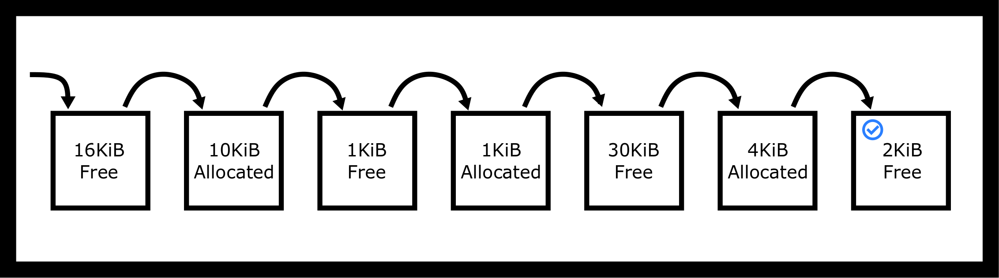
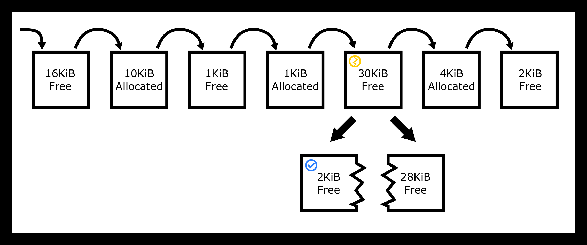
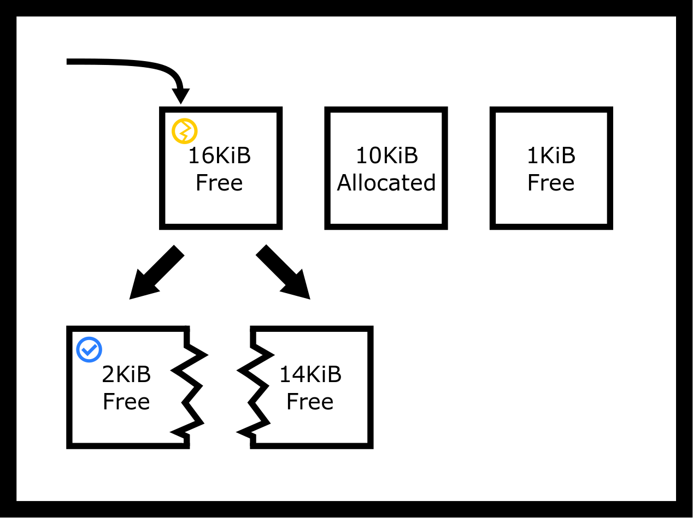
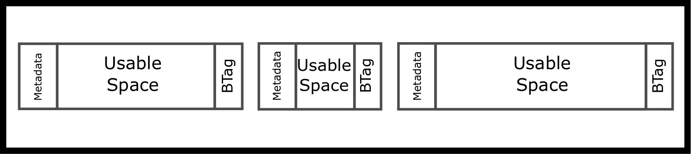
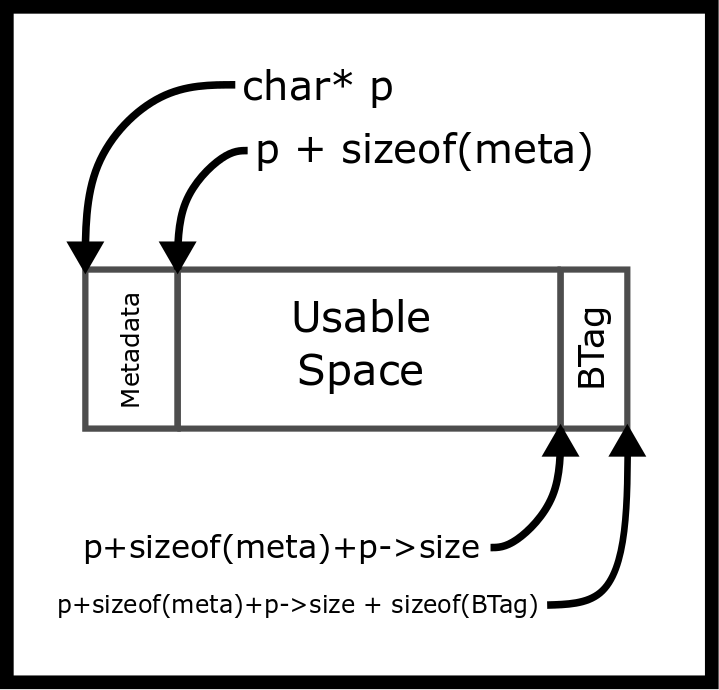
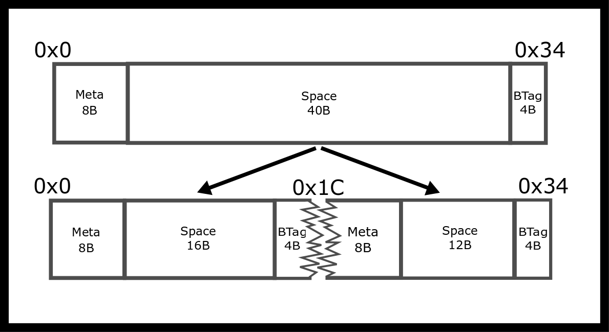
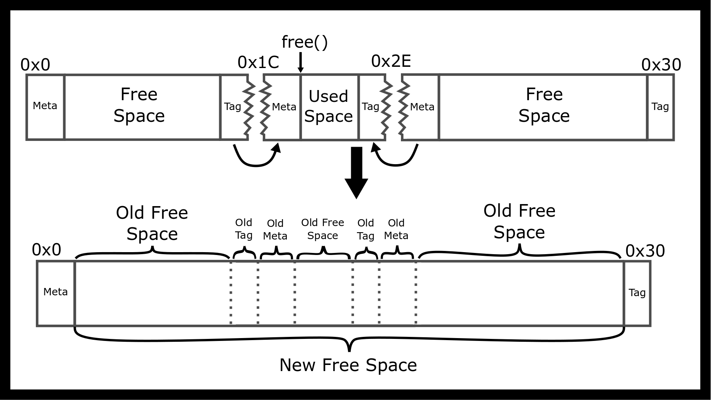
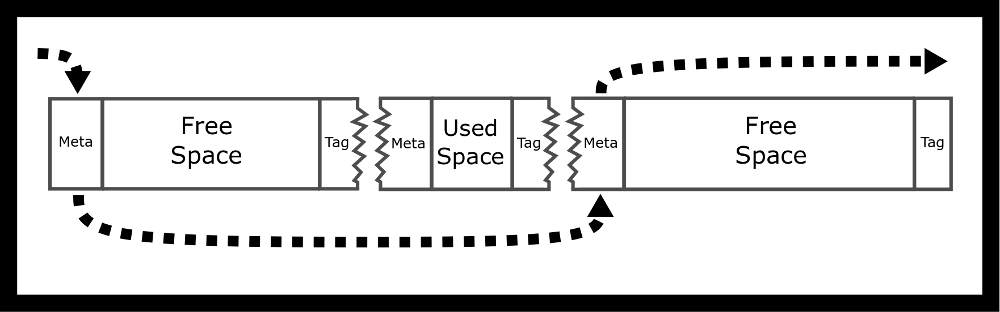
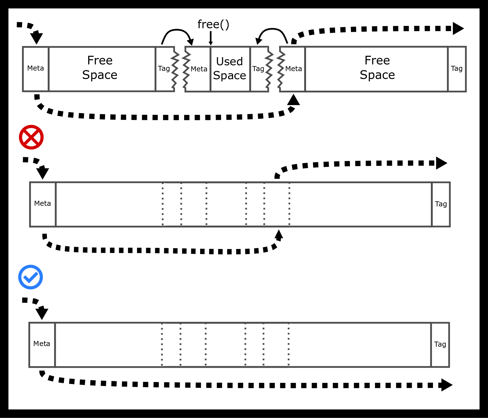

---
bibliography:
- malloc/malloc.bib
link-citations: true
title: "**CS341 系统编程课程手册**"
---

- [[#^memory-allocators|内存分配器]]
  - [[#^introduction|引言]]
  - [[#^c-memory-allocation-api|C 内存分配 API]]
    - [[#^heaps-and-sbrk|堆与 sbrk]]
  - [[#^intro-to-allocating|内存分配入门]]
    - [[#^placement-strategies|放置策略]]
    - [[#^placement-strategy-pros-and-cons|放置策略的优缺点]]
  - [[#^memory-allocator-tutorial|内存分配器教程]]
    - [[#^implementing-a-memory-allocator|实现一个内存分配器]]
    - [[#^alignment-and-rounding-up-considerations|对齐与向上取整的注意事项]]
    - [[#^implementing-free|实现 free]]
    - [[#^performance|性能]]
    - [[#^explicit-free-lists-allocators|显式空闲链表分配器]]
  - [[#^case-study-buddy-allocator-an-example-of-a-segregated-list|案例研究：Buddy 分配器——segregated list 的一个例子]]
  - [[#^case-study-slub-allocator-slab-allocation|案例研究：SLUB 分配器、Slab 分配]]
  - [[#^further-reading|延伸阅读]]
  - [[#^topics|主题]]
  - [[#^questionsexercises|问题／练习]]


# 内存分配器 ^memory-allocators

**到处都是内存，却没有一次分配值得去做** — **一个碎片化的堆**

## 引言 ^introduction

内存分配非常重要！在任何应用中，分配和释放堆内存都是最常见的操作之一。系统层面的堆是一段连续的地址序列，程序可以按自己的需要扩展或收缩它（<a href="#ref-mallocinternals">[4]</a>）。在 POSIX 中，这被称为 system break（系统断点）。我们用 `sbrk` 来移动这个系统断点。大多数程序并不直接与这个调用交互，而是在它外面套一层内存分配系统，负责把内存切块、并记录哪些内存已分配、哪些已释放。

我们将主要考察简单的分配器。只需知道还存在其他划分内存的方式，比如 `mmap`，以及其他分配方案和方法，比如 `jemalloc`。

## C 内存分配 API ^c-memory-allocation-api

- `malloc(size_t bytes)` 是一个 C 库函数，用于预留一块可能未初始化的连续内存（<a href="#ref-jones2010wg14">[2]</a>）。与栈内存不同，这块内存会一直保持已分配状态，直到用同一个指针调用 `free`。`malloc` 要么返回一个指向至少所请求那么多空闲空间的指针，要么返回 `NULL`。这意味着即使还有空间，malloc 也可能返回 NULL。健壮的程序应当检查返回值。如果你的代码假定 `malloc` 会成功而它并没有成功，那么程序在尝试写入地址 0 时很可能会崩溃（段错误）。此外，出于性能考虑，malloc 会在内存中留下垃圾数据——请检查你的代码，确保所有程序值都已初始化。

- `realloc(void *space, size_t bytes)` 允许程序调整先前在堆上分配的那块内存的大小（通过 malloc、calloc 或 realloc 分配）（<a href="#ref-jones2010wg14">[2]</a>）。realloc 最常见的用途是调整用于存放某个值数组的那块内存的大小。realloc 有两个坑：一是可能返回一个新的指针，二是它可能失败。下面给出一个朴素但易读的 realloc 版本及其用法示例。

  ``` objectivec
  void * realloc(void * ptr, size_t newsize) {
    // Simple implementation always reserves more memory
    // and has no error checking
    void *result = malloc(newsize);
    size_t oldsize =  ... //(depends on allocator's internal data structure)
    if (ptr) memcpy(result, ptr, newsize < oldsize ? newsize : oldsize);
    free(ptr);
    return result;
  }

  int main() {
    // 1
    int *array = malloc(sizeof(int) * 2);
    array[0] = 10; array[1] = 20;
    // Oops need a bigger array - so use realloc..
    array = realloc(array, 3 * sizeof(int));
    array[2] = 30;

  }
  ```

  上面这段代码很脆弱。如果 `realloc` 失败，程序就会泄漏内存。健壮的代码会检查返回值，只有在返回值不是 NULL 时才重新赋值给原来的指针。

  ``` objectivec
  int main() {
    // 1
    int *array = malloc(sizeof(int) * 2);
    array[0] = 10; array[1] = 20;
    void *tmp = realloc(array, 3 * sizeof(int));
    if (tmp == NULL) {
      // Nothing to do here.
    } else if (tmp == array) {
      // realloc returned same space
      array[2] = 30;
    } else {
      // realloc returned different space
      array = tmp;
      array[2] = 30;
    }

  }
  ```

- `calloc(size_t nmemb, size_t size)` 会把内存内容初始化为零，它同时接收两个参数：元素个数和每个元素的字节大小。程序员常常用 `calloc` 而不是显式地在 `malloc` 之后调用 `memset` 来把内存内容置零，因为其中考虑了某些性能因素。要高效地做到这一点比看上去更难：一个实现应当跳过那些操作系统已经清零的内存，并且在 `nmemb` 乘以 `size` 装不下 `size_t` 时必须捕获溢出。关于这两个问题的深入讨论见 <a href="https://locklessinc.com/articles/calloc/">https://locklessinc.com/articles/calloc/</a>。注意 `calloc(x,y)` 与 `calloc(y,x)` 完全等价，但你应当遵循手册中的约定。下面是一个朴素的 calloc 实现。

  ``` objectivec
  void *calloc(size_t n, size_t size) {
    size_t total = n * size; // Does not check for overflow!
    void *result = malloc(total);

    if (!result) return NULL;


    // If we're using new memory pages
    // allocated from the system by calling sbrk
    // then they will be zero so zero-ing out is unnecessary,
    // We will be non-robust and memset either way.
    return memset(result, 0, total);
  }
  ```

- `free` 接收一个指向某段内存起点的指针，并把这块内存交出来供后续对其他分配函数的调用使用。这一点很重要，因为我们不希望地址空间中的每个进程都占用大量内存。用完之后，我们用 ‘free‘ 停止使用它。下面是一个简单的用法。

  ``` objectivec
  int *ptr = malloc(sizeof(*ptr));
  do_something(ptr);
  free(ptr);
  ```

  如果程序在内存被释放之后还去使用它——那就是未定义行为。

### 堆与 sbrk ^heaps-and-sbrk

堆是进程内存的一部分，大小会变化。当程序调用 `malloc`（`calloc`、`realloc`）和 `free` 时，堆内存分配由 C 库完成。通过调用 `sbrk`，C 库可以在你的程序需要更多堆内存时扩大堆的大小。由于堆和栈都需要增长，我们把它们放在地址空间的两端。栈不像堆那样增长，栈的新部分是给新线程分配的。对典型架构而言，堆向上增长，栈向下增长。

如今，现代操作系统的内存分配器不再需要 `sbrk`。相反，它们可以申请彼此独立的虚拟内存区域，并维护多个内存区域。例如，gibibyte 级的申请可以被放到与小型申请不同的内存区域中。不过，这个细节带来的是我们不想要的复杂度。

程序通常不需要调用 `brk` 或 `sbrk`，不过调用 `sbrk(0)` 倒是挺有意思，因为它会告诉程序你的堆当前在哪里结束。程序实际使用的是属于 C 库的 `malloc`、`calloc`、`realloc` 和 `free`。这些函数的内部实现可能会在需要更多堆内存时调用 `sbrk`。

``` objectivec
void *top_of_heap = sbrk(0);
malloc(16384);
void *top_of_heap2 = sbrk(0);
printf("The top of heap went from %p to %p \n", top_of_heap, top_of_heap2);
// Example output: The top of heap went from 0x4000 to 0xa000
```

请注意，操作系统新获得的内存必须被清零。如果操作系统原样保留了物理 RAM 中的内容，那么某个进程就有可能获知此前使用过这块内存的另一个进程的数据。这将造成安全泄露。遗憾的是，这意味着在任何内存被释放之前，`malloc` 申请到的内存*往往*是零。这很不幸，因为许多程序员误以为所分配的内存*总是*为零而写出了错误的 C 程序。

``` objectivec
char* ptr = malloc(300);
// contents is probably zero because we get brand new memory
// so beginner programs appear to work!
// strcpy(ptr, "Some data"); // work with the data
free(ptr);
// later
char *ptr2 = malloc(300); // Contents might now contain existing data and is probably not zero
```

## 内存分配入门 ^intro-to-allocating

我们来试着写一个 malloc。以下是我们的第一次尝试——朴素版本。

``` objectivec
void* malloc(size_t size)
{
    // Ask the system for more bytes by extending the heap space.
    // sbrk returns -1 on failure
    void *p = sbrk(size);
    if(p == (void *) -1) return NULL; // No space left
    return p;
}
  void free() {/* Do nothing */}
```

上面是 malloc 最简单的实现，不过它有一些缺点。

- 相比库调用，系统调用很慢。我们应当一次预留大量内存，只偶尔才向系统要更多。

- 已释放的内存完全没有被复用。我们的程序从不重用堆内存——它只是一直要求更大的堆。

如果在一个典型程序中使用这个分配器，进程很快就会耗尽所有可用内存。因此，我们需要一个能高效利用堆空间、只在必要时才申请更多内存的分配器。有些程序确实使用这类分配器。设想一个电子游戏为载入下一个场景而分配对象。那么按上面那样做完就把整块内存扔掉，要比采用下面这些放置策略快得多。

### 放置策略 ^placement-strategies

在程序运行过程中，内存被分配又被释放，因此堆内存中会出现可供未来内存申请复用的空隙。内存分配器需要记录堆的哪些部分当前已分配、哪些部分可用。假设我们当前的堆大小是 64K，比方说我们的堆是下面这张表的样子。

<figure data-latex-placement="H">
<p></p>
<figcaption>空的堆块</figcaption>
</figure>

从最低地址算起，各块依次是：16KiB 空闲、10KiB 已分配、1KiB 空闲、1KiB 已分配、30KiB 空闲、4KiB 已分配、2KiB 空闲。

如果执行了一个 2KiB 的新 malloc 申请（`malloc(2048)`），`malloc` 应当在哪里预留内存？它可以使用最后那个 2KiB 的空洞，尺寸恰好合适！也可以从另外两个空闲空洞中切开一个。这些选择代表不同的放置策略。无论选中哪个空洞，分配器都需要把这个空洞一分为二。第一块是新分配的内存，将返回给程序；第二块是如果有剩余空间的话留下的小空洞。最佳适配策略会找到尺寸足够的（至少 2KiB）最小空洞：

<figure data-latex-placement="H">
<p></p>
<figcaption>最佳适配找到一个精确匹配</figcaption>
</figure>

最差适配策略会找到尺寸足够的最大空洞，于是把 30KiB 的空洞切成两块：

<figure data-latex-placement="H">
<p></p>
<figcaption>最差适配找到最差的匹配</figcaption>
</figure>

这次申请占用该空洞中的 2KiB，身后留下一个 28KiB 的空洞。

首次适配策略会找到第一个尺寸足够的空洞，于是把 16KiB 的空洞切成两块。我们甚至不必遍历整个堆！

<figure data-latex-placement="H">
<p></p>
<figcaption>首次适配找到第一个匹配</figcaption>
</figure>

有一点需要记住：这些放置策略并不需要切分块。例如，我们的首次适配分配器本可以把原来的块原封不动地返回。请注意，这样会导致大约 14KiB 的空间不被用户和分配器使用。我们把这称为内部碎片。

与之相对，外部碎片是指：尽管堆中有足够多的内存，但它可能被切分成若干块，以致找不到这么大的一块连续内存。在我们前面的例子中，64KiB 的堆内存里有 17KiB 已分配、47KiB 空闲。然而可用的最大块只有 30KiB，因为我们那份可用但未分配的堆内存已经碎成了更小的片。

### 放置策略的优缺点 ^placement-strategy-pros-and-cons

编写堆分配器的难点在于

- 需要尽量减少碎片（也就是最大化内存利用率）

- 需要高性能

- 实现起来很琐碎——要用到大量链表指针操作和指针算术。

- 碎片和性能都取决于应用的分配特征，这可以评估但无法预测；在实践中，在特定使用条件下，专用分配器往往能胜过通用实现。

- 分配器无法预先知道程序的内存申请。就算我们知道了，这也就是 <a href="http://en.wikipedia.org/wiki/Knapsack_problem">http://en.wikipedia.org/wiki/Knapsack_problem</a>，而它是已知 NP-hard 的问题！

不同的策略会以并不直观的方式影响堆内存的碎片情况，而这些影响只有通过数学分析，或者在真实条件下做精心模拟（例如模拟数据库或 web 服务器的内存申请）才能发现。

首先，我们会用一种更数学化的、一次性的视角来看每一种算法（<a href="#ref-Garey:1972:WAM:800152.804907">[1]</a>）。该论文描述了一个场景：你有若干个箱子和若干次分配，试图让这些分配放进尽可能少的箱子里，从而占用尽可能少的内存。论文讨论了理论含义，并对理想内存用量与实际内存用量之间的长期比值给出了一个漂亮的界限。对该结论感兴趣的人可以知道：随着箱子数量增加（箱子可以是任意分布），实际内存用量与理想内存用量之比，对首次适配约为 1.7，对最佳适配则下界为 1.7。这项分析的问题在于，真实世界中很少有应用需要这种一次性的分配。电子游戏的对象分配通常会为每个关卡指定一个不同的子堆，如果它们需要一个能直接扔掉的快速内存分配方案，就把那个子堆填满即可。

在实践中，我们会采用 1995 年一项更为严谨的调查得出的结果（<a href="#ref-10.1007/3-540-60368-9_19">[7]</a>）。该调查特意指出，内存分配是一个移动的目标。对某个程序好的分配方案，对另一个程序未必是好的。程序并不统一地遵循某种分配分布。该论文讨论了我们介绍过的所有分配方案，以及另外一些。下面是一些归纳出的要点

1.  当选中一个尺寸几乎正合适的块、而剩余空间被切得太小以至于程序大概不会使用时，最佳适配可能出问题。绕开这一点的一个办法是为切分设定一个阈值。在常规负载下，这种小切分出现得并不频繁。此外，最佳适配的最坏情况表现很差，但通常不会真的发生 \[p. 43\]。

2.  该调查还谈到首次适配的一个重要区别。“第一个”有多种含义。它可以按 ‘free‘ 的时间排序，也可以按块起始地址排序，还可以按最后一次释放的时间排序——即“最久未使用优先”。该调查没有深入比较各自的性能，但确实指出：按地址排序的链表和最久未使用（LRU）链表的表现优于最近使用优先。

3.  调查最后先指出，在模拟的随机（假设均匀随机）负载下，最佳适配和首次适配表现相当。即便在实践中，只要配上切分阈值和合并，两者的表现也大体相当。原因并不完全清楚。

我们再补充几点

1.  最佳适配可能比扫描整个堆更省时间。当找到一个尺寸正好合适的块、或在阈值之内尺寸正好合适的块时，就可以直接返回，具体取决于你所采用的边界情况策略。

2.  最差适配也遵循同样的思路。你的堆可以用最大堆数据结构来表示，每次分配调用只需弹出堆顶、重新堆化，并视情况插入一块切分出来的内存块。更花哨的堆在这里收益不大：斐波那契堆在纸面上有更好的摊还界，但每个节点都要携带父指针、子指针、两个兄弟指针、度数和标记字段。在一个分配器里，每个空闲块都得背上这些开销，这会抬高最小块大小，而且实际上它的指针跳转无论如何都比一个简单的二叉堆更慢。

3.  首次适配需要一种块顺序。多数时候程序员会默认使用链表，这是不错的选择。用最久未使用／最近使用链表策略你能做的改进不多，但换成按地址排序的链表，你可以在单链表之外配合一个随机化跳表，把插入从 O(n) 加速到 O(log(n))。插入时用跳表作为快捷路径来找到正确的位置，而删除则照常走链表。

4.  还有很多我们没谈到的放置策略，其中一个是 next-fit（下次适配），它与首次适配类似，只是每次搜索从上一次的停止处继续，而不是从堆的开头开始。这带来的是确定性的随机性——请原谅这个矛盾修辞。你不会被要求掌握这个算法，但要明白：当你作为机器学习题的一部分实现内存分配器时，还有比这些更多的选择。

## 内存分配器教程 ^memory-allocator-tutorial

一个内存分配器需要记录当前哪些字节已被分配、哪些可用。本节介绍构建一个分配器的实现思路和概念细节，也就是真正实现 `malloc` 和 `free` 的代码。

从概念上说，我们要做的是创建链表和块列表！请欣赏下面这幅 ASCII 图。其中 bt 是 boundary tag（边界标记）的缩写。

<figure data-latex-placement="H">
<p></p>
<figcaption>3 个相邻的内存块</figcaption>
</figure>

我们会在下一个块中放置隐式指针，也就是说我们可以通过做加法从一个块走到另一个块。这与在元数据块中放一个显式的 `metadata *next` 字段形成对比。

<figure data-latex-placement="H">
<p></p>
<figcaption>Malloc 的加法运算</figcaption>
</figure>

只要找到当前块的末尾，就能抓到下一个块。这就是我们所说的“隐式链表”。

实际的空间间隔可能不同，元数据里可以放不同的东西。最精简的元数据实现只需要有块的大小。

由于我们把整数和指针写进自己控制的内存中，之后就可以稳定地从一个地址跳到下一个。这些内部信息代表一定的开销。也就是说，即便我们向系统申请了 1024 KiB 的连续内存，这么大的一次分配也会失败。

我们的堆内存是一个块的列表，每个块要么已分配、要么未分配。因此从概念上说存在一个空闲块的列表，只不过它以块大小信息的形式隐式存在，而我们把这份信息作为每个块的一部分存下来。我们用一个简单实现来具体看看。

``` objectivec
typedef struct {
  size_t block_size;
  char data[0];
} block;
// Stored at the end of each block (bt in the figures above)
typedef struct {
  size_t block_size;
} boundary_tag;
block *p = sbrk(100);
p->block_size = 100 - sizeof(*p) - sizeof(boundary_tag);
// Other block allocations
```

我们可以通过加上块的大小，从一个块走到下一个块。

``` objectivec
p + sizeof(metadata) + p->block_size + sizeof(boundary_tag)
```

一定要把类型转换搞对！否则程序将会移动多得离谱的字节。

调用方程序永远看不到这些值。它们是内存分配器实现内部的。举个例子，假设你的分配器被要求预留 80 字节（`malloc(80)`），并且需要 8 字节的内部头部数据。分配器就需要找到至少 88 字节的未分配空间。更新完堆数据之后，它会返回一个指向该块的指针。然而，返回的指针指向的是可用空间，而不是内部数据！换句话说，我们返回的是块起点加 8 字节。在实现时请记住，指针算术依赖于类型。例如 `p += 8` 加的是 `8 * sizeof(p)`，不一定是 8 字节！

### 实现一个内存分配器 ^implementing-a-memory-allocator

最简单的实现使用首次适配。从第一个块开始（假定它存在），一路迭代，直到找到一个代表足够大未分配空间的块，或者我们已经检查完所有块。如果没有找到合适的块，就该再次调用 `sbrk()`，以充分扩展堆的大小。对于本课程，我们会尝试满足每一个内存请求，直到操作系统告知我们堆空间即将用尽为止。其他应用可能会把自己限制在某个堆大小，从而导致请求间歇性失败。此外，一个快速实现可能会把堆大幅扩展，这样我们短期内就不必再申请更多堆内存。

找到一个空闲块时，它可能比我们需要的空间大。如果是这样，我们会在隐式链表中创建两个条目。第一个条目是已分配的块，第二个条目是剩余空间。如果程序希望把开销压小，做法不止一种。我们建议一开始先追求可读性。

``` objectivec
typedef struct {
  size_t block_size;
  int is_free;
  char data[0];
} block;
block *p = sbrk(100);
p->block_size = 100 - sizeof(*p) - sizeof(boundary_tag);
// Other block allocations
```

如果程序希望某些位承载不同的信息，那就用位域（bit field）！

``` objectivec
typedef struct {
  unsigned int block_size : 7;
  unsigned int is_free : 1;
} size_free;

typedef struct {
  size_free info;
  char data[0];
} block;
```

移位操作交给编译器处理。字段设置好之后，代码就简化成遍历各个块并检查相应的字段。

下面是所发生之事的可视化表示。假设我们有一个如下所示的块，并且假设这次分配是 16 字节，那么我们要做的切分如下。

<figure data-latex-placement="H">
<p></p>
<figcaption>Malloc 的分割</figcaption>
</figure>

原来的块是 52（0x34）字节：8 字节元数据、40 字节空间，以及一个 4 字节的边界标记。切分之后，第一个块保留 16 字节空间，结束于 0x1C；剩下的 24 字节变成一个新块，包含 8 字节元数据、12 字节空间，以及它自己的 4 字节标记。

这还没考虑对齐问题。

### 对齐与向上取整的注意事项 ^alignment-and-rounding-up-considerations

许多架构要求多字节的基本类型对齐到 2 的某个倍数（4、16 等）。例如，通常要求 4 字节类型对齐到 4 字节边界，8 字节类型对齐到 8 字节边界。如果多字节基本类型存放在不合理的位置上，性能可能会受到显著影响，因为它可能需要额外一次内存读取。在某些架构上，代价甚至更大——程序会因 <a href="http://en.wikipedia.org/wiki/Bus_error#Unaligned_access">http://en.wikipedia.org/wiki/Bus_error#Unaligned_access</a> 而崩溃。如果当时没有内存保护，你们大多在体系结构课里体验过这种情况。

由于 `malloc` 不知道用户会怎样使用所分配的内存，返回给程序的指针需要按最坏情况对齐，而这取决于具体架构。

glibc 手册给出的对齐保证如下（<a href="#ref-vma_paging">[6]</a>）：

> `malloc` 交给你的那块内存保证是对齐的，可以容纳任何类型的数据。在 GNU 系统中，这个地址在大多数系统上总是 8 的倍数，在 64 位系统上是 16 的倍数。

所以，如果你的分配器以 16 字节为单位发放内存，记住在计算一次申请需要多少个单位时要向上取整。

在 C 中，这段数学运算大致是这么写的。

``` objectivec
int s = (requested_bytes + tag_overhead_bytes + 15) / 16
```

多出来的那个常数保证不足一个单位时会向上取整。请注意，真实代码更可能使用符号化的尺寸，例如 `sizeof(x) - 1`，而不是直接写数值常量 15。<a href="https://web.archive.org/web/20190313121701/https://www.ibm.com/developerworks/library/pa-dalign/">https://web.archive.org/web/20190313121701/https://www.ibm.com/developerworks/library/pa-dalign/</a>。

另一个附带效果是内部碎片，当给出的块大于申请尺寸时就会发生。假设我们有一个 16B 大小的空闲块（不含元数据）。如果他们申请 7 字节，分配器可能会向上取整到 16B 并返回整块。在实现合并和切分时，情况会变得棘手。如果分配器两者都不实现，它最终可能会为一次 7B 的申请返回一块 64B 的内存！这次分配的开销大得惊人，而这正是我们要避免的。

### 实现 free ^implementing-free

调用 `free` 时，我们需要重新施加那个偏移量，回到块的“真正”起点——也就是我们存放大小信息的地方。朴素的做法只是简单地把该块标记为未使用。如果我们把块的分配状态存在一个位域里，那么就需要设置 `is_free` 位：

``` objectivec
p->info.is_free = 1;
```

不过，我们还有一点工作要做。如果当前块和下一个块（如果存在）都是空闲的，就需要把这些块合并成一个。同样地，我们也需要检查前一个块。如果它存在并且代表未分配的内存，那么就需要把这些块合并成一个大块。

为了能把一个空闲块与它前面的空闲块合并，我们还需要找到前一个块，因此我们把块的大小也存放在块的末尾。这些就叫作“边界标记”（<a href="#ref-knuth1973art">[3]</a>）。这是 Knuth 双向解决合并问题的办法。由于各块是连续的，一个块的末尾正好紧邻下一个块的开头。于是当前块（除第一个之外）可以往回看几个字节，查到前一个块的大小。有了这个信息，分配器现在就能向后跳了！

举一个双向合并的例子。如果我们想释放中间那个块，就需要把周围的块变成一个大块。

<figure data-latex-placement="H">
<p></p>
<figcaption>free 的双向合并</figcaption>
</figure>

### 性能 ^performance

有了上面的描述，就有可能构建出一个内存分配器。它的主要优势是简单——至少与其他分配器相比是简单的！分配内存是最坏情况下线性时间的操作——在链表中搜索一个足够大的空闲块。释放内存则是常数时间。最多只有 3 个块需要合并成一个块，而且如果采用最近使用块方案，只需更新一个链表条目。

使用这个分配器，你就可以实验不同的放置策略。例如，分配器可以从最后释放的那个块开始搜索。如果分配器存放了指向各块的指针，它就需要更新这些指针，使它们始终保持有效。

### 显式空闲链表分配器 ^explicit-free-lists-allocators

实现一个显式的空闲节点双向链表可以获得更好的性能。这样我们就能立刻遍历到下一个空闲块和上一个空闲块。由于链表只包含未分配的块，这可以缩短搜索时间。第二个好处是，现在我们对链表的顺序有了一定控制权。例如，当一个块被释放时，我们可以选择把它插入链表开头，而不是总是插在它的两个邻居之间。我们可以把结构体更新成下面这样。

``` objectivec
typedef struct {
  size_t info;
  struct block *next;
  char data[0];
} block;
```

下面是它与我们的隐式链表放在一起的样子。

<figure data-latex-placement="H">
<p></p>
<figcaption>空闲链表</figcaption>
</figure>

我们把链表的指针存到哪里？一个简单的技巧是意识到这个块本身正闲置着，于是把 next 和 prev 指针作为块的一部分存进去；不过你必须确保空闲块始终足够大，能容纳两个指针。我们仍然需要实现边界标记，才能正确释放块并把它们与两侧的邻居合并。因此，显式空闲链表需要更多代码和更多复杂度。使用显式链表时，会用一个快速而简单的“Find-First”算法来找到第一个足够大的链接。不过由于链接顺序可以被修改，这就对应于不同的放置策略。如果这些链接按从大到小维护，那么这就产生了“最差适配”放置策略。

不过这里有边界情况，考虑一下如果你同时还要做双向合并，该如何维护你的空闲链表。我们放了一幅图，展示一个常见错误。

<figure data-latex-placement="H">
<p></p>
<figcaption>空闲链表中正确与错误的合并</figcaption>
</figure>

在错误的版本中，合并后的块仍然指向右侧块原来的起点，而那个位置现在已在合并块的中间。在正确的版本中，合并块接管了右侧块的链接，因此链表从合并块直接连到下一个空闲块。

我们建议在尝试实现 malloc 时，先把各种情况在概念上画出来，然后再写代码。

#### 显式链表插入策略 ^explicit-linked-list-insertion-policy

新释放的块可以很容易地插入到两个可能的位置之一：链表开头，或按地址顺序插入。插到开头会形成 LIFO（后进先出）策略。最近释放的空间会被优先重用。研究表明，这种做法的碎片情况比按地址排序更差（<a href="#ref-10.1007/3-540-60368-9_19">[7]</a>）。

按地址顺序插入（“地址有序策略”）会把释放的块插入到使得遍历时块按地址递增顺序出现的位置。这个策略在释放一个块时耗时更长，因为必须借助边界标记（大小数据）来找到下一个和上一个未分配的块。不过这样碎片更少。

## 案例研究：Buddy 分配器——segregated list 的一个例子 ^case-study-buddy-allocator-an-example-of-a-segregated-list

分离式（segregated）分配器是这样一种分配器：它把堆划分为不同的区域，并根据分配请求的尺寸交给不同的子分配器处理。尺寸按 2 的幂分组，每种尺寸由一个不同的子分配器负责，每种尺寸各自维护自己的空闲链表。

这一类中一个著名的分配器是 buddy 分配器（<a href="#ref-rangan1999foundations">[5]</a>）。我们将讨论二进制 buddy 分配器，它把分配切成尺寸为某个基础单位字节数 $$ 2^n; n = 1, 2, 3, ... $$ 倍的块；不过也存在其他变体，比如 Fibonacci 切分，其分配会向上取整到下一个斐波那契数。基本概念很简单：如果没有尺寸为 $$ 2^n $$ 的空闲块，就到下一层去“偷”一个块并把它一分为二。如果两个相邻的同尺寸块都变为未分配，它们就可以合并成一个两倍大小的大块。

Buddy 分配器之所以快，是因为要合并的相邻块可以直接从被释放块的地址算出来，而不必遍历大小标记。要达到极致性能，通常还需要一小段汇编代码，用一条专用 CPU 指令找出最低的非零位。

Buddy 分配器的主要缺点是它会受到*内部碎片*的影响，因为分配会被向上取整到最接近的块大小。例如，一次 68 字节的分配需要一块 128 字节的块。

## 案例研究：SLUB 分配器、Slab 分配 ^case-study-slub-allocator-slab-allocation

SLUB 分配器是一种 slab（切片）分配器，用来满足 Linux 内核的不同需求 <a href="http://en.wikipedia.org/wiki/SLUB_%28software%29">http://en.wikipedia.org/wiki/SLUB_%28software%29</a>。设想你在为内核编写一个分配器，你的要求是什么？下面是一份假想的简明清单。

1.  首要的一点是你希望内存占用尽可能低，好让内核能装到各种类型的硬件上：嵌入式设备、台式机、超级计算机等等。

2.  其次，你希望实际内存尽可能连续，以便利用缓存。每当执行一次系统调用，内核的页面都需要被载入内存。这意味着如果它们是连续的，处理器就能更高效地缓存它们。

3.  最后，你希望分配动作足够快。

于是有了 SLUB 分配器 `kmalloc`。SLUB 分配器是一种分离式链表分配器，切分和合并都做到最少。这里的区别在于，这种分离式链表关注的是更贴近现实的分配尺寸，而不是 2 的幂。SLUB 还专注于在把页面留在缓存中的同时保持整体较低的内存占用。它有不同尺寸的块，内核会把每个分配请求向上取整到能满足它的最小块大小。这个分配器与其他分配器的一个重大区别是，它通常遵循页面大小。我们会在另一章讨论虚拟内存和页面，但内核会以 4KiB 即 4096 字节为一组（span）直接操作内存页。

## 延伸阅读 ^further-reading

引导性问题

- malloc 得到的内存是初始化过的吗？那么 calloc 或 realloc 得到的内存呢？

- realloc 接受的参数是元素个数还是空间（字节数）？

- 分配函数可能报错的原因是什么？

参见 <a href="http://man7.org/linux/man-pages/man3/malloc.3.html">http://man7.org/linux/man-pages/man3/malloc.3.html</a> 或该书的附录 <a href="#man_malloc">#man_malloc</a>！

- <a href="https://en.wikipedia.org/wiki/Slab_allocation">https://en.wikipedia.org/wiki/Slab_allocation</a>

- <a href="http://en.wikipedia.org/wiki/Buddy_memory_allocation">http://en.wikipedia.org/wiki/Buddy_memory_allocation</a>

## 主题 ^topics

- 最佳适配

- 最差适配

- 首次适配

- Buddy 分配器

- 内部碎片

- 外部碎片

- sbrk

- 自然对齐

- 边界标记

- 合并

- 切分

- Slab 分配／内存池

## 问题／练习 ^questionsexercises

- 什么是内部碎片？它在什么时候会成为问题？

- 什么是外部碎片？它在什么时候会成为问题？

- 什么是最佳适配放置策略？它在外部碎片方面表现如何？时间复杂度呢？

- 什么是最差适配放置策略？它在外部碎片方面是否好一点？时间复杂度呢？

- 什么是首次适配放置策略？在碎片方面它要好一点，对吧？期望时间复杂度呢？

- 假设我们使用一个 buddy 分配器，并有一个新的 64KiB slab。它会如何分配 1.5KiB？

- 那份 5 行的 `sbrk` malloc 实现在什么时候有用？

- 什么是自然对齐？

- 什么是合并／切分？它们如何增加／减少碎片？什么时候可以合并或切分？

- 边界标记是如何工作的？它们如何用来合并或切分？

<div id="refs" class="references csl-bib-body hanging-indent">

<div id="ref-Garey:1972:WAM:800152.804907" class="csl-entry">

Garey, M. R., R. L. Graham, and J. D. Ullman. 1972. “Worst-Case Analysis
of Memory Allocation Algorithms.” *Proceedings of the Fourth Annual ACM
Symposium on Theory of Computing* (New York, NY, USA), STOC ’72, 143–50.
<a href="https://doi.org/10.1145/800152.804907">https://doi.org/10.1145/800152.804907</a>.

</div>

<div id="ref-jones2010wg14" class="csl-entry">

Jones, Larry. 2010. *WG14 N1539 Committee Draft ISO/IEC 9899: 201x*.
International Standards Organization.

</div>

<div id="ref-knuth1973art" class="csl-entry">

Knuth, D. E. 1973. *The Art of Computer Programming: Fundamental
Algorithms*. Addison-Wesley Series in Computer Science and Information
Processing, v. 1-2. Addison-Wesley.
<a href="https://books.google.com/books?id=dC05RwAACAAJ">https://books.google.com/books?id=dC05RwAACAAJ</a>.

</div>

<div id="ref-mallocinternals" class="csl-entry">

“Overview of Malloc.” 2018. In *MallocInternals - Glibc Wiki*. Free
Software Foundation.
<a href="https://sourceware.org/glibc/wiki/MallocInternals">https://sourceware.org/glibc/wiki/MallocInternals</a>.

</div>

<div id="ref-rangan1999foundations" class="csl-entry">

Rangan, C. P., V. Raman, and R. Ramanujam. 1999. *Foundations of
Software Technology and Theoretical Computer Science: 19th Conference,
Chennai, India, December 13-15, 1999 Proceedings*. FOUNDATIONS OF
SOFTWARE TECHNOLOGY AND THEORETICAL COMPUTER SCIENCE. Springer.
<a href="https://books.google.com/books?id=0uHME7EfjQEC">https://books.google.com/books?id=0uHME7EfjQEC</a>.

</div>

<div id="ref-vma_paging" class="csl-entry">

“Virtual Memory Allocation and Paging.” 2001. In *The GNU C Library -
Virtual Memory Allocation And Paging*. Free Software Foundation.
<a href="https://ftp.gnu.org/old-gnu/Manuals/glibc-2.2.3/html_chapter/libc_3.html">https://ftp.gnu.org/old-gnu/Manuals/glibc-2.2.3/html_chapter/libc_3.html</a>.

</div>

<div id="ref-10.1007/3-540-60368-9_19" class="csl-entry">

Wilson, Paul R., Mark S. Johnstone, Michael Neely, and David Boles.
1995. “Dynamic Storage Allocation: A Survey and Critical Review.” In
*Memory Management*, edited by Henry G. Baler. Springer Berlin
Heidelberg.

</div>

</div>
