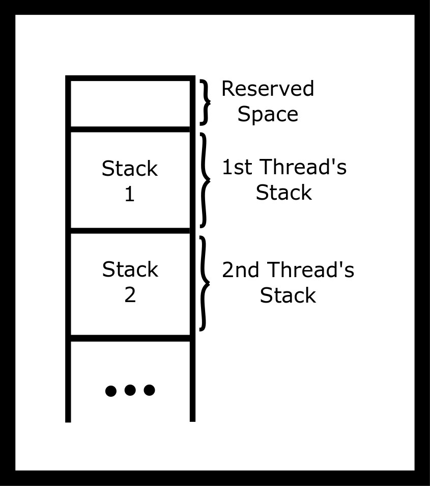
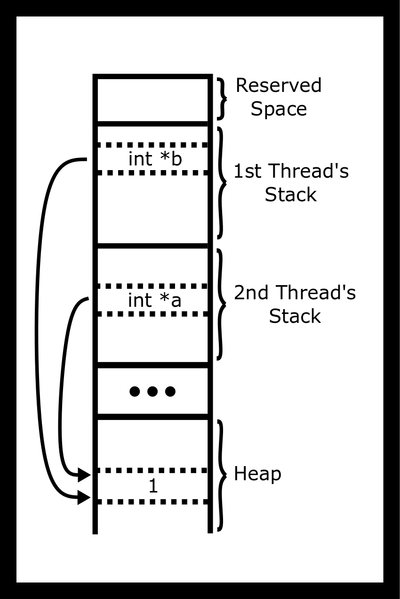
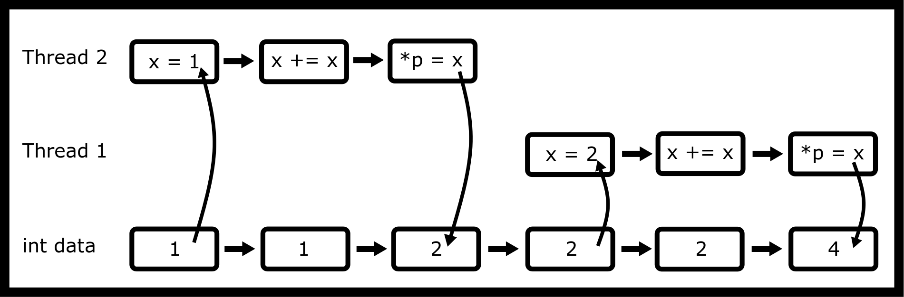
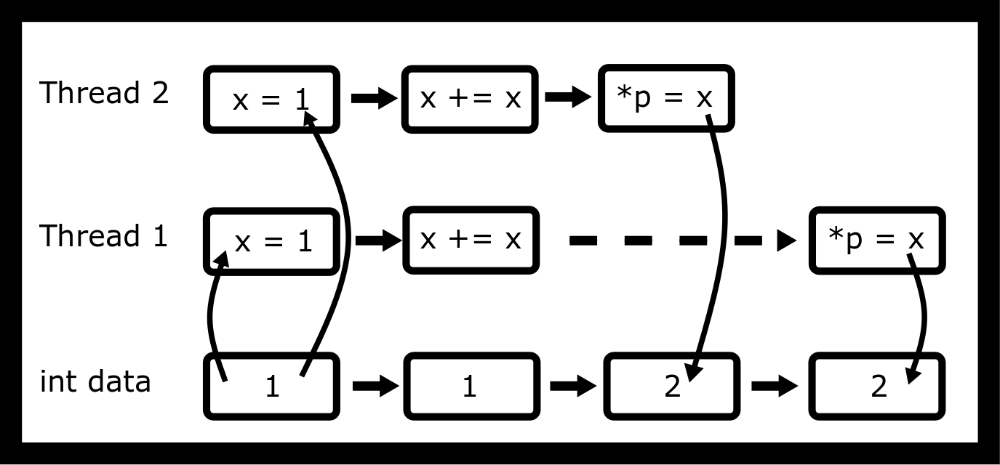

---
bibliography:
- threads/threads.bib
link-citations: true
title: "**CS341 系统编程课程手册**"
---

- [[#^threads|线程]]
  - [[#^processes-vs-threads|进程与线程]]
  - [[#^thread-internals|线程内部机制]]
  - [[#^simple-usage|简单用法]]
  - [[#^pthread-functions|pthread 函数]]
  - [[#^race-conditions|竞态条件]]
    - [[#^dont-cross-the-streams|别让溪流交汇]]
    - [[#^embarrassingly-parallel-problems|易并行问题]]
    - [[#^other-problems|其他问题]]
    - [[#^advanced-lightweight-processes|进阶：轻量级进程？]]
    - [[#^further-reading|延伸阅读]]
  - [[#^topics|主题]]
  - [[#^questions|问题]]


# 线程 ^threads

**如果你觉得你的程序以前崩得还不够狠，那等着看它们以十倍的速度崩掉吧** —

线程是“执行线程”（thread-of-execution）的简称。它代表 CPU 拥有并将要执行的那一串指令。为了记住如何从函数调用返回，也为了存放自动变量和参数的值，线程要使用一个栈。有点奇怪的是，线程就是一个进程，也就是说创建线程类似于 `fork`，只不过这里**不做复制**，因此也没有写时复制。这带来的好处是，一个进程中的所有线程可以共享同一个地址空间、变量、堆、文件描述符等等。真正用来创建线程的系统调用类似于 `fork`。它是 `clone`。我们不深入细节，但你可以读读 <a href="http://man7.org/linux/man-pages/man2/clone.2.html">http://man7.org/linux/man-pages/man2/clone.2.html</a>，同时要记住它超出了本课程的直接范围。在很多场景下，LWP（轻量级进程），也就是线程，比 fork 更受青睐，因为创建它们的开销要小得多。不过在某些情况下（尤其是 Python 就用了这一套），多进程才是让代码变快的办法。

## 进程与线程 ^processes-vs-threads

在以下情形中，创建独立的进程是有用的：

- 想要更高的安全性时。例如，Chrome 浏览器为不同标签页使用不同的进程。

- 要运行一个已有的、完整的程序时，必须开一个新进程，例如启动 ‘gcc‘。

- 当你开始使用同步原语、而每个进程都在操作系统中各自动用某样东西时。

- 当你的线程太多时——内核会试图把所有线程调度到彼此靠近的位置，这可能弊大于利。

- 当你不想操心竞态条件时

- 当通信量小到只需要用简单的 IPC 就够了时。

另一方面，在以下情形中创建线程更有用：

- 你想利用多核系统的算力来完成同一项任务时

- 当你承受不起进程的开销时

- 当你想让线程之间的通信更简单时

- 当你希望线程属于同一个进程时

## 线程内部机制 ^thread-internals

你的 main 函数以及其他函数都有自动变量。我们会把它们存放在内存中的一个栈上，并用一个简单的指针（“栈指针”）来记录栈有多大。如果线程调用了另一个函数，我们就把栈指针向下移，从而为参数和自动变量腾出更多空间。等它从函数返回时，我们再把栈指针移回原来的值。我们把旧的栈指针值保留一份——就放在栈上！这就是从函数返回很快的原因。释放自动变量所占的内存也很“简单”，因为程序只需要改动一下栈指针。

在多线程程序中，有多个栈，但只有一个地址空间。pthread 库会分配一些栈空间，并用 `clone` 这个函数调用来让线程从该栈地址开始执行。

<figure data-latex-placement="H">
<p></p>
<figcaption>线程栈示意图</figcaption>
</figure>

一个进程内部可以有多个线程在运行。而第一个线程是白送给你的！它运行你在 ‘main’ 里写的代码。如果程序需要更多线程，它可以调用 `pthread_create`，用 pthread 库创建一个新线程。你需要传入一个函数指针，这样线程才知道该从哪里开始。

所有线程都活在同一块虚拟内存中，因为它们属于同一个进程。因此它们都能看到堆、全局变量和程序代码。

<figure data-latex-placement="H">
<p></p>
<figcaption>多个线程指向堆中的同一位置</figcaption>
</figure>

因此，一个程序可以有两个（或更多）CPU 在同一时刻、同一进程内同时处理你的程序。把线程分配给哪些 CPU，取决于操作系统。如果一个程序的活跃线程数超过 CPU 数量，内核会把某个线程分配给一个 CPU 运行一小段时间，或者直到它没事情可做，然后自动切换到另一个线程上工作。例如，一个 CPU 可能在处理游戏的 AI，而另一个线程正在计算图形输出。

## 简单用法 ^simple-usage

要使用 pthreads，请包含 `pthread.h`，并在编译和链接时加上 `-pthread` 或 `-lpthread` 编译选项。该选项告诉编译器：你的程序需要线程支持。要创建一个线程，使用函数 `pthread_create`。该函数接收四个参数：

``` objectivec
int pthread_create(pthread_t *thread, const pthread_attr_t *attr,
void *(*start_routine) (void *), void *arg);
```

- 第一个是一个指针，指向一个变量，用来存放新创建线程的 id。

- 第二个是一个属性指针，我们可以用它来微调 pthreads 的一些高级特性。

- 第三个是一个指向我们想运行的函数的指针

- 第四个是一个指针，它会被传给你的函数

参数 `void *(*start_routine) (void *)` 很难看懂！它的含义是：一个接收 `void *` 指针并返回 `void *` 指针的指针。它看起来像一个函数声明，只不过函数名被 `(* .... )` 包了起来。

``` objectivec
#include <stdio.h>
#include <pthread.h>

void *busy(void *ptr) {
  // ptr will point to "Hi"
  puts("Hello World");
  return NULL;
}
int main() {
  pthread_t id;
  pthread_create(&id, NULL, busy, "Hi");
  void *result;
  pthread_join(id, &result);
}
```

在上例中，结果会是 `NULL`，因为 busy 函数返回了 `NULL`。我们必须把结果的地址传进去，因为 `pthread_join` 会往我们指针所指向的内容里写值。

在手册页中，它警告程序员应当把 `pthread_t` 当作一个不透明类型，不要去窥探其内部结构。不过我们经常不理会这一条。

## pthread 函数 ^pthread-functions

下面是一些常用的 pthread 函数：

- `pthread_create` 创建一个新线程。每个线程都会得到一个新的栈。如果一个程序调用两次 `pthread_create`，你的进程里就会有三个栈——每个线程一个。第一个线程在进程启动时创建，另两个在 create 之后创建。实际上栈可以有更多，但我们姑且简化。关键在于，每个线程都需要一个栈，因为栈里存放着自动变量和旧的 CPU PC 寄存器值，函数执行完毕后线程要靠它回到调用者继续执行。

- `pthread_cancel` 停止一个线程。注意该线程可能仍会继续。比如，当线程发起某个操作系统系统调用时（例如 `write`）它就可能被终止。在实践中，`pthread_cancel` 很少被使用，因为线程不会清理已打开的文件之类的资源。一种替代实现是使用一个布尔（int）变量，用它的值来通知其他线程应当结束并清理。

- `pthread_exit(void *)` 停止调用它的线程，也就是说该线程在调用 `pthread_exit` 之后永远不会返回。如果没有其他线程在运行，pthread 库会自动结束整个进程。`pthread_exit(...)` 等价于从线程函数中 return；两者都会结束该线程，同时设置该线程的返回值（void \* 指针）。在 `main` 线程中调用 `pthread_exit`，是简单程序确保所有线程都结束的常用做法。例如，在下面这个程序中，`myfunc` 线程很可能根本没来得及启动。另一方面，`exit()` 会退出整个进程并设置进程的退出值，这等价于在 main 方法中调用 `return ();`。进程内的所有线程都会停止。注意 `pthread_exit` 版本的写法会产生线程僵尸；不过这不是一个长期运行的进程，所以我们不必在意。

  ``` objectivec
  int main() {
    pthread_t tid1, tid2;
    pthread_create(&tid1, NULL, myfunc, "Jabberwocky");
    pthread_create(&tid2, NULL, myfunc, "Vorpel");
    if (keep_threads_going) {
      pthread_exit(NULL);
    } else {
      exit(42); //or return 42;
    }

    // No code is run after exit
  }
  ```

- `pthread_join()` 等待某个线程结束并记录它的返回值。已结束的线程会继续占用资源。最终，如果创建了足够多的线程，`pthread_create` 就会失败。在实践中，这只对长期运行的进程是个问题；对简单、短命的进程则不是问题，因为进程退出时所有线程资源都会被自动释放。这等价于把你的子进程变成僵尸，所以对长期运行的进程请记住这一点。在上面的退出示例中，我们也可以改为等待所有线程结束。

  ``` objectivec
  // ...
  void* result;
  pthread_join(tid1, &result);
  pthread_join(tid2, &result);
  return 42;
  // ...
  ```

退出线程的方式有很多。下面是一个不完整的列表：

- 从线程函数中 return

- 调用 `pthread_exit`

- 用 `pthread_cancel` 取消该线程

- 通过一个信号终止整个进程。

- 调用 `exit()` 或 `abort()`

- 从 `main` 中 return

- 执行另一个程序

- 拔掉你的电源

- 某些未定义行为可以终结你的线程——是的，就是未定义行为

## 竞态条件 ^race-conditions

竞态条件是指：程序的结果取决于各个线程碰巧以什么顺序运行，而这个顺序由调度器决定。这意味着代码的执行是非确定性的。同一个程序运行多次，会因为内核调度线程的方式不同而产出不同的（且错误的）结果。下面就是那个教科书级的竞态条件。

``` objectivec
void *thread_main(void *p) {
  int *p_int = (int*) p;
  int x = *p_int;
  x += x;
  *p_int = x;
  return NULL;
}

int main() {
  int data = 1;
  pthread_t one, two;
  pthread_create(&one, NULL, thread_main, &data);
  pthread_create(&two, NULL, thread_main, &data);
  pthread_join(one, NULL);
  pthread_join(two, NULL);
  printf("%d\n", data);
  return 0;
}
```

把那段汇编拆开看，是对代码的许多次不同的访问。为简单起见，假设这个共享整数位于内存的 `[rbp-4]` 处。在不做优化的情况下，更新操作会被编译成类似下面这样：把值从内存载入 `eax` 寄存器，翻倍，然后写回。

```
mov eax, DWORD PTR [rbp-4]    ;Loads the value from memory
add eax, eax                  ;Doubles it
mov DWORD PTR [rbp-4], eax    ;Stores it back
```

考虑下面这种访问模式。

<figure data-latex-placement="H">
<p></p>
<figcaption>线程访问——不是竞态条件</figcaption>
</figure>

这种访问模式会让变量 `data` 的值变成 4。问题出在这些指令被并行执行的时候。

<figure data-latex-placement="H">
<p></p>
<figcaption>线程访问——竞态条件</figcaption>
</figure>

这种访问模式会让变量 `data` 的值变成 2。这是未定义行为，也是一个竞态条件。我们真正想要的是，让线程在任一时刻只访问代码的那一部分。

但当用 `-O2` 编译时，汇编输出变成了单条指令。

```
shl dword ptr [rdi]   # Optimized way of doing the add
```

这样不就修好了吗？只有一条汇编指令，所以不会有交错？它并没有解决 *硬件本身* 可能经历竞态条件的问题，因为我们作为程序员并没有告诉硬件去检查它。最简单的办法是加上 *lock* 前缀（<a href="#ref-guide2011intel">[1]</a>）。

但我们可不想用汇编来写代码！我们需要为这个问题想出一个软件方案。

#### 竞态现场的一天 ^a-day-at-the-races

这里还有一个小小的竞态条件。下面这段代码本应启动十个线程，分别传入 0 到 9（含端点）的整数。然而运行起来却会打印出 `1 7 8 8 8 8 8 8 8 10`！而且很少能打印出我们期望的结果。你看出原因了吗？

``` objectivec
#include <pthread.h>
void* myfunc(void* ptr) {
  int i = *((int *) ptr);
  printf("%d ", i);
  return NULL;
}

int main() {
  // Each thread gets a different value of i to process
  int i;
  pthread_t tid;
  for(i =0; i < 10; i++) {
    pthread_create(&tid, NULL, myfunc, &i); // ERROR
  }
  pthread_exit(NULL);
}
```

上面的代码存在一个 `race condition`（竞态条件）——i 的值在变化。新线程启动得更晚；在示例输出中，最后一个线程是在循环结束之后才启动的。为了克服这个竞态条件，我们会给每个线程一个指向它自己数据区的指针。例如，对每个线程我们可能想存放它的 id、一个起始值和一个输出值。或者，对于单个的小整数，我们可以把 `i` 的值转型为 `void*`，然后直接把这个值传过去。

``` objectivec
void* myfunc(void* ptr) {
  int data = (int) (intptr_t) ptr;
  printf("%d ", data);
  return NULL;
}

int main() {
  // Each thread gets a different value of i to process
  int i;
  pthread_t tid;
  for(i =0; i < 10; i++) {
    pthread_create(&tid, NULL, myfunc, (void *) (intptr_t) i);
  }
  pthread_exit(NULL);
}
```

竞态条件并不只出现在我们自己的代码里，它们也可能存在于别人提供的代码中。有些函数，比如 `asctime`、`getenv`、`strtok`、`strerror`，就不是线程安全的。我们来看一个同样不“线程安全”的简单函数。它的结果缓冲区可能存放在全局内存中。这在单线程程序里是好事。我们不会希望返回一个指向栈上无效地址的指针，而整个内存里只有一个结果缓冲区。如果两个线程同时使用它，其中一个就会破坏另一个。

``` objectivec
char *to_message(int num) {
  static char result [256];
  if (num < 10) sprintf(result, "%d : blah blah" , num);
  else strcpy(result, "Unknown");
  return result;
}
```

绕过这个问题有各种办法，比如使用同步锁；但首先，让我们从设计上解决这个问题。你会怎么修复上面那个函数？参数和返回类型都可以改。下面是一种可行的方案。

``` objectivec
int to_message_r(int num, char *buf, size_t nbytes) {
  int written;
  if (num < 10) {
    written = snprintf(buf, nbytes, "%d : blah blah" , num);
  } else {
    written = snprintf(buf, nbytes, "%s", "Unknown");
  }
  // Nonzero if the whole message (and its '\0') fit in buf
  return written >= 0 && (size_t) written < nbytes;
}
```

我们没有让函数负责内存，而是让调用方负责！很多程序——希望你的程序也是——所需的通信量极少。往往一次 malloc 调用比给互斥锁加锁、或给另一个线程发一条消息要省事得多。

### 别让溪流交汇 ^dont-cross-the-streams

一个多线程进程内部当然也可以 fork！不过子进程只有单个线程，它是调用 `fork` 那个线程的克隆。我们可以把它看成一个简单的例子：那些后台线程在子进程中永远不会打印出第二条消息。

``` objectivec
#include <pthread.h>
#include <stdio.h>
#include <unistd.h>

static pid_t child = -2;

void *sleepnprint(void *arg) {
  printf("%d:%s starting up...\n", getpid(), (char *) arg);

  while (child == -2) {sleep(1);} /* Later we will use condition variables */

  printf("%d:%s finishing...\n",getpid(), (char*)arg);

  return NULL;
}
int main() {
  pthread_t tid1, tid2;
  pthread_create(&tid1,NULL, sleepnprint, "New Thread One");
  pthread_create(&tid2,NULL, sleepnprint, "New Thread Two");

  child = fork();
  printf("%d:%s\n",getpid(), "fork()ing complete");
  sleep(3);

  printf("%d:%s\n",getpid(), "Main thread finished");

  pthread_exit(NULL);
  return 0; /* Never executes */
}
```

    8970:New Thread One starting up...
    8970:fork()ing complete
    8973:fork()ing complete
    8970:New Thread Two starting up...
    8970:New Thread Two finishing...
    8970:New Thread One finishing...
    8970:Main thread finished
    8973:Main thread finished

在实践中，fork 之前创建线程可能导致意外的错误，因为（如上所示）fork 时其他线程会立即被终止。另一个线程可能已经锁住了一把互斥锁——比如通过调用 malloc——却再也没有释放。高级用户也许会觉得 `pthread_atfork` 很有用；不过我们建议你避免在 fork 之前创建线程，除非你完全理解这种做法的限制和困难。

### 易并行问题 ^embarrassingly-parallel-problems

过去几年里，对并行算法的研究呈爆发式增长。易并行问题指的是任何几乎不费力气就能并行化的问题。其中很多也牵涉一些同步概念，但并非总是如此。你已经认识一个可以并行的算法了：归并排序！

``` objectivec
void merge_sort(int *arr, size_t len){
  if(len > 1){
    // Merge Sort the left half
    // Merge Sort the right half
    // Merge the two halves
  }
```

有了对线程的新理解，你要做的只是为左半部分创建一个线程，再为右半部分创建一个线程。鉴于你的 CPU 有多个物理核心，你会看到耗时遵循 <a href="https://en.wikipedia.org/wiki/Amdahl's_law">https://en.wikipedia.org/wiki/Amdahl's_law</a>。

这里的时间复杂度分析也变得有意思起来。即便我们假设核心数要多少有多少，照现在这样写出来的算法运行时间仍是 $$ O(n) $$，因为最后把两半合并的步骤仍然是由单个线程串行完成的。把合并这一步也并行化，运行时间就能降到 $$ O(\log^2(n)) $$。

不过在实践中，我们通常会做两处改动。第一，一旦数组小到某个程度，我们就放弃并行归并排序算法，改用在小数组上表现良好的传统排序方法——在这个规模上，通常是缓存一致性规则在起作用。第二，我们知道 CPU 的核心数不是无限的。为了绕开这一点，我们通常会维护一个工作线程池。由于缓存一致性、以及调度额外线程之类的开销，你不会立刻看到加速比。不过在更大块的代码上，你终究会开始看到加速效果。

另一个易并行问题是并行的 map。假设我们想把一个函数逐个元素地应用到整个数组上。

``` objectivec
int *map(int (*func)(int), int *arr, size_t len){
  int *ret = malloc(len*sizeof(*arr));
  for(size_t i = 0; i < len; ++i) {
    ret[i] = func(arr[i]);
  }
  return ret;
}
```

由于没有任何元素依赖其他元素，你会怎么把它并行化？你认为在线程之间划分工作的最佳方式是什么？

关于更多调度方式，请查阅附录中的线程调度。

### 其他问题 ^other-problems

取自 <a href="https://en.wikipedia.org/wiki/Embarrassingly_parallel">https://en.wikipedia.org/wiki/Embarrassingly_parallel</a>

- 在 web 服务器上同时为多个用户提供静态文件。

- Mandelbrot 集、Perlin 噪声之类的图像，其中每个点都是独立计算的。

- 计算机图形的渲染。在计算机动画中，每一帧都可以独立渲染（参见并行渲染）。

- 密码学中的暴力搜索。

- 值得一提的现实例子包括 distributed.net，以及加密货币中使用的-proof of work 系统。

- 生物信息学中对多个查询做 BLAST 搜索（但不是单个大查询）。

- 大规模人脸识别系统：把任意采集到的海量人脸（例如通过闭路电视拍摄的安全或监控视频）与同样数量的已存储人脸（例如嫌疑人图库或类似的观察名单）进行比对。

- 比较大量独立场景的计算机仿真，例如气候模型。

- 进化计算类元启发式算法，例如遗传算法。

- 数值天气预报的集合计算。

- 粒子物理中的事件仿真与重建。

- 步进方格（marching squares）算法

- 二次筛和数域筛中的筛分步骤。

- 随机森林这一机器学习技术中的树生长步骤。

- 离散傅里叶变换，其中每个谐波分量都独立计算。

### 进阶：轻量级进程？ ^advanced-lightweight-processes

在本章开头，我们提到线程就是进程。这是什么意思？你可以像创建进程那样创建线程。看看下面这段示例代码。

``` objectivec

// 8 MiB stacks
#define STACK_SIZE (8 * 1024 * 1024)

int thread_start(void *arg) {
  // Just like the pthread function
  puts("Hello Clone!");
  // This shares the same heap and address space!
  return 0;
}

int main() {
  // Allocate stack space for the child
  char *child_stack = malloc(STACK_SIZE);
  // Remember stacks work by growing down, so we need
  // to give the top of the stack
  char *stack_top = child_stack + STACK_SIZE;

  // clone create thread
  pid_t pid = clone(thread_start, stack_top, CLONE_VM | SIGCHLD, NULL);
  if (pid == -1) {
    perror("clone");
    exit(1);
  }
  printf("Child pid %ld\n", (long) pid);

  // Wait like any child
  if (waitpid(pid, NULL, 0) == -1) {
    perror("waitpid");
    exit(1);
  }

  return 0;
}
```

看起来很简单对吧？那为什么不用这个功能呢？第一，这里有相当多的样板代码。第二，pthreads 是 POSIX 标准的一部分，其功能有明确定义。Pthreads 允许程序设置各种属性——其中一些类似 clone 中的选项——来定制你的线程。但正如我们前面提到的，为了可移植性，每增加一层抽象，我们就会损失一些功能。clone 可以做一些很酷的事情，比如在创建其他页副本的同时保持堆中不同部分不变。由于它是一个拥有相同映射的进程，程序对调度有更精细的控制。

在本课程的任何阶段，你都不应该使用 clone。但请记住，将来它完全可以作为 fork 的一种可行替代方案。你需要谨慎，并研究各种边界情况。

### 延伸阅读 ^further-reading

引导性问题：

- pthread create 的第一个参数是什么？

- pthread create 中的启动例程是什么？arg 呢？

- pthread create 可能会因为什么而失败？

- 在一个进程内，线程之间共享哪些东西？有哪几点是不同的？

- 线程如何唯一地标识自己？

- 非线程安全的库函数有哪些例子？它们为什么可能不是线程安全的？

- 程序如何停止一个线程？

- 程序如何取回线程的"返回值"？

<!-- -->

- <a href="http://man7.org/linux/man-pages/man3/pthread_create.3.html">http://man7.org/linux/man-pages/man3/pthread_create.3.html</a>

- <a href="http://man7.org/linux/man-pages/man7/pthreads.7.html">http://man7.org/linux/man-pages/man7/pthreads.7.html</a>

- <a href="http://www.thegeekstuff.com/2012/04/terminate-c-thread/">http://www.thegeekstuff.com/2012/04/terminate-c-thread/</a>

## 主题 ^topics

- pthread 生命周期

- 每个线程都有自己的栈

- 从线程中捕获返回值

- 使用 `pthread_join`

- 使用 `pthread_create`

- 使用 `pthread_exit`

- 进程在什么条件下会退出

## 问题 ^questions

- pthread 被创建时会发生什么？

- 每个线程的栈在哪里？

- 给定一个 `pthread_t`，程序如何获得返回值？线程可以用哪些方式设置这个返回值？如果程序丢弃了返回值会怎样？

- 为什么 `pthread_join` 很重要（想想栈空间、寄存器、返回值）？

- 如果 `pthread_exit` 所在的不是最后一个线程，它会做什么？调用 pthread_exit 之后还会调用哪些别的函数？

- 请给出多线程进程会退出的三个条件。还有别的吗？

- 什么是易并行问题？

<div id="refs" class="references csl-bib-body hanging-indent">

<div id="ref-guide2011intel" class="csl-entry">

Guide, Part. 2011. “Intel® 64 and Ia-32 Architectures Software
Developer’s Manual.” *Volume 3B: System Programming Guide, Part* 2.

</div>

</div>
