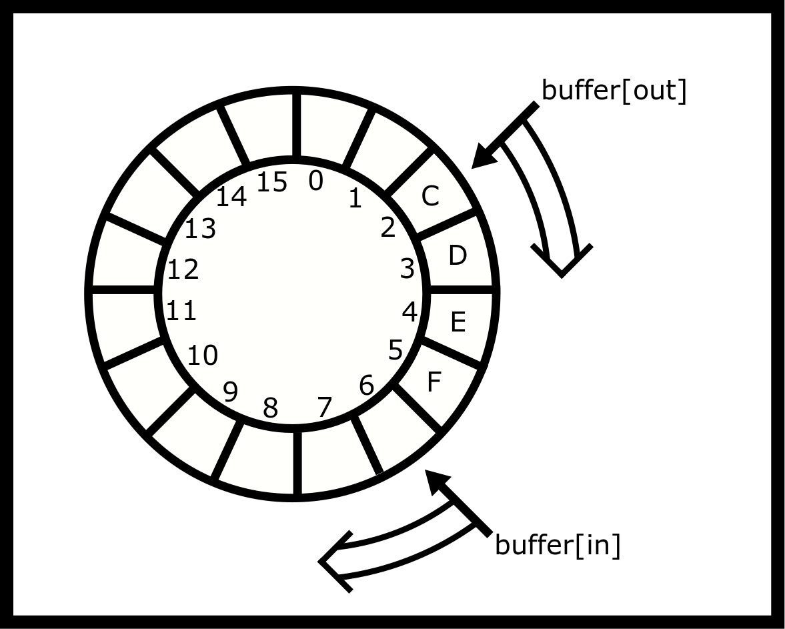

---
bibliography:
  - synchronization/synchronization.bib
link-citations: true
title: "**CS341 系统编程课程手册**"
---

- [[#^synchronization|同步]]
  - [[#^mutex|互斥锁]]
    - [[#^mutex-lifetime|互斥锁的生命周期]]
    - [[#^mutex-usages|互斥锁的用途]]
    - [[#^mutex-implementation|互斥锁的实现]]
    - [[#^advanced-implementing-a-mutex-with-hardware|进阶：用硬件实现互斥锁]]
    - [[#^semaphore|信号量]]
  - [[#^condition-variables|条件变量]]
  - [[#^thread-safe-data-structures|线程安全的数据结构]]
    - [[#^using-semaphores|使用信号量]]
  - [[#^software-solutions-to-the-critical-section|临界区的软件解决方案]]
    - [[#^naive-solutions|朴素方案]]
    - [[#^turn-based-solutions|基于轮次的方案]]
    - [[#^turn-and-flag-solutions|轮次加标志方案]]
  - [[#^working-solutions|可行的方案]]
    - [[#^petersons-solution|Peterson 方案]]
  - [[#^implementing-counting-semaphore|实现计数信号量]]
    - [[#^other-semaphore-considerations|信号量的其他考量]]
  - [[#^barriers|屏障]]
    - [[#^reader-writer-problem|读者-写者问题]]
    - [[#^attempt-1|尝试 #1]]
    - [[#^attempt-2|尝试 #2：]]
    - [[#^attempt-3|尝试 #3]]
    - [[#^starving-writers|写者饥饿]]
    - [[#^attempt-4|尝试 #4]]
  - [[#^ring-buffer|环形缓冲区]]
    - [[#^ring-buffer-gotchas|环形缓冲区的坑]]
    - [[#^multithreaded-correctness|多线程下的正确性]]
    - [[#^analysis|分析]]
    - [[#^another-analysis|另一种分析]]
    - [[#^correct-implementation-of-a-ring-buffer|环形缓冲区的正确实现]]
  - [[#^extra-process-synchronization|补充：进程同步]]
    - [[#^interruption|中断]]
    - [[#^solution|解决方案]]
  - [[#^external-resources|外部资源]]
  - [[#^topics|主题]]
  - [[#^questions|问题]]


# 同步 ^synchronization

**当多线程变得有趣起来时** -

同步用于协调各类任务，使它们最终都处于正确的状态。在 C 语言中，我们有一系列
机制来控制在某个时刻允许哪些线程做什么事。绝大多数时候，
线程无需通信就能推进，但每隔一段时间，
就可能有两个或更多线程想要访问某个临界区。临界区
是一段代码：如果程序要正确运行，
同一时刻只能有一个线程执行它。如果两个线程（或
进程）同时在临界区内执行代码，
程序的行为就可能不再正确。

正如上一章所说，当一个操作与另一个线程在同一时刻
访问同一块内存时，就会发生竞态条件。如果那块内存
只被一个线程访问，例如下面的自动变量 `i`，
那么就不可能出现竞态条件，也就没有与 `i`
相关的临界区。然而，`sum` 变量是一个全局变量，
被两个线程访问。因此可能有两个线程同时
尝试给该变量加一。

``` objectivec
#include <stdio.h>
#include <pthread.h>

int sum = 0; //shared

void *countgold(void *param) {
  int i; //local to each thread
  for (i = 0; i < 10000000; i++) {
    sum += 1;
  }
  return NULL;
}

int main() {
  pthread_t tid1, tid2;
  pthread_create(&tid1, NULL, countgold, NULL);
  pthread_create(&tid2, NULL, countgold, NULL);

  //Wait for both threads to finish:
  pthread_join(tid1, NULL);
  pthread_join(tid2, NULL);

  printf("ARRRRG sum is %d\n", sum);
  return 0;
}
```

上面代码的典型输出是
`ARRRRG sum is <some number less than expected>`，因为存在竞态
条件。这段代码允许两个线程同时读写 `sum`。
例如，两个线程都把 sum 的当前值复制到各自运行的
CPU 寄存器中（假设是 123）。两个线程各自
把自己的副本加一。两个线程再把结果写回（124）。如果
两个线程是在不同时间访问 sum 的，
那么结果应该是 125。几种可能的顺序如下。

允许的模式

<div class="center">

| 线程 1                       |                       线程 2 |
|:-------------------------------|-------------------------------:|
| 载入 Addr，本地加 1（i=1） |                            ... |
| 存储（全局 i=1）           |                            ... |
| ...                            | 载入 Addr，本地加 1（i=2） |
| ...                            |           存储（全局 i=2） |

良好的线程访问模式

</div>

部分重叠

<div class="center">

| 线程 1                       |                       线程 2 |
|:-------------------------------|-------------------------------:|
| 载入 Addr，本地加 1（i=1） |                            ... |
| 存储（全局 i=1）           | 载入 Addr，本地加 1（i=1） |
| ...                            |           存储（全局 i=1） |

糟糕的线程访问模式

</div>

完全重叠

<div class="center">

| 线程 1                       |                       线程 2 |
|:-------------------------------|-------------------------------:|
| 载入 Addr，本地加 1（i=1） | 载入 Addr，本地加 1（i=1） |
| 存储（全局 i=1）           |           存储（全局 i=1） |

可怕的线程访问模式

</div>

我们希望上面第一种模式中的代码是互斥的。
这就引出了我们的第一个同步原语：互斥锁。

## 互斥锁 ^mutex

要确保同一时刻只有一个线程能访问某个全局变量，
请使用互斥锁（mutex）—— 即 Mutual Exclusion（互斥）的简称。如果有一个线程
正在临界区内，我们希望另一个线程等待，
直到第一个线程结束。互斥锁并不是最纯粹意义上的
原语，不过它确实是带有多线程 API 的最小原语之一。互斥锁
也不是一个数据结构。它是一个抽象数据类型。

让我们想一只满足 mutex API 的鸭子。如果有人拿着
这只鸭子，那么他就获准访问某个共享资源！我们把它
叫作 mutex duck。其他所有人都只能摇摇摆胖地等着。一旦有人
松开鸭子，他就必须停止与该资源交互，而下一个
抓到鸭子的人就可以与共享资源交互了。现在你知道
这只鸭子的来历了。

实现互斥锁的方法有很多，本章会给出其中几种。
眼下先使用 pthread 库提供给我们的黑盒。
下面就是声明一个互斥锁的方式。

``` objectivec
pthread_mutex_t m = PTHREAD_MUTEX_INITIALIZER;
pthread_mutex_lock(&m); // start of Critical Section
// Critical section
pthread_mutex_unlock(&m); //end of Critical Section
```

### 互斥锁的生命周期 ^mutex-lifetime

对于所有互斥锁，初始化方式有两种：

- `PTHREAD_MUTEX_INITIALIZER`

- `pthread_mutex_init(pthread_mutex_t *mutex, pthread_mutexattr_t *attr)`

宏 `PTHREAD_MUTEX_INITIALIZER` 在功能上等价于
更通用的 `pthread_mutex_init(&m,NULL)`。换句话说，
`PTHREAD_MUTEX_INITIALIZER` 会创建一个具有默认属性的互斥锁。
init 版本中的 `attr` 包含了若干选项，可以用性能
换取额外的错误检查、更高级的共享能力等。虽然我们
推荐对位于堆上的互斥锁在程序内部使用 init 函数，
但两种方法你都可以用。

``` objectivec
pthread_mutex_t *lock = malloc(sizeof(pthread_mutex_t));
pthread_mutex_init(lock, NULL);
//later
pthread_mutex_destroy(lock);
free(lock);
```

用完互斥锁之后，我们还应当调用
`pthread_mutex_destroy(&m)`。注意，程序只能销毁处于未加锁状态的
互斥锁，在已加锁的互斥锁上调用销毁是未定义行为。关于互斥锁的
初始化和销毁，有以下几点需要记住：

1.  初始化一个已经初始化过的互斥锁是未定义行为

2.  销毁一个已加锁的互斥锁是未定义行为

3.  坚持"有且仅有一个线程负责初始化互斥锁"的模式。

4.  把互斥锁的字节复制到一个新的内存位置然后
    使用这个副本是**不受支持**的。要引用一个互斥锁，程序
    *必须*持有指向那块内存地址的指针。

5.  全局／静态互斥锁不需要销毁。

### 互斥锁的用途 ^mutex-usages

互斥锁该怎么用？下面是一个完整的例子，
风格上与前面那段代码一脉相承。

``` objectivec
#include <stdio.h>
#include <pthread.h>

// Create a global mutex, this is ready to be locked!
pthread_mutex_t m = PTHREAD_MUTEX_INITIALIZER;

int sum = 0;

void *countgold(void *param) {
  int i;

  //Same thread that locks the mutex must unlock it
  //Critical section is 'sum += 1'
  //However locking and unlocking ten million times
  //has significant overhead

  pthread_mutex_lock(&m);

  // Other threads that call lock will have to wait until we call unlock

  for (i = 0; i < 10000000; i++) {
    sum += 1;
  }
  pthread_mutex_unlock(&m);
  return NULL;
}

int main() {
  pthread_t tid1, tid2;
  pthread_create(&tid1, NULL, countgold, NULL);
  pthread_create(&tid2, NULL, countgold, NULL);

  pthread_join(tid1, NULL);
  pthread_join(tid2, NULL);

  printf("ARRRRG sum is %d\n", sum);
  return 0;
}
```

在上面的代码中，线程在进入之前先拿到计数小屋的锁。
临界区只有 `sum+=1`，所以下面这个版本同样正确。

``` objectivec
for (i = 0; i < 10000000; i++) {
  pthread_mutex_lock(&m);
  sum += 1;
  pthread_mutex_unlock(&m);
}
return NULL;
}
```

这个过程更慢，因为我们把互斥锁加锁、解锁了一千万次，
这代价不菲—— 至少与给一个变量加一相比是如此。在这个简单
的例子中，我们其实并不需要线程。一个更快的
多线程例子是：先用自动（局部）变量累加一千万，
等计算循环结束后再把它加到一个共享总数上：

``` objectivec
int local = 0;
for (i = 0; i < 10000000; i++) {
  local += 1;
}

pthread_mutex_lock(&m);
sum += local;
pthread_mutex_unlock(&m);

return NULL;
}
```

先说坑。首先，C 语言的互斥锁并不锁变量。
互斥锁是一个简单的数据结构。它作用于代码，而不是数据。如果
一个互斥锁被锁上了，其他线程会继续往下走。只有当
线程试图去锁一个已经被锁住的互斥锁时，它才需要等待。
一旦原先那个线程解锁，第二个（正在等待的）线程就会
获得这把锁并继续执行。下面的代码创建了一个
实际上什么也不做的互斥锁。

``` objectivec
int a;
pthread_mutex_t m1 = PTHREAD_MUTEX_INITIALIZER,
m2 = PTHREAD_MUTEX_INITIALIZER;
// later
// Thread 1
pthread_mutex_lock(&m1);
a++;
pthread_mutex_unlock(&m1);

// Thread 2
pthread_mutex_lock(&m2);
a++;
pthread_mutex_unlock(&m2);
```

下面是其他一些坑，不分先后顺序：

1.  别把流搞混！如果在使用线程，就不要在程序
    中途 fork。这意味着在你的互斥锁已经
    初始化之后的任何时刻都不要这么做。

2.  给某个互斥锁加锁的线程，是唯一能给
    它解锁的线程。

3.  每个程序可以有多个互斥锁。一个线程安全的设计
    可能给每个数据结构配一把锁、每个堆一把锁，
    或每组数据结构一把锁。如果一个程序只有一把锁，
    那么对这把锁的争用可能会很激烈。如果两个
    线程在更新两个不同的计数器，就没有必要
    使用同一把锁。

4.  锁只是一种工具。它不会帮你找出临界区！

5.  调用 `pthread_mutex_lock` 和 `pthread_mutex_unlock` 总会带来
    一点额外开销。不过，这就是让程序正确
    运行所要付出的代价！

6.  在错误处理中因为提前返回而没有解锁

7.  资源泄漏（没有调用 `pthread_mutex_destroy`）

8.  使用未初始化的互斥锁，或使用一个已经被
    销毁的互斥锁

9.  在一个线程上连续加锁两次而中间没有解锁

10. 死锁

### 互斥锁的实现 ^mutex-implementation

于是我们有了这个很酷的数据结构。要怎么实现它？下面是一个
天真的、错误的实现。`unlock` 函数只是
解锁并返回。lock 函数先检查一下这把锁是否已经被锁住。
如果它当前被锁住了，就会一遍又一遍地继续检查，
直到另一个线程解锁为止。暂时我们先回避
"其他线程能够解锁它们并不拥有的锁"这一情形，
专注于互斥这一点。

``` objectivec
// Version 1 (Incorrect!)

void lock(mutex_t *m) {
  while(m->locked) { /*Locked? Never-mind - loop and check again!*/ }

  m->locked = 1;
}

void unlock(mutex_t *m) {
  m->locked = 0;
}
```

版本 1 不必要地使用了"忙等"，白白浪费 CPU 资源。
不过还有一个更严重的问题：我们出现了竞态条件！如果
两个线程同时调用 `lock`，那么有可能
两个线程都把 `m->locked` 读成零。于是两个线程都会
认为自己独占了这把锁，然后两个线程都会继续执行。

我们也许可以在循环里调用 `pthread_yield()` 来稍微降低一点
CPU 开销—— pthread_yield 向操作系统表明该线程
短时间内不会用到 CPU，因此 CPU 可以分配给那些
正等着运行的线程。但这仍然留下了竞态条件。我们需要
一个更好的实现。这一章的临界区部分稍后会再谈
这个问题。现在，我们来谈谈信号量。

### 进阶：用硬件实现互斥锁 ^advanced-implementing-a-mutex-with-hardware

我们可以用 C11 原子操作完美地做到这一点！一个完整的方案在
这里有详细说明。这是一个自旋锁互斥锁，
<a href="https://locklessinc.com/articles/mutex_cv_futex/">https://locklessinc.com/articles/mutex_cv_futex/</a>
这些实现在网上都可以找到。

首先是数据结构和初始化代码。

``` objectivec
typedef struct mutex_{
  // We need some variable to see if the lock is locked
  atomic_int_least8_t lock;
  // A mutex needs to keep track of its owner so
  // Another thread can't unlock it
  pthread_t owner;
} mutex;

#define UNLOCKED 0
#define LOCKED 1
#define UNASSIGNED_OWNER 0

int mutex_init(mutex* mtx){
  // Some simple error checking
  if(!mtx){
    return 0;
  }
  // Not thread-safe the user has to take care of this
  atomic_init(&mtx->lock, UNLOCKED);
  mtx->owner = UNASSIGNED_OWNER;
  return 1;
}
```

这就是初始化代码，没什么花哨的地方。我们把互斥锁的状态
设为未加锁，并把所有者设为未指定。

``` objectivec
int mutex_lock(mutex* mtx){
  int_least8_t zero = UNLOCKED;
  while(!atomic_compare_exchange_weak_explicit
  (&mtx->lock,
  &zero,
  LOCKED,
  memory_order_seq_cst,
  memory_order_seq_cst)){
    zero = UNLOCKED;
    sched_yield(); // Use system calls for scheduling speed
  }
  // We have the lock now
  mtx->owner = pthread_self();
  return 1;
}
```

这段代码做了什么？它初始化了一个变量，我们将用它表示
未加锁状态。<a href="https://en.wikipedia.org/wiki/Compare-and-swap">https://en.wikipedia.org/wiki/Compare-and-swap</a>
是大多数现代体系结构都支持的一条指令（在 x86 上它是
`lock cmpxchg`）。这个操作的伪代码看起来像这样

``` objectivec
int atomic_compare_exchange_pseudo(int* addr1, int* addr2, int val){
  if(*addr1 == *addr2){
    *addr1 = val;
    return 1;
  }else{
    *addr2 = *addr1;
    return 0;
  }
}
```

只不过整个操作是*原子*地完成的，也就是说在一次不可中断的
操作中完成。*弱*那部分是什么意思？C11 提供了比较并交换
的两个版本。*强*版本只有在值确实与预期不同时才会失败。
*弱*版本即使在值是匹配的情况下也
**虚假地**失败，这让它在某些 CPU（比如 ARM）上可以编译成
更快的指令。这与你在下面的条件变量中会看到的
虚假唤醒很相似。反正我们总是在
循环里重试，所以一次虚假失败只会多花一轮迭代，
而我们可以使用更快的弱版本。这意味着即使它
失败得稍微频繁一点也没关系，因为我们反正会继续自旋。

在 while 循环内部，说明我们没能拿到锁！我们把零重置为
未加锁并短暂休眠。醒来之后我们再试着拿锁。
一旦交换成功，我们就进入临界区了！
我们把互斥锁的所有者设为当前线程，以便
解锁方法使用，然后成功返回。

这如何保证互斥？关于原子操作的推理
往往很棘手，但这个简单的例子很容易检查。
比较并交换是原子的，因此只有一个线程
能把锁从 UNLOCKED（0）改成 LOCKED（1）。那个线程的
比较并交换成功，它进入临界区。其他每个线程看到的都是
LOCKED 而不是它预期的 UNLOCKED 值，因此它的
比较并交换失败，于是继续等待。解锁该怎么实现？

``` objectivec
int mutex_unlock(mutex* mtx){
  if(unlikely(pthread_self() != mtx->owner)){
    return 0; // Can't unlock a mutex if the thread isn't the owner
  }
  int_least8_t one = 1;
  //Critical section ends after this atomic
  mtx->owner = UNASSIGNED_OWNER;
  if(!atomic_compare_exchange_strong_explicit(
  &mtx->lock,
  &one,
  UNLOCKED,
  memory_order_seq_cst,
  memory_order_seq_cst)){
    //The mutex was never locked in the first place
    return 0;
  }
  return 1;
}
```

为了满足 API，除非线程就是拥有者，否则它不能解锁这个
互斥锁。接着我们取消指定互斥锁的所有者，因为
原子操作结束后临界区就结束了。我们要的是强交换，
因为我们不想阻塞。我们预期互斥锁是已锁定的，
然后把它交换为未加锁。如果交换成功，我们就解锁了。
如果没有成功，那说明互斥锁本来就是 UNLOCKED，
而我们试图把它从 UNLOCKED 变成 UNLOCKED，
从而保持了 unlock 的行为。

这个内存序是怎么回事？我们之前谈到过
内存栅栏，现在它来了！我们不打算细讲，因为它超出了
本课程的范围，不过它在
<a href="https://gcc.gnu.org/wiki/Atomic/GCCMM/AtomicSync">https://gcc.gnu.org/wiki/Atomic/GCCMM/AtomicSync</a>
的范围内。我们需要一致性来确保没有任何加载或存储被排到
前面或后面。程序需要建立依赖链来获得更高效的
排序。

### 信号量 ^semaphore

信号量是另一个同步原语。它被初始化为
某个值。线程可以 `sem_wait` 或 `sem_post`，从而
降低或提高该值。如果值降到零又有人调用 wait，
线程就会被阻塞，直到有人调用 post。

使用信号量和使用互斥锁一样简单。首先，确定
初始值，例如数组中剩余的空位数。
与 pthread 互斥锁不同，创建信号量没有什么捷径——
请使用 `sem_init`。

``` objectivec
#include <semaphore.h>

sem_t s;
int main() {
  sem_init(&s, 0, 10); // returns -1 (=FAILED) on OS X
  sem_wait(&s); // Could do this 10 times without blocking
  sem_post(&s); // Announce that we've finished (and one more resource item is available; increment count)
  sem_destroy(&s); // release resources of the semaphore
}
```

使用信号量时，wait 和 post 可以由不同的
线程调用！与互斥锁不同，递增和递减可以来自
不同的线程。

如果你想用信号量来实现一个互斥锁，这一点就特别
有用。互斥锁就是一个在它
`posts` 之前总是先 `waits` 的信号量。有些教科书会把互斥锁
称为二元信号量。你确实必须小心，永远不要往信号量上加
超过一，否则你的互斥锁抽象就坏了。只要这样留意，
信号量就可以替代互斥锁；本章稍后我们还会反过来，
用一个互斥锁加一个条件变量来构造信号量。

- 把信号量初始化为计数 1。

- 把 `pthread_mutex_lock` 替换为 `sem_wait`

- 把 `pthread_mutex_unlock` 替换为 `sem_post`

``` objectivec
sem_t s;
sem_init(&s, 0, 1);

sem_wait(&s);
// Critical Section
sem_post(&s);
```

但要当心，它并不一样！互斥锁有所有者：只有
给它加锁的那个线程才能给它解锁。信号量没有所有者，
因此任何线程都可以调用 `sem_post`，包括一个从未
等待过的线程。在下面的代码中，
线程 2 多余地调用 `sem_post`，让线程 1 和 3 同时
进入了临界区。

``` objectivec
// Thread 1
sem_wait(&s);
// Critical Section
sem_post(&s);

// Thread 2
// Some threads want to see the world burn
sem_post(&s);

// Thread 3
sem_wait(&s);
// Not thread-safe!
sem_post(&s);
```

对互斥锁而言，线程 2 的解锁是一个错误，因为线程 2 并不
拥有这个互斥锁。带错误检查的互斥锁会返回 `EPERM`；
用默认互斥锁时行为是未定义的，所以不要依赖它。

``` objectivec
// Thread 1
mutex_lock(&s);
// Critical Section
mutex_unlock(&s);

// Thread 2
// Foiled!
mutex_unlock(&s);

// Thread 3
mutex_lock(&s);
// Now it's thread-safe
mutex_unlock(&s);
```

另外，二元信号量与互斥锁也不同，因为互斥锁必须
由给它加锁的线程来解锁，而任何线程都可以
在信号量上调用 `sem_post`，哪怕它从未等待过。

#### 信号安全性 ^signal-safety

另外，`sem_post` 是少数几个可以在信号处理器内部
正确使用的函数之一。`pthread_mutex_unlock` 则不行。我们可以
唤醒一个正在等待的线程，让它去执行那些我们不允许
在信号处理器内部调用的调用，比如 `printf`。下面
是一些利用这一点的代码：

``` objectivec
#include <stdio.h>
#include <pthread.h>
#include <signal.h>
#include <semaphore.h>
#include <unistd.h>

sem_t s;

void handler(int signal) {
  sem_post(&s); /* Release the Kraken! */
}

void *singsong(void *param) {
  sem_wait(&s);
  printf("Waiting until a signal releases...\n");
}

int main() {
  int ok = sem_init(&s, 0, 0 /* Initial value of zero*/);
  if (ok == -1) {
    perror("Could not create unnamed semaphore");
    return 1;
  }
  signal(SIGINT, handler); // Too simple! See Signals chapter

  pthread_t tid;
  pthread_create(&tid, NULL, singsong, NULL);
  pthread_exit(NULL); /* Process will exit when there are no more threads */
}
```

信号量的其他用途是跟踪数组中的空位。
我们会在"线程安全的数据结构"一节讨论这些。

## 条件变量 ^condition-variables

条件变量允许一组线程睡眠，直到被唤醒。
该 API 允许唤醒一个或全部线程。如果程序只
唤醒一个线程，那么由操作系统来决定唤醒哪个
线程。线程不会直接唤醒别的线程，比如按 id 唤醒。
相反，一个线程会对条件变量"发信号"，
条件变量随后会唤醒一个（或全部）
正在条件变量里睡眠的线程。

条件变量也总是配合互斥锁和一个循环一起使用，
这样它们被唤醒后必须在临界区里检查某个条件。如果
某个线程需要在临界区之外被唤醒，POSIX 中还有
别的办法。在条件变量里睡眠的线程
通过调用 `pthread_cond_broadcast`（唤醒全部）
或 `pthread_cond_signal`（唤醒一个）被唤醒。注意，尽管函数名如此，
这与 POSIX 的 `signal` 毫无关系！

偶尔，一个正在等待的线程似乎会毫无理由地醒来。
这叫做*虚假唤醒*。如果你读过互斥锁一节的
硬件实现，就会发现这与同名的原子操作失败很
相似。

虚假唤醒为什么会发生？为了性能。在多 CPU 系统上，
有可能一次唤醒（发信号）请求会因为竞态条件
而被忽略。内核可能检测不到这次丢失的唤醒
调用，却能检测到它可能发生。为了避免可能丢失的
信号，线程会被唤醒，这样程序代码就可以
再次测试条件。如果你想知道原因，去看看附录。

## 线程安全的数据结构 ^thread-safe-data-structures

理所当然，我们希望数据结构也是线程安全的！
我们可以使用互斥锁和同步原语来实现这一点。先给出
几个定义。当一个操作是线程安全的时，我们称它具有
原子性。我们通过提供 lock 前缀
在硬件中拥有原子指令

    lock ...

原子性同样适用于更高层次的操作。我们说一个数据
结构操作是原子的，是指它要么整体成功、
要么完全不发生。

因此，我们可以用同步原语让数据
结构变得线程安全。绝大多数时候我们会用互斥锁，
因为它们比二元信号量承载更多语义信息。还要注意，
这只是一篇入门介绍。要编写高性能的线程安全数据
结构，本身就得写一本书！以如下这个
非线程安全的栈为例。

``` objectivec
// A simple fixed-sized stack (version 1)
#define STACK_SIZE 20
int count;
double values[STACK_SIZE];

void push(double v) {
  values[count++] = v;
}

double pop() {
  return values[--count];
}

int is_empty() {
  return count == 0;
}
```

栈的版本 1 是非线程安全的，因为如果两个线程同时调用
push 或 pop，那么结果或栈本身都可能
不一致。例如，想象两个线程同时调用 pop，
那么两个线程可能读到同一个值，都可能读到
原来的计数值。

要把它变成线程安全的数据结构，我们需要找出代码中的
*临界区*，也就是我们必须问清楚：代码中的哪一段（或
哪几段）同一时刻只允许有一个线程。在上面的例子中
`push`、`pop` 和 `is_empty` 函数访问同一块内存，
对这个栈来说它们全都是临界区。当 `push`
（以及 `pop`）执行时，数据结构处于不一致状态，
例如计数值可能还没被写回，所以它可能仍然
保存着原来的值。把这些方法用互斥锁包起来，
我们就能确保同一时刻只有一个线程能更新（或读取）
这个栈。下面是一个候选"解决方案"。
它正确吗？如果不正确，它会怎么失败？

``` objectivec
// An attempt at a thread-safe stack (version 2)
#define STACK_SIZE 20
int count;
double values[STACK_SIZE];

pthread_mutex_t m1 = PTHREAD_MUTEX_INITIALIZER;
pthread_mutex_t m2 = PTHREAD_MUTEX_INITIALIZER;

void push(double v) {
  pthread_mutex_lock(&m1);
  values[count++] = v;
  pthread_mutex_unlock(&m1);
}

double pop() {
  pthread_mutex_lock(&m2);
  double v = values[--count];
  pthread_mutex_unlock(&m2);

  return v;
}

int is_empty() {
  pthread_mutex_lock(&m1);
  return count == 0;
  pthread_mutex_unlock(&m1);
}
```

版本 2 至少有一个错误。花点时间看看你能不能
找出这些错误，并推断出它们的后果。

如果三个线程同时调用 `push()`，那么锁 `m1` 能确保
同一时刻只有一个线程在 push 或 is_empty 时操作
这个栈—— 另外两个线程必须等待直到第一个线程完成。
对 `pop` 的并发调用也适用类似的论证。然而，版本
2 并不能阻止 push 和 pop 同时运行，因为
`push` 和 `pop` 使用了两把不同的互斥锁。这种情况下
修复很简单—— push 和 pop 两个函数用同一把互斥锁即可。

这段代码还有第二个错误。`is_empty` 在比较之后返回，
并把互斥锁留在未加锁状态。不过这个错误不会
立刻被发现。例如，假设一个线程调用了 `is_empty`，
之后第二个线程调用了 `push`。这个线程会莫名其妙地
卡住。用调试器你就会发现，该线程卡在了
`push` 方法里的 lock() 上，因为早先那次 `is_empty`
调用从未解锁。因此一个线程中的一处疏漏，
在时间上远远之后、在另一个任意的线程里
引发了问题。让我们来修正这些问题。

``` objectivec
// An attempt at a thread-safe stack (version 3)
int count;
double values[count];
pthread_mutex_t m = PTHREAD_MUTEX_INITIALIZER;

void push(double v) {
  pthread_mutex_lock(&m);
  values[count++] = v;
  pthread_mutex_unlock(&m);
}
double pop() {
  pthread_mutex_lock(&m);
  double v = values[--count];
  pthread_mutex_unlock(&m);
  return v;
}
int is_empty() {
  pthread_mutex_lock(&m);
  int result = count == 0;
  pthread_mutex_unlock(&m);
  return result;
}
```

版本 3 是线程安全的。我们已经为所有
临界区保证了互斥。有几点需要注意。

- `is_empty` 是线程安全的，但它的结果可能已经过时。
  等线程拿到结果时，栈可能已经不再为空了！
  这通常就是为什么在线程安全的数据结构中，返回大小的
  函数会被删除或弃用。

- 没有任何针对下溢（在空栈上 pop）或
  上溢（在已满的栈上 push）的保护

最后一点可以用计数信号量来修复。原来的
实现假定只有一个栈。一个更通用的版本
可以把互斥锁作为内存结构的一部分，并用
`pthread_mutex_init` 来初始化该互斥锁。例如，

``` objectivec
// Support for multiple stacks (each one has a mutex)
typedef struct stack {
  int count;
  pthread_mutex_t m;
  double *values;
} stack_t;

stack_t* stack_create(int capacity) {
  stack_t *result = malloc(sizeof(stack_t));
  result->count = 0;
  result->values = malloc(sizeof(double) * capacity);
  pthread_mutex_init(&result->m, NULL);
  return result;
}
void stack_destroy(stack_t *s) {
  free(s->values);
  pthread_mutex_destroy(&s->m);
  free(s);
}

// Warning no underflow or overflow checks!

void push(stack_t *s, double v) {
  pthread_mutex_lock(&s->m);
  s->values[(s->count)++] = v;
  pthread_mutex_unlock(&s->m);
}

double pop(stack_t *s) {
  pthread_mutex_lock(&s->m);
  double v = s->values[--(s->count)];
  pthread_mutex_unlock(&s->m);
  return v;
}

int is_empty(stack_t *s) {
  pthread_mutex_lock(&s->m);
  int result = s->count == 0;
  pthread_mutex_unlock(&s->m);
  return result;
}

int main() {
  stack_t *s1 = stack_create(10 /* Max capacity*/);
  stack_t *s2 = stack_create(10);
  push(s1, 3.141);
  push(s2, pop(s1));
  stack_destroy(s2);
  stack_destroy(s1);
}
```

在我们用信号量修复这些问题之前，你会如何用
条件变量来修复？先自己试一试再看
下面的代码。如果栈是满的或空的，
我们需要在 push 和 pop 中分别等待。尝试性的方案：

``` objectivec
// Assume cv is a condition variable
// correctly initialized

void push(stack_t *s, double v) {
  pthread_mutex_lock(&s->m);
  if(s->count == 0) pthread_cond_wait(&s->cv, &s->m);
  s->values[(s->count)++] = v;
  pthread_mutex_unlock(&s->m);
}

double pop(stack_t *s) {
  pthread_mutex_lock(&s->m);
  if(s->count == 0) pthread_cond_wait(&s->cv, &s->m);
  double v = s->values[--(s->count)];
  pthread_mutex_unlock(&s->m);
  return v;
}
```

上面的方案行得通吗？在看答案之前
先花点时间找出错误。

那么你把所有错误都找出来了吗？

1.  第一个是很简单的。在 push 中，我们的检查应当是对照
    总容量，而不是零。

2.  我们只有 if 语句检查。wait() 可能虚假唤醒。

3.  我们从来没有给任何线程发信号！线程可能会
    永远卡在等待里。

让我们来修正这些错误。这个方案行得通吗？

``` objectivec
void push(stack_t *s, double v) {
  pthread_mutex_lock(&s->m);
  while(s->count == capacity) pthread_cond_wait(&s->cv, &s->m);
  s->values[(s->count)++] = v;
  pthread_mutex_unlock(&s->m);
  pthread_cond_signal(&s->cv);
}

double pop(stack_t *s) {
  pthread_mutex_lock(&s->m);
  while(s->count == 0) pthread_cond_wait(&s->cv, &s->m);
  double v = s->values[--(s->count)];
  pthread_cond_broadcast(&s->cv);
  pthread_mutex_unlock(&s->m);
  return v;
}
```

这个方案同样行不通！问题出在
发信号上。你能看出为什么吗？你会怎么做来修复它？

那么，我们该如何用计数信号量来防止上溢和下溢？
下一节讨论。

### 使用信号量 ^using-semaphores

让我们用一个计数信号量来跟踪还剩多少空位，
再用另一个信号量来跟踪栈中的元素个数。我们把
这两个信号量叫做 `sremain` 和 `sitems`。记住 `sem_wait`
会在信号量的计数被（其他调用 `sem_wait` 的
线程）减到零时等待。

``` objectivec
// Sketch #1

sem_t sitems;
sem_t sremain;
void stack_init(){
  sem_init(&sitems, 0, 0);
  sem_init(&sremain, 0, 10);
}


double pop() {
  // Wait until there's at least one item
  sem_wait(&sitems);
  ...
}

void push(double v) {
  // Wait until there's at least one space
  sem_wait(&sremain);
  ...
}
```

草图 \#1 只讲了一半的故事。让 `sitems` 从 0 开始、
`sremain` 从 10 开始，那么 `pop` 会在栈为空时阻塞，
而当栈上有 10 个元素时 `push` 就会阻塞，这正是我们想要的。
但从来没有人调用 `sem_post`：`sitems` 永远不会增加，
所以每个 `pop` 都会永远阻塞；而 `sremain` 也永远回不来，
因此 10 次 push 之后每个 `push` 同样会永远阻塞。
每次成功的 `push` 都会创建一个元素，所以它
必须 post `sitems`；每次成功的 `pop` 都会腾出一个空位，
所以它必须 post `sremain`。问题在于这些 post 应该
放在*哪里*。

草图 \#2 过早实现了 `post`。另一个在 push 中
等待的线程可能错误地尝试写入已满的栈。同样地，
一个在 pop() 中等待的线程也获准过早地继续下去。

``` objectivec
// Sketch #2 (Error!)
double pop() {
  // Wait until there's at least one item
  sem_wait(&sitems);
  sem_post(&sremain); // error! wakes up pushing() thread too early
  return values[--count];
}
void push(double v) {
  // Wait until there's at least one space
  sem_wait(&sremain);
  sem_post(&sitems); // error! wakes up a popping() thread too early
  values[count++] = v;
}
```

草图 \#3 实现了正确的信号量逻辑，但你能
看出错误吗？

``` objectivec
// Sketch #3 (Error!)
double pop() {
  // Wait until there's at least one item
  sem_wait(&sitems);
  double v= values[--count];
  sem_post(&sremain);
  return v;
}

void push(double v) {
  // Wait until there's at least one space
  sem_wait(&sremain);
  values[count++] = v;
  sem_post(&sitems);
}
```

草图 \#3 正确地用信号量强制了
缓冲区满和缓冲区空的条件。然而，它没有
*互斥*。两个线程可以同时处于
*临界区*，这会破坏数据结构，或者至少导致数据丢失。
修复办法是在临界区外面包一把互斥锁：

``` objectivec
// Simple single stack - see the above example on how to convert this into multiple stacks.
// Also a robust POSIX implementation would check for EINTR and error codes of sem_wait.

// PTHREAD_MUTEX_INITIALIZER for statics (use pthread_mutex_init() for stack/heap memory)
#define SPACES 10
pthread_mutex_t m= PTHREAD_MUTEX_INITIALIZER;
int count = 0;
double values[SPACES];
sem_t sitems, sremain;

void init() {
  sem_init(&sitems, 0, 0);
  sem_init(&sremain, 0, SPACES); // 10 spaces
}

double pop() {
  // Wait until there's at least one item
  sem_wait(&sitems);

  pthread_mutex_lock(&m); // CRITICAL SECTION
  double v= values[--count];
  pthread_mutex_unlock(&m);

  sem_post(&sremain); // Hey world, there's at least one space
  return v;
}

void push(double v) {
  // Wait until there's at least one space
  sem_wait(&sremain);

  pthread_mutex_lock(&m); // CRITICAL SECTION
  values[count++] = v;
  pthread_mutex_unlock(&m);

  sem_post(&sitems); // Hey world, there's at least one item
}
// Note a robust solution will need to check sem_wait's result for EINTR (more about this later)
```

当我们开始把加锁和等待的顺序颠倒过来时会发生什么？

``` objectivec
double pop() {
  pthread_mutex_lock(&m);
  sem_wait(&sitems);

  double v= values[--count];
  pthread_mutex_unlock(&m);

  sem_post(&sremain);
  return v;
}

void push(double v) {
  sem_wait(&sremain);

  pthread_mutex_lock(&m);
  values[count++] = v;
  pthread_mutex_unlock(&m);

  sem_post(&sitems);
}
```

与其直接给你答案，不如让你自己想一想。
这是一种可接受的加锁与解锁方式吗？是否存在一系列
操作会导致竞态条件？死锁呢？如果
存在，请给出。如果不存在，请给出一个简短的
证明说明为什么它不会发生。

## 临界区的软件解决方案 ^software-solutions-to-the-critical-section

正如前面讨论过的，我们的代码中有些关键部分
同一时刻只能由一个线程执行。我们把这一要求描述为
"互斥"。只有一个线程（或进程）可以访问
共享资源。在多线程程序中，我们可以用互斥锁的
加锁和解锁调用把临界区包起来：

``` objectivec
pthread_mutex_lock() // one thread allowed at a time! (others will have to wait here)
// ... Do Critical Section stuff here!
pthread_mutex_unlock() // let other waiting threads continue
```

我们要怎么实现这些加锁和解锁调用？能否创建一个纯
软件的算法来保证互斥？下面是我们之前
尝试过的版本。

``` objectivec
pthread_mutex_lock(p_mutex_t *m) {
  while(m->lock) ;
  m->lock = 1;
}
pthread_mutex_unlock(p_mutex_t *m) {
  m->lock = 0;
}
```

正如我们前面提到的，这个实现*不满足互斥*，
即使考虑到线程可以解锁其他线程的
锁也一样。让我们从两个几乎同时运行的线程的角度
仔细看看这个"实现"。

为了简化讨论，我们只考虑两个线程。注意这些
论证对线程和进程都成立，而经典的 CS 文献
是用两个需要独占访问某临界区或共享资源的
进程来讨论这些问题的。置起一个标志
表示一个线程／进程想要进入临界区的意图。

对于临界区问题的解法，我们希望它
具备三项主要性质。

1.  互斥性。线程／进程获得独占访问权。其他
    必须等到它退出临界区。

2.  有界等待。一个等待进入临界区的线程／进程
    不会被其他线程超越无限多次。

3.  进展性。如果临界区内没有任何线程／进程，
    线程／进程就应当能够继续推进而不必等待。

带着这些想法，让我们再考察另一个候选方案，
它只在两个线程恰好同时需要访问时才
使用基于轮次的标志。

### 朴素方案 ^naive-solutions

请记住，下面给出的伪代码是一个更大程序的一部分。
线程或进程通常需要在进程的生命周期内多次
进入临界区。所以，请把每个例子都想象成
包在一个循环里，在循环中线程或进程会随机地
花一段时间去做别的事。

下面描述的候选方案有什么问题吗？

    // Candidate #1
    wait until your flag is lowered
    raise my flag
    // Do Critical Section stuff
    lower my flag

答案：候选方案 \#1 同样存在竞态条件，
因为两个线程／进程都可能把对方的标志值
读成"已落下"，然后继续。

这说明我们应当在检查另一个
线程的标志*之前*就置起自己的标志，
也就是下面的候选方案 \#2。

    // Candidate #2
    raise my flag
    wait until your flag is lowered
    // Do Critical Section stuff
    lower my flag

候选方案 \#2 满足互斥性。两个
线程同时处于临界区内是不可能的。然而，
这段代码会死锁！假设两个线程
同时想要进入临界区。

<div class="center">

| 时间 |  线程 1  |  线程 2  |
|:-----|:----------:|:----------:|
| 1    | 置起标志 |            |
| 2    |            | 置起标志 |
| 3    |    等待    |    等待    |

候选方案 \#2 分析

</div>

现在两个进程都在等待对方放下自己的标志。
由于双方都永远卡住了，谁也进不了临界区！
这说明我们应当用一个基于轮次的变量来试着
判定谁应该继续。

### 基于轮次的方案 ^turn-based-solutions

下面的候选方案 \#3 使用一个基于轮次的变量，
礼貌地先让一个线程、再让另一个线程继续。

    // Candidate #3
    wait until my turn is myid
    // Do Critical Section stuff
    turn = yourid

候选方案 \#3 满足互斥性。每个线程或进程都能
独占访问临界区。然而，两个
线程／进程必须严格按轮次交替才能使用
临界区。它们被迫采用交替进入临界区的
访问模式。如果线程 1 想每
毫秒读一次哈希表，而另一个线程每秒写一次
哈希表，那么读线程就得再等 999ms 才能
再次读取哈希表。这个"解决方案"效率低下，
因为只要当前没有其他线程在临界区里，
我们的线程就应当能够推进并进入
临界区。

### 轮次加标志方案 ^turn-and-flag-solutions

下面这个是 CSP 的正确解法吗？

    \\ Candidate #4
    raise my flag
    if your flag is raised, wait until my turn
    // Do Critical Section stuff
    turn = yourid
    lower my flag

分析这些解法很棘手。就连关于这一
具体主题的同行评审论文里也有错误的解法
（<a href="#ref-Hyman:1966:CPC:365153.365167">#ref-Hyman:1966:CPC:365153.365167</a>）！
乍看之下，它似乎满足互斥性、有界等待
和进展性。基于轮次的标志只在出现僵平时才被使用，
所以进展性和有界等待都成立，而互斥性看起来也
得到了满足。也许你能找到一个反例？

候选方案 \#4 失败，是因为一个线程并没有等待
另一个线程放下它的标志。经过一番思考或灵光一现，
可以构造出下面这个场景来演示互斥性
是如何不被满足的。

设想第一个线程把这段代码运行两次。此时轮次标志
指向第二个线程。当第一个线程仍在
临界区内时，第二个线程到来了。第二个线程可以
立刻继续进入临界区！

<div class="center">

| 时间 | 轮次 | 线程 \# 1 | 线程 \# 2 |
|:---|:---|:---|:---|
| 1 | 2 | 置起我的标志 |  |
| 2 | 2 | 如果你的标志已置起，就等到轮到我 | 置起我的标志 |
| 3 | 2 | // 执行临界区操作 | 如果你的标志已置起，就等到轮到我（真的！） |
| 4 | 2 | // 执行临界区操作 | 执行临界区操作 —— 糟糕 |

候选方案 \#4

</div>

## 可行的方案 ^working-solutions

这个问题的第一个解法是 Dekker 的方案。Dekker 算法
（1962）是第一个可证明正确的解法。不过它当时
是一篇未发表的论文，因此直到后来才被
发现（<a href="#ref-dekker_dijkstra_1965">[1]</a>）
（这是 1965 年发布的英文誊写版）。下面是该算法的一个
版本。

    raise my flag
    while (your flag is raised) :
       if it is your turn to win :
         lower my flag
         wait while your turn
         raise my flag
    // Do Critical Section stuff
    set your turn to win
    lower my flag

注意这个进程无论循环迭代零次、一次还是多次，
它的标志在临界区内始终是置起的。
此外，这个标志可以理解为"立即想进入
临界区"的意图。只有当另一个进程也置起了标志时，
某一个进程才会推迟、放下自己的意图标志并等待。
我们来检查这些条件。

1.  互斥性。我们试着勾勒一个简单的证明。循环
    不变式是：在开始检查条件时，你的标志
    必须是置起的—— 这由穷举得出。由于一个
    线程离开循环的唯一方式是条件为假，
    所以在整个临界区内标志都必然是置起的。既然
    循环会阻止线程在另一个线程的
    标志置起时退出，而线程在自己的临界区内
    标志是置起的，那么另一个线程就不可能
    同时进入临界区。

2.  有界等待。假定临界区会在有限
    时间内结束，那么一个线程一旦离开临界区，
    就不可能重新抢回临界区。原因在于
    轮次变量被设成了另一个线程，也就是说
    那个线程现在拥有优先权。这意味着一个线程
    不会无穷无尽地被另一个线程插队。

3.  进展性。如果另一个线程不在临界区里，
    它会直接通过一次简单检查继续下去。我们并未讨论
    线程被系统调度器随机停掉的情况。这是个
    理想化的场景：线程会一直执行
    指令。

### Peterson 方案 ^petersons-solution

Peterson 在 1981 年发表了他新颖而
出人意料地简单的解法（<a href="#ref-Peterson1981MythsAT">[2]</a>）。下面
展示了他的算法的一个版本，它使用了一个共享变量
`turn`。

    // Candidate #5
    raise my flag
    turn = other_thread_id
    while (your flag is up and turn is other_thread_id)
        loop
    // Do Critical Section stuff
    lower my flag

这个解法满足互斥性、有界等待和进展性。
假设线程 \#2 已把 turn 设为 1 并且正在
临界区内。线程 \#1 到来了，*把 turn 设为 2*，
然后等待线程 2 放下标志。

1.  互斥性。我们再试着勾勒一个简单的证明。
    在轮次变量归你所有、或另一个线程的
    标志没有置起之前，线程不会进入临界区。
    如果另一个线程的标志没有置起，说明
    它并不想进入临界区。那是线程做的
    第一个动作，也是它最后撤销的那个动作。
    如果轮次变量被设给了本线程，那意味着
    另一个线程已经把控制权交给了本线程。由于我的标志
    是置起的而且轮次变量也已被设置，另一个线程必须
    在循环里等待，直到当前线程完成。

2.  有界等待。在一个线程放下标志之后，
    在 while 循环里等待的线程就会退出，
    因为第一个条件被破坏了。这意味着
    线程不可能永远都赢。

3.  进展性。如果没有其他线程在竞争，其他线程的标志
    就不会置起。这意味着一个线程可以越过
    while 循环并去执行临界区里的
    操作。

遗憾的是，今天我们无法用同样的方式实现软件互斥锁，
因为指令可能乱序执行。问题的解决方案请见附录。

## 实现计数信号量 ^implementing-counting-semaphore

既然我们已经有了临界区问题的解法，就可以
顺理成章地实现一个互斥锁了。要怎么实现其他
同步原语呢？让我们从信号量开始。要实现一个
CPU 效率高的信号量，我们会先说自己已经实现了
一个条件变量。仅用一个互斥锁来实现一个
O(1) 空间的条件变量并不简单，或者至少，用堆实现一个
O(1) 的条件变量并不简单。我们不想在实现一个
原语的过程中调用 malloc，否则我们可能死锁！

- 我们可以用条件变量来实现一个计数信号量。

- 每个信号量需要一个计数、一个条件变量和一把互斥锁。

  ``` objectivec
  typedef struct sem_t {
    ssize_t count;
    pthread_mutex_t m;
    pthread_cond_t cv;
  } sem_t;
  ```

实现 `sem_init` 来初始化该互斥锁和条件变量。

``` objectivec
int sem_init(sem_t *s, int pshared, int value) {
  if (pshared) {
    errno = ENOSYS /* 'Not implemented'*/;
    return -1;
  }

  s->count = value;
  pthread_mutex_init(&s->m, NULL);
  pthread_cond_init(&s->cv, NULL);
  return 0;
}
```

我们对 `sem_post` 的实现需要增加计数。我们
还会唤醒任何在条件变量里睡眠的线程。注意
我们对互斥锁做了加锁和解锁，因此同一时刻
只有一个线程能处于临界区。

``` objectivec
void sem_post(sem_t *s) {
  pthread_mutex_lock(&s->m);
  s->count++;
  pthread_cond_signal(&s->cv);
  /* A woken thread must acquire the lock, so it will also have to wait until we call unlock*/

  pthread_mutex_unlock(&s->m);
}
```

我们对 `sem_wait` 的实现在信号量的
计数为零时可能需要睡眠。就像 `sem_post` 一样，
我们用锁把临界区包起来，因此同一时刻只有一个线程
能执行我们的代码。注意，如果线程确实需要等待，
那么互斥锁会被解锁，
从而允许另一个线程进入 `sem_post` 并把我们从
睡眠中唤醒！

还要注意，即使一个在线程从 `pthread_cond_wait`
返回之前就被唤醒，它也必须重新获得这把锁，
因此它不得不一直等到 sem_post 完成为止。

``` objectivec
void sem_wait(sem_t *s) {
  pthread_mutex_lock(&s->m);
  while (s->count == 0) {
    pthread_cond_wait(&s->cv, &s->m); /*unlock mutex, wait, relock mutex*/
  }
  s->count--;
  pthread_mutex_unlock(&s->m);
}
```

这就是一个计数信号量的完整实现。请注意
`sem_post` 每次都会调用 `pthread_cond_signal`。在实践中，
这意味着 `sem_post` 即使在没有任何线程等待时
也会不必要地调用 `pthread_cond_signal`。更高效的实现
只在必要时才调用 `pthread_cond_signal`，即

``` objectivec
/* Did we increment from zero to one- time to signal a thread sleeping inside sem_wait */
if (s->count == 1) /* Wake up one waiting thread!*/
pthread_cond_signal(&s->cv);
```

### 信号量的其他考量 ^other-semaphore-considerations

- 生产环境中的信号量实现可能包含一个队列，以保证
  公平性和优先级。也就是说，我们唤醒优先级最高的
  和／或睡眠时间最长的线程。

- `sem_init` 的一种高级用法允许信号量在
  进程之间共享。我们的实现只对同一进程内的线程有效。
  我们可以通过设置条件变量和互斥锁的
  属性来修正这一点。

用互斥锁实现条件变量很复杂，所以我们把它
留在了附录里。

## 屏障 ^barriers

假设我们想执行一个分两个阶段的多线程计算，
但我们不希望在第一阶段完成之前就进入第二阶段。
我们可以使用一种叫**屏障**的同步方法。当一个线程
到达屏障时，它会在屏障处等待，
直到所有线程都到达屏障，然后它们才会一起
继续。

可以把它想象成你和几个朋友出去远足。你在脑子里
记下自己有多少个朋友，并约定在每座山顶
互相等待。假设你是第一个到达第一座山顶的人。
你会在山顶等着你的朋友们。他们会一个接一个
到达山顶，但在你们这群人中最后一个
人到达之前，谁都不会继续。他们到了之后，
你们就一起继续。

Pthreads 有一个实现这一点的函数 `pthread_barrier_wait()`。
你需要声明一个 `pthread_barrier_t` 变量，并用 `pthread_barrier_init()`
对它进行初始化。`pthread_barrier_init()` 的参数是
将要参与该屏障的线程数量。下面是一个使用屏障的
示例程序。

``` objectivec
#define _GNU_SOURCE
#include <stdio.h>
#include <stdlib.h>
#include <unistd.h>
#include <pthread.h>
#include <time.h>

#define THREAD_COUNT 4

pthread_barrier_t mybarrier;

void* threadFn(void *id_ptr) {
  int thread_id = *(int*)id_ptr;
  int wait_sec = 1 + rand() % 5;
  printf("thread %d: Wait for %d seconds.\n", thread_id, wait_sec);
  sleep(wait_sec);
  printf("thread %d: I'm ready...\n", thread_id);

  pthread_barrier_wait(&mybarrier);

  printf("thread %d: going!\n", thread_id);
  return NULL;
}


int main() {
  int i;
  pthread_t ids[THREAD_COUNT];
  int short_ids[THREAD_COUNT];

  srand(time(NULL));
  pthread_barrier_init(&mybarrier, NULL, THREAD_COUNT + 1);

  for (i=0; i < THREAD_COUNT; i++) {
    short_ids[i] = i;
    pthread_create(&ids[i], NULL, threadFn, &short_ids[i]);
  }

  printf("main() is ready.\n");

  pthread_barrier_wait(&mybarrier);

  printf("main() is going!\n");

  for (i=0; i < THREAD_COUNT; i++) {
    pthread_join(ids[i], NULL);
  }

  pthread_barrier_destroy(&mybarrier);

  return 0;
}
```

现在让我们实现自己的屏障，并用它把一次大规模计算中的
所有线程保持同步。我们的思路是：

1.  线程做第一轮计算（使用并修改 data 中的值）

2.  屏障！在继续之前等待所有线程完成第一轮计算

3.  线程做第二轮计算（使用并修改 data 中的值）

线程函数有四个主要部分：

``` objectivec
// double data[256][8192]

void *calc(void *arg) {
  /* Do my part of the first calculation */
  /* Is this the last thread to finish? If so wake up all the other threads! */
  /* Otherwise wait until the other threads have finished part one */
  /* Do my part of the second calculation */
}
```

我们的主线程会创建 16 个线程，并把每次
计算划分成 16 个独立部分。每个线程会被赋予一个
唯一的值（0,1,2,..15），这样它就能处理自己
那一块。由于 (void\*) 类型可以存放小整数，
我们会通过把 `i` 的值转换成 void 指针来传递它。

``` objectivec
#define N (16)
double data[256][8192] ;
int main() {
  pthread_t ids[N];
  for(int i = 0; i < N; i++) {
    pthread_create(&ids[i], NULL, calc, (void *) i);
  }
  //...
}
```

注意，我们绝不会把这个指针值当作真正的
内存位置去解引用。

我们会直接把它转换回整数。

``` objectivec
void *calc(void *ptr) {
  // Thread 0 will work on rows 0..15, thread 1 on rows 16..31
  int x, y, start = N * (int) ptr;
  int end = start + N;
  for(x = start; x < end; x++) {
    for (y = 0; y < 8192; y++) {
      /* do calc #1 */
    }
  }
}
```

第一轮计算完成后，除了我们自己是最后一个线程之外，
我们都需要等待较慢的线程！所以要记录
已经到达我们这个屏障"检查点"的线程
数量。

``` objectivec
// Global:
int remain = N;

// After calc #1 code:
remain--; // We finished
if (remain == 0) {/*I'm last!  -  Time for everyone to wake up! */ }
else {
  while (remain != 0) { /* spin spin spin*/ }
}
```

不过这段代码有一些缺陷。其一是两个线程可能试图
同时递减 `remain`。其二是这个循环是忙循环。
我们可以做得更好！让我们用一个条件变量，
然后用 broadcast／signal 函数来唤醒睡眠中的线程。

提醒一下，条件变量很像一所房子！线程到那里
去睡觉（`pthread_cond_wait`）。一个线程可以选择唤醒
一个线程（`pthread_cond_signal`）或唤醒所有线程
（`pthread_cond_broadcast`）。如果当前没有线程在等待，
那么这两个调用都不会产生任何效果。

条件变量版本的通常会类似于忙循环那种错误的
方案—— 下面我们就展示这一点。首先，加上互斥锁和条件
变量这两个全局变量，别忘了在 `main` 中
初始化它们。

``` objectivec
//global variables
pthread_mutex_t m;
pthread_cond_t cv;

int main() {
  pthread_mutex_init(&m, NULL);
  pthread_cond_init(&cv, NULL);
```

我们会用互斥锁来确保同一时刻只有一个线程修改 `remain`。
最后到达的线程需要唤醒*所有*睡眠中的
线程—— 所以我们用 `pthread_cond_broadcast(&cv)` 而不是
`pthread_cond_signal`。

``` objectivec
pthread_mutex_lock(&m);
remain--;
if (remain == 0) {
  pthread_cond_broadcast(&cv);
}
else {
  while(remain != 0) {
    pthread_cond_wait(&cv, &m);
  }
}
pthread_mutex_unlock(&m);
```

当一个线程进入 `pthread_cond_wait` 时，它会释放互斥锁并
进入睡眠。之后，该线程会被唤醒。当我们把一个线程从
睡眠中拉回来时，它在返回之前必须等到能够
锁上互斥锁为止。注意，即使一个睡眠中的线程提前
醒来，它也会检查 while 循环的条件，必要时
重新进入等待。

**上面这个屏障是不可复用的**。也就是说，
如果你把它塞进任何一个普通的计算循环里，
代码都很可能会遇到这样一种情况：屏障要么死锁，
要么某个线程在一个迭代上跑得更快、抢先一步。
为什么会这样？因为那个
雄心勃勃的线程。

我们假设有一个线程比所有其他
线程都快得多。使用屏障 API 时，这个线程本应
在等待，但它可能并没有等待。把它说得更具体
一些，我们来看这段代码

``` objectivec
void barrier_wait(barrier *b) {
  pthread_mutex_lock(&b->m);
  // If it is 0 before decrement, we should be on
  // another iteration right?
  if (b->remain == 0) b->remain = NUM_THREADS;
  b->remain--;
  if (b->remain == 0) {
    pthread_cond_broadcast(&cv);
  }
  else {
    while(b->remain != 0) {
      pthread_cond_wait(&cv, &m);
    }
  }
  pthread_mutex_unlock(&b->m);
}

for (/* ... */) {
  // Some calc
  barrier_wait(b);
}
```

如果一个线程变得雄心勃勃会怎样？会这样：

1.  许多其他线程在条件变量上等待

2.  最后一个线程广播。

3.  一个线程离开 while 循环。

4.  这个唯一的线程在任何其他线程
    *甚至还没醒来*之前就完成了它的计算

5.  重置剩余线程数并重新进入睡眠。

其他所有本该醒来的线程都从未醒来，于是我们的
实现死锁了。你会怎么解决这个问题？提示：如果
多个线程在循环中调用 `barrier_wait`，那么就可以保证
它们处于同一轮迭代。

### 读者-写者问题 ^reader-writer-problem

设想你有一个被许多
线程使用的键值映射数据结构。只要该数据结构
没有被写入，多个线程就应该能够同时查询（读）值。
写者则没有这么友好。为了避免数据损坏，同一时刻
只有一个线程可以修改（`write`）该数据结构，
而且在那时不能有任何读者在
读取。

这就是*读者-写者问题*的一个例子。也就是说，
我们如何高效地同步多个读者和写者，使得
多个读者可以一起读，而写者却能获得独占
访问权？

下面是一个错误的尝试（"lock" 是 `pthread_mutex_lock`
的简写）：

### 尝试 \#1 ^attempt-1

``` objectivec
void read() {
  lock(&m)
  // do read stuff
  unlock(&m)
}

void write() {
  lock(&m)
  // do write stuff
  unlock(&m)
}
```

至少我们的第一次尝试不会出现数据损坏。读者
必须在写者写入期间等待，反之亦然！然而，读者
还必须等其他读者。让我们再试一种实现。

### 尝试 \#2： ^attempt-2

``` objectivec
void read() {
  while(writing) {/*spin*/}
  reading = 1
  // do read stuff
  reading = 0
}

void write() {
  while(reading || writing) {/*spin*/}
  writing = 1
  // do write stuff
  writing = 0
}
```

我们的第二次尝试存在竞态条件。想象两个线程
同时调用 `read` 和 `write`，或者同时调用 write。
两个线程都能继续往下走！其次，我们可以有多个
读者和多个写者，所以让我们记录读者或写者的
总数。这就引出了尝试 \#3。

### 尝试 \#3 ^attempt-3

记住 `pthread_cond_wait` 会执行**三**个动作。首先，它
会解锁互斥锁。其次，它会睡眠（直到被
`pthread_cond_signal` 或 `pthread_cond_broadcast` 唤醒）；这前两个
动作是原子地发生的。第三，被唤醒的线程必须在
返回之前重新获得互斥锁。因此同一时刻
真正能在由 lock 和 unlock() 方法
界定的临界区内运行的只有一个线程。

下面的实现 \#3 保证：只要有写者正在写，
读者就会进入 `cond_wait`。

``` objectivec
read() {
  lock(&m)
  while (writing)
  cond_wait(&cv, &m)
  reading++;

  /* Read here! */

  reading--
  cond_signal(&cv)
  unlock(&m)
}
```

然而，由于候选方案 \#3 没有
释放互斥锁，同一时刻只能有一个读者在读。
更好的版本会在读之前解锁。

``` objectivec
read() {
  lock(&m);
  while (writing)
  cond_wait(&cv, &m)
  reading++;
  unlock(&m)

  /* Read here! */

  lock(&m)
  reading--
  cond_signal(&cv)
  unlock(&m)
}
```

这是否意味着一个写者和一个读者可能同时
读写？不会！首先，记住 cond_wait 要求线程
在返回之前重新获得互斥锁。因此同一时刻
只能有一个线程在临界区（用 \*\* 标出的部分）里
执行代码！

``` objectivec
read() {
  lock(&m);
  **  while (writing)
  **      cond_wait(&cv, &m)
  **  reading++;
  unlock(&m)
  /* Read here! */
  lock(&m)
  **  reading--
  **  cond_signal(&cv)
  unlock(&m)
}
```

写者必须等待所有人。互斥性由这把锁保证。

``` objectivec
write() {
  lock(&m);
  **  while (reading || writing)
  **      cond_wait(&cv, &m);
  **  writing++;
  **
  ** /* Write here! */
  **  writing--;
  **  cond_signal(&cv);
  unlock(&m);
}
```

上面的候选方案 \#3 还用了 `pthread_cond_signal`。它只会唤醒
一个线程。如果有很多读者正在等待写者完成，
那么只有一个沉睡的读者会从睡梦中醒来。读者
和写者都应当使用 `cond_broadcast`，这样所有线程都会醒来
并检查自己的 while 循环条件。

### 写者饥饿 ^starving-writers

上面的候选方案 \#3 会导致饥饿。如果读者源源不断地
到来，那么写者就永远无法推进（"reading"
计数永远降不到零）。这就叫做*饥饿*，它
在负载很重时才会被发现。我们的修复办法是为
写者实现有界等待。如果有写者到来，他仍然需要等待
已有的读者，但之后的读者必须被放进一个"等待区"，
等写者完成后才能继续。这个"等待区"可以
用一个变量和一个条件变量来实现，这样等写者完成后
我们就能唤醒这些线程。

我们的计划是：当写者到来时，在等待当前
读者结束之前，先通过给一个名为 `writer`
的计数器加一来登记我们的写入意图

``` objectivec
write() {
  lock()
  writer++

  while (reading || writing)
  cond_wait
  unlock()
  ...
}
```

而在 writer 非零期间，不允许新到来的读者继续前进。
注意 `writer` 表示有一个写者已经到达，而
`reading` 和 `writing` 这两个计数器表示存在一个
*活跃的*读者或写者。

``` objectivec
read() {
  lock()
  // readers that arrive *after* the writer arrived will have to wait here!
  while(writer)
  cond_wait(&cv,&m)

  // readers that arrive while there is an active writer
  // will also wait.
  while (writing)
  cond_wait(&cv,&m)
  reading++
  unlock
  ...
}
```

### 尝试 \#4 ^attempt-4

下面是我们对读者-写者问题的第一个可行解法。请注意，
如果你继续读"读者-写者问题"的相关内容，就会
发现我们是通过让写者优先获得锁
而解决了"第二读者-写者问题"。这个解法不是最优的。
不过它满足我们最初的问题：N 个活跃读者、
单个活跃写者，以及在读者源源不断时避免
写者饥饿。

你能看出有哪些可以改进的地方吗？例如，
你会怎样改进代码，使我们只唤醒读者或只唤醒
一个写者？

``` objectivec
int writers; // Number writer threads that want to enter the critical section (some or all of these may be blocked)
int writing; // Number of threads that are actually writing inside the C.S. (can only be zero or one)
int reading; // Number of threads that are actually reading inside the C.S.
// if writing !=0 then reading must be zero (and vice versa)

reader() {
  lock(&m)
  while (writers)
  cond_wait(&turn, &m)
  // No need to wait while(writing here) because we can only exit the above loop
  // when writing is zero
  reading++
  unlock(&m)

  // perform reading here

  lock(&m)
  reading--
  cond_broadcast(&turn)
  unlock(&m)
}

writer() {
  lock(&m)
  writers++
  while (reading || writing)
  cond_wait(&turn, &m)
  writing++
  unlock(&m)
  // perform writing here
  lock(&m)
  writing--
  writers--
  cond_broadcast(&turn)
  unlock(&m)
}
```

## 环形缓冲区 ^ring-buffer

环形缓冲区是一种简单的、通常固定大小的
存储机制：把连续内存当作是环形的，
并用两个索引计数器来跟踪队列当前的开头和结尾。由于
数组下标不是循环的，索引计数器在越过
数组末尾时必须回绕到零。当数据被加入（入队）
队列头部或从队列尾部被移除（出队）时，
缓冲区中当前的元素就像一列火车，看上去
在绕着轨道转圈。

<figure>
<p></p>
<figcaption>环形缓冲区可视化</figcaption>
</figure>

下面是一个简单的（单线程）实现。请注意，入队
和出队都没有防止下溢或上溢。队列满时
仍可能加入一个元素，队列空时
仍可能移除一个元素。如果我们往队列里
加入 20 个整数（1, 2, 3, …, 20）却不出队任何
元素，那么 `17,18,19,20` 这些值就会
覆盖掉 `1,2,3,4`。我们现在不修复这个问题；
相反，等我们创建多线程版本时，我们会确保在
环形缓冲区满或空时，分别阻塞入队和出队的
线程。

``` objectivec
void *buffer[16];
unsigned int in = 0, out = 0;

void enqueue(void *value) { /* Add one item to the front of the queue*/
  buffer[in] = value;
  in++; /* Advance the index for next time */
  if (in == 16) in = 0; /* Wrap around! */
}

void *dequeue() { /* Remove one item to the end of the queue.*/
  void *result = buffer[out];
  out++;
  if (out == 16) out = 0;
  return result;
}
```

### 环形缓冲区的坑 ^ring-buffer-gotchas

人们很容易想用下面这种紧凑形式
来写入队或出队方法。

``` objectivec
// N is the capacity of the buffer
void enqueue(void *value)
b[ (in++) % N ] = value;
}
```

这个方法看起来能工作，但包含一个微妙的
bug。enqueue 操作超过四十亿次之后，`in`
的 int 值就会溢出并回绕到 0！于是，比如，
你最后可能写进了 `b[0]`！

只要 N 是 2 的幂，一个正确的紧凑形式
可以使用位掩码。（16,32,64,…）

``` objectivec
b[ (in++) & (N-1) ] = value;
```

这个缓冲区还没有防止覆盖。为此我们会
转向我们的多线程尝试，它会阻塞线程，
直到有空间或者至少有一个元素可以移除。

### 多线程下的正确性 ^multithreaded-correctness

下面的代码是一个错误的实现。会发生什么？
`enqueue` 和／或 `dequeue` 会阻塞吗？互斥是否
成立？缓冲区会下溢吗？会溢出吗？为清晰起见，
`pthread_mutex` 被简写为 `p_m`，并且我们假设 sem_wait 不会
被中断。

``` objectivec
#define N 16
void *b[N]
int in = 0, out = 0
p_m_t lock
sem_t s1,s2
void init() {
  p_m_init(&lock, NULL)
  sem_init(&s1, 0, 16)
  sem_init(&s2, 0, 0)
}

enqueue(void *value) {
  p_m_lock(&lock)

  // Hint: Wait while zero. Decrement and return
  sem_wait( &s1 )

  b[ (in++) & (N-1) ] = value

  // Hint: Increment. Will wake up a waiting thread
  sem_post(&s1)
  p_m_unlock(&lock)
}
void *dequeue(){
  p_m_lock(&lock)
  sem_wait(&s2)
  void *result = b[(out++) & (N-1) ]
  sem_post(&s2)
  p_m_unlock(&lock)
  return result
}
```

### 分析 ^analysis

在继续往下读之前，看看你能找到多少个错误。然后判断
如果线程调用入队和出队方法会发生什么。

- 入队方法在同一个信号量（s1）上做等待和 post，
  出队与（s2）同理，也就是说我们先递减计数，
  然后立即递增，因此函数结束时
  信号量的值没有变化！

- s1 的初始值是 16，所以该信号量永远不会被减
  到零—— 环形缓冲区满时入队不会阻塞—— 所以
  上溢是可能的。

- s2 的初始值是零，因此对出队的调用总会阻塞
  并且永不返回！

- 互斥锁加锁和 sem_wait 的顺序需要交换；不过，
  这个示例坏得太彻底，以至于这个 bug 毫无影响！

### 另一种分析 ^another-analysis

下面的代码是一个错误的实现。会发生什么？
`enqueue` 和／或 `dequeue` 会阻塞吗？互斥是否
成立？缓冲区会下溢吗？会溢出吗？为清晰起见
`pthread_mutex` 被简写为 `p_m`，并且我们假设 sem_wait 不会
被中断。

``` objectivec
void *b[16]
int in = 0, out = 0
p_m_t lock
sem_t s1, s2
void init() {
  sem_init(&s1,0,16)
  sem_init(&s2,0,0)
}

enqueue(void *value){
  sem_wait(&s2)
  p_m_lock(&lock)

  b[ (in++) & (N-1) ] = value

  p_m_unlock(&lock)
  sem_post(&s1)
}

void *dequeue(){
  sem_wait(&s1)
  p_m_lock(&lock)
  void *result = b[(out++) & (N-1)]
  p_m_unlock(&lock)
  sem_post(&s2)

  return result;
}
```

下面是几个我们希望你已经发现的问题。

- s2 的初始值是 0。因此即使缓冲区是空的，
  入队在第一次调用 sem_wait 时也会阻塞！

- s1 的初始值是 16。因此即使缓冲区是空的，
  出队在第一次调用 sem_wait 时也不会阻塞 —— 下溢！
  出队方法将返回无效数据。

- 这段代码不满足互斥性。两个线程可以同时
  修改 `in` 或 `out`！代码看起来用了互斥锁。
  可惜这把锁从未用 `pthread_mutex_init()` 或 `PTHREAD_MUTEX_INITIALIZER` 初始化——
  所以这把锁可能根本不起作用（`pthread_mutex_lock` 可能什么也不做）

### 环形缓冲区的正确实现 ^correct-implementation-of-a-ring-buffer

由于互斥锁存放在全局（静态）内存中，它可以
用 `PTHREAD_MUTEX_INITIALIZER` 初始化。如果我们为互斥锁在堆上
分配了空间，那么就该用
`pthread_mutex_init(ptr, NULL)`。

``` objectivec
#include <pthread.h>
#include <semaphore.h>
// N must be 2^i
#define N (16)

void *b[N]
int in = 0, out = 0
p_m_t lock = PTHREAD_MUTEX_INITIALIZER
sem_t countsem, spacesem

void init() {
  sem_init(&countsem, 0, 0)
  sem_init(&spacesem, 0, 16)
}
```

下面给出的是入队方法。请务必注意。

1.  这把锁只在临界区（对数据结构的
    访问）期间被持有。

2.  一个完整的实现需要防范 `sem_wait`
    因 POSIX 信号而提前返回。

``` objectivec
enqueue(void *value){
  // wait if there is no space left:
  sem_wait( &spacesem )

  p_m_lock(&lock)
  b[ (in++) & (N-1) ] = value
  p_m_unlock(&lock)

  // increment the count of the number of items
  sem_post(&countsem)
}
```

下面给出的是 `dequeue` 的实现。请注意
对 `enqueue` 的同步调用所体现出的对称性。
在两种情况下，函数都会先在空位数计数
或元素数计数为零时等待。

``` objectivec
void *dequeue(){
  // Wait if there are no items in the buffer
  sem_wait(&countsem)

  p_m_lock(&lock)
  void *result = b[(out++) & (N-1)]
  p_m_unlock(&lock)

  // Increment the count of the number of spaces
  sem_post(&spacesem)

  return result
}
```

思考题：

- 如果把 `pthread_mutex_unlock` 和
  `sem_post` 调用的顺序交换，会发生什么？

- 如果把 `sem_wait` 和 `pthread_mutex_lock`
  调用的顺序交换，会发生什么？

## 补充：进程同步 ^extra-process-synchronization

你以为自己用的是不同的进程，所以不必
同步？再想想！你的进程内部也许没有竞态条件，
但如果你的进程需要与周围的系统
交互呢？我们来看一个引例。

``` objectivec
void write_string(const char *data) {
  int fd = open("my_file.txt", O_WRONLY);
  write(fd, data, strlen(data));
  close(fd);
}

int main() {
  if(!fork()) {
    write_string("key1: value1");
    wait(NULL);
  } else {
    write_string("key2: value2");
  }
  return 0;
}
```

如果所有系统调用都不失败，那么在文件一开始是
空的前提下，我们应该得到类似
这样的结果。

    key1: value1
    key2: value2

    key2: value2
    key1: value1

### 中断 ^interruption

不过，这里有个隐藏的微妙之处。大多数系统调用都可以
`interrupted`
，这意味着操作系统可以中止一个正在进行的系统调用，
因为它需要停掉这个进程。所以除了 `fork` `wait` `open`
和 `close` 会失败之外（它们通常都会执行到底），
如果 `write` 失败会怎样？如果 write 失败且一个字节都没写入，
我们可能得到像 `key1: value1` 或 `key2: value2` 这样的东西。这是
数据丢失，这是不正确的，但不会损坏文件。那么如果
write 在部分写入之后被中断呢？我们会得到各种
混乱。例如，

    key2: key1: value1

### 解决方案 ^solution

程序可以在 fork 之前创建一个互斥锁—— 不过子进程和
父进程不会共享虚拟内存，因此各自会拥有一个
与对方相互独立的互斥锁。进阶说明：有基于
共享内存的高级选项，可以让子进程和父进程共享
一个互斥锁，前提是它是用正确的选项创建的、
并且使用了一块共享内存段。参见
<a href="http://stackoverflow.com/questions/19172541/procs-fork-and-mutexes">http://stackoverflow.com/questions/19172541/procs-fork-and-mutexes</a>

那我们该怎么办？我们应该用一把共享的互斥锁！请看
下面这段代码。

``` objectivec
pthread_mutex_t * pmutex = NULL;
pthread_mutexattr_t attrmutex;

void write_string(const char *data) {
  pthread_mutex_lock(pmutex);
  int fd = open("my_file.txt", O_WRONLY);
  int bytes_to_write = strlen(data), written = 0;
  while(written < bytes_to_write) {
    ssize_t result = write(fd, data + written, bytes_to_write - written);
    if(result == -1) break; // give up on an error
    written += result;
  }
  close(fd);
  pthread_mutex_unlock(pmutex);
}

int main() {
  pthread_mutexattr_init(&attrmutex);
  pthread_mutexattr_setpshared(&attrmutex, PTHREAD_PROCESS_SHARED);
  pmutex = mmap (NULL, sizeof(pthread_mutex_t),
  PROT_READ|PROT_WRITE, MAP_SHARED|MAP_ANON, -1, 0);
  pthread_mutex_init(pmutex, &attrmutex);
  if(fork()) { // parent
    write_string("key1: value1");
    wait(NULL);
    pthread_mutex_destroy(pmutex);
    pthread_mutexattr_destroy(&attrmutex);
    munmap((void *)pmutex, sizeof(*pmutex));
  } else {
    write_string("key2: value2");
  }
  return 0;
}
```

代码在 main 中所做的是用一块 `shared` 内存
初始化一把进程间共享的互斥锁。你以后会知道这次对
`mmap` 的调用究竟做了什么—— 目前先假设它创建了一块
在进程之间共享的内存。我们可以在这块
特殊内存中初始化一个 `pthread_mutex_t`，然后像平常一样使用它。
为了应对 `write` 失败，我们把 `write` 调用放进了
一个 while 循环里，只要还有字节没写完就继续写。
这样一来，只要其他所有系统调用都正常工作，
就不会再有竞态条件了。

大多数程序干脆通过写入不同的文件
来回避这个问题，但知道进程之间也有互斥锁、
并且它们很有用总是不错的。一个程序可以使用
前面提到的全部原语！屏障、信号量和条件变量
都可以在一块共享内存上初始化，并以类似于
它们的多线程对应物的方式使用。

- 你不必担心任意内存地址成为竞态条件
  的候选。只有被专门映射过的区域才有
  危险。

- 你获得了进程带来的良好隔离性，因此即使一个进程失败，
  系统依然可以保持完整。

- 当你有很多线程时，创建一个进程也许能
  减轻系统负载。

还有其他同步方式，去看看协程，
或者附录中更高阶的同步机制。

## 外部资源 ^external-resources

关于 man 手册的引导性问题

- 递归互斥锁与默认互斥锁有何不同？

- 互斥锁的 trylock 与 lock 有何不同？

- 互斥锁加锁会为什么失败？举个例子。

- 如果一个线程试图销毁一把已加锁的互斥锁，会发生什么？

- 一个线程能否复制互斥锁底层的字节，而不是使用
  指针？

- 信号量的生命周期是什么？

<!-- -->

- <a href="http://linux.die.net/man/3/pthread_mutex_lock">http://linux.die.net/man/3/pthread_mutex_lock</a>

- <a href="http://linux.die.net/man/3/pthread_mutex_init">http://linux.die.net/man/3/pthread_mutex_init</a>

- <a href="http://man7.org/linux/man-pages/man3/sem_init.3.html">http://man7.org/linux/man-pages/man3/sem_init.3.html</a>

- <a href="http://man7.org/linux/man-pages/man3/sem_wait.3.html">http://man7.org/linux/man-pages/man3/sem_wait.3.html</a>

- <a href="http://man7.org/linux/man-pages/man3/sem_post.3.html">http://man7.org/linux/man-pages/man3/sem_post.3.html</a>

- <a href="http://man7.org/linux/man-pages/man3/sem_destroy.3.html">http://man7.org/linux/man-pages/man3/sem_destroy.3.html</a>

## 主题 ^topics

- 原子操作

- 临界区

- 生产者-消费者问题

- 使用条件变量

- 使用计数信号量

- 实现屏障

- 实现环形缓冲区

- 使用 pthread_mutex

- 实现生产者-消费者

- 分析多线程代码

## 问题 ^questions

- 什么是原子操作？

- 为什么下面这段代码在并行代码中行不通？

  ``` objectivec
  //In the global section
  size_t a;
  //In pthread function
  for(int i = 0; i < 100000000; i++) a++;
  ```

  而下面这段呢？

  ``` objectivec
  //In the global section
  atomic_size_t a;
  //In pthread function
  for(int i = 0; i < 100000000; i++) atomic_fetch_add(a, 1);
  ```

- 原子操作有哪些缺点？哪种做法更快：
  保留一个局部变量，还是做大量原子操作？

- 什么是临界区？

- 一旦你识别出了临界区，用什么办法
  可以保证同一时刻只有一个线程在其中？

- 找出这里面的临界区

  ``` objectivec
  struct linked_list;
  struct node;
  void add_linked_list(linked_list *ll, void* elem){
    node* packaged = new_node(elem);
    if(ll->head){
      ll->head =
    }else{
      packaged->next = ll->head;
      ll->head = packaged;
      ll->size++;
    }
  }

  void* pop_elem(linked_list *ll, size_t index){
    if(index >= ll->size) return NULL;

    node *i, *prev;
    for(i = ll->head; i && index; i = i->next, index--){
      prev = i;
    }

    //i points to the element we need to pop, prev before
    if(prev->next) prev->next = prev->next->next;
    ll->size--;
    void* elem = i->elem;
    destroy_node(i);
    return elem;
  }
  ```

- 你能把临界区缩到多紧？

- 什么是生产者-消费者问题？生产者-消费者
  队列可以怎样用在上面那节中？生产者-消费者问题
  与读者-写者问题有什么关系？

- 什么是条件变量？相比一个 `while`
  循环，使用它的好处在哪里？

- 为什么这段代码很危险？

  ``` objectivec
  if(not_ready){
    pthread_cond_wait(&cv, &mtx);
  }
  ```

- 什么是计数信号量？给我一个饼干罐／披萨
  盒／限量食品的类比。

- 什么是线程屏障？

- 用计数信号量实现一个屏障。

- 写一个生产者／消费者队列。那生产者-消费者
  栈呢？

- 给我一个用条件
  变量实现的读者-写者锁，用 struct 搭出你需要的任何东西，
  它需要支持下面这些函数。

  ``` objectivec
  typedef struct {


  } rw_lock_t;

  void reader_lock(rw_lock_t* lck) {

  }

  void writer_lock(rw_lock_t* lck) {

  }

  void reader_unlock(rw_lock_t* lck) {

  }

  void writer_unlock(rw_lock_t* lck) {

  }
  ```

  唯一的规范是：在 `reader_lock` 与
  `reader_unlock` 之间，不能有写者在写。在两次写者加锁之间，
  同一时刻只能有一个写者在写。

- 编写代码，仅用三个计数
  信号量实现一个生产者-消费者。假设可能有多个
  线程调用入队和出队。确定每个信号量的
  初始值。

- 编写代码，用条件变量和
  一把互斥锁实现一个生产者-消费者。假设可能有多个
  线程调用入队和出队。

- 用条件变量实现 add(unsigned int) 和 subtract(unsigned int)
  两个阻塞函数，使全局值永远不会大于
  100。

- 用条件变量为 15 个线程实现一个屏障。

- 下面的代码做了什么？

  ``` objectivec
  void main() {
      pthread_mutex_t mutex;
      pthread_cond_t cond;

      pthread_mutex_init(&mutex, NULL);
      pthread_cond_init(&cond, NULL);

      pthread_cond_broadcast(&cond);
      pthread_cond_wait(&cond,&mutex);

      return 0;
  }
  ```

- 下面的代码正确吗？如果不正确，你能修好它吗？

  ``` objectivec
  extern int money;
  void deposit(int amount) {
    pthread_mutex_lock(&m);
    money += amount;
    pthread_mutex_unlock(&m);
  }

  void withdraw(int amount) {
    if (money < amount) {
      pthread_cond_wait(&cv);
    }

    pthread_mutex_lock(&m);
    money -= amount;
    pthread_mutex_unlock(&m);
  }
  ```

- Sketch 出如何把一个二元信号量当作互斥锁来用。记住，除了
  互斥之外，互斥锁还只能由给它
  加锁的线程来解锁。

  ``` objectivec
  sem_t sem;

  void lock() {

  }

  void unlock() {

  }
  ```

- 下面的陈述有多少条是正确的？

  - 可以有多个活跃读者

  - 可以有多个活跃写者

  - 当存在一个活跃写者时，活跃读者的数量必须
    为零

  - 如果存在一个活跃读者，活跃写者的数量必须
    为零

  - 写者必须等待当前的活跃读者全部结束

<div id="refs" class="references csl-bib-body hanging-indent">

<div id="ref-dekker_dijkstra_1965" class="csl-entry">

Dekker, T. J., and Edsgar Dijkstra. 1965. “Over de Sequentialiteit van
Procesbeschrijvingen.” In *E.W.Dijkstra Archive: Over de Sequentialiteit
van Procesbeschrijvingen (EWD 35)*. University of Texas Austin.
<a href="http://www.cs.utexas.edu/users/EWD/transcriptions/EWD00xx/EWD35.html">http://www.cs.utexas.edu/users/EWD/transcriptions/EWD00xx/EWD35.html</a>.

</div>

<div id="ref-Peterson1981MythsAT" class="csl-entry">

Peterson, Gary L. 1981. “Myths about the Mutual Exclusion Problem.”
*Inf. Process. Lett.* 12: 115–16.

</div>

</div>
