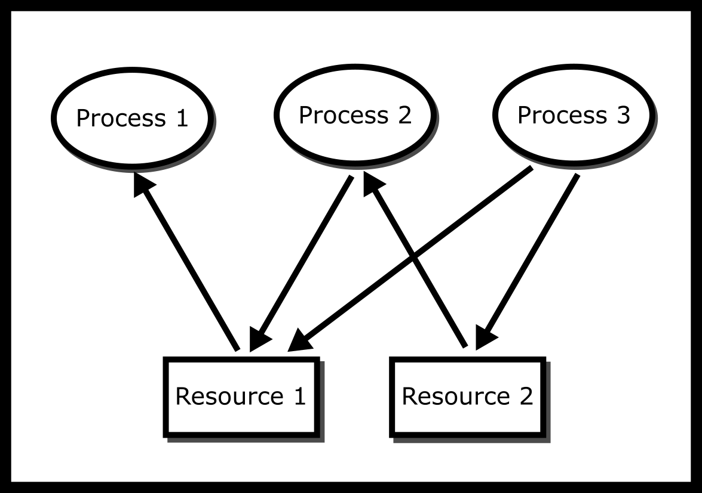
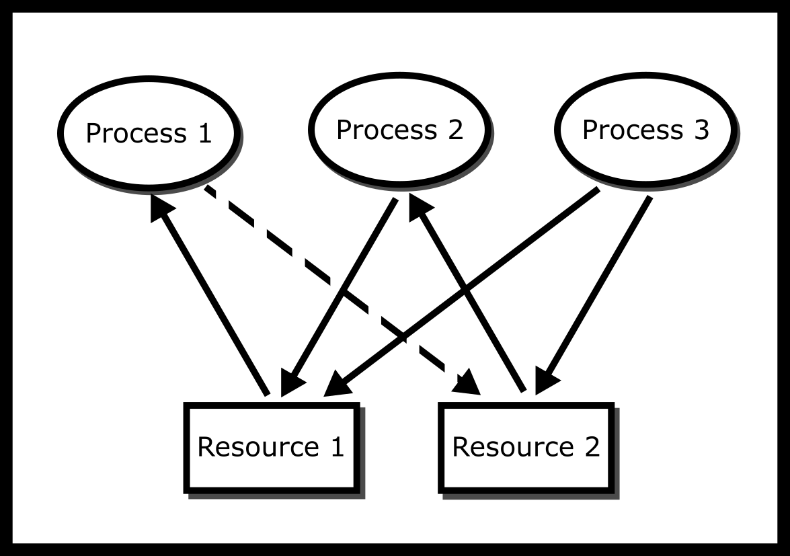
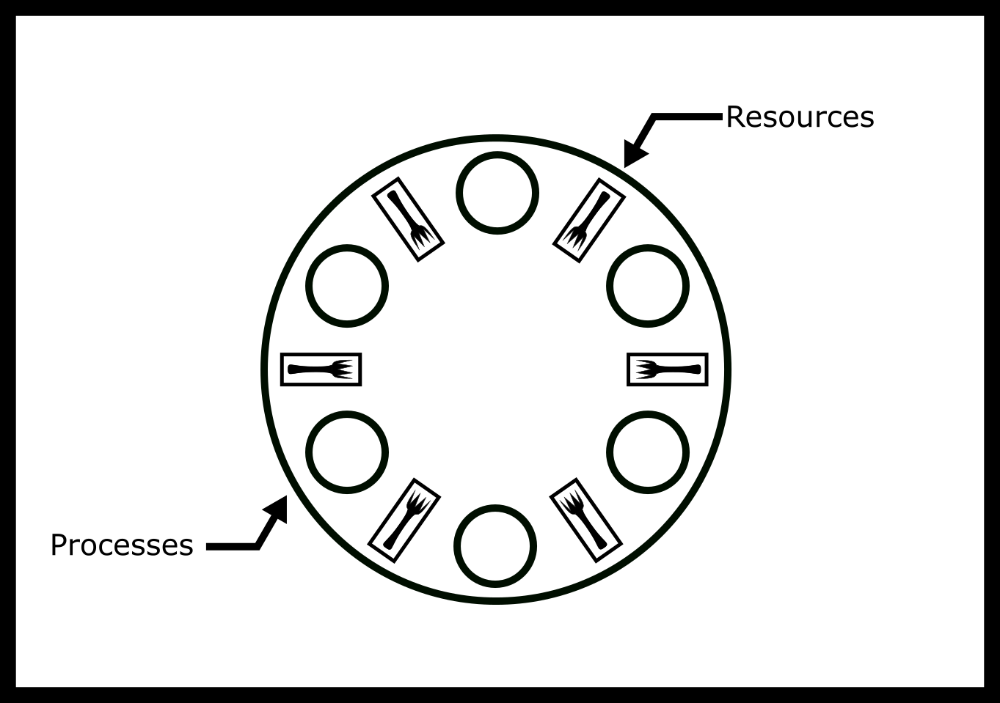
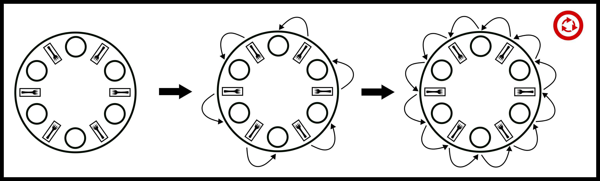
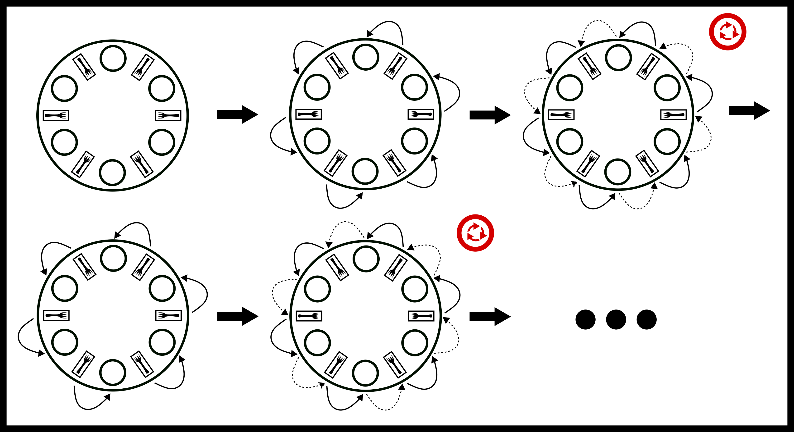
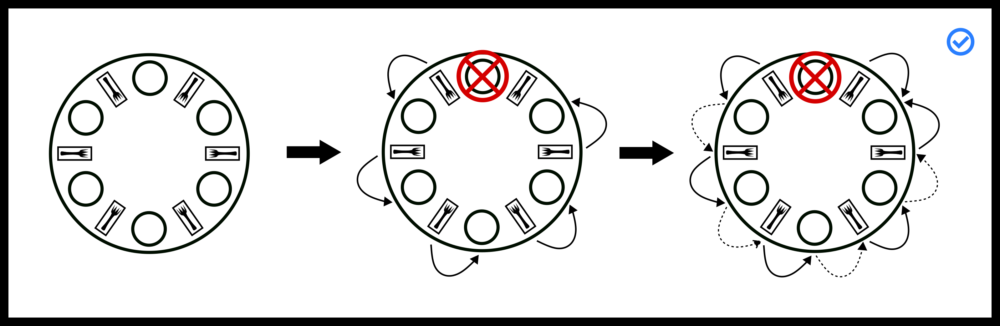
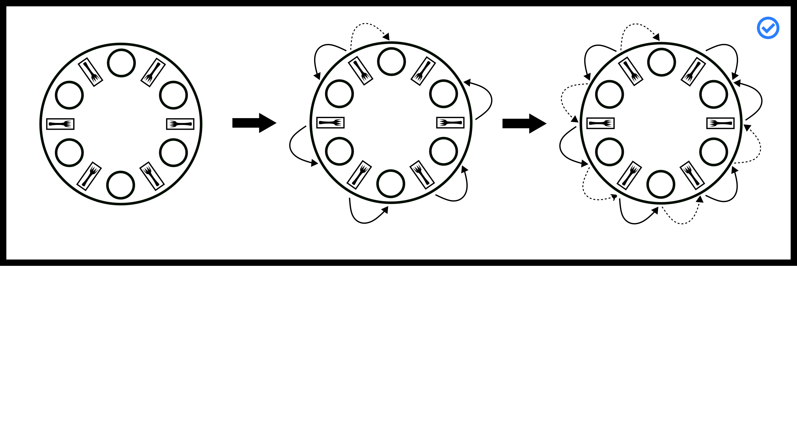

---
bibliography:
- deadlock/deadlock.bib
link-citations: true
title: "**CS341 系统编程课程手册**"
---

- [[#^deadlock|死锁]]
  - [[#^resource-allocation-graphs|资源分配图]]
  - [[#^coffman-conditions|Coffman 条件]]
  - [[#^approaches-to-solving-livelock-and-deadlock|解决活锁与死锁的思路]]
  - [[#^dining-philosophers|哲学家进餐]]
    - [[#^failed-solutions|失败的方案]]
  - [[#^viable-solutions|可行的方案]]
    - [[#^leaving-the-table-stallings-solution|离开餐桌（Stallings 方案）]]
    - [[#^partial-ordering-dijkstras-solution|偏序（Dijkstra 方案）]]
  - [[#^topics|主题]]
  - [[#^questions|问题]]


# 死锁 ^deadlock

**不，你不可能总是得到你想要的
你不可能总是得到你想要的
你不可能总是得到你想要的
但如果你偶尔去试一试，你会发现
你得到了你所需要的** — **滚石乐队的贾格与理查兹**

死锁的定义是：系统无法取得任何进展。在本章余下部分，我们把“系统”定义为一套规则，一组进程依照这套规则可以从一个状态转移到另一个状态，其中每个状态要么是正在工作，要么是在等待某个特定资源。所谓“取得进展”，是指至少有一个进程正在工作，或者我们能把某个正在等待资源的进程所等待的资源分配给它。在很多系统中，死锁是靠彻底无视这个概念来避免的（<a href="#ref-silberschatz2006operating">[4]</a>）。你听说过“关掉再打开”这种做法吗？对于那些利害关系不大的产品（用户级操作系统、手机），允许死锁也许更高效。但对于那些“绝不能失败”的场合——阿波罗 13 号——你就需要一个能够检测、打破或预防死锁的系统。阿波罗 13 号并不是因为死锁而失败的，但在发射时重启系统显然也不是什么好主意。

任务关键型操作系统需要正式地给出这种保证，因为拿人的生命去赌概率不是个好主意。那么我们该怎么做？我们对问题建模。尽管有句常见的统计格言说“所有模型都是错的”，但模型对系统刻画得越准确，方法奏效的机会就越大。

## 资源分配图 ^resource-allocation-graphs

<figure id="ragfigure" data-latex-placement="H">
<p></p>
<figcaption>资源分配图</figcaption>
</figure>

这样的一种方法就是用资源分配图（RAG）来为系统建模。资源分配图跟踪哪个进程持有哪个资源，以及哪个进程正在等待某一特定类型的资源。它是一个简单却有力的工具，可以说明相互作用的进程是如何死锁的。如果一个进程正在*使用*某个资源，就从资源节点向进程节点画一条箭头。如果一个进程正在*请求*某个资源，就从进程节点向资源节点画一条箭头。如果资源分配图中存在一个环，并且环中每个资源都只提供一个实例，那么这些进程就会死锁。例如，如果进程 1 持有资源 A，进程 2 持有资源 B，而进程 1 在等待 B、进程 2 在等待 A，那么进程 1 和 2 就死锁了（参见图 <a href="#deadlockfigure">#deadlockfigure</a>）。我们要明确这样一点：如果所有工作进程除了等待之外都无法执行任何操作，那么按定义系统就处于死锁之中。因此，只要每个资源都只提供一个实例，检测死锁就意味着在图中搜索一个环。进程和资源都是节点，每条边都有方向，所以这就是在*有向*图上做环检测。通常使用的工具是一次深度优先搜索，它为每个节点记录两个不同的事实：我们是否已经探索完它，以及它是否位于我们当前正在走的那条路径上。下面的伪代码把这两个事实各自保存在一个 `set` 中，你可以把它想象成一个存放节点标识符的哈希集合，提供常数时间的插入、删除和成员测试。

``` objectivec
// Pseudocode. A node is either a process or a resource.
// finished: nodes that have already been explored completely.
// path:     nodes on the current search stack, i.e. how we got here.

static bool visit(const graph *g, node n, set *finished, set *path);

bool is_cyclic(const graph *g) {
    set *finished = set_create();
    set *path = set_create();
    bool cyclic = false;

    // A search from one node only explores what that node reaches, so
    // every node gets a turn as the starting point. 'finished' is shared
    // across those searches, so no node is explored twice.
    for (each node n in g) {
        if (visit(g, n, finished, path)) {
            cyclic = true;
            break;
        }
    }

    // Note the single exit: returning as soon as a cycle turns up
    // would skip the set_destroy calls below and leak both sets.
    set_destroy(finished);
    set_destroy(path);
    return cyclic;
}

static bool visit(const graph *g, node n, set *finished, set *path) {
    // n is on the route that brought us here: we walked in a circle
    if (set_contains(path, n)) return true;
    // n was explored before, and no cycle was found through it
    if (set_contains(finished, n)) return false;

    set_add(path, n);
    for (each node m that n points to) {
        if (visit(g, m, finished, path)) return true;
    }
    set_remove(path, n); // n is behind us; no longer on the path
    set_add(finished, n);

    return false;
}
```

每个节点最多被展开一次，因此搜索的代价是 $$ O(V + E) $$，对于 $$ V $$ 个节点和 $$ E $$ 条边。

这两个集合承担的是不同的职责，而把它们合并成一个是导致此算法出错的一种常见做法。那条诱人的捷径是“如果我以前见过这个节点，那就是有环”，它在*任何*图上都会出错，而不仅仅是不适用于有向图。在无向图上，你走过的第一条边就会触发它，因为你刚刚走过来的那个节点已经见过了。在有向图上，它能通过这一关，但以一种更隐蔽的方式失败。假设进程 1 和进程 2 都在等待当前由进程 3 持有的资源 A。这些边是 $$ P_1 →A $$、$$ P_2 →A $$ 和 $$ A →P_3 $$。这里并没有死锁——进程 3 会完成并释放 A——但一个从进程 1 开始搜索会探索 A 和进程 3，当外层循环重新从进程 2 开始时，它第二次到达 A。在这条捷径下，第二次出现就会被报告为死锁，而这个系统其实运行得好好的；而且只要两条路径汇聚到同一个节点，同一次搜索内部也会发生同样的误报。两次看到一个节点只说明有两条路径通向它；只有当第二次出现时第一次访问尚未结束时，它才构成一个环，而这正是 `path` 所记录的内容。

请记住，这套搜索给出的结论，其强度完全取决于“单实例”这个假设。如果环中某个资源提供了多个可互换的实例，那么环外的某个进程仍可能归还一个实例，从而让某个人得以继续，因此环对于死锁仍然是*必要*条件，但不再是*充分*条件。

<figure id="deadlockfigure" data-latex-placement="H">
<p></p>
<figcaption>基于图的死锁</figcaption>
</figure>

在这张图中，进程 1 持有资源 1 并请求资源 2，而进程 2 持有资源 2 并请求资源 1。虚线边标出了那个环，因此进程 1 和 2 死锁了，而同时请求这两种资源的进程 3 则被它们堵在了后面。

## Coffman 条件 ^coffman-conditions

RAG 中的环在操作系统里明明时刻都在发生，那为什么系统不会卡死？你可能看不到死锁，因为操作系统可能会**抢占**某些进程从而打破这个环，但你那三个孤零零的进程仍然有可能死锁。

死锁有四个条件，它们是*必要*条件：如果一个系统死锁了，那么这四条必然都成立，因此打破其中任何一条的系统就不可能死锁。一般来说它们并不是*充分*条件：四条全都成立时系统仍然可能取得进展，例如当某个资源有多个可互换实例，而环外的某个进程归还了其中一个的时候。如果每个资源都只有一个实例，那么这些条件也是充分的，此时循环等待就等价于死锁。这些条件被称为 Coffman 条件（<a href="#ref-coffman1971system">[1]</a>）。

- 互斥：没有两个进程能同时获得同一个资源。

- 循环等待：资源分配图中存在一个环，或者存在一组进程 {P1, P2, …}，使得 P1 在等待 P2 持有的资源，P2 在等待 P3 持有的资源，……，而 P3 又在等待 P1 持有的资源。

- 占有并等待：一旦获得某个资源，进程就保持该资源处于锁定状态。

- 不可抢占：没有任何东西能强制进程放弃一个资源。

\
**(Optional) Proof:**\
假设每个资源都只有一个实例，并且一个进程在同一时刻最多只等待一个资源。如果 $$ D $$ 中的每个进程都在等待被 $$ D $$ 中另一个进程持有的资源，就称进程集合 $$ D $$ 是*死锁的*。当 $$ D $$ 是所有进程时，这就是本章开头所说的全系统死锁。我们证明两件事：如果一个进程集合死锁了，那么四个 Coffman 条件全部成立；以及如果系统具备互斥、占有并等待和不可抢占，那么资源分配图中的任何环都是死锁。

$$ → $$ 假设 $$ D $$ 是死锁的。

- 互斥：$$ D $$ 中的某个进程正在等待一个被别人持有的资源。如果那个资源可以共享，它就会直接被交给等待的进程，那么该进程就不必再等待了。

- 占有并等待：取 $$ p ∈D $$ 中任意一个正在等待资源 $$ r $$ 的进程。$$ q $$ 持有 $$ r $$，它也在 $$ D $$ 中，所以 $$ q $$ 自身正在等待——同时却占有着 $$ r $$。

- 不可抢占：如果系统能把 $$ r $$ 从 $$ q $$ 那里抢走，就可以把 $$ r $$ 交给 $$ p $$，而 $$ p $$ 就不会被困住了。

- 循环等待：从任意 $$ p_0 ∈D $$ 开始。设 $$ p_1 $$ 是 $$ p_0 $$ 所等待资源的持有者，$$ p_2 $$ 是 $$ p_1 $$ 所等待资源的持有者，依此类推。每个 $$ p_i $$ 都在 $$ D $$ 中，所以这条链条永远不会停止。但 $$ D $$ 是有限的，因此某个进程最终会重复出现：$$ p_i = p_j $$，其中存在某个 $$ i < j $$。于是 $$ p_i →p_{i+1} →⋯→p_{j-1} →p_i $$ 就是资源分配图中的一个环。

$$ ← $$ 假设系统具备互斥、占有并等待和不可抢占，并且资源分配图中包含一个环 $$ p_1 →r_1 →p_2 →r_2 →⋯→p_k →r_k →p_1 $$。也就是说，$$ p_i $$ 正在等待 $$ r_i $$，后者由 $$ p_{i+1} $$ 持有；$$ p_{k+1} $$ 表示 $$ p_1 $$。反证法：假设环上某个进程最终获得了它所等待的资源，并设 $$ p_i $$ 是*第一个*做到这一点的进程，发生时刻为 $$ t $$。资源 $$ r_i $$ 只有一个实例且不可共享，因此 $$ p_{i+1} $$ 必然在时刻 $$ t $$ 之前就放弃了它。不存在抢占，所以没有人把 $$ r_i $$ 从 $$ p_{i+1} $$ 手中抢走；是 $$ p_{i+1} $$ 主动释放的。由于占有并等待，$$ p_{i+1} $$ 在仍在等待时不会释放任何东西，因此 $$ p_{i+1} $$ 必然已获得 $$ r_{i+1} $$，且发生在时刻 $$ t $$ 之前。这与 $$ p_i $$ 是第一个相矛盾。所以环上的任何进程都永远拿不到它的资源：环上的进程都死锁了。\
**(Optional) ■**\

证明中唯一用到单实例这一点的地方，是 $$ ← $$ 这个方向：如果 $$ r_i $$ 有第二份副本，环外的某个进程就可以释放那份副本，让 $$ p_i $$ 继续前进。这正是为什么在多实例资源的情况下，环是死锁的必要条件而非充分条件。

如果一个系统打破了其中任何一条，它就不可能死锁！设想两个学生都需要纸和笔，而各只有一份。打破互斥意味着让学生共享笔和纸。打破循环等待可以是让学生约定好先拿笔再拿纸。用反证法来说，假设在该规则和这些条件下发生了死锁。不失一般性，这意味着一个学生手里拿着纸却在等笔，另一个手里拿着笔却在等纸。这就与我们自己的假设矛盾了，因为有一个学生拿到了纸却没拿笔，所以死锁就不会发生。打破占有并等待可以是：学生先尝试拿笔再拿纸，如果某个学生没拿到纸，就把笔放下。这会引入一个称为*活锁*的新问题，后面会讨论。打破不可抢占意味着：如果两个学生死锁了，老师可以走进来，通过把某件被占用的物品交给其中一个学生、或者命令两个学生都把东西放下，来化解这场死锁。

活锁与死锁密切相关。考虑前面打破占有并等待的方案。虽然避免了死锁，但设想这个方案的一个变体：两个学生以相反的顺序去拿东西——一个先拿笔，另一个先拿纸。每个人都拿到了第一件，没能拿到第二件，于是放下第一件，再试一次。如果他们始终这样同步地重复下去，两人都很忙，却什么工作都没做成。活锁通常更难检测，因为在外层操作系统看来，这些进程往往像是正在工作的；而在死锁中，操作系统通常知道有两个进程正在等待一个系统级资源。另一个问题是，活锁有*必要*条件（即死锁不会发生）却没有*充分*条件——这意味着不存在一套规则能让活锁必然发生。你必须证明某个特定系统不会活锁，通常要借助所谓的*不变式*。人们必须枚举出系统的每一个步骤，如果每一步最终——在有限步之后——都会导致取得进展，那么该系统就不会活锁。甚至还有更好的系统能够证明等待是有界的：这样一个系统最多只会活锁 $$ n $$ 个周期，这对于证券交易所之类的场景可能很重要。

## 解决活锁与死锁的思路 ^approaches-to-solving-livelock-and-deadlock

无视死锁是最显而易见的做法。相当幽默的是，这个做法被称为鸵鸟算法。虽然看不出明确的出处，但这个算法的思路来自鸵鸟把头埋进沙子里的概念。当操作系统检测到死锁时，它什么特别的事也不做，而死锁通常就会自行消失。操作系统在为上下文切换而停止某个进程时会抢占它。操作系统可以中断任何系统调用，从而有可能打破死锁局面。操作系统还会把某些文件设为只读，从而使这些资源可被共享。鸵鸟算法接受这样一个事实：恶意或写得糟糕的程序仍然可能死锁；操作系统只是不试图去阻止它。在日常生活中，这通常是可以接受的。当它不可接受时，我们可以转向下面这种方法。

死锁检测允许系统进入死锁状态。进入之后，系统利用这些信息来打破死锁。举个例子，考虑多个进程访问文件的场景。操作系统可以通过文件描述符在某个层级上（要么通过 API 抽象出来，要么直接）跟踪所有文件／资源。如果操作系统在操作系统的文件描述符表中检测到一个有向环，它就可能通过调度等方式打破其中某个进程的持有，让系统继续运行。这一领域之所以普遍采用这种方式，是因为不运行程序就无法知道程序会选择哪些资源。这是赖斯定理（<a href="#ref-rice">[3]</a>）的一个推论：不运行程序就无法知道任何语义特性（语义特性比如它试图打开哪些文件）。所以从理论上讲，它是可靠的。这样就引入了另一个问题：如果我们反复抢占一组资源，就可能陷入活锁。绕开这一点的方式大多是概率性的：操作系统随机选择一个资源来打破 `hold-and-wait`。现在，尽管用户可以写出一个程序，使得在每个资源上打破占有并等待都会导致活锁，但在实际运行程序的机器上这并不常发生；即使真发生了活锁，也只持续几个周期。这些系统适合那些需要维持非死锁状态、但能容忍短时间内有小概率活锁的产品。

此外，我们还有*银行家算法*，它的基本前提是银行永远不会枯竭，从而避免了活锁。更多细节请自行查阅附录。

## 哲学家进餐 ^dining-philosophers

哲学家进餐问题是一个经典的同步问题。设想我们邀请 $$ n $$（比如 6 位）哲学家共进晚餐。我们让他们围坐在一张放着 6 根筷子的桌旁，每两位哲学家之间放一根。一位哲学家在“想吃东西”和“思考”之间交替。要吃饭，哲学家必须拿起自己位置两侧的这两根筷子。迪克斯特拉最初版本的问题用的是叉子和一碗意大利面，怀疑者可能会指出用一把叉子也能吃面，所以许多转述改用了筷子——没人会只用一根筷子吃饭。本章中的代码和插图仍然写作 fork；这两个词含义相同。每根筷子与一位邻座共享。

<figure data-latex-placement="H">
<p></p>
<figcaption>哲学家进餐</figcaption>
</figure>

有可能设计出一个高效的方案，让所有哲学家都能吃到饭吗？或者，会有一些哲学家永远拿不到第二根筷子、从而饿死吗？又或者，所有人都会死锁？例如，假设每位客人都先拿起左边的筷子，然后等待右边的筷子空出来。糟糕——我们的哲学家死锁了！每位哲学家本质上都是一样的，也就是说每位哲学家都基于其他哲学家拥有相同的指令集；你不能让所有偶数编号的哲学家做一件事、所有奇数编号的哲学家做另一件事。

### 失败的方案 ^failed-solutions

``` objectivec
void* philosopher(void* forks){
  info phil_info = forks;
  pthread_mutex_t* left_fork = phil_info->left_fork;
  pthread_mutex_t* right_fork = phil_info->right_fork;
  while(phil_info->simulation){
    pthread_mutex_lock(left_fork);
    pthread_mutex_lock(right_fork);
    eat(left_fork, right_fork);
    pthread_mutex_unlock(left_fork);
    pthread_mutex_unlock(right_fork);
  }
}
```

这看起来不错，但如果每个人都拿起左边的叉子，然后等待右边的叉子呢？我们的程序就死锁了。要注意死锁并非每次都会发生，而且哲学家人数越多，这个方案死锁的概率就越低。真正要注意的是，这个方案最终*会*死锁，从而让线程饿死，这是很糟糕的。下面是一张简单的资源分配图，展示了这个系统可能如何陷入死锁。

<figure data-latex-placement="H">
<p></p>
<figcaption>哲学家先左后右的循环</figcaption>
</figure>

现在你开始考虑打破某个 Coffman 条件了。我们来打破占有并等待！

``` objectivec
void* philosopher(void* forks){
  info phil_info = forks;
  pthread_mutex_t* left_fork = phil_info->left_fork;
  pthread_mutex_t* right_fork = phil_info->right_fork;
  while(phil_info->simulation){
    int left_succeed = pthread_mutex_trylock(left_fork);
    if (!left_succeed) {
      sleep();
      continue;
    }
    int right_succeed = pthread_mutex_trylock(right_fork);
    if (!right_succeed) {
      pthread_mutex_unlock(left_fork);
      sleep();
      continue;
    }
    eat(left_fork, right_fork);
    pthread_mutex_unlock(left_fork);
    pthread_mutex_unlock(right_fork);
  }
}
```

现在我们的哲学家拿起左边的叉子，然后试着去抓右边的。如果右边是空的，他就吃饭。如果拿不到，他就放下左边的叉子再试一次。没有死锁！但是这里有个问题。如果所有哲学家同时拿起左边的叉子，试了抓右边的，放下左边的，再拿起左边的，又试着抓右边的，如此反复。下面就是这个系统的时间演化过程。

<figure data-latex-placement="H">
<p></p>
<figcaption>活锁失败</figcaption>
</figure>

我们的方案现在活锁了！可怜的哲学家们还在挨饿，下面给他们一些像样的方案吧。

## 可行的方案 ^viable-solutions

朴素的仲裁者方案只有一位仲裁者，比如一把互斥锁。让每位哲学家向仲裁者请求进餐许可，或者对仲裁者的互斥锁尝试加锁。这个方案允许同一时刻只有一位哲学家进餐。他们吃完之后，另一位哲学家就可以请求进餐许可。由于不存在循环等待，这就避免了死锁！没有任何哲学家需要等待其他哲学家。进阶的仲裁者方案是实现一个类，用来判断某位哲学家的叉子是否在仲裁者手中。如果是，仲裁者就把叉子交给他，让他吃饭，然后再收回叉子。这样做的好处是可以让多位哲学家同时进餐。

这些方案存在不少问题。其一是速度慢，而且存在单点故障。假定所有哲学家都是善意的，那么仲裁者就需要是公平的。在实际系统中，仲裁者往往会因为调度或伪随机性而把叉子反复交给同样的进程。另一个值得注意的重要点是：这只为整个系统防止了死锁。但在我们的哲学家进餐模型中，哲学家必须自己释放锁。于是你可以考虑这样一种情况：一个恶意的哲学家（就说是笛卡尔吧，因为他有“邪恶的 demons”）可以永远霸占仲裁者。他会取得进展，系统也会取得进展，但我们无法保证每个进程都取得进展——除非对进程做出某些假设，或者拥有真正的抢占，也就是由某个更高权威（就说是乔布斯吧）强制他们停止进餐。

\
**(Optional) Proof:**\
仲裁者方案不会死锁

这个证明简单到了极点。哲学家只有在持有仲裁者时才会拿起叉子，并且在放开仲裁者之前会把两把叉子都放下。因此，无论谁持有仲裁者，他都能看到桌上所有的叉子，永远不必等待任何一个。其他人等待的只有仲裁者，而仲裁者被一位并未处于等待状态的哲学家持有。资源分配图中的一个环需要环上每位哲学家都处于等待状态，所以不可能形成环；而没有循环等待就没有死锁，这正是我们想要证明的。

\
**(Optional) ■**\

<figure data-latex-placement="H">
<p></p>
<figcaption>仲裁者示意图</figcaption>
</figure>

### 离开餐桌（Stallings 方案） ^leaving-the-table-stallings-solution

第一个方案为什么会死锁？嗯，桌上有 $$ n $$ 位哲学家和 $$ n $$ 根筷子。如果桌上只有 1 位哲学家呢？还能死锁吗？不能。2 位呢？3 位呢？你已经猜到结论了。Stallings 的方案（<a href="#ref-stalling">[5]</a>）把哲学家从桌边撤走，直到死锁不再可能——想想桌上那个“神奇人数”是多少。在实际系统中实现这一点的办法是使用信号量，只放行一定数量的哲学家。这样做的好处是多位哲学家可以同时进餐。

如果这些哲学家并不邪恶，这个方案需要大量耗时的上下文切换。此外也没有可靠的办法事先知道资源的数量。在哲学家进餐这个场景中，这一点不成问题，因为一切都已知；但如果你试图指定一个“系统不知道哪个进程会打开哪个文件”的操作系统，就可能得到一个有缺陷的方案。而且同样地，由于信号量是系统构件，它们遵循系统时钟，这意味着同一批进程往往会被重新排回队列中。现在，如果有一位哲学家变坏了，问题就变成了没有抢占。一位哲学家想吃多久都可以，系统仍会继续运转，但这意味着在最坏情况下这个方案的公平性可能很差。配合超时或强制上下文切换来保证等待时间有界，效果最好。

\
**(Optional) Proof:**\
Stallings 方案不会死锁。让我们把哲学家编号为 $$ \{p_0, p_1, .., p_{n-1}\} $$，把资源编号为 $$ \{r_0, r_1, .., r_{n-1}\} $$。哲学家 $$ p_i $$ 需要资源 $$ r_i $$ 和 $$ r_{(i+1) \bmod n} $$。不失一般性，先把 $$ p_i $$ 从考虑中拿掉。每个资源原本恰好有两位哲学家可以使用它。现在资源 $$ r_i $$ 和 $$ r_{(i+1) \bmod n} $$ 各自只剩下一位哲学家可以使用它们。即使占有并等待、不可抢占和互斥都存在，这些资源也永远不会进入这样一个状态：某位哲学家请求它们，而它们被另一位哲学家持有——因为只有一位哲学家可能请求它们。既然没有其他途径能产生环，循环等待就不可能成立。既然循环等待不可能成立，死锁就不可能发生。\
**(Optional) ■**\

下面是最坏情况的可视化。系统即将死锁，但这个做法把它化解了。

<figure data-latex-placement="H">
<p></p>
<figcaption>Stallings 方案差点死锁</figcaption>
</figure>

由于有一个座位是空的，叉子比哲学家多。即使剩下五位哲学家都拿着自己的左叉，仍然有一把叉子是空的，所以至少有一位哲学家能拿到第二把叉子并吃饭。

### 偏序（Dijkstra 方案） ^partial-ordering-dijkstras-solution

这就是 Dijkstra 的方案（<a href="#ref-EWD:EWD310">[2]</a>）。他是在一次考试中提出这个问题的。为什么第一个方案会死锁？Dijkstra 认为，最后那位拿起左叉（从而导致方案死锁）的哲学家应该去拿右叉。他通过给叉子编号 $$ 1..n $$ 来实现这一点，并告诉每位哲学家去拿编号较小的叉子。让我们再走一遍死锁条件。每个人都先试着拿编号较小的叉子。哲学家 $$ 1 $$ 拿到叉子 $$ 1 $$，哲学家 $$ 2 $$ 拿到叉子 $$ 2 $$，如此下去，直到哲学家 $$ n $$。他必须在叉子 $$ 1 $$ 和 $$ n $$ 之间做选择。叉子 $$ 1 $$ 已经被哲学家 $$ 1 $$ 拿住了，所以他拿不到那把叉子，也就是说他不会去拿叉子 $$ n $$。我们打破了 `circular wait`！也就是说死锁不可能发生。

其中一些问题在于：某个实体要么必须预先知道资源的有限集合，要么必须能够产生一个一致的偏序，使得循环等待不可能发生。这同样意味着需要有某个实体（操作系统或另一个进程）来决定这个数量，并且随着新资源不断加入，所有哲学家都必须认同这个数量。正如我们在前面的方案中看到的，这依赖于上下文切换。它会优先照顾那些已经吃过饭的哲学家，但可以通过引入随机的睡眠和等待来让它变得更公平。

\
**(Optional) Proof:**\
Dijkstra 方案不会死锁

这个证明与上一个类似。让我们把哲学家编号为 $$ \{p_0, p_1, \ldots, p_{n-1}\} $$，把叉子编号为 $$ \{r_0, r_1, \ldots, r_{n-1}\} $$，其中哲学家 $$ p_i $$ 需要叉子 $$ r_i $$ 和 $$ r_{(i+1) \bmod n} $$。每个人都先拿编号较小的叉子。对 $$ p_0 $$ 到 $$ p_{n-2} $$ 而言，这意味着先拿 $$ r_i $$，再拿 $$ r_{i+1} $$。最后一位哲学家 $$ p_{n-1} $$ 需要 $$ r_{n-1} $$ 和 $$ r_0 $$，所以他先拿 $$ r_0 $$ 再拿 $$ r_{n-1} $$——与其他人正好相反。注意 $$ p_0 $$ 和 $$ p_{n-1} $$ 都把 $$ r_0 $$ 当作自己的*第一把*叉子，而且没有人会在拿第一把之前就去拿第二把。所以两者中没持有 $$ r_0 $$ 的那一位什么叉子都没拿。一个什么都没拿的哲学家不可能是资源分配图中某个环的一部分，因为环上的每个人都要持有前一位哲学家正在等待的那把叉子。这里有两种情况。

如果 $$ p_{n-1} $$ 没有持有 $$ r_0 $$，那么 $$ p_{n-1} $$ 什么都没拿，我们可以把 $$ p_{n-1} $$ 从考虑中拿掉。

如果 $$ p_{n-1} $$ 确实持有 $$ r_0 $$，那么 $$ p_0 $$ 什么都没拿，我们可以把 $$ p_0 $$ 从考虑中拿掉。

无论哪种情况，最多只有 $$ n-1 $$ 位哲学家在共享这 $$ n $$ 把叉子，这正是上面 Stallings 证明中的情形，因此循环等待不可能发生。既然两种情况下都无法达到死锁，这个方案就不会死锁，这正是我们想要证明的。

\
**(Optional) ■**\

<figure data-latex-placement="H">
<p></p>
<figcaption>Dijkstra 的偏序方案</figcaption>
</figure>

附录中还有其他一些方案（干净／脏叉子以及 actor 模型）。

## 主题 ^topics

- Coffman 条件

- 资源分配图

- 哲学家进餐

- 失败的哲学家进餐方案

- 会活锁的哲学家进餐方案

- 可用的哲学家进餐方案：优点／缺点

- <a href="http://adit.io/posts/2013-05-11-The-Dining-Philosophers-Problem-With-Ron-Swanson.html">http://adit.io/posts/2013-05-11-The-Dining-Philosophers-Problem-With-Ron-Swanson.html</a>

## 问题 ^questions

- Coffman 条件是什么？

- Coffman 条件中的每一条分别是什么意思？请逐条给出定义。

- 请各举一个现实生活中的例子，依次说明如何打破每一个 Coffman 条件。可以考虑这样的场景：油漆工、油漆、油漆刷等等。你要如何确保工作最终能完成？

- 在下面这段代码中，哪一个 Coffman 条件没有被满足？

  ``` objectivec
  // Get both locks or none
  pthread_mutex_lock(a);
  if(pthread_mutex_trylock( b )) { /* failure */
    pthread_mutex_unlock( a );
  }
  ```

- 发生了下面这些调用

  ``` c
  // Thread 1
  pthread_mutex_lock(m1) // success
  pthread_mutex_lock(m2) // blocks

  // Thread 2
  pthread_mutex_lock(m2) // success
  pthread_mutex_lock(m1) // blocks
  ```

  会发生什么，为什么？如果第三个线程调用 `pthread_mutex_lock(m1)` 会发生什么？

- 有多少个进程被阻塞了？照例假设一个进程只要能获得下面列出的全部资源就能完成。

- P1 获得 R1

- P2 获得 R2

- P1 获得 R3

- P2 等待 R3

- P3 获得 R5

- P1 等待 R4

- P3 等待 R1

- P4 等待 R5

- P5 等待 R1

  把资源图画出来！

<div id="refs" class="references csl-bib-body hanging-indent">

<div id="ref-coffman1971system" class="csl-entry">

Coffman, Edward G, Melanie Elphick, and Arie Shoshani. 1971. “System
Deadlocks.” *ACM Computing Surveys (CSUR)* 3 (2): 67–78.

</div>

<div id="ref-EWD:EWD310" class="csl-entry">

Dijkstra, Edsger W. 1971. “Hierarchical Ordering of Sequential
Processes.”
<a href="http://www.cs.utexas.edu/users/EWD/ewd03xx/EWD310.PDF">http://www.cs.utexas.edu/users/EWD/ewd03xx/EWD310.PDF</a>.

</div>

<div id="ref-rice" class="csl-entry">

Rice, H. G. 1953. “Classes of Recursively Enumerable Sets and Their
Decision Problems.” *Transactions of the American Mathematical Society*
74 (2): 358–66.
<a href="http://www.jstor.org/stable/1990888">http://www.jstor.org/stable/1990888</a>.

</div>

<div id="ref-silberschatz2006operating" class="csl-entry">

Silberschatz, A., P. B. Galvin, and G. Gagne. 2006. *OPERATING SYSTEM
PRINCIPLES, 7TH ED*. Wiley Student Edition. Wiley India Pvt. Limited.
<a href="https://books.google.com/books?id=WjvX0HmVTlMC">https://books.google.com/books?id=WjvX0HmVTlMC</a>.

</div>

<div id="ref-stalling" class="csl-entry">

Stallings, William. 2011. *Operating Systems: Internals and Design
Principles 7th Ed. By Stallings (International Economy Edition)*. PE.
<a href="https://www.amazon.com/Operating-Systems-Internals-Principles-International/dp/9332518807?SubscriptionId=0JYN1NVW651KCA56C102&tag=techkie-20&linkCode=xm2&camp=2025&creative=165953&creativeASIN=9332518807">https://www.amazon.com/Operating-Systems-Internals-Principles-International/dp/9332518807?SubscriptionId=0JYN1NVW651KCA56C102&tag=techkie-20&linkCode=xm2&camp=2025&creative=165953&creativeASIN=9332518807</a>.

</div>

</div>
