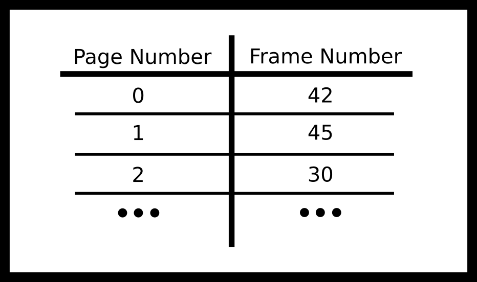
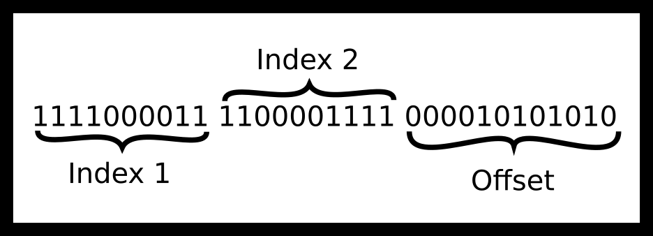

---
bibliography:
- ipc/ipc.bib
link-citations: true
title: "**CS341 系统编程课程手册**"
---

- [[#^virtual-memory-and-interprocess-communication|虚拟内存与进程间通信]]
  - [[#^translating-addresses|地址转换]]
    - [[#^terminology|术语]]
    - [[#^multi-level-page-tables|多级页表]]
    - [[#^page-table-disadvantages|页表的缺点]]
    - [[#^mmu-algorithm|MMU 算法]]
    - [[#^frames-and-page-protections|页框与页面保护]]
    - [[#^page-faults|缺页]]
    - [[#^link-back-to-ipc|回到 IPC]]
  - [[#^mmap|mmap]]
    - [[#^mmap-definitions|mmap 的定义]]
    - [[#^annotated-mmap-walkthrough|带注释的 mmap 详解]]
    - [[#^mmap-communication|用 MMAP 通信]]
  - [[#^pipes|管道]]
    - [[#^pipe-gotchas|管道的坑]]
    - [[#^other-pipe-facts|关于管道的其他事实]]
    - [[#^pipes-and-dup|管道与 dup]]
    - [[#^pipe-conveniences|管道的便利之处]]
  - [[#^named-pipes|命名管道]]
    - [[#^hanging-named-pipes|阻塞的命名管道]]
    - [[#^race-condition-with-named-pipes|命名管道中的竞态条件]]
  - [[#^files|文件]]
    - [[#^determining-file-length|确定文件长度]]
    - [[#^use-stat-instead|改用 stat]]
    - [[#^gotchas-with-files|文件的各种坑]]
  - [[#^ipc-alternatives|IPC 的其他选择]]
  - [[#^topics|主题]]
  - [[#^questions|问题]]


# 虚拟内存与进程间通信 ^virtual-memory-and-interprocess-communication

**Abbott：现在你懂了。\
Costello：我按自然地把球扔给他。\
Abbott：你没有！你扔给 Who 了！\
Costello：自然地。\
Abbott：好吧，就这样——照这么说吧。\
Costello：我就是这么说的。**——**Abbott 与 Costello 论有效沟通**

在简单的嵌入式系统和早期计算机中，进程直接访问内存——"地址 1234"对应物理内存某个特定部分存的某个特定字节。例如，IBM 709 必须直接读写磁带，没有任何抽象层次
（<a href="#ref-ibm709">[2]</a>）。即便在那之后的系统里，采用
虚拟内存也很难，因为虚拟内存要求通过硬件改变整个取指周期——许多厂商
当时仍认为这种改动代价高昂。在 PDP-10 上，人们用为每个进程配备不同寄存器
的办法来绕过这个问题，后来才加入虚拟内存（<a href="#ref-ricm">[1]</a>）。在现代
系统中，情况已不再如此。取而代之的是，每个进程都是隔离的，
并且在某条 CPU 指令或某段数据的地址与物理内存（"RAM"）中的实际字节之间
存在一个转换过程。内存地址不再映射到物理地址。进程运行在虚拟内存之中。
虚拟内存让进程彼此安全，因为一个进程无法直接读取或修改另一个进程的内存。
虚拟内存还允许系统高效地为不同进程分配和重新分配内存片段。现代的内存转换
流程如下。

1.  进程发出一次内存请求。

2.  电路首先检查转换后备缓冲器（TLB），看该地址页是否已缓存到内存中。如果
    找到，就直接跳到读/写阶段；否则该请求转交给 MMU。

3.  内存管理单元（MMU）执行地址转换。
    如果转换成功，该页就从 RAM 中调入——从概念上说，并不是把整个页都加载
    上来。结果会被缓存在 TLB 中。

4.  CPU 通过从物理地址读或向该地址写来执行操作。

## 地址转换 ^translating-addresses

内存管理单元是 CPU 的一部分，它把虚拟内存地址转换成物理地址。首先我们谈谈
虚拟内存这个抽象是什么，以及如何转换地址。

为了说明问题，设想一台 32 位机器，也就是指针为 32 位。
它们可以寻址 $$ 2^{32} $$ 个不同的位置，也就是 4GB 内存（一个地址对应一个字节）。
想象我们为每个可能的地址都准备了一张大表，用来存放"真实的"也就是
物理地址。每个物理地址需要 4 个字节——用来存那 32 位。显然，
这个方案需要 160 亿字节来存放所有条目。显而易见，我们的查找方案会吃掉我们这台
4GB 机器能买到的全部内存。我们的查找表应该比可用内存更小，
否则就没空间留给实际的程序和操作系统数据了。
解决办法是把内存切成称为"页"和"页框"的小区域，
并为每一页配一张查找表。

### 术语 ^terminology

**页（page）**是虚拟内存的一个块。Linux 上典型的块大小
是 4KiB，也就是 $$ 2^{12} $$ 个地址，不过也能找到更大的块的例子。
所以我们可以谈论 4KiB 的块而不是单个字节，每个块称为一页。我们也可以
给页编号（"第 0 页""第 1 页"等等）。让我们做一次样例计算，
看看有多少页。假设页大小是 4KiB。

对于一台 32 位机器，

$$ 2^{32} \text{address} / 2^{12} \text{(address/page)} = 2^{20} \text{pages}. $$

对于一台 64 位机器，

$$ 2^{64} \text{address} / 2^{12} \text{(address/page)} = 2^{52} \text{pages} ≈10^{15} \text{pages}. $$

**页框（frame）**有时也叫"页帧（page frame）"，是*物理
内存*也就是 RAM（随机存取内存）的一个块。页框的字节数与一个虚拟页相同，
在我们的机器上就是 4KiB。它存放我们关心的那些字节。要访问页框中的某个
特定字节，MMU 会从页框起始处加上偏移量——后面会讨论。

**页表（page table）**是一张从编号到特定页框的映射表。例
如第 1 页可能映射到页框 45，第 2 页映射到页框 30。
其他页框可能当前未被使用，或被分配给其他正在运行的
进程，或被操作系统内部使用。从名字可以想象，
就把页表当成一张表。

<figure data-latex-placement="H">
<p></p>
<figcaption>显式页框表</figcaption>
</figure>

在实践中，我们会省略第一列，因为它总是依次为 0、1、2 等等，
我们改用相对表起点的偏移量作为条目编号。

现在来实际算一遍。我们假设一台 32 位机器有 4KiB 的页。显然，
为了寻址所有可能的条目，页框有 $$ 2^{20} $$ 个。由于可能的页框有
$$ 2^{20} $$ 个，我们就需要 20 个比特来给所有可能的页框编号，
这意味着 `Frame Number` 必须是 2.5 个字节长。实际中我们会把
它向上取整到 4 个字节，然后对剩下的比特做些有趣的处理。
每个条目 4 个字节 x $$ 2^{20} $$ 个条目 = 需要 4 MiB 物理内存
来为一个进程保存整个页表。

记住，我们的页表把页映射到页框，而每个页框是一段
连续地址构成的块。我们怎么计算出在某个特定页框内部该用
哪个特定字节呢？办法是直接复用虚拟内存地址的最低若干比特。
例如，假设我们的进程正在读取下面这个地址——
`VirtualAddress = 11110000111100001111000010101010 (binary)`

举个例子，假设我们就有上面那个虚拟地址。用"一页对一页框"的方案，
我们会怎么把它拆开？

<figure data-latex-placement="H">
<p></p>
<figcaption>拆分地址</figcaption>
</figure>

我们可以把解引用的步骤想象成一个过程。总体上，它
看起来是这样的。

<figure data-latex-placement="H">
<p></p>
<figcaption>单级解引用</figcaption>
</figure>

从上面那个特定地址读取的方式可视化如下。

<figure data-latex-placement="H">
<p></p>
<figcaption>单级解引用示例</figcaption>
</figure>

在这个例子中，高 20 位 11110000111100001111 选出了那个
存放页框 357 的页表条目。偏移量 000010101010 则选出
页框 357 内部的字节。

如果我们要从那里读取，就"返回"那个值。听起来是个
完美的方案。把每个地址按顺序映射到一个虚拟地址上，
进程会以为地址是连续的，但高 20 位被用来确定 `page_num`，
这让我们能够找到页框号、找到页框、加上
**偏移量**——由最低 12 位导出——然后执行读或写。

还有其他拆分方式。在页大小为 256 字节的机器上，
最低 8 位（10101010）将用作偏移量。其余的高位
就是页号（111100001111000011110000）。这个偏移量被当作
二进制数处理，并在我们拿到页框时加到页框起始处。

不过在 64 位操作系统上我们确实有个问题。对于一台
4KiB 页的 64 位机器，每个条目需要 52 比特。把每个条目向上取整到 8
个字节，有 $$ 2^{52} $$ 个条目就是 $$ 2^{55} $$ 字节（32 PiB，
大约 36 PB）。所以我们的页表太大了。在 64 位
架构中，内存地址是稀疏的，因此我们需要一种机制来
缩小页表大小，考虑到其中大多数条目永远不会被用到。
这一点我们下面会讲。最后还有一块术语需要说明。

### 多级页表 ^multi-level-page-tables

多级页表是解决 64 位架构页表体积问题的一种方案。我们来看
最简单的实现——两级页表。每张表都是一个指针列表，指向
下一级表，某些子表可能被省略。举个例子，下面是一个
32 位架构的两级页表。

<figure data-latex-placement="H">
<p></p>
<figcaption>三段式地址拆分</figcaption>
</figure>

那么解引用一个地址的直觉是什么？首先，MMU
取到顶层页表，找到第 `Index1` 个条目。那个
条目里含有一个数字，会把 MMU 引向相应的
子表。然后走到那张表的第 `Index2` 个条目。
那个条目里含有一个页框号。这就是我们前面谈过的
那种老派的 4KiB RAM。然后 MMU 加上偏移量并执行
读或写。

#### 把解引用过程可视化

在一张图里，解引用过程看起来是下面这张图。

<figure data-latex-placement="H">
<p></p>
<figcaption>完整的页表解引用</figcaption>
</figure>

按照我们的例子，解引用过程会是下面这样。

<figure data-latex-placement="H">
<p></p>
<figcaption>完整页表示例的解引用</figcaption>
</figure>

这里高 10 位 1111000011 选出目录条目 173，它指向
子表 173。中间 10 位 1100001111 选出存放页框 241 的条目，
偏移量 000010101010 选出页框 241 内部的字节。

#### 计算尺寸方面的顾虑

现在做一些尺寸上的计算。地址的高 10 位是
*进入*目录的索引，但每个目录条目都必须说明
它的子表位于物理内存的何处，这需要一个页框号。所以，
和子表条目一样，每个目录条目是 4 个字节。有
$$ 2^{10} $$ 个条目、每个 4 字节，整个顶层目录就是
4KiB——正好一个页框。每个子表会指向物理页框，
而它们的每个条目都必须是前面所说的 4 个字节，才能
寻址所有的页框。不过，对于内存需求很小的进程，
我们只需要为堆和程序代码的低内存地址指定条目，
以及为栈的高内存地址指定条目。

因此，我们的多级页表的总内存开销
已经从单级实现的 4MiB 缩小到只有三张
表：4KiB 的顶层目录加上两张 4KiB 的子表，
总共 $$ 3 ×4\text{KiB} = 12 $$KiB。原因如下。我们至少需要一个
页框给高层目录，需要两个页框给两张子表。
一张子表是低地址所必需的——程序代码、
常量以及可能还有一点堆。另一张子表是给环境变量和栈所用的
较高地址。在实践中，真实程序
很可能需要更多的子表条目，因为每张子表只能
引用 1024\*4KiB = 4MiB 的地址空间。核心观点依然
成立：我们显著降低了执行页表查找所需的内存开销。

### 页表的缺点 ^page-table-disadvantages

页表有许多问题——一个大问题是它们很慢。对于单级页表，
我们的机器现在慢了一倍！需要两次内存访问。对于两级页表，
内存访问现在慢了 thrice——需要三次内存访问。

为了克服这些开销，MMU 中包含一个针对最近使用的
虚拟页到页框查找结果的相关（associative）缓存。这个缓存叫做
TLB（"translation lookaside buffer"）。每当一个虚拟地址需要
被转换成物理内存位置时，TLB 会与页表并行被查询。
对于大多数程序的大多数内存访问来说，
TLB 命中缓存结果的可能性相当高。
然而，如果一个程序的引用局部性很差，地址就会
经常在 TLB 中未命中，这意味着 MMU 必须使用慢得多的
页表转换。

### MMU 算法 ^mmu-algorithm

MMU 有一套相应的伪代码。我们将假设
这是针对单级页表的。

1.  接收地址

2.  尝试按编程设定的方案转换地址

3.  如果转换失败，报告一个非法地址

4.  否则，

    1.  如果 TLB 中包含该物理内存，就从 TLB 取得物理页框
        并执行读或写。

    2.  如果该页存在于内存中，检查该进程是否有
        权限对该页执行该操作，也就是说该
        进程能访问该页，并且它是从
        它有权限读的页中读，或向它有权限写的页中写。

        1.  If so, translate the address to the physical frame, perform
            the read or write, and cache the translation in the TLB.

        2.  Otherwise, trigger a hardware interrupt. The kernel will
            most likely send a SIGSEGV or a Segmentation Violation.

    3.  如果该页不存在于内存中，产生一次中断。

        1.  The kernel could realize that this page could either be not
            allocated or on disk. If it fits the mapping, allocate the
            page and try the operation again.

        2.  Otherwise, this is an invalid access and the kernel will
            most likely send a SIGSEGV to the process.

如果面对多级页表，你会怎样修改它？

### 页框与页面保护 ^frames-and-page-protections

页框可以在进程之间共享，本章的核心内容就在这里。
我们可以用这些表来与进程通信。除了存放页框号之外，
页表还可以用来记录一个进程是可以写某个特定
页框，还是只能读。只读的页框因此可以在多个
进程之间安全共享。例如，C 库的指令代码可以在所有
动态加载该代码到进程内存中的进程之间共享。
每个进程只能读那段内存。也就是说，如果
一个程序试图写入内存中的只读页，它就会
`SEGFAULT`。这就是为什么有时内存访问会 SEGFAULT、有时
不会，全都取决于硬件是否允许该程序以那种方式
访问该页。

此外，进程还可以用 `mmap` 系统调用与子进程
共享一个页。`mmap` 是一个有意思的调用，因为它不是把每个
虚拟地址绑定到一个物理页框，而是把它绑定到别的东西上。
这里有一个重要区别：我们讲的是 mmap，而不是
泛指内存映射 IO。`mmap` 系统调用不能可靠地
用来做其他内存映射操作，比如与 GPU 通信
以及把像素写到屏幕上——这主要取决于硬件。

#### 关于页面的比特位

这*高度*依赖于芯片组。我们会介绍一些
历史上在芯片组中比较流行的比特位。

1.  只读位把该页标记为只读。试图写入
    该页会引发一次缺页。该缺页随后会
    由内核处理。只读页的两个例子是
    在多个进程之间共享 C 标准库——出于安全考虑，
    你不会希望某个进程能修改那个
    库；以及写时复制（Copy-On-Write），它能把复制一个页
    的代价推迟到第一次写入发生时。

2.  执行位决定一页中的字节能否作为
    CPU 指令被执行。处理器可能会把这些位合并成一个，
    并认定某页要么可写、要么可执行。这个位很有用，因为它
    能在把用户数据写入堆或栈时防止栈溢出或代码注入攻击，
    因为那些区域不是只读的，
    因而也就不可执行。延伸阅读：
    <a href="http://en.wikipedia.org/wiki/NX_bit#Hardware_background">http://en.wikipedia.org/wiki/NX_bit#Hardware_background</a>

3.  脏位（dirty bit）可用于性能优化。一个
    只被读取过的页可以被直接丢弃而不必同步到磁盘，
    因为该页没有改变。但是，如果该页在调入内存
    之后被写入过，它的脏位就会被置位，表明
    该页必须被写回后备存储。这一策略
    要求后备存储在该页被调入内存之后仍保留一份副本。
    当不使用脏位时，后备存储
    只需在任一时刻不小于所有被换出页的瞬时总大小即可。
    当使用脏位时，在任何时刻
    都会有一些页同时存在于物理内存和后备
    存储中。

4.  还有很多其他比特位。看看你最喜欢的
    那一种架构，看看还关联了哪些别的比特位！

### 缺页 ^page-faults

当一个进程访问某个内存中缺失的页框里的地址时，
可能发生缺页。缺页有三种类型。

1.  **次要（Minor）** 如果该页还没有映射，但它是一个
    合法地址。这可能是 `sbrk(2)` 申请了内存但
    还没有写入，也就是说操作系统可以等到第一次
    写入时再分配空间——如果是从中读，操作系统
    可以直接短路该操作返回 0。操作系统只是
    创建该页、把它加载进内存，然后继续。

2.  **主要（Major）** 如果该页的映射只存在于磁盘上。
    操作系统会把该页换入内存，同时把另一个
    页换出。如果这种情况发生得足够频繁，就说你
    的程序在*颠簸（thrash）* MMU。

3.  **非法（Invalid）** 当一个程序试图写入不可写的内存
    地址，或从不可读的内存地址读取时。MMU
    产生一次非法故障，操作系统通常会产生
    `SIGSEGV`，也就是段违例，意味着该程序
    写到了它可以写的段之外。

### 回到 IPC ^link-back-to-ipc

这跟 IPC 有什么关系？在此之前，你知道进程具有
隔离性。第一，你不知道这种隔离是怎么映射的。第二，你
可能不知道怎样打破这种隔离。要打破任何内存级别的
隔离，你有两条路。一条是请内核提供某种
接口。另一条是请内核把两个内存页
映射到同一片虚拟内存区域，然后自己处理所有
同步工作。

## mmap ^mmap

`mmap` 是虚拟内存的一个技巧：它不是把一个页映射到
一个页框，而是让这个页框可以由磁盘上的一个文件
来支撑，或者让这个页框在进程之间共享。我们可以用它
高效地从磁盘上的文件读取，或把改动同步回文件。
一项很大的优化是：文件可以被延迟调入内存。举个例子，
看下面这段代码。

``` objectivec
int fd = open(...); //File is 2 Pages
    char* addr = mmap(..fd..);
    addr[0] = 'l';
```

内核看到程序想把该文件 mmap 进内存，于是
它会在你的地址空间中预留一块空间，大小就是该
文件的长度。这意味着当程序写入 `addr[0]` 时，它写入的是
文件的第一个字节。内核也能做一些优化。
它可以只按页加载，而不是把整个文件加载进内存。
一个程序可能只访问 3 到 4 页，那么加载整个
文件就是浪费时间。缺页之所以如此强大，就是因为它们
让操作系统能够掌控一个文件何时被使用。

### mmap 的定义 ^mmap-definitions

`mmap` 做的事情比"取一个文件并映射到内存"要多。
它是创建进程间共享内存的通用接口。POSIX
要求它支持普通文件和 POSIX `shmem` 对象
（<a href="#ref-mmap_2018">[3]</a>）；Linux 还支持
匿名映射，即不由任何文件支撑的映射，我们本章后面会用到。
当然，关于它的内容你可以在上面的参考文献中读到，
那里引用的是当前工作组的 POSIX 标准。下面还有
该页中需要注意的其他一些选项。

mmap 的 `prot` 和 `flags` 参数可以取很多选项：
`PROT_*` 的值填入 `prot`，`MAP_*` 的值填入 `flags`。

1.  `PROT_READ` 这表示进程可以读该内存。不过！这并不是
    唯一能给进程读权限的标志。底层
    的文件描述符在这里必须以读权限
    打开。

2.  `PROT_WRITE` 这表示进程可以写该内存。进程要写入某个
    映射就必须提供它。底层的
    文件描述符在这里必须要么以写权限打开，
    要么在下面提供一个私有映射。

3.  `PROT_EXEC` 这表示进程可以执行这段内存。
    虽然 POSIX 文档中没有明说，但它不应该
    与 WRITE 一起提供，因为那会使它在
    NX 位下变得非法。

4.  `PROT_NONE` 这表示进程对这个
    映射什么也做不了。它的值是零，所以
    不能与其他 `PROT_*` 值组合来去掉权限。
    如果你出于安全考虑实现保护页（guard page），这可能有用。
    如果你在关键数据周围围上许多
    不可访问的页，就降低了
    各种攻击得手的可能性。

5.  `MAP_SHARED` 这个映射会与底层的
    文件对象同步。如果该映射同时可写（`PROT_WRITE`），
    那么该文件描述符必须是以写权限打开的。

6.  `MAP_PRIVATE` 这个映射只对进程
    自身可见。不折腾操作系统是好事。

记住，一旦一个程序 `mmap` ping 完某个程序，它必须
`munmap`，以告诉操作系统它不再使用那些
已分配的页，这样操作系统才能把它写回磁盘，
并在需要另一次 mmap 时把这些地址收回来。相应的
调用 `msync` 接受一块被 mmap 的内存，并把改动
同步回文件系统，不过我们不会深入讲。mmap 的
其他参数在下面的带注释详解中说明。

### 带注释的 mmap 详解 ^annotated-mmap-walkthrough

下面是对 man 手册中示例代码的带注释详解。
我们的命令行工具会接受一个文件、一个偏移量和一个要打印的长度。
我们可以假设这些值都被正确初始化，并且偏移量加上
长度小于文件长度。

``` objectivec
off_t offset;
    size_t length;
```

我们假设所有系统调用都成功。首先，我们必须打开
文件并获得它的大小。

``` objectivec
struct stat sb;
    int fd = open(argv[1], O_RDONLY);
    fstat(fd, &sb);
```

然后，我们需要引入另一个称为 `page_offset` 的变量。mmap
不允许程序传入任意值作为偏移量，它必须是
页大小的整数倍。在我们的情形中，我们会向下取整。

``` objectivec
off_t page_offset = offset & ~(sysconf(_SC_PAGE_SIZE) - 1);
```

然后，我们调用 mmap，下面是参数的顺序。

1.  NULL，这告诉 mmap 我们不需要从某个
    特定地址开始

2.  length + offset - page_offset，把文件的"剩余"部分映射进
    内存（从 offset 开始）

3.  PROT_READ，我们想读取该文件

4.  MAP_PRIVATE，告诉操作系统我们不想共享我们的映射

5.  fd，我们所引用的对象描述符

6.  page_offset，对齐到页的起始偏移量

``` objectivec
char * addr = mmap(NULL, length + offset - page_offset, PROT_READ,
     MAP_PRIVATE, fd, page_offset);
```

现在，我们可以像对待一个普通缓冲区那样与该地址交互。
之后，我们必须解除该文件的映射并关闭该文件描述符，以确保
其他系统资源被释放。

``` objectivec
write(1, addr + offset - page_offset, length);
    munmap(addr, length + offset - page_offset);
    close(fd);
```

在 man 手册中看看完整的代码清单。

### 用 MMAP 通信 ^mmap-communication

那么我们该怎么用 mmap 在进程之间通信呢？从概念上
说，它会跟使用线程是一样的。让我们通过一个分解开的
例子来看一遍。首先，我们需要分配一些空间。
我们可以用 `mmap` 调用来做到。我们还要为 100 个整数分配空间。

``` objectivec
int size = 100 * sizeof(int);
    void *addr = mmap(0, size, PROT_READ | PROT_WRITE, MAP_SHARED | MAP_ANONYMOUS, -1, 0);
    int *shared = addr;
```

然后，我们需要 fork 并进行一些通信。我们的父进程会
存一些值，我们的子进程会读取这些值。

``` objectivec
pid_t mychild = fork();
    if (mychild > 0) {
     shared[0] = 10;
     shared[1] = 20;
    } else {
     sleep(1); // Check the synchronization chapter for a better way
     printf("%d\n", shared[1] + shared[0]);
    }
```

现在，并没有保证这些值一定被正确传达，因为
该进程用的是 `sleep`，而不是互斥锁。绝大多数时候这能工作。

``` objectivec
#include <stdio.h>
    #include <stdlib.h>
    #include <sys/types.h>
    #include <sys/stat.h>
    #include <sys/mman.h> /* mmap() is defined in this header */
    #include <fcntl.h>
    #include <unistd.h>
    #include <errno.h>
    #include <string.h>
     
    int main() {
     
     int size = 100 * sizeof(int);
     void *addr = mmap(0, size, PROT_READ | PROT_WRITE, MAP_SHARED | MAP_ANONYMOUS, -1, 0);
     
     printf("Mapped at %p\n", addr);
     
     int *shared = addr;
     pid_t mychild = fork();
     if (mychild > 0) {
     shared[0] = 10;
     shared[1] = 20;
     } else {
     sleep(1); // We will talk about synchronization later
     printf("%d\n", shared[1] + shared[0]);
     }
     
     munmap(addr,size);
     return 0;
    }
```

这段代码为 100 个整数分配了空间，并创建了一块
在所有进程之间共享的内存。然后代码 fork。
父进程把两个整数写入前两个槽位。为了避免
数据竞争，子进程先睡一秒，然后打印出所存的
值。这是一种并不完美的防止数据竞争的方式。我们本可以
使用在同步一节中提到的、跨进程的互斥锁。
但对这个简单例子来说，它够用了。注意，每个
进程在用完那块内存后都应当调用 munmap。

共享匿名内存是一种高效的进程间
通信形式，因为没有复制、系统调用或磁盘访问
的开销——两个进程共享同一块主
内存的物理页框。另一方面，共享内存——就像多线程
场景中那样——也为数据竞争创造了空间。共享可写
内存的进程可能需要使用互斥锁之类的同步原语
来防止这类问题发生。

## 管道 ^pipes

你已经看过用虚拟内存做 IPC 的方式了，但内核还提供了
更标准的 IPC 版本。其中一项大工具是 POSIX 管道。管道
简单地接收一个字节流，再吐出一串字节。

管道最初的重要起点之一要追溯到 PDP-10 时代。
在那些日子里，往磁盘甚至往你的终端写东西都很慢，因为它
可能还得被打印出来。Unix 程序员仍然想创建
小巧、可移植、做好一件事并且可以组合起来的程序。
于是管道被发明出来，把一个程序的输出喂给
另一个程序的输入，不过今天它们还有别的用途——
你可以读更多
<a href="https://en.wikipedia.org/wiki/Pipeline_%28Unix%29">https://en.wikipedia.org/wiki/Pipeline_%28Unix%29</a>。
设想你在终端中输入了下面这行。

``` bash
$ ls -1 | cut -d'.' -f1 | sort | uniq | tee dirents
```

下面这段代码做了什么？首先，它列出当前
目录。`-1` 表示每行输出一个条目。`cut` 命令随后
取第一个句点之前的所有内容。`sort` 把所有输入行
排序，`uniq` 确保所有行都是唯一的。最后，`tee`
把内容输出到文件 `dirents` 和终端，供你
细看。关键之处在于 bash 创建了**5 个独立的
进程**，并用管道把它们的标准输出/标准输入连接起来。
整个链路大致像这样。

<figure data-latex-placement="H">
<p></p>
<figcaption>管道进程文件描述符重定向</figcaption>
</figure>

管道中的数字是每个进程的文件描述符，
箭头表示重定向，也就是管道的输出流向
哪里。POSIX 管道几乎就像它现实中的对应物——一个程序
可以把字节塞进一端，它们会以相同的顺序
从另一端出现。不过与真实管道不同的是，流动方向
始终是同一个方向，一个文件描述符用于读，另一个用于
写。`pipe` 系统调用用于创建管道。这些文件
描述符可以配合 `read` 和 `write` 使用。使用管道的
一种常见方法是在 fork 之前创建管道，以便与
子进程通信。

``` objectivec
int filedes[2];
    pipe (filedes);
    pid_t child = fork();
    if (child > 0) { /* I must be the parent */
     char buffer[80];
     int bytesread = read(filedes[0], buffer, sizeof(buffer));
     // do something with the bytes read
    } else {
     write(filedes[1], "done", 4);
    }
```

pipe 会创建两个文件描述符。`filedes[0]` 包含
读端。`filedes[1]` 包含写端。你身边那些热心的助教
帮你记忆的方法是：*先能读才能写，或者说读在前、
写在后*。你可以尽管为此翻白眼，但
记住哪个是读端、哪个是写端还是有帮助的。

管道也可以在同一个进程内部使用，但通常不会带来
额外好处。下面是一个给自己发消息的示例程序。

``` objectivec
#include <unistd.h>
    #include <stdlib.h>
    #include <stdio.h>
     
    int main() {
     int fh[2];
     pipe(fh);
     FILE *reader = fdopen(fh[0], "r");
     FILE *writer = fdopen(fh[1], "w");
     // Hurrah now I can use printf
     printf("Writing...\n");
     fprintf(writer,"%d %d %d\n", 10, 20, 30);
     fflush(writer);
     
     printf("Reading...\n");
     int results[3];
     int ok = fscanf(reader,"%d %d %d", results, results + 1, results + 2);
     printf("%d values parsed: %d %d %d\n", ok, results[0], results[1], results[2]);
     
     return 0;
    }
```

这样使用管道的问题在于，向管道写入
可能会阻塞，也就是说管道的缓冲容量是有限的。缓冲区的
最大大小与系统有关；典型值从 4KiB
到 128KiB，不过它们可以被修改。

``` objectivec
int main() {
     int fh[2];
     pipe(fh);
     int b = 0;
     #define MESG "..............................."
     while(1) {
     printf("%d\n",b);
     write(fh[1], MESG, sizeof(MESG));
     b+=sizeof(MESG);
     }
     return 0;
    }
```

### 管道的坑 ^pipe-gotchas

下面是一个完全跑不通的例子！子进程每次从管道
读一个字节并打印出来——但我们永远看不到那条消息！
你能看出为什么吗？

``` objectivec
#include <stdio.h>
    #include <stdlib.h>
    #include <unistd.h>
    #include <signal.h>
     
    int main() {
     int fd[2];
     pipe(fd);
     //You must read from fd[0] and write from fd[1]
     printf("Reading from %d, writing to %d\n", fd[0], fd[1]);
     
     pid_t p = fork();
     if (p > 0) {
     /* I have a child, therefore I am the parent */
     write(fd[1],"Hi Child!",9);
     
     /*don't forget your child*/
     wait(NULL);
     } else {
     char buf;
     int bytesread;
     // read one byte at a time.
     while ((bytesread = read(fd[0], &buf, 1)) > 0) {
     putchar(buf);
     }
     }
     return 0;
    }
```

父进程把字节 `H,i,(space),C...!` 送进管道。子进程
开始每次从管道读一个字节。在上面的情形中，子进程
会读取并打印每个字符。然而，它永远不离开那个
while 循环！当没有字符可读时，它就只是阻塞
起来并等待更多输入，除非**所有写端都被关闭**。
另一种解决办法是检查一个消息结束标记
来退出循环。

``` objectivec
while ((bytesread = read(fd[0], &buf, 1)) > 0) {
     putchar(buf);
     if (buf == '!') break; /* End of message */
    }
```

我们知道，当一个进程试图从一个
仍有写者的管道中读取时，该进程会阻塞。如果一个管道
没有写者，read 返回 0。如果一个进程向一个
仍有读者的管道写入，只要管道缓冲区还有空间，
写入就会成功。如果管道已满，写入会阻塞
直到有读者腾出空间；在非阻塞管道上，
它改为写入能放下的部分并提前返回，或者在
什么都放不下时以 `EAGAIN` 失败。当一个进程在
没有读者的情况下试图写入时会发生什么？

        If all file descriptors referring to the read end of a pipe have been closed,
        then a write(2) will cause a SIGPIPE signal to be generated for the calling process.

提示：注意只有写者（不是读者）能使用这个信号。为了
通知读者某个写者正在关闭它那一端的管道，一个
程序可以写入一个特殊字节（比如 0xff）或一条消息（`"Bye!"`）。

下面是一个捕获这个信号却失败的例子！你能看出为什么吗？

``` objectivec
#include <stdio.h>
    #include <stdio.h>
    #include <unistd.h>
    #include <signal.h>
     
    void no_one_listening(int signal) {
     write(1, "No one is listening!\n", 21);
    }
     
    int main() {
     signal(SIGPIPE, no_one_listening);
     int filedes[2];
     
     pipe(filedes);
     pid_t child = fork();
     if (child > 0) {
     /* This process is the parent. Close the listening end of the pipe */
     close(filedes[0]);
     } else {
     /* Child writes messages to the pipe */
     write(filedes[1], "One", 3);
     sleep(2);
     // Will this write generate SIGPIPE ?
     write(filedes[1], "Two", 3);
     write(1, "Done\n", 5);
     }
     return 0;
    }
```

上面代码中的错误在于，这个管道仍然
有一个读者！子进程仍然开着管道的第一个文件描述符，
还记得那条规定吗？所有读端都必须被关闭。

在 fork 时，*通常的做法*是在子进程和父进程中
都关闭每个管道不必要（未使用）的那一端。例如，
父进程可以关闭读端，子进程可以关闭写
端。

最后一点补充是：程序可以设置文件描述符
在无人监听时返回，而不是收到 SIGPIPE，因为
默认情况下 SIGPIPE 会终止你的程序。之所以
默认是这个行为，是因为它让上面那个
管道示例能正常工作。看看这个没用的
cat 用法。

``` bash
$ cat /dev/urandom | head -n 20
```

它从 urandom 抓取 20 行输入。`head` 会在
读到 20 个换行字符后终止。那 `cat` 呢？`cat` 需要
收到一个 SIGPIPE，通知它该程序试图写入一个
无人监听的管道。

### 关于管道的其他事实 ^other-pipe-facts

当写者在读者没有读走任何内容的情况下写入过多时，
管道就会被填满。当管道满了，所有
写入都会失败，直到发生一次读取。即便如此，如果
管道只剩一点点空间而不足以容纳整条
消息，一次写入也可能部分失败。通常人们会做两件事来避免
这一点。要么增大管道
的容量。要么更常见地，修正你的程序设计，让
管道持续被读取。

正如之前暗示的，管道写入在管道容量范围内是
原子的。
也就是说，如果两个进程试图写入同一个管道，内核
有与该管道关联的内部互斥锁，它会加锁、执行写入、
然后返回。唯一的坑是管道即将被填满的时候。如果两个
进程都在试图写入而管道只能满足部分
写入，那么这次管道写入就不是原子的——这一点要小心！

匿名管道存在于内存中，是一种简单而高效的
进程间通信（IPC）形式，适合流式传输数据和
简单消息。一旦所有进程都关闭了，管道资源就
被释放。

把管道设计成单向也是常见做法——也就是一个进程
负责写、一个进程负责读。否则，
子进程就会试图读取本该给父进程的数据（反之
亦然）！

### 管道与 dup ^pipes-and-dup

通常你会想结合 dup 来使用 `pipe2`。举个例子，
就是命令行里的那个简单程序。

``` bash
$ ls -1 | cut -f1 -d.
```

这条命令取 `ls -1` 的输出（它把当前目录的内容
每行一个地列出来），并把它通过管道送给 cut。cut 接受
一个分隔符（在这里是一个点）和一个字段位置（在我们的例子里是第 1 个），
然后按分隔符逐行输出第 n 个字段。从高层来看，这
就是把当前目录中的文件名去掉扩展名。

在引擎盖下，bash 在内部就是这么做的。

``` objectivec
#define _GNU_SOURCE
     
    #include <stdio.h>
    #include <fcntl.h>
    #include <unistd.h>
    #include <stdlib.h>
     
    int main() {
     
     int pipe_fds[2];
     // Call with the O_CLOEXEC flag to prevent any commands from blocking
     pipe2(pipe_fds, O_CLOEXEC);
     
     // Remember for pipe_fds, the program read then write (reading is 0 and writing is 1)
     
     if(!fork()) {
     // Child
     
     // Make the stdout of the process, the write end
     dup2(pipe_fds[1], 1);
     
     // Exec! Don't forget the cast
     execlp("ls", "ls", "-1", (char*)NULL);
     exit(-1);
     }
     
     // Same here, except the stdin of the process is the read end
     dup2(pipe_fds[0], 0);
     
     // Same deal here
     execlp("cut", "cut", "-f1", "-d.", (char*)NULL);
     exit(-1);
     
     return 0;
    }
```

这两个程序的结果应该是一样的。请记住，当你
遇到更复杂的进程串联例子时，一个程序
需要关闭所有未使用的管道端，否则该程序
就会在等待你的进程结束时死锁。

### 管道的便利之处 ^pipe-conveniences

如果程序已经有一个文件描述符，它可以把它"包"成一个
FILE 指针，用 `fdopen`。

``` objectivec
#include <sys/types.h>
    #include <sys/stat.h>
    #include <fcntl.h>
    #include <stdio.h>

    int main() {
     char *name="Fred";
     int score = 123;
     int filedes = open("mydata.txt", O_WRONLY | O_CREAT | O_TRUNC, S_IWUSR | S_IRUSR);

     FILE *f = fdopen(filedes, "w");
     fprintf(f, "Name:%s Score:%d\n", name, score);
     fclose(f); // also closes filedes
     return 0;
    }
```

对于写文件，这是不必要的。用 `fopen` 即可，它的作用
与 `open` 和 `fdopen` 相同。不过对于管道，我们已经有了一个
文件描述符，所以这正是使用 `fdopen` 的好时机。

下面是一个几乎能跑通的完整管道示例！你能看出
那个错误吗？提示：父进程从来没打印任何东西！

``` objectivec
#include <unistd.h>
    #include <stdlib.h>
    #include <stdio.h>
     
    int main() {
     int fh[2];
     pipe(fh);
     FILE *reader = fdopen(fh[0], "r");
     FILE *writer = fdopen(fh[1], "w");
     pid_t p = fork();
     if (p > 0) {
     int score;
     fscanf(reader, "Score %d", &score);
     printf("The child says the score is %d\n", score);
     } else {
     fprintf(writer, "Score %d", 10 + 10);
     fflush(writer);
     }
     return 0;
    }
```

注意，一旦子进程和父进程都退出了，这个匿名管道
资源就会消失。在上面的例子中，子进程会发送这些字节，
父进程会从管道中接收这些字节。然而，从来没有
发送任何行尾字符，所以 `fscanf` 会继续索要
字节，因为它在等待行尾也就是说它会永远
等待下去！修法是确保我们发送一个换行字符，
这样 `fscanf` 就会返回。

``` objectivec
change: fprintf(writer, "Score %d", 10 + 10);
    to: fprintf(writer, "Score %d\n", 10 + 10);
```

如果你希望字节被立即送到管道里，就需要
fflush！回想一下引言一节中展示的
终端输出与非终端输出的区别。

**尽管我们专门有一节讲这个，但极不推荐
对不可定位的文件使用文件描述符 API**。原因在于，
我们虽然得到了一些便利，却也会遇到前面提到的
缓冲问题、缓存等等。C 库的基本
原则是：任何程序能够正确定位（`fseek`）或移动到
任意位置的设备，它都应该能够被包装成（`fdopen`）。
文件满足这一行为，共享内存也是，终端等等也是。
但对于管道、
套接字、epoll 对象等等，不要这样做。

## 命名管道 ^named-pipes

*匿名*管道的一种替代方案是用 `mkfifo` 创建的
*命名*管道。从命令行：`mkfifo` 从 C 语言：
`int mkfifo(const char *pathname, mode_t mode);`

你给它路径名和操作模式，它就可以开工了！
命名管道在文件系统上几乎不占空间。这意味着
管道的实际内容不会被打印到文件里，也不会从
同一个文件里读出来。当你有了一个
命名管道时，操作系统告诉你的只是：它会创建一个
指向该命名管道的匿名管道，仅此而已！没有额外的
魔法。这是为了编程上的便利——如果进程不是通过 fork
启动的，那么对匿名管道来说就没有办法
把文件描述符传到子进程。

### 阻塞的命名管道 ^hanging-named-pipes

命名管道 `mkfifo` 是这样一个管道：程序对它调用 `open(2)`
并带上读和/或写权限。如果你想在两个进程之间
建立一个管道，而又不需要某个进程 fork 另一个
进程，这是很有用的。命名管道有一些
坑。下面还有更多，但我们先在这里
用一个简单例子引入它。命名管道上的读
和写会一直阻塞，直到至少有一个读者和一个
写者，请看这个。

``` bash
1$ mkfifo fifo
    1$ echo Hello > fifo
    # This will hang until the following command is run on another terminal or another process
    2$ cat fifo
    Hello
```

任何时候在命名管道上调用 `open`，内核都会阻塞，
直到另一个进程调用方向相反的 open。也就是说，
echo 调用了 `open(.., O_WRONLY)`，但它会阻塞直到 cat 调用了
`open(.., O_RDONLY)`，然后这些程序才被允许继续。

### 命名管道中的竞态条件 ^race-condition-with-named-pipes

下面这个程序有什么问题？

``` objectivec
//Program 1
     
    int main(){
     int fd = open("fifo", O_RDWR | O_TRUNC);
     write(fd, "Hello!", 6);
     close(fd);
     return 0;
    }
     
    //Program 2
    int main() {
     char buffer[7];
     int fd = open("fifo", O_RDONLY);
     read(fd, buffer, 6);
     buffer[6] = '\0';
     printf("%s\n", buffer);
     return 0;
    }
```

它可能永远打印不出 hello，因为存在竞态条件。由于
一个程序在第一个进程中以两种权限都打开了该管道，
open 不会等待一个读者，因为该程序
告诉操作系统它自己就是读者！有时看起来它能工作，
因为代码的执行看起来像这样。

<div class="center">

|        |       进程 1        |        进程 2        |
|:------:|:----------------------:|:-----------------------:|
| 时刻 1 | open(O_RDWR) & write() |                         |
| 时刻 2 |                        | open(O_RDONLY) & read() |
| 时刻 3 |    close() & exit()    |                         |
| 时刻 4 |                        |    print() & exit()     |

正确的管道访问模式

</div>

但下面是一串会引发竞态条件的非法操作。

<div class="center">

|        |       进程 1        |              进程 2               |
|:------:|:----------------------:|:------------------------------------:|
| 时刻 1 | open(O_RDWR) & write() |                                      |
| 时刻 2 |    close() & exit()    |                                      |
| 时刻 3 |                        | open(O_RDONLY)（无限期阻塞） |

管道竞态条件

</div>

## 文件 ^files

在 Linux 上，文件有两个抽象层次。第一层是 Linux
的 `fd` 级别抽象。

- `open` 接受一个文件路径，并在
  进程表中创建一个文件描述符条目。如果该文件不可访问，它会报错。

- `read` 接受内核已收到的某个
  字节数，并把它们读入一个用户态缓冲区。如果该文件没有以
  读模式打开，这会失败。

- `write` 向一个文件描述符输出某个
  字节数。如果该文件没有以写模式打开，这会失败。
  这可能在内部被缓冲。

- `close` 从一个进程的文件描述符中移除一个
  文件描述符。对合法的文件描述符来说这总是成功。

- `lseek` 接受一个文件描述符并把它移动到某个
  位置。如果定位越界，它可能失败。

- `fcntl` 是针对文件描述符的万能函数。设置文件
  锁、读、写、编辑权限等等。

Linux 接口强大而富有表达力，但有时我们需要
可移植性，例如当我们为 Macintosh 或 Windows 编写时。
这就是 C 的抽象派上用场的地方。在不同的操作
系统上，C 使用那些底层函数来创建一个到处都在使用的
文件包装器，也就是说 C 在 Linux 上使用上面那些调用。

- `fopen` 打开一个文件并返回一个对象。如果该
  程序没有该文件的权限，则返回 `null`。

- `fread` 从文件读取某个字节数。如果已经
  位于文件末尾，则返回错误，此时程序
  必须调用 `feof()` 来检查该程序是否试图读取了文件末尾
  *之后*的内容。

- `fgetc/fgets` 从文件中取一个字符或一个字符串

- `fscanf` 从文件中读取一个格式串

- `fwrite` 向文件写入一些对象

- `fprintf` 向文件写入一个格式化字符串

- `fclose` 关闭一个文件句柄

- `fflush` 把任何已缓冲的改动取出并刷新到文件

- `feof` 如果你位于文件末尾则返回 true

- `ferror` 如果在读、写或
  定位时发生了错误则返回 true。

- `setvbuf` 设置缓冲方式（None、Line 或 Full）以及
  用于缓冲的内存

但程序并没有得到 Linux 系统调用所赋予的那种
表达力。程序可以用 `int fileno(FILE* stream)` 和 `FILE* fdopen(int fd...)`
在两者之间来回转换。此外，C 的文件
是**带缓冲的**，这意味着它们的内容可能在调用返回之后
才被写入后备存储。你可以用 C 的选项改变这一点。

### 确定文件长度 ^determining-file-length

有时程序需要知道一个文件有多大，例如为了
分配一个足以容纳全部内容的缓冲区。对于大小
能放进一个 `long`（见下文）的文件，`fseek` 和 `ftell` 是一个简单的
办法。移动到文件末尾并查看当前位置。

``` objectivec
fseek(f, 0, SEEK_END);
    long pos = ftell(f);
```

这告诉我们文件中以字节计的当前位置——也就是
文件的长度！

`fseek` 也可以用来设置绝对位置。

``` objectivec
fseek(f, 0, SEEK_SET); // Move to the start of the file
    fseek(f, posn, SEEK_SET); // Move to 'posn' in the file.
```

此后对该流的所有读和写都会遵循这个位置。
注意，对文件的写或读会改变当前位置。
更多信息请查看 fseek 和 ftell 的 man 手册。

### 改用 stat ^use-stat-instead

`fseek`/`ftell` 这个技巧有个坑：`ftell` 返回一个 `long`，而 C
只要求 `long` 至少有 **4 个字节大**。在那种情况下——
32 位 Linux，甚至 64 位 Windows——`ftell` 能
报告的最大位置是 $$ 2^{31}-1 $$ 字节，比 2 GiB 略小。
如今，
在分布式文件系统上我们的文件可能达到几百 GiB
甚至几 TB。那我们该怎么办？用 `stat`！我们
会在后面讲 stat，但这里有一段能告诉
程序文件大小的代码。

``` objectivec
struct stat buf;
    if(stat(filename, &buf) == -1){
     return -1;
    }
    return (ssize_t)buf.st_size;
```

`buf.st_size` 的类型是 `off_t`，足够容纳大文件。

### 文件的各种坑 ^gotchas-with-files

当文件流被两个不同的进程关闭时会发生什么？
关闭文件流这个动作对每个进程各自独立。其他
进程可以继续使用它们自己的文件句柄。记住，
创建子进程时一切都会被复制过来，
包括文件的相对位置。正如你在使用 `fork` 时
可能已经观察到的，Ubuntu 上文件及其缓存的实现
有一个怪癖：文件一旦被关闭，文件描述符就会
被回绕。因此，要确保在 fork 之前关闭，
或者至少不要触发缓存不一致——后者要难处理得多。

## IPC 的其他选择 ^ipc-alternatives

好，现在你的工具箱里有了一份可用于应对
进程间通信的工具清单，那么该用哪个？

没有硬性答案，尽管这是最有意思的问题。
一般来说，出于遗留原因我们保留了管道。
这意味着我们只在收集日志之类的程序中
用它们来重定向 stdin、stdout 和 stderr。
你也可能发现有些进程试图
用匿名管道或命名管道通信。不过绝大多数时候
你不会直接处理这类交互。

文件几乎总是被用作一种 IPC 形式。Hadoop 就是个很好的
例子：进程会写入仅追加的表，然后由其他
进程从这些表中读取。我们一般只在少数
几种情况下使用文件。一种情况是我们想把某个
操作的中间结果保存到文件以备后用。另一种情况是
把它放进内存会导致内存不足错误。在 Linux 上，
文件操作通常相当便宜，所以大多数程序员
把它用于较大的中间存储。

mmap 有两种使用场景。一种是对文件做 `linear` 或 `near-linear`
式的通读。
也就是说，一个程序从头到尾或从尾到头地读取
该文件。关键在于该程序不要过多地
来回跳转。过多跳转会
造成颠簸，并失去使用 mmap 的全部好处。
mmap 的另一个用途是直接的内存式进程间
通信。这意味着一个程序可以把结构体存放在一块
被 mmap 的内存里，并在两个进程之间共享它们。
Python 和 Ruby 一直在用这种映射来
利用写时复制的语义。

## 主题 ^topics

1.  虚拟内存

2.  页表

3.  MMU/TLB

4.  地址转换

5.  缺页

6.  页框/页

7.  单级页表与多级页表

8.  为多级页表计算偏移量

9.  管道

10. 管道的读端与写端

11.  向一个零读者的管道写入

12.  从一个零写者的管道读取

13.  命名管道与匿名管道

14.  缓冲区大小与原子性

15.  调度算法

16.  效率的度量

## 问题 ^questions

1.  什么是虚拟内存？

2.  以下概念是什么，它们的用途又是什么？

    1.  转换后备缓冲器

    2.  物理地址

    3.  内存管理单元。多级页表。页框号。
        页号与页内偏移。

    4.  脏位

    5.  NX 位

3.  什么是页表？物理页框呢？页总是
    必须指向一个物理页框吗？

4.  什么是缺页？有哪几种类型？它在什么情况下会导致
    SEGFAULT？

5.  单级页表有什么优点？缺点呢？
    多级页表呢？

6.  多级页表在内存中长什么样？

7.  你如何确定页内偏移用了多少个比特？

8.  给定 64 位地址空间、4kb 的页与页框，以及一个 3 级
    页表，虚拟页号 1、VPN2、VPN3
    和偏移各占多少比特？

9.  什么是管道？我们如何创建管道？

10. SIGPIPE 在什么情况下会被投递给进程？

11. 在什么条件下对管道调用 read() 会阻塞？在
    什么条件下 read() 会立即返回 0？

12. 命名管道和匿名管道有什么区别？

13. 管道是线程安全的吗？

14. 写一个函数，用 fseek 和 ftell 把一个文件中间的
    字符替换成 'X'

15. 写一个函数，创建一个管道并用 write 发送 5 个字节
    "HELLO" 到该管道。返回该管道的读文件描述符。

16. 当你对一个文件做 mmap 时会发生什么？

17. 为什么不推荐用 ftell 获取文件大小？你应该
    改用什么方式？

<div id="refs" class="references csl-bib-body hanging-indent">

<div id="ref-ricm" class="csl-entry">

“DEC PDP-10 KA10 Control Panel.” n.d. In *RICM*. RICM.
<a href="http://www.ricomputermuseum.org/Home/interesting_computer_items/dec-pdp-ka10">http://www.ricomputermuseum.org/Home/interesting_computer_items/dec-pdp-ka10</a>.

</div>

<div id="ref-ibm709" class="csl-entry">

(IBM), International Business Machines Corporation. August 1958. *IBM
709 Data Processing System Reference Manual*. International Business
Machines Corporation (IBM).
<a href="http://archive.computerhistory.org/resources/text/Fortran/102653991.05.01.acc.pdf">http://archive.computerhistory.org/resources/text/Fortran/102653991.05.01.acc.pdf</a>.

</div>

<div id="ref-mmap_2018" class="csl-entry">

“Mmap.” 2018. In *Mmap*. The Open Group.
<a href="http://pubs.opengroup.org/onlinepubs/9699919799/functions/mmap.html">http://pubs.opengroup.org/onlinepubs/9699919799/functions/mmap.html</a>.

</div>

</div>
