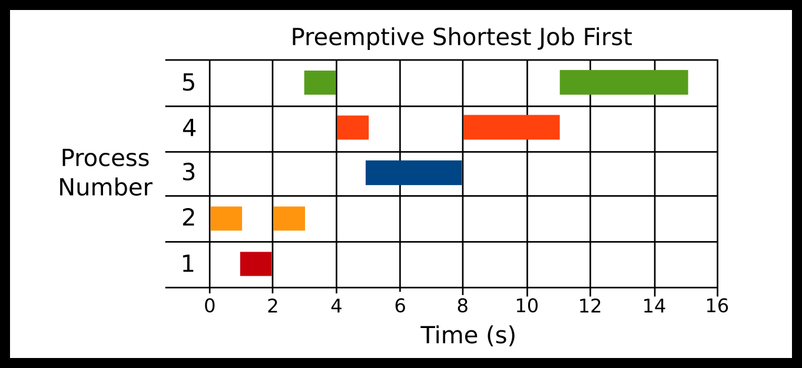
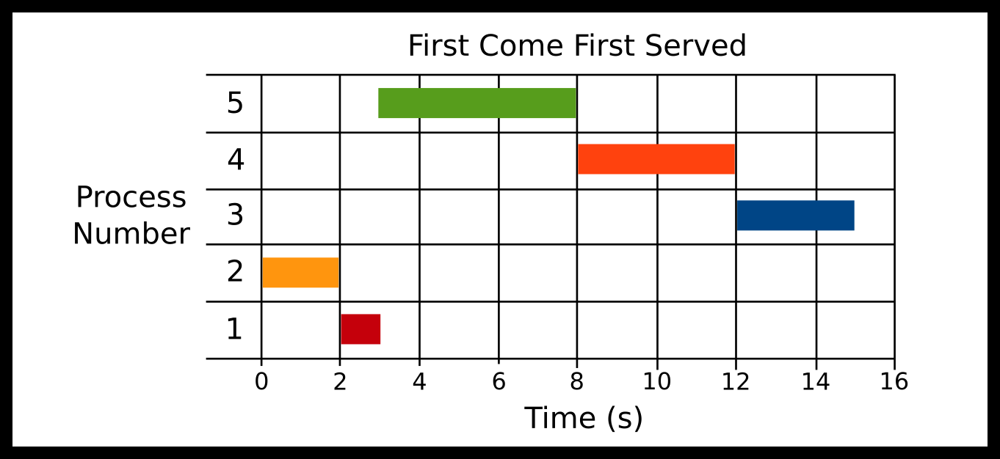

---
bibliography:
- scheduling/scheduling.bib
link-citations: true
title: "**CS341 系统编程课程手册**"
---

- [[#^scheduling|调度]]
  - [[#^high-level-scheduler-overview|高层调度器概览]]
  - [[#^measurements|度量指标]]
    - [[#^what-is-preemption|什么是抢占？]]
    - [[#^why-might-a-process-or-thread-be-placed-on-the-ready-queue|进程（或线程）为什么会被放进就绪队列？]]
  - [[#^measures-of-efficiency|效率度量]]
    - [[#^convoy-effect|护航效应]]
  - [[#^scheduling-algorithms|调度算法]]
    - [[#^shortest-job-first-sjf|最短作业优先（SJF）]]
    - [[#^preemptive-shortest-job-first-psjf|抢占式最短作业优先（PSJF）]]
    - [[#^first-come-first-served-fcfs|先来先服务（FCFS）]]
    - [[#^round-robin-rr|时间片轮转（RR）]]
    - [[#^priority|优先级]]
  - [[#^topics|主题]]
  - [[#^questions|问题]]

# 调度 ^scheduling

**我多希望能飞
一旦停下便有危险，缘由就在于此
你看我已经误了时辰
我已成了兔子汤锅里的一道菜
连句“再见”都说不出口，只能道“你好”
我迟了，我迟了，我迟了
不，不，不，不，不，不，不！** — **爱丽丝梦游仙境**

CPU 调度是这样一个问题：如何高效地选出哪些进程在系统的 CPU 核心上运行。在繁忙的系统中，就绪可运行的进程数量会超过 CPU 核心数量，因此系统内核必须评估哪些进程应当被调度运行、哪些进程应当稍后执行。系统还必须决定是否要暂停某个特定进程的执行——连同它相关的所有线程一起。分寸在于：暂停得足够频繁，让你的计算机保持响应；又足够稀疏，让程序自身花在上下文切换上的时间降到最少。这是一个很难拿捏好的平衡。

多线程和多 CPU 核心带来的额外复杂性会让人分心，因此这里略过不谈。对非母语者来说，另一个坑是“Time”一词的双重含义：它既可以指时钟时刻，也可以指经过的时长。例如“The arrival time of the first process was 9:00am.”（第一个进程的到达时间是上午 9:00）与“The running time of the algorithm is 3 seconds”（该算法的运行时间是 3 秒）。

我们要澄清的一点是：本文的调度主要讨论短期调度，也就是 CPU 调度。这意味着我们假定进程已经在内存中并且准备就绪。其他类型的调度属于长期和中期调度。长期调度器扮演处理世界的门卫角色。当一个进程请求执行另一个进程时，它可以回答“可以”“不可以”或者“稍等”。中期调度器处理的是这样一些情况：当进程太多，或者已知某些进程只占用极少量的 CPU 周期时，把进程从内存中的暂停状态迁移到磁盘上的暂停状态。想想那种每小时才检查一次什么东西的进程。

## 高层调度器概览 ^high-level-scheduler-overview

调度器就是一些软件程序。事实上，你自己就能实现调度器！如果你拿到一份待 exec 的命令列表，程序可以用 SIGSTOP 和 SIGCONT 来调度它们。这些被称为用户态调度器。Hadoop 和 Python 的 celery 可能就做了某种用户态调度，或者与操作系统打交道。

在操作系统层面，你一般会看到下面这种状态流程图，先用文字描述如下。注意，请不要去死记硬背所有状态。

1.  New 是初始状态。一个进程被请求调度。所有进程请求都来自 fork 或 clone。此时操作系统知道自己需要创建一个新进程。

2.  进程从 new 状态转入 ready 状态。这意味着内核中需要的各个结构体都已分配完毕。从那里它可以进入 ready suspended 或 running。

3.  Running 是我们希望大多数进程所处的状态，意味着它们正在做有用的工作。一个进程可能被抢占、被阻塞，或者终止。抢占会把进程送回 ready 状态。如果一个进程被阻塞，那意味着它可能在等某把互斥锁，也可能调用了 sleep——无论哪种情况，它都是主动放弃了控制权。

4.  在 blocked 状态下，操作系统既可以把该进程转为 ready，也可以让它进入一个更深的状态，叫作 blocked suspended。

5.  还有一些所谓的深度休眠状态，叫作 blocked suspended 和 blocked ready。你不必为这些操心。

我们会尝试挑选一种方案，来决定一个进程何时应当转入 running 状态，又何时应当被移回 ready 状态。对于如何纳入主动阻塞的状态、以及何时切换到深度休眠状态，我们不会多作讨论。

## 度量指标 ^measurements

调度会影响系统性能，具体来说是系统的*延迟*与*吞吐量*。吞吐量可以用某个系统指标来衡量，例如 I/O 吞吐量——每秒写入的比特数，或者单位时间内能完成多少个小进程。延迟则可以用响应时间来衡量——进程开始发出响应之前经过的时间——或者用等待时间、周转时间来衡量——完成一个任务所经过的时间。不同的调度器提供了不同的优化取舍，以适应不同的使用需求。不存在一个对所有可能环境和目标都最优的调度器。例如，最短作业优先会让所有作业的总等待时间最小，但在交互式（UI）环境中，宁可牺牲一些吞吐量也要把响应时间降到最低；而 FCFS 看上去凭直觉很公平、实现也简单，却会受到护航效应的困扰。到达时间是进程首次进入就绪队列、准备开始执行的时间。如果 CPU 空闲，那么到达时间也就是开始执行的时间。

### 什么是抢占？ ^what-is-preemption

没有抢占时，进程会一直运行，直到它再也无法利用 CPU 为止。比如下面这些情况会把一个进程从 CPU 上移除，此后 CPU 就可以被调度给其他进程：进程因收到信号而终止、进程阻塞在等待某个并发原语上、或者进程正常退出。因此，一旦一个进程被调度，它就会继续运行，即便就绪队列中出现了优先级更高的进程。

有了抢占，如果就绪队列中加入了更受青睐的进程，现有进程可以立即被移除。举例来说，假设在 t=0 时有一个最短作业优先调度器，就绪队列中有两个进程（P1、P2），执行时间分别是 10ms 和 20ms。P1 被调度运行。P1 立即创建了一个新进程 P3，执行时间为 5ms，它被加入就绪队列。没有抢占时，P3 会在 10ms 之后运行（等 P1 完成之后）。有抢占时，P1 会立即被从 CPU 上逐出并放回就绪队列，改由 CPU 执行 P3。

任何不使用某种抢占形式的调度器都可能导致饥饿，因为先到的进程可能永远得不到调度运行（拿不到 CPU）。例如在 SJF 中，如果系统里持续有大量短作业要调度，较长的作业可能永远排不上队。这完全取决于
<a href="https://en.wikipedia.org/wiki/Scheduling_(computing)#Types_of_operating_system_schedulers">https://en.wikipedia.org/wiki/Scheduling_(computing)#Types_of_operating_system_schedulers</a>。

### 进程（或线程）为什么会被放进就绪队列？ ^why-might-a-process-or-thread-be-placed-on-the-ready-queue

当一个进程能够使用 CPU 时，它就被放进就绪队列。举一些例子：

- 某个进程此前阻塞在等待来自存储设备或套接字的 `read` 完成，而现在数据已经就绪。

- 一个新进程被创建出来，已经准备开始运行。

- 某个进程线程此前阻塞在某个同步原语上（条件变量、信号量、互斥锁），现在可以继续了。

- 某个进程阻塞在等待某个系统调用完成，但此时投递了一个信号，而信号处理程序需要运行。

## 效率度量 ^measures-of-efficiency

先给出一些定义。

1.  `start_time` 是进程的墙上时钟开始时间（CPU 开始处理它的时间）

2.  `end_time` 是进程的墙上时钟结束时间（CPU 完成该进程的时间）

3.  `run_time` 是所需的 CPU 时间总量

4.  `arrival_time` 是进程进入调度器的时间（CPU 可能从此刻开始处理它）

下面是各项效率度量及其数学公式

1.  `Turnaround Time` 是从进程到达直到它结束的总时间。`end_time - arrival_time`

2.  `Response Time` 是从进程到达、到 CPU 真正开始处理它为止的总延迟（时间）。
    `start_time - arrival_time`

3.  `Wait Time` 是*总*等待时间，也就是进程待在就绪队列上的总时间。一个常见错误是以为它只是在就绪队列中的最初那段等待时间。假设一个没有 I/O 的 CPU 密集型进程需要 7 分钟的 CPU 时间才能完成，但实际花费了 9 分钟的墙上时钟时间，那么我们可以断定它在就绪队列上待了 2 分钟。在这 2 分钟里，该进程已经准备好运行，却没有分配到 CPU。它究竟是在什么时候等待的并不重要，等待时间就是 2 分钟。`end_time - arrival_time - run_time`

### 护航效应 ^convoy-effect

护航效应是指一个进程占用了大量 CPU 时间，导致所有其他资源需求可能更小的进程像一支船队一样跟在它后面。

假设当前 CPU 被分配给了一个 CPU 密集型任务，而就绪队列中有一批 I/O 密集型进程。这些进程只需要极少的 CPU 时间，却无法推进，因为它们在等那个 CPU 密集型任务被处理器移走。这些进程会一直处于饥饿状态，直到那个 CPU 密集型进程释放 CPU。但 CPU 很少被释放。例如在 FCFS 调度器的情况下，我们必须等到该进程因 I/O 请求而阻塞。这些 I/O 密集型进程此时终于可以满足它们的 CPU 需求，而且能很快满足，因为它们的需求本身很小；随后 CPU 又被交还给那个 CPU 密集型进程。于是，整个系统的 I/O 性能因所有进程的 CPU 需求都被间接饿死而受损。

这个效应通常在 FCFS 调度器的语境下讨论；不过，当时间片较长时，时间片轮转调度器同样会表现出护航效应。

## 调度算法 ^scheduling-algorithms

除非另有说明，本节中的示例都使用下面这些进程：

1.  进程 1：运行时间 1000ms

2.  进程 2：运行时间 2000ms

3.  进程 3：运行时间 3000ms

4.  进程 4：运行时间 4000ms

5.  进程 5：运行时间 5000ms

### 最短作业优先（SJF） ^shortest-job-first-sjf

<figure data-latex-placement="H">

<figcaption>最短作业优先调度</figcaption>
</figure>

- P1 到达：0ms

- P2 到达：0ms

- P3 到达：0ms

- P4 到达：0ms

- P5 到达：0ms

这些进程都在开始时到达，调度器会调度总 CPU 时间最短的那个作业。显而易见的问题在于：这个调度器需要在程序运行之前就知道它将会运行多久。

技术细节：一个现实的 SJF 实现所用的并不是进程的总执行时间，而是突发时间（burst time），也就是跑完一个程序所需的 CPU 周期数。期望的突发时间可以用基于此前突发时间的指数衰减加权滚动平均来估算
（<a href="#ref-silberschatz2005operating">[1]</a>）。
在本节讲解中，为简化起见，我们用进程的总运行时间作为突发时间的替代。

**优点**

1.  较短的作业倾向于先运行

2.  平均等待时间和响应时间都会下降

**缺点**

1.  需要算法是全知的

2.  需要估算进程的突发性，这比估算一个计算机网络还难

### 抢占式最短作业优先（PSJF） ^preemptive-shortest-job-first-psjf

抢占式最短作业优先与最短作业优先类似，但当一个新到达的作业其运行时间比当前作业的总运行时间更短时，就改为运行它。如果运行时间相同，我们的算法可以任选其一。该调度器使用的是进程的*总*运行时间。如果调度器想比较的是最短的*剩余*时间，那就是 PSJF 的一个变体，称为最短剩余时间优先（SRTF）。

<figure data-latex-placement="H">

<figcaption>抢占式最短作业优先调度</figcaption>
</figure>

- P2 于 0ms

- P1 于 1000ms

- P5 于 3000ms

- P4 于 4000ms

- P3 于 5000ms

下面是我们的算法所做的。它先运行 P2，因为那时只有它可运行。然后 P1 在 1000ms 到达，P2 已经运行了 2000ms，于是我们的调度器抢占 P2，让 P1 一路跑完，因为 P1 的总运行时间（1000ms）比 P2 的（2000ms）短。接着 P2 一直运行到结束。然后 P5 到达——由于当前没有进程在运行，调度器会运行进程 5。P4 到达，而它的总运行时间（4000ms）比 P5 的（5000ms）短，于是调度器停下 P5 去运行 P4。最后 P3 到达，抢占 P4 并运行到结束。然后 P4 运行，再然后 P5 运行。在 SRTF（最短剩余时间优先）下，比较的是剩余时间而非总时间，那么上述每一次抢占（P1、P4 和 P3 到达时）都会变成平局。

**优点**

1.  确保较短的作业先运行

**缺点**

1.  同样需要知道运行时间

2.  上下文切换，作业可能被中断

### 先来先服务（FCFS） ^first-come-first-served-fcfs

<figure data-latex-placement="H">

<figcaption>先来先服务调度</figcaption>
</figure>

- P2 于 0ms

- P1 于 1000ms

- P5 于 3000ms

- P4 于 4000ms

- P3 于 5000ms

进程按到达顺序被调度。FCFS 的一个优点是调度算法很简单。就绪队列就是一个 FIFO（先进先出）队列。FCFS 会受到护航效应的影响。这里 P2 先到，然后 P1，然后 P5，然后 P4，然后 P3。你可以看到 P5 遭遇的护航效应。

**优点**

- 算法和实现都很简单

- 当存在长运行进程时，上下文切换不频繁

- 如果能保证所有进程都会终止，就不会出现饥饿

**缺点**

- 护航效应：排在长运行进程之后的短进程必须等它跑完

- 当作业长度差异很大时，平均等待时间和响应时间都很差

- 没有抢占，因此不适合交互式系统

### 时间片轮转（RR） ^round-robin-rr

进程按它们在就绪队列中的到达顺序被调度。不过在经过一个很短的时间步之后，一个正在运行的进程会被强制从运行状态移除，并放回就绪队列。这确保长运行进程不会让其他所有进程都饿着没机会运行。一个进程在被送回就绪队列之前最多能执行的时间，称为时间片。随着时间片趋近于无穷大，时间片轮转就等价于 FCFS。

<figure data-latex-placement="H">

<figcaption>时间片轮转调度</figcaption>
</figure>

- P1 到达：0ms

- P2 到达：0ms

- P3 到达：0ms

- P4 到达：0ms

- P5 到达：0ms

时间片 = 1000ms

这里所有进程同时到达。P1 运行一个时间片就结束了。P2 运行一个时间片；然后它被停下让 P3 运行。等所有其他进程都跑完一个时间片后，我们再循环回到 P2，直到所有进程都结束。

**优点**

1.  确保了某种形式的公平

**缺点**

1.  进程数量大 = 大量切换

### 优先级 ^priority

进程按优先级值的顺序被调度。例如，一个导航进程可能比一个日志进程更重要、更值得先执行。

**如果你想用一种更数学化的方式来比较调度算法，请参见
附录中的第 <a href="#sec:scheduling_conceptually">#sec:scheduling_conceptually</a> 节。**

## 主题 ^topics

- 调度算法

- 效率度量

## 问题 ^questions

- 什么是调度？

- 什么是排队？有哪些不同的排队方法？

- 什么是周转时间？响应时间？等待时间？

- 什么是护航效应？

- 哪些算法在平均周转时间／响应时间／等待时间上表现最好？

- 与非抢占式算法相比，抢占式算法在平均响应时间上是否更好？那么在周转时间／等待时间上呢？

Silberschatz, A., P. B. Galvin, and G. Gagne. 2005. *Operating System
Concepts*. Wiley.
<a href="https://books.google.com/books?id=FH8fAQAAIAAJ">https://books.google.com/books?id=FH8fAQAAIAAJ</a>.

