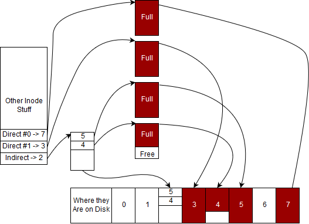

---
bibliography:
- filesystems/filesystems.bib
link-citations: true
title: "**CS341 系统编程课程手册**"
---

- [[#^filesystems|文件系统]]
  - [[#^what-is-a-filesystem|什么是文件系统？]]
    - [[#^the-file-api|文件 API]]
  - [[#^storing-data-on-disk|在磁盘上存储数据]]
    - [[#^file-contents|文件内容]]
    - [[#^directory-implementation|目录的实现]]
    - [[#^unix-directory-conventions|UNIX 目录约定]]
    - [[#^directory-api|目录 API]]
    - [[#^linking|链接]]
    - [[#^pathing|路径]]
    - [[#^metadata|元数据]]
  - [[#^permissions-and-bits|权限与各位]]
    - [[#^user-id-group-id|用户 ID / 组 ID]]
    - [[#^reading-changing-file-permissions|读取 / 修改文件
      权限]]
    - [[#^understanding-the-umask|理解 ‘umask’]]
    - [[#^the-setuid-bit|‘setuid’ 位]]
    - [[#^the-sticky-bit|‘sticky’ 位]]
  - [[#^virtual-filesystems-and-other-filesystems|虚拟文件系统与其他
    文件系统]]
    - [[#^managing-files-and-filesystems|管理文件与文件系统]]
    - [[#^obtaining-random-data|获取随机数据]]
    - [[#^copying-files|复制文件]]
    - [[#^updating-modification-time|更新修改时间]]
    - [[#^managing-filesystems|管理文件系统]]
  - [[#^memory-mapped-io|内存映射 IO]]
  - [[#^reliable-single-disk-filesystems|可靠的单磁盘
    文件系统]]
    - [[#^raid-redundant-array-of-inexpensive-disks|RAID - 廉价磁盘冗余
      阵列]]
    - [[#^higher-levels-of-raid|更高层级的 RAID]]
    - [[#^solutions|解决方案]]
  - [[#^simple-filesystem-model|简单文件系统模型]]
    - [[#^file-size-vs-space-on-disk|文件大小与磁盘占用]]
    - [[#^performing-reads|执行读取]]
    - [[#^performing-writes|执行写入]]
    - [[#^adding-deletes|加入删除]]
  - [[#^topics|主题]]
  - [[#^questions|问题]]


# 文件系统 ^filesystems

**`/home` 才是核心所在** -

文件系统之所以重要，是因为它们让你能在计算机
关机、崩溃或内存损坏之后仍然保留数据。在当年，
使用文件系统代价高昂。向文件系统（FS）写入意味着要
写磁带并从磁带读回
（<a href="#ref-iec">[1]</a>）。那既慢、又笨重，而且容易
出错。

如今我们的大多数文件都存放在磁盘上——虽然并非全部！
磁盘至少仍比内存慢一个数量级。

在开始本章之前先说几个术语。**文件系统**——我们稍后会
更具体地定义它——指的是任何满足文件系统 API 的东西。
文件系统由某种存储介质支撑，比如
机械硬盘、固态硬盘、RAM 等等。磁盘要么是**机械
硬盘（HDD）**，它包含一个旋转的金属盘片和一个读写头，
读写头可以在这块盘片上写入 1 或 0；要么是
`solid-state drive (SSD)`，它可以翻转芯片上或独立
硬盘上的某些 NAND 门来存储 1 或 0。截至 2019 年，SSD
比标准 HDD 快一个数量级。这些都是文件系统的
典型支撑介质。文件系统实现在这一支撑之上，也就是说
我们可以在市售的硬盘上实现 EXT、MinixFS、NTFS、FAT32
之类的东西。这个文件系统告诉
操作系统如何组织这些 1 和 0，来存储文件信息
以及目录信息，不过这留待后面再讲。为避免
过于吹毛求疵，我们说像 EXT 或 NTFS 这样的文件系统直接
实现了文件系统 API（open、close 等）。操作系统
通常会额外加一层抽象，要求由操作系统来
满足那个 API（可以想象成 linux_open、
linux_close 之类的函数）。这样做有两个好处：
一个文件系统就能为多个操作系统 API 实现，
而且新增一个操作系统
文件系统调用也不需要底下所有文件系统都
更改它们的 API。例如，在 Linux 的下一个版本中，
如果新增了一个用于创建文件备份的系统调用，
操作系统可以用内部 API 来实现它，
而不必让所有文件系统驱动都去改代码。

**最后一条背景知识相当重要。**在本章中，
我们引用文件大小时会使用符合 ISO 标准的 KiB，也就是
Kibibyte。\*iB 家族是"以 2 的幂为单位的存储"的简写。
也就是说如下：

<div class="center">

| 前缀 |   字节值   |
|:------:|:--------------:|
|  KiB   |     1024B      |
|  MiB   | 1024 \* 1024 B |
|  GiB   |    1024 3̂ B    |

Kibibyte 的取值

</div>

标准的十进制前缀含义如下：

<div class="center">

| 前缀 |   字节值   |
|:------:|:--------------:|
|   KB   |     1000B      |
|   MB   | 1000 \* 1000 B |
|   GB   |    1000 3̂ B    |

Kilobyte 的取值

</div>

为保持一致性、也为了不让人搞混，我们在本书和
网络一章中都按前面那套来。**而在真实世界里，
另有一套约定，令人困惑。**那套约定是：当一个
文件在操作系统中显示时，**KB 与 KiB 相同**。
但当我们谈论计算机网络、CD 以及其他存储时，**KB 与 KiB
并不相同**，而是采用上面 ISO／公制的定义。这
是一个历史遗留的怪现象，源自网络
开发者与内存／硬盘开发者之间的冲突。硬盘和内存
开发者发现，如果一个比特可以取两种状态之一，那么
把 Kilo 前缀说成 1024 已经很接近 1000 了，很自然。
网络开发者则必须处理比特、实时信号处理
以及各种其他因素，于是他们沿用了已经被
普遍接受的那个约定：Kilo 意味着 1000 个什么（<a href="#ref-iec">[1]</a>）。
你需要知道的是，当你在实际环境中看到 KB 时，
它可能基于上下文取 1024。如果你在本课中任何时候
看到 KB 或这一家族成员并涉及文件系统问题，
你可以安全地推断它们指的是以 1024 为基本单位。
不过，当你推送生产代码时，务必把两者的差别问清楚！

## 什么是文件系统？ ^what-is-a-filesystem

你可能听过 UNIX 那句老话："一切皆文件"。在
大多数 UNIX 系统上，文件操作为许多
不同的操作提供了统一的抽象接口。网络套接字、
硬件设备以及磁盘上的数据
都由类似文件的对象来表示。一个类文件对象必须
遵循以下约定：

1.  它必须向文件系统呈现自己。

2.  它必须支持常见的文件系统操作，比如 `open`、
    `read`、`write`。至少它需要能被打开和关闭。

文件系统就是文件接口的一种实现。在本章中，
我们将探讨一个文件系统所提供的各种回调、
一些典型的功能以及相关的实现
细节。在本课中，我们主要讨论那些
让用户能够访问磁盘上数据的文件系统，它们是
现代计算机不可或缺的一部分。

下面是文件系统的一些常见特性：

1.  它们既负责存储本地文件，也负责处理那些
   允许内核与用户空间安全通信的特殊设备。

2.  它们要处理故障、可扩展性、索引、加密、
   压缩以及性能。

3.  它们处理这样一层抽象：包含数据的文件，
   与这些数据究竟如何存储在磁盘上、如何分区、
   如何受到保护。

在深入文件系统细节之前，我们先看几个
例子。明确一下：挂载点就是内核中
一个目录到某个文件系统的映射。

1.  `ext4` 在 Linux 系统上通常挂载在 / 上，它是你
   所习惯的、提供了磁盘访问的那个文件系统。

2.  `procfs` 通常挂载在 /proc 上，提供关于
   进程的信息与控制。

3.  `sysfs` 通常挂载在 /sys 上，它是 /proc 的一个
   更现代的版本，还允许控制其他各种硬件，
   比如网络套接字。

4.  `tmpfs` 在某些系统中挂载在 /tmp 上，这是一个
   存放临时文件的内存文件系统。

5.  `sshfs` 它通过 `ssh` 协议同步文件。

它告诉你那些基于目录的文件系统调用解析到哪里去。
例如，在我们的情形中 `/` 由 `ext4` 文件系统解析，但
`/proc/2` 却由 `procfs` 系统解析，尽管它把 `/`
当作一个子系统来包含。

你可能已经注意到，有些文件系统提供了通往那些
并非"文件"之物的接口。诸如 `procfs` 这样的文件系统
通常被称为*虚拟*文件系统，因为它们并不像
传统文件系统那样提供数据访问。从技术上说，
内核中所有文件系统都由虚拟文件系统表示，不过
我们会把*虚拟*文件系统区分出来，指那些确实
不在硬盘上存储任何东西的文件系统。

### 文件 API ^the-file-api

文件系统必须为一系列动作提供回调函数。
其中一些列在下面：

- `open` 为 IO 打开一个文件

- `read` 读取文件的内容

- `write` 写入文件

- `close` 关闭文件并释放相关资源

- `chmod` 修改文件的权限

- `ioctl` 与终端这类字符设备的设备参数交互

并非每个文件系统都支持所有可能的回调函数。举例来说，
许多文件系统省略了 `ioctl` 或 `link`。许多文件系统
不是 `seekable` 的，这意味着它们只提供顺序
访问。程序无法移动到文件中的任意位置。
这类似于 `seekable stream`s。在本章中，我们不会
逐一审视每个文件系统回调。如果你想更多地
了解这个接口，可以试着去查用户态层
文件系统（FUSE）的文档。

## 在磁盘上存储数据 ^storing-data-on-disk

要理解文件系统如何与磁盘上的数据交互，我们需要
用到三个关键术语。

1.  `disk block` 磁盘块是磁盘上为存放某个文件或
    目录的内容而预留的一部分。

2.  `inode` inode *就是*一个文件或目录。这意味着
    一个 inode 含有该文件的元数据，以及指向
    磁盘块的指针，从而使该文件真正可以被写入或读取。

3.  `superblock` 超级块中含有关于 inode 和
    磁盘块的元数据。一个超级块的例子可以
    记录每个磁盘块有多满、哪些 inode
    正在被使用等等。现代文件系统实际上
    可能包含多个超级块，以及某种"超级块的超级块"
    来跟踪哪些扇区由哪些超级块管辖。
    这往往有助于缓解碎片问题。

看起来可能让人望而生畏，但读完本章之后，
我们就能够理解文件系统的每个部分了。

要推理某种存储介质上的数据——旋转磁盘、
固态硬盘、磁带——通常的做法是先把
存储介质看作一组*块*。一块可以
被看作磁盘上的一段连续区域。它的大小有时
由底层硬件的某个属性决定，但更常见的是
根据给定系统的一页内存的大小来确定，
这样来自磁盘的数据就可以缓存在内存中以加快
访问——这是许多文件系统的一项重要特性。

文件系统有一个称为*超级块*的特殊块，它存储
关于文件系统的元数据，比如日志
（记录对文件系统的改动）、inode 表、
磁盘上第一个 inode 的位置等等。超级块
重要之处在于它位于磁盘上一个
已知的位置。否则，你的计算机可能就无法启动！
设想一个烧进主板的简单 ROM。如果你的处理器
无法让主板开始读取并解析某个磁盘块以启动
引导序列，那你就没戏了。

inode 是我们的文件系统最重要的结构，因为
它代表一个文件。在深入探讨它之前，我们先列出
要拥有一个可用的文件所需的关键
信息。

- 名字

- 文件大小

- 创建时间、最后修改时间、最后访问时间

- 权限

- 文件路径

- 校验和

- 文件数据

### 文件内容 ^file-contents

摘自
<a href="http://en.wikipedia.org/wiki/Inode">http://en.wikipedia.org/wiki/Inode</a>：

> *在类 UNIX 文件系统中，索引节点（informally 称为
> inode）是一种数据结构，用于表示一个文件系统对象，
> 它可以是各种东西，包括文件或目录。每个
> inode 都存储该文件系统对象数据的属性和磁盘
> 块位置。文件系统对象的属性可能包括
> 操作元数据（例如更改时间、访问时间、修改时间），
> 以及所有者与权限数据（例如组 id、用户 id、权限）。*

超级块可以存储一个 inode 数组，其中每个 inode
都存储指向磁盘块的直接指针，
以及可能若干种间接指针。由于 inode
存放在超级块中，大多数文件系统都对
inode 的数量有上限。由于每个 inode 对应一个
文件，这也就是该文件系统所能拥有的文件数量上限。
试图通过把 inode 存在别的位置来
解决这个问题会极大增加文件系统的复杂度。
试图为 inode 表重新分配空间同样不可行，
因为 inode 数组末尾之后的每一个字节
都必须被搬移，这是一个极其昂贵的
操作。这并不是说完全没有解决办法，
不过通常没有必要增加 inode 的数量，因为
inode 的数量一般已经足够多了。

核心思想：忘掉文件名吧。inode *就是*文件。

人们常常把文件名当作"真正的"文件。其实不是！
相反，应该把 inode 当作文件。inode 保存
元信息（最后访问时间、所有者、大小），并指向
用于保存文件内容的磁盘块。不过 inode 通常
并不存储文件名。文件名通常只存储在
目录里（见下文）。

例如，要读取一个文件的头几个字节，就沿着
第一个直接块指针走到第一个直接块，然后读取头几个
字节。写入遵循同样的过程。如果一个程序想读取
整个文件，就一直读直接块，直到你已读的字节数
等于文件大小。如果文件的总大小小于
直接块的数量乘以块的大小，那么未使用的块指针
将是未定义的。同样地，如果一个
文件的大小不是块大小的整数倍，那么最后一个块中
最后一个字节之后的数据将是垃圾。

如果一个文件比它的直接块所能寻址的最大空间
还大怎么办？为此我们引入一句程序员
过于认真对待的格言。

> "计算机科学中的所有问题都可以通过再加一层
> 间接来解决。" —— David Wheeler

除了间接层数过多这个问题本身。

为了解决这个问题，我们引入 `indirect blocks`。一个单级间接
块是一个存放指向更多数据块的指针的块。同理，
一个双级间接块存放指向单级间接块的指针，
而这个概念可以推广到任意层数的间接。这是一个
重要概念，因为 inode 存放在超级块中，
或某个位于已知位置、大小固定的结构中，
间接机制让一个 inode 能追踪的空间
呈指数级增长。

作为一个演算例子，假设我们把磁盘划分成 4KiB 的块，并且我们
想要寻址最多 $$ 2^{32} $$ 个块。最大磁盘大小是
$$ 4KiB *2^{32} = 16TiB $$，记住 $$ 2^{10} = 1024 $$。一个磁盘块
可以存放 $$ \frac{4KiB}{4B} $$ 个可能的指针，也就是 1024 个指针。
需要四个字节宽的指针，
因为我们想寻址 32 位那么多个块。
每个指针指向一个 4KiB 的磁盘块，所以你可以引用
最多 $$ 1024*4KiB = 4MiB $$ 的数据。对于同样的磁盘配置，一个
双级间接块存放 1024 个指针，指向 1024 张间接表。
因此一个双级间接块最多可以引用 $$ 1024 * 4MiB = 4GiB $$
的数据。同理，一个三级间接块最多可以引用 4TiB 的
数据。代价是额外的磁盘读取。一旦 inode 进入内存，
通过直接指针找到一个数据块需要一次读取，
通过单级间接块需要两次，双级间接块需要三次，
三级间接块需要四次。实际中文件系统会缓存间接块，
所以对顺序读取来说，这个代价由每个间接块所
描述的那 1024 个数据块共同分摊。块内部的
实际读取时间并不会改变。

### 目录的实现 ^directory-implementation

目录是名字到 inode 编号的映射。它通常是一个
普通文件，只是它的 inode 里设置了某些特殊的位，
并且它的内容有特定的结构。POSIX 提供了一小组
函数，用来读取每个条目的文件名和 inode 编号，
我们稍后会在本章中深入讨论它们。

我们来想想目录在实际文件系统里是什么样子的。
从理论上说，它们就是文件。磁盘块中会包含
*目录条目*或 *dirent*。这意味着我们的
磁盘块可能是这样：

    | inode_num | name   | | ----------- | ------ |
    | 2043567   | hi.txt | | ... |

每个目录条目可以是固定大小，也可以是变长的
C 字符串。这取决于具体的文件系统在
底层如何实现它。要查看 POSIX 系统上文件名到
inode 编号的映射，可以在 shell 中使用 `ls` 加上 `-i` 选项

``` bash
# ls -i
12983989 dirlist.c      12984068 sandwich.c
```

你稍后会看到这是一个多么强大的抽象。一个
文件可以在一个目录中拥有多个不同的名字，
或者同时存在于多个
目录中。

### UNIX 目录约定 ^unix-directory-conventions

在标准的 UNIX 文件系统中，在请求读取目录时，
下列条目会被特别地加入进来。

1.  `.` 表示当前目录

2.  `..` 表示父目录

与直觉相反，`...` 在磁盘上可能是某个
文件或目录的名字（你可以用 `mkdir ...` 试试），
而不是祖父目录。
只有当前目录和父目录才有涉及
`.` 的特殊别名（即 `.` 和 `..`）。
令人困惑的是，shell `zsh` 确实
会在展开 shell 命令时把 `...` 解释成通往
祖父目录的便捷写法（如果它存在的话）。

与名字有关的约定的其他事实：

1.  `~` 通常会被 shell 展开为家目录

2.  在磁盘上以 ’.’（一个句点）开头的文件，按约定
    被认为"隐藏"，像 `ls` 这样的程序在
    不加额外标志（`-a`）时会省略它们。
    这不是文件系统的一项特性，程序可以
    选择忽略它。

3.  有些文件还可能以一个 NUL 字节开头。这些通常是
    *抽象 UNIX 套接字*，它们被用来避免
    弄乱文件系统，因为任何没有预料到的程序
    实际上都看不到它们。不过，列举
    套接字信息的工具会把它们列出来，
    所以这并不是一项提供
    安全性的特性。

4.  如果你想惹恼你的邻居，就创建一个带有终端
    响铃字符的文件。这个文件每次被列出时
    （比如调用 ‘ls’ 时），都会听到一声
    响铃。

### 目录 API ^directory-api

在 C 中与文件交互通常是用 `open`
打开文件，然后用 `read` 或 `write` 与该文件交互，
再调用 `close` 释放资源；但目录有专门的
调用，比如 `opendir`、`closedir` 和 `readdir`。没有
`writedir` 这个函数，因为那通常意味着创建一个文件或链接。
程序会用 `open` 或 `mkdir` 之类的东西。

为了探索这些函数，我们来写一个程序，在目录的
内容中搜索某个特定文件。下面的代码有个 bug，
试着找出来！

``` objectivec
int exists(char *directory, char *name)  {
  struct dirent *dp;
  DIR *dirp = opendir(directory);
  while ((dp = readdir(dirp)) != NULL) {
    puts(dp->d_name);
    if (!strcmp(dp->d_name, name)) {
      return 1; /* Found */
    }
  }
  closedir(dirp);
  return 0; /* Not Found */
}
```

找到那个 bug 了吗？它泄漏了资源！如果找到了
匹配的文件名，那么提前返回时永远不会调用
‘closedir’。任何已打开的文件描述符以及
opendir 分配的内存都没有被释放。这意味着
最终该进程会耗尽资源，导致某次 `open`
或 `opendir` 调用失败。

修法是确保在每一条可能的代码路径上
都释放资源。

在上面的代码中，这意味着要在 `return 1` 之前
调用 `closedir`。忘记释放资源是 C 编程中一个
常见的 bug，因为 C 语言本身
并不提供任何支持来保证资源在所有代码路径上都被释放。

给定一个已打开的目录，在调用 `fork()` 之后，
或者（异或关系地）父进程或子进程
可以使用 `readdir()`、`rewinddir()` 或 `seekdir()`。
如果父子双方都使用上述函数，行为是
未定义的。

这里有两个主要的坑和一个需要考虑的地方。`readdir` 函数
会返回 "."（当前目录）和 ".."（父目录）。另一个是
程序需要显式地把子目录从搜索中排除，
否则搜索可能耗时很久。

对许多应用来说，先检查当前目录、
然后再递归搜索子目录是合理的做法。
这可以通过把结果存入一个链表，
或者重置目录结构体以便从头重新开始来实现。

下面的代码试图递归地列出一个目录中的
所有文件。作为练习，试着找出它引入的
那些 bug。

``` objectivec
void dirlist(char *path) {
  struct dirent *dp;
  DIR *dirp = opendir(path);
  while ((dp = readdir(dirp)) != NULL) {
    char newpath[strlen(path) + strlen(dp->d_name) + 1];
    sprintf(newpath,"%s/%s", newpath, dp->d_name);
    printf("%s\n", dp->d_name);
    dirlist(newpath);
  }
}

int main(int argc, char **argv) {
  dirlist(argv[1]);
  return 0;
}
```

5 个 bug 都找到了吗？

``` objectivec
// Check opendir result (perhaps user gave us a path that can not be opened as a directory
if (!dirp) { perror("Could not open directory"); return; }

// +2 as we need space for the / and the terminating 0
char newpath[strlen(path) + strlen(dp->d_name) + 2];

// Correct parameter
sprintf(newpath,"%s/%s", path, dp->d_name);

// Perform stat test (and verify) before recursing
if (0 == stat(newpath,&s) && S_ISDIR(s.st_mode)) dirlist(newpath)

// Resource leak: the directory file handle is not closed after the while loop
closedir(dirp);
```

最后再提醒一句。`readdir` 在多个线程共享同一个
目录流时并不保证是线程安全的。不要去用
可重入版本 `readdir_r`；它在 glibc 中已被废弃。
相反，从各自的 `DIR*` 流中读取的
线程不需要额外小心，而共享同一个
`DIR*` 流的线程则必须在每次调用
`readdir` 时加上锁。

更多细节请见
<a href="https://linux.die.net/man/3/readdir">https://linux.die.net/man/3/readdir</a>。

### 链接 ^linking

正是链接迫使我们把文件系统建模成一张图，
而不是一棵树。

把文件系统建模成树意味着每个 inode 都有
唯一的父目录；而链接则允许 inode 在多个地方
以文件的形式出现，甚至可能带着不同的名字，
于是就导致一个 inode 拥有多个
父目录。链接分为两种：

1.  `Hard Links` 硬链接就是在某个目录中增加一个条目，
    把某个名字赋给一个 inode 编号，而该 inode
    在同一个目录或不同目录中已经有了另一个名字
    和映射。如果我们已经在文件系统上
    有了一个文件，就可以用 `` `ln' `` 命令
    为同一个 inode 创建另一个链接：

    ``` bash
    $ ln file1.txt blip.txt
    ```

    However, blip.txt *is* the same file. If we edit blip, I’m editing
    the same file as ‘file1.txt!’. We can prove this by showing that
    both file names refer to the same inode.

        $ ls -i file1.txt blip.txt
        134235 file1.txt
        134235 blip.txt

    The equivalent C call is `link`

    ``` objectivec
    // Function Prototype
    int link(const char *path1, const char *path2);

    link("file1.txt", "blip.txt");
    ```

    For simplicity, the above examples made hard links inside the same
    directory. Hard links can be created anywhere inside the same
    filesystem.

2.  `Soft Links` 第二种链接称为软链接、符号
    链接或 symlink。符号链接的不同之处在于，
    它是一个设置了特殊位的文件，存储着
    到另一个文件的路径。简单地说，
    去掉那个特殊位，它就不过是一个内含
    文件路径的文本文件。注意，当人们
    泛泛地谈论链接而不指明是硬链接还是软链接时，
    他们指的是硬链接。

    To create a symbolic link in the shell, use `ln -s`. To read the
    contents of the link as a file, use `readlink`. These are both
    demonstrated below.

        $ ln -s file1.txt file2.txt
        $ ls -i file1.txt file2.txt blip.txt
        134235 file1.txt
        134236 file2.txt
        134235 blip.txt
        $ cat file1.txt
        file1!
        $ cat file2.txt
        file1!
        $ cat blip.txt
        file1!
        $ echo edited file2 >> file2.txt # >> is bash syntax for append to file
        $ cat file1.txt
        file1!
        edited file2
        $ cat file2.txt
        file1!
        edited file2
        $ cat blip.txt
        file1!
        edited file2
        $ readlink file2.txt
        file1.txt

    Note that `file2.txt` and `file1.txt` have different inode numbers,
    unlike the hard link, `blip.txt`.

    There is a C library call to create symlinks which is similar to
    link.

    ``` objectivec
    symlink(const char *target, const char *symlink);
    ```

    Some advantages of symbolic links are

    - 可以指向尚不存在的文件

    - 与硬链接不同，它既可以指向目录，
      也可以指向普通文件

    - 可以指向当前文件系统之外存在的
      文件（以及目录）

    However, symlinks have a key disadvantage, they are slower than
    regular files and directories. When the link’s contents are read,
    they must be interpreted as a new path to the target file, resulting
    in an additional call to open and read since the real file must be
    opened and read. Another disadvantage is that POSIX forbids hard
    linking directories whereas soft links are allowed. The `ln` command
    will only allow root to do this and only if you provide the `-d`
    option. However, even root may not be able to perform this because
    most filesystems prevent it!

文件系统的完整性假设目录结构是一棵
无环的树，并且可以从根目录到达。
如果允许目录链接，那么强制执行或验证
这一约束就会变得昂贵。破坏这些假设
会让文件完整性工具
无法修复该文件系统。递归搜索有可能
永不终止，而且目录可以有多个父节点，但“..”
只能指向单一的父节点。总而言之是个坏主意。
软链接只是被忽略掉了，这正是我们可以用它们
来引用目录的原因。

当你用 `rm` 或 `unlink` 删除一个文件时，
你删除的是某个目录对一个 inode 的
引用。不过，该 inode 仍可能
被其他目录引用。为了确定文件的内容
是否仍然被需要，每个 inode 会维护一个引用计数，
每当创建或销毁一个新链接时
就会更新。这个计数只跟踪硬
链接，因为符号链接允许指向不存在的文件，因此
无关紧要。

硬链接的一个用途示例是高效地为文件系统在
不同时间点创建多个归档。一旦归档区中
有了某个特定文件的副本，未来的归档就可以
复用这些归档文件，而不必创建一个重复文件。
这被称为增量备份。Apple 的“Time Machine”软件
就是这么做的。

### 路径 ^pathing

现在我们有了定义，也谈过了目录，接下来
就要遇到路径这个概念。路径是一串
目录，它为你在作为图的文件系统中的图上
提供一条"路径"。不过
其中有一些细微之处。存在这样一个
名为 `a/b/../c/./` 的路径是可能的。由于 `..` 和 `.`
是目录中的特殊条目，
所以这是一个合法路径，实际上指向 `a/c`。
大多数文件系统
函数都允许传入未压缩的路径。C 库
提供了一个函数 `realpath` 来压缩路径或取得绝对
路径。手动简化时，请记住 `..` 表示
"父文件夹"，而 `.` 表示"当前文件夹"。下面是一个
例子，说明如何通过在 shell 中使用 `cd`
在文件系统中导航，把路径 `a/b/../c/.` 简化掉。

1.  `cd a`（在 a 中）

2.  `cd b`（在 a/b 中）

3.  `cd ..`（在 a 中，因为 .. 表示"父文件夹"）

4.  `cd c`（在 a/c 中）

5.  `cd .`（在 a/c 中，因为 . 表示"当前文件夹"）

因此，这条路径可以简化为 `a/c`。

### 元数据 ^metadata

我们如何区分普通文件和目录？除此之外，
文件还可能含有许多其他属性。
我们是用 inode 内部的字段来区分文件类型的，
这与文件扩展名（比如 png、
svg、pdf）无关。系统如何知道
一个文件是什么类型
呢？

这些信息存储在 inode 内部。要访问它，请使用 stat
系列的调用。例如，要查出我的 ‘notes.txt’ 文件最后
是什么时候被访问的。

``` objectivec
struct stat s;
stat("notes.txt", &s);
printf("Last accessed %s", ctime(&s.st_atime));
```

`stat` 实际上有三个版本：

``` objectivec
int stat(const char *path, struct stat *buf);
int fstat(int fd, struct stat *buf);
int lstat(const char *path, struct stat *buf);
```

例如，如果一个程序已经持有与某个文件
关联的文件描述符，它可以用 `fstat` 来了解
该文件的元数据。

``` objectivec
FILE *file = fopen("notes.txt", "r");
int fd = fileno(file); /* Just for fun - extract the file descriptor from a C FILE struct */
struct stat s;
fstat(fd, & s);
printf("Last accessed %s", ctime(&s.st_atime));
```

`lstat` 几乎与 `stat` 相同，但对符号链接的
处理方式不同。摘自 `stat` 的 man 手册。

> lstat() 与 stat() 完全相同，区别在于：如果 pathname
> 是一个符号链接，那么它返回的是该
> 链接本身的信息，而不是它所
> 指向的文件的信息。

这些 stat 函数会用到 `struct stat`。摘自 `stat` 的 man 手册：

``` objectivec
struct stat {
  dev_t     st_dev;         /* ID of device containing file */
  ino_t     st_ino;         /* Inode number */
  mode_t    st_mode;        /* File type and mode */
  nlink_t   st_nlink;       /* Number of hard links */
  uid_t     st_uid;         /* User ID of owner */
  gid_t     st_gid;         /* Group ID of owner */
  dev_t     st_rdev;        /* Device ID (if special file) */
  off_t     st_size;        /* Total size, in bytes */
  blksize_t st_blksize;     /* Block size for filesystem I/O */
  blkcnt_t  st_blocks;      /* Number of 512B blocks allocated */
  struct timespec st_atim;  /* Time of last access */
  struct timespec st_mtim;  /* Time of last modification */
  struct timespec st_ctim;  /* Time of last status change */
};
```

`st_mode` 字段可以用来区分普通文件
和目录。要做到这一点，请使用宏
`S_ISDIR` 和 `S_ISREG`。

``` objectivec
struct stat s;
if (0 == stat(name, &s)) {
  printf("%s ", name);
  if (S_ISDIR( s.st_mode)) puts("is a directory");
  if (S_ISREG( s.st_mode)) puts("is a regular file");
} else {
  perror("stat failed - are you sure we can read this file's metadata?");
}
```

## 权限与各位 ^permissions-and-bits

权限是 UNIX 系统在文件系统中
提供安全性的关键部分。你可能已经注意到
`struct stat` 中的 `st_mode` 字段
包含的不只是文件类型。它还包含
mode，也就是一份详细说明用户能与不能
对某个给定文件做什么的描述。任何文件通常都有
三组权限。
分别是*用户*、*组*和*其他*（所有落在
前两类之外的用户）的权限。对于这三类中的每一类，
我们都需要记录该用户是否被允许读该文件、
写该文件以及执行该文件。由于有三种
类别和三种权限，权限通常表示为
一个 3 位八进制数。每个八进制数位是三个比特：
最高位（4）对应读权限，中间位（2）
对应写权限，最低位（1）对应执行
权限。它们总是按*用户*、*组*、*其他*
（*UGO*）的顺序呈现。下面是一些常见例子。
这里是各位的约定：

1.  `r` 意味着这一类人可以读

2.  `w` 意味着这一类人可以写

3.  `x` 意味着这一类人可以执行

<div class="center">

| 八进制码 | 用户  | 组   | 其他 |
|:----------:|:-----:|:-----:|:------:|
|    755     | `rwx` | `r-x` | `r-x`  |
|    644     | `rw-` | `r--` | `r--`  |

权限表

</div>

值得注意的是，这些 `rwx` 位对目录
来说含义略有不同。对目录的写权限
允许一个程序在其中创建或删除新的
文件或目录。你可以把这理解成
拥有对该目录条目（dirent）映射的写权限。
对目录的读权限
允许一个程序列出该目录的内容。
这就是对该目录条目（dirent）映射的读权限。
执行权限允许一个程序用 cd
进入该目录。没有执行位时，
任何创建或删除文件或目录的尝试
都会失败，因为你无法访问它们。不过，
你仍然可以列出该目录的
内容。

有若干个命令行工具可以与文件的
mode 交互。`mknod` 会改变文件的类型。`chmod` 接受一个
数字和一个文件，并修改权限位。不过在我们
详细讨论 chmod 之前，还必须理解用户 ID（`uid`）和
组 ID（`gid`）。

### 用户 ID / 组 ID ^user-id-group-id

UNIX 系统中的每个用户都有一个用户 ID。这是一个
可以标识某个用户的唯一数字。同样地，
用户可以被加入称为组的集合中，
而每个组也有一个唯一的标识号码。组
在 UNIX 系统上有各种用途。它们可以被赋予
能力（capabilities）——一种描述用户对
系统拥有何种控制程度的方式。例如，你可能碰到过的
一个组是 `sudoers` 组，它是一组受信任的用户，
允许使用 `sudo` 命令
临时获得更高的权限。本章稍后会更多讨论 `sudo`
是如何工作的。每个文件在创建时
都有一个所有者，即该文件的创建者。
所有者的用户 ID（`uid`）可以通过
调用 `stat` 在一个 `struct stat` 的 `st_uid` 字段中
找到。同样地，
组 ID（`gid`）也会被设置，并存储在 `st_gid` 中。

每个进程都可以用 `getuid` 和
`getgid` 来确定自己的 `uid` 和 `gid`。当一个进程试图
以特定模式打开一个文件时，它的
`uid` 和 `gid` 会与该文件的 `uid` 和 `gid` 比较。如果
这些 `uid` 匹配，那么该进程打开该文件的请求
会与文件权限中用户字段上的各位比较。如果
这些 `gid` 匹配，那么该进程的请求会与
权限中的组字段比较。如果所有 ID 都不匹配，
那么就适用其他
字段。

### 读取 / 修改文件权限 ^reading-changing-file-permissions

在讨论如何修改权限位之前，我们应当
能够读取它们。在 C 中，可以使用 `stat`
这一系列库调用。要从命令行
读取权限位，请使用 `ls -l`。注意，
权限会以 ‘trwxrwxrwx’ 的格式输出。第一个字符
指示文件类型。第一个字符的
可能取值包括但不限于：

1.  (-) 普通文件

2.  \(d) 目录

3.  \(c) 字符设备文件

4.  \(l) 符号链接

5.  \(p) 命名管道（也叫 FIFO）

6.  \(b) 块设备

7.  \(s) 套接字

或者，使用程序 `stat`，它会呈现所有
可以从 `stat` 库调用中取得的信息。

要修改权限位，有一个系统调用
`int chmod(const char *path, mode_t mode);`。为了简化我们的例子，
我们将使用同名的命令行工具 `chmod`，
它是 "change mode" 的缩写。`chmod` 有两种常用用法，
可以带一个八进制值，也可以带一个符号字符串。

``` bash
$ chmod 644 file1
$ chmod 755 file2
$ chmod 700 file3
$ chmod ugo-w file4
$ chmod o-rx file4
```

那些以 8 为基（"八进制"）的数字描述了各角色的
权限：拥有该文件的
用户、组以及其他所有人。这个八进制数是
赋予三种权限类型的三个值之和：读(4)、
写(2)、执行(1)。

示例：`chmod 755 myfile`

1.  用户拥有 4+2+1，即读、写和执行（全部）权限

2.  组拥有 4+0+1，即读和执行权限

3.  所有用户拥有 4+0+1，即读和执行权限

### 理解 ‘umask’ ^understanding-the-umask

umask 会从 `777` 中*减去*（削减）权限位，
并在通过 open、mkdir 等创建新文件和新
目录时使用。默认情况下，umask 被设为
`022`（八进制），这意味着组和其他
权限将只有可读。每个进程都有一个
当前的 umask 值。在 fork 时，子进程会继承父进程的 umask
值。

例如，在 shell 中把 umask 设为 `077`，
就能确保今后创建的文件和目录
只有当前用户可以访问，

``` bash
$ umask 077
$ mkdir secretdir
```

作为代码示例，假设一个新建文件是用 `open()` 和
模式位 `666`（用户、组、其他的写位和读位）创建的：

``` objectivec
open("myfile", O_CREAT, S_IRUSR | S_IWUSR | S_IRGRP | S_IWGRP | S_IROTH | S_IWOTH);
```

如果 umask 是八进制 `022`，那么所创建文件的权限
就会是 `0666` & ~`022`，例如。

``` objectivec
S_IRUSR | S_IWUSR | S_IRGRP | S_IROTH
```

### ‘setuid’ 位 ^the-setuid-bit

你可能已经注意到，具有执行权限的文件
还可以设置另一个位。这个位就是 `setuid` 位。它表示
在被运行的时候，该程序会把用户的 uid
设为该文件所有者的 uid。
同理，还有一个 `setgid` 位会把执行者的 gid
设为所有者的 gid。设置了 `setuid` 的
程序的典型例子就是 `sudo`。

`sudo` 通常是一个由 root 用户拥有的程序——root 是一个
拥有全部能力的用户。通过使用 `sudo`，一个本来
没有特权的用户也能访问系统中
大部分内容。这对于运行
可能需要提升权限的程序很有用，比如用 `chown`
改变文件的所有者，或用 `mount` 来挂载或卸载
文件系统（这个动作我们会在本章稍后讨论）。下面是
一些例子：

``` bash
$ sudo mount /dev/sda2 /stuff/mydisk
$ sudo adduser fred
$ ls -l /usr/bin/sudo
-r-s--x--x  1 root  wheel  327920 Oct 24 09:04 /usr/bin/sudo
```

在执行一个带 setuid 位的进程时，仍然可以
用 `getuid` 来确定某个用户的原始 uid。`setuid` 位
真正的作用是设置有效用户 ID（`euid`），
它可以用 `geteuid` 来确定。`getuid` 和 `geteuid` 的
作用如下所述。

- `getuid` 返回真实的用户 id（以 root 登录时为零）

- `geteuid` 返回有效的用户 id（以 root 身份操作时为零，
  例如因为程序上设置了 setuid 标志）

这些函数让你可以写出这样一个程序：
通过检查 `geteuid` 来限制它只能由特权
用户运行；或者更进一步，用 `getuid` 来确保
唯一能运行这段代码的用户是 root。

### ‘sticky’ 位 ^the-sticky-bit

我们今天使用的 sticky 位，其目的与
最初引入时已经不同。sticky 位原本是可以
设置在可执行文件上的一个位，它会
允许一个程序的文本段在程序执行结束后
仍留在交换区中。这使得同一程序
后续的执行更快。今天，这种行为
已不再被支持，sticky 位只有在
设置于目录上时才有意义。

当一个目录的 sticky 位被设置时，只有该文件的
所有者、该目录的所有者以及 root 用户
能够重命名或删除该文件。当
多个用户对一个公共目录有写权限时，这很有用。
sticky 位的一个常见用途是那个共享且可写的 `/tmp`
目录，许多用户的文件可能存放在那里，
但用户不应该能够
访问属于其他用户的文件。

要设置 sticky 位，请使用 `chmod +t`。

``` bash
aneesh$ mkdir sticky
aneesh$ chmod +t sticky
aneesh$ ls -l
drwxr-xr-x  7 aneesh aneesh    4096 Nov  1 14:19 .
drwxr-xr-x 53 aneesh aneesh    4096 Nov  1 14:19 ..
drwxr-xr-t  2 aneesh aneesh    4096 Nov  1 14:19 sticky
aneesh$ su newuser
newuser$ rm -rf sticky
rm: cannot remove 'sticky': Permission denied
newuser$ exit
aneesh$ rm -rf sticky
aneesh$ ls -l
drwxr-xr-x  7 aneesh aneesh    4096 Nov  1 14:19 .
drwxr-xr-x 53 aneesh aneesh    4096 Nov  1 14:19 ..
```

注意在上面的例子中，用户名被加到了提示符前面，
并且用了 `su` 命令来切换用户。

## 虚拟文件系统与其他文件系统 ^virtual-filesystems-and-other-filesystems

POSIX 系统（比如 Linux 和基于 BSD 的
Mac OS X）包含若干作为文件系统一部分
被挂载（提供可用）的虚拟文件系统。这些
虚拟文件系统中的文件可能是
动态生成的，也可能存放在内存中。Linux 提供了
3 个主要的虚拟
文件系统。

<div class="center">

| 设备 | 用途 |
|:--:|:--:|
| `/dev` | 物理设备和虚拟设备的列表（例如网卡、cdrom、随机数生成器） |
| `/proc` | 各进程所用资源的列表，以及（按惯例）一组系统信息 |
| `/sys` | 内核内部实体的一份有组织清单 |

虚拟文件系统列表

</div>

如果我们想要一个连续的 0 流，可以运行 `cat /dev/zero`。

另一个例子是文件 `/dev/null`，它非常适合存放
那些你永远不需要读回的比特。送到 `/dev/null` 的
字节永远不会被存储，
只是被直接丢弃。`/dev/null` 的一个常见用途是丢弃标准
输出。例如：

``` bash
$ ls . >/dev/null
```

### 管理文件与文件系统 ^managing-files-and-filesystems

鉴于文件系统为你提供了大量
可用操作，我们来探索一些可以
用来管理文件和文件系统的工具与技术。

一个例子是创建一个安全的目录。假设你在 /tmp
中创建了自己的目录，然后设置了权限，
使得只有你能使用该目录（见下文）。这样安全吗？

``` bash
$ mkdir /tmp/mystuff
$ chmod 700 /tmp/mystuff
```

在目录被创建和其权限被
更改之间，存在一个可乘之机。这会导致若干
基于竞态条件的
脆弱性。

如果另一个用户用某个已有文件或目录的
硬链接来替换 `mystuff`，而那个文件或目录
归第二位用户所有，那么他就能读取
并控制 `mystuff` 目录的内容。糟糕——我们的秘密
不再保密了！

不过在这个具体例子中，`/tmp` 目录
设置了 sticky 位，所以只有所有者才能删除
`mystuff` 目录，上面描述的那种简单攻击
场景是不可能的。但这并不意味着"先创建目录、
之后再把它设为私有"就是安全的！
更好的做法是从一开始就原子地创建该目录，
并带上正确的权限。

``` bash
$ mkdir -m 700 /tmp/mystuff
```

### 获取随机数据 ^obtaining-random-data

`/dev/random` 是一个包含随机数生成器的文件，
其中熵由环境噪声决定。Random
会一直阻塞/等待，直到从环境中收集到
足够的熵。

`/dev/urandom` 与 random 类似，但区别在于
它允许出现重复（熵阈值更低），
因此不会阻塞。

你可以把这两个都看作字符流，程序
可以从中读取，而不像文件那样有开头和
结尾。顺便纠正一个误解：绝大多数时候
你应当使用 `/dev/urandom`。`/dev/random` 唯一
明确的用例是，当你在开机时需要
密码学上安全的数据并且系统应当阻塞时。
除此之外，有以下这些理由。

1.  从经验来看，它们产出的数字看起来都足够随机。

2.  `/dev/random` 可能在不合时宜的时刻阻塞。如果有人
    在为高可扩展性编写服务并依赖
    `/dev/random`，那么攻击者可以可靠地耗尽熵池，
    致使服务阻塞。

3.  man 手册的作者们设想了一种假设性攻击，
    即攻击者耗尽熵池并猜出种子位，
    但这种攻击尚未被实现。

4.  某些操作系统并没有像 MacOS 那样
    真正的 `/dev/random`。

5.  安全专家会讨论计算安全与
    信息论安全的区别，更多内容见这篇文章
    <a href="https://www.2uo.de/myths-about-urandom">https://www.2uo.de/myths-about-urandom</a>。大多数加密是计算安全的，
    这意味着 `/dev/urandom` 也是。

### 复制文件 ^copying-files

使用多功能的 `dd` 命令。例如，下面这条命令
把 1 MiB 的数据从文件 `/dev/urandom` 复制到文件
`/dev/null`。数据是按 1024 个块、块大小 1024 字节
复制过来的。

``` bash
$ dd if=/dev/urandom of=/dev/null bs=1k count=1024
```

上面例子中的输入文件和输出文件都是虚拟的——它们
并不存在于磁盘上。这意味着传输速度
不受硬件性能的影响。

`dd` 也常用于制作某个磁盘或整个
文件系统的副本，以创建可以刻录到其他磁盘
或分发给其他用户的镜像。

### 更新修改时间 ^updating-modification-time

`touch` 可执行文件会在文件不存在时创建它，
同时把文件的最后修改时间更新为当前
时间。例如，我们可以用当前时间
创建一个新的私有文件：

``` bash
$ umask 077       # all future new files will mask out all r,w,x bits for group and other access
        $ touch file123   # create a file if it non-existant, and update its modified time
        $ stat file123
          File: `file123'
          Size: 0           Blocks: 0          IO Block: 65536  regular empty file
        Device: 21h/33d Inode: 226148      Links: 1
        Access: (0600/-rw-------)  Uid: (395606/ angrave)   Gid: (61019/     ews)
        Access: 2014-11-12 13:42:06.000000000 -0600
        Modify: 2014-11-12 13:42:06.001787000 -0600
        Change: 2014-11-12 13:42:06.001787000 -0600
```

touch 的一个用例是：在修改了 makefile 中的
编译器选项之后，强制 make 重新编译一个
本身没有变化的文件。
记住 make 是"懒惰的"——它会比较源文件的
修改时间与相应输出文件的修改时间，
以判断该文件是否需要
重新编译。

``` bash
$ touch myprogram.c   # force my source file to be recompiled
        $ make
```

### 管理文件系统 ^managing-filesystems

要管理你机器上的文件系统，请使用 `mount`。不带任何
选项运行 mount 会生成一份已挂载
文件系统的列表（每行一个），其中包括网络、
虚拟和本地（旋转磁盘／
基于 SSD 的）文件系统。下面是 mount 的一份典型输出

``` bash
$ mount
        /dev/mapper/cs341--server_sys-root on / type ext4 (rw)
        proc on /proc type proc (rw)
        sysfs on /sys type sysfs (rw)
        devpts on /dev/pts type devpts (rw,gid=5,mode=620)
        tmpfs on /dev/shm type tmpfs (rw,rootcontext="system_u:object_r:tmpfs_t:s0")
        /dev/sda1 on /boot type ext3 (rw)
        /dev/mapper/cs341--server_sys-srv on /srv type ext4 (rw)
        /dev/mapper/cs341--server_sys-tmp on /tmp type ext4 (rw)
        /dev/mapper/cs341--server_sys-var on /var type ext4 (rw)rw,bind)
        /srv/software/Mathematica-8.0 on /software/Mathematica-8.0 type none (rw,bind)
        engr-ews-homes.engr.illinois.edu:/fs1-homes/angrave/linux on /home/angrave type nfs (rw,soft,intr,tcp,noacl,acregmin=30,vers=3,sec=sys,sloppy,addr=128.174.252.102)
```

注意每一行都包含文件系统类型、
文件系统的来源以及挂载点。为了精简这份输出，
我们可以把它管道给 `grep`，
只看到匹配某个正则表达式的行。

``` bash
>mount | grep proc  # only see lines that contain 'proc'
        proc on /proc type proc (rw)
        none on /proc/sys/fs/binfmt_misc type binfmt_misc (rw)
```

#### 挂载文件系统 ^filesystem-mounting

假设你从 <a href="https://www.archlinux.org/download/">https://www.archlinux.org/download/</a> 下载了一个可引导的
Linux 磁盘镜像。

``` bash
$ wget $URL
```

在把文件系统放到 CD 之前，我们可以把这个文件
挂载为一个文件系统并浏览它的内容。注意：
mount 需要 root 权限，
所以我们用 sudo 来运行。

``` bash
$ mkdir arch
        $ sudo mount -o loop archlinux-2014.11.01-dual.iso ./arch
        $ cd arch
```

在 mount 命令之前，arch 目录是新建的，显然是空的。
挂载之后，`arch/` 的内容
就会来自存储在该文件系统内部的文件和目录，
而该文件系统就在 `archlinux-2014.11.01-dual.iso`
文件里面。`loop` 选项是必需的，
因为我们想挂载的是一个普通文件，
而不是像物理磁盘那样的块设备。

loop 选项把原文件包装成块设备。在这个
例子中，我们下面会发现该文件系统
是在 `/dev/loop0` 之下提供的。我们
可以通过不带任何参数运行 mount 命令
来检查文件系统类型和挂载选项。
我们会把输出管道给 `grep`，这样就只看到
包含 ‘arch’ 的相关输出行。

``` bash
$ mount | grep arch
/home/demo/archlinux-2014.11.01-dual.iso on /home/demo/arch type iso9660 (rw,loop=/dev/loop0)
```

iso9660 文件系统是一个最初为
光盘存储介质（即 CDRom）设计的只读文件系统。
尝试更改该文件系统的内容
将会失败。

``` bash
$ touch arch/nocando
touch: cannot touch `/home/demo/arch/nocando': Read-only file system
```

## 内存映射 IO ^memory-mapped-io

我们传统上认为对文件的读写是一种
通过 `read` 和 `write` 调用进行的操作，但还有
另一种方式：使用 `mmap` 把文件映射到内存中。`mmap` 也
可以用于 IPC，关于 `mmap` 作为
使能共享内存的系统调用，你可以在 IPC 一章中
看到更多。本章中，我们将 `mmap`
作为一种文件系统操作来简要探讨一下。

`mmap` 接受一个文件并把它的内容映射到内存中。这让
用户可以把整个文件当作内存中的一个缓冲区
来处理，从而在编程时有更简单的语义，
并避免必须显式地把文件读成离散的
若干块。

并非所有文件系统都支持用 `mmap` 做 IO。支持的文件系统
行为也各不相同。有些只是把 `mmap` 实现为
`read` 和 `write` 的一个包装。另一些则会利用
内核的页缓存来加入额外优化。当然，
这样的优化同样可以用在 `read` 和 `write` 的实现中，
所以通常用 `mmap` 会得到相同的性能。

`mmap` 被用来执行某些操作，比如把库和
进程加载到内存中。如果许多程序只需要对
同一个文件有读权限，那么同一块物理内存
就可以在多个进程之间共享。这一点被用于
C 标准库这类公共
库。

把一个文件映射到内存的过程
如下。

1.  `mmap` 需要一个文件描述符，所以我们得先 `open`
    该文件

2.  我们定位到所需的大小，并写入一个字节，
    以确保该文件长度足够

3.  完成后调用 munmap 把该文件从内存中取消映射。

下面是一个简短的例子。

``` objectivec
#include <stdio.h>
#include <stdlib.h>
#include <sys/types.h>
#include <sys/stat.h>
#include <sys/mman.h>
#include <fcntl.h>
#include <unistd.h>
#include <errno.h>
#include <string.h>


int fail(char *filename, int linenumber) {
  fprintf(stderr, "%s:%d %s\n", filename, linenumber, strerror(errno));
  exit(1);
  return 0; /*Make compiler happy */
}
#define QUIT fail(__FILE__, __LINE__ )

int main() {
  // We want a file big enough to hold 10 integers
  int size = sizeof(int) * 10;

  int fd = open("data", O_RDWR | O_CREAT | O_TRUNC, 0600); //6 = read+write for me!

  lseek(fd, size, SEEK_SET);
  write(fd, "A", 1);

  void *addr = mmap(0, size, PROT_READ | PROT_WRITE, MAP_SHARED, fd, 0);
  printf("Mapped at %p\n", addr);
  if (addr == (void*) -1 ) QUIT;

  int *array = addr;
  array[0] = 0x12345678;
  array[1] = 0xdeadc0de;

  munmap(addr,size);
  return 0;

}
```

细心的读者可能注意到，我们的整数是以
最小字节序（little-endian）格式写入的，
因为那是我们运行此例子的 CPU 的字节序。
我们还把文件分配得多了
一个字节！`PROT_READ | PROT_WRITE` 选项指定了虚拟
内存保护。`PROT_EXEC` 选项（此处未使用）
可以设置成允许 CPU 执行内存中的指令。

## 可靠的单磁盘文件系统 ^reliable-single-disk-filesystems

大多数文件系统都会在物理内存中
缓存大量磁盘数据。Linux 在这方面尤为
极端：所有未使用的内存都被当作
一个巨大的磁盘缓存。由于磁盘 I/O 很慢，
磁盘缓存可能对整体系统性能有显著影响。
对旋转磁盘上的随机访问请求尤其
如此，因为磁盘读写延迟
主要由把读写头移动到正确位置
所需的寻道时间主导。

为了效率，内核会缓存最近使用的磁盘块。
对于写入，我们必须在性能和
可靠性之间做取舍。磁盘写入也可以被缓存
（"回写缓存"），被修改的磁盘块
在内存中保存直到被逐出。
或者，也可以采用"直写缓存"策略，
让磁盘写入立即
发往磁盘。后者更安全，因为文件系统的
修改会很快被存入持久介质，但比
回写缓存要慢。如果写入被缓存，
它们就可以被延迟，并
根据每个磁盘块的物理位置高效地调度。
注意，这只是一个简化的描述，因为固态硬盘（SSD）
可以被用作第二级回写缓存。

无论是固态硬盘（SSD）还是旋转磁盘，
在读写顺序数据时性能都会
得到改善。因此，操作系统
常常可以使用预读策略来摊薄读请求的
成本，每次请求若干个连续的磁盘块。
在用户应用程序
需要下一个磁盘块之前就先为它发出 I/O 请求，
表观上的磁盘 I/O 延迟
就可以被降低。

如果你的数据很重要、需要被强制写入磁盘，
请调用 `sync` 来请求把文件系统的改动
写入（刷新到）磁盘。不过，操作系统
可能会忽略这个请求。即使
数据已从内核缓冲区中被逐出，磁盘固件也可能
使用内部的盘上缓存，或者尚未
完成对物理介质的修改。注意，你也可以用
`fsync(int fd)` 来请求把与某个特定文件描述符
关联的所有改动刷新到磁盘。关于这个调用
是否无用存在一场激烈的争论，
由 PostgresQL 团队发起
<a href="https://lwn.net/Articles/752063/">https://lwn.net/Articles/752063/</a>。

如果你的操作系统在某个操作中途失败，
大多数现代文件系统会做一些称为
**日志（journaling）** 的事情来绕开
这个问题。文件系统在完成某个
可能代价高昂的操作之前，会先把它打算做什么
写进一份日志。
一旦崩溃或故障发生，人们可以逐步走查这份日志，
看出哪些文件已损坏并加以修复。这是一种在
数据关键且没有明显
备份的情况下抢救硬盘的办法。

虽然你的计算机出现这种情况不太可能，
但为数据中心编程意味着磁盘每隔几秒就会坏。
磁盘故障用"平均无故障时间（MTTF）"
来度量。对于大型阵列，平均
故障时间可能短得出人意料。如果
MTTF（单盘）= 30,000 小时，那么
MTTF（1000 块盘）= 30000/1000=30 小时，
大约一天半！这还得假设各盘之间的
故障是独立的，而实际上往往并非如此。

### RAID - 廉价磁盘冗余阵列 ^raid-redundant-array-of-inexpensive-disks

防止这种情况的一种方法是把数据
存两份！这就是"RAID-1"磁盘阵列的
主要原理。通过把对一个
磁盘的写入复制成对另一个备份磁盘的写入，
数据就有了恰好两份副本。如果一块磁盘
坏了，另一块磁盘就成为唯一的一份副本，
直到它能被重新克隆。由于数据
可以从任一块磁盘请求，所以读数据更快，
但写入可能慢上两倍，
因为现在每次写入一个磁盘块都需要发出
两条写命令。与使用单块磁盘相比，
每字节的存储成本
翻了一番。

另一种常见的 RAID 方案是 RAID-0，
意思是某个文件可以
被拆分到两块磁盘上，但如果任何一块磁盘坏了，
这些文件就
无法恢复了。它的好处是写入时间减半，因为文件的
一部分可以写到 1 号硬盘，
另一部分写到 2 号
硬盘。

把这些系统组合起来也很常见。如果你有很多
硬盘，可以考虑 RAID-10。这是用 RAID-0
把数据条带化到若干对 RAID-1 镜像盘上——四块磁盘
就是两对镜像盘。你获得了条带化的加速，
读取可以由一对中的任一块磁盘
提供服务，而且和 RAID-1 一样，
你要为两倍的原始
存储付出代价。任意一块磁盘都可能坏掉，
它的数据可以从它的镜像
重建。这个阵列甚至可以挺过多次故障，
只要没有两块坏盘落在同一对镜像中；
丢掉一对中的两块盘
就丢数据了。用四块盘时，一旦有一块盘
坏了，第二次随机故障命中其搭档的概率
就是 $$ 1/3 $$。

### 更高层级的 RAID ^higher-levels-of-raid

RAID-3 使用校验码而不是镜像数据。每写入 N 位，
我们就会多写一位，即"校验位"，
它保证写入的 1 的总数为偶数。该校验位
被写入一块额外的磁盘。如果包括校验盘在内
任何一块磁盘丢失，它的内容
仍可以用其他磁盘的内容
计算出来。

专用校验盘的一个缺点是：每次写入——不论
写的是哪一块数据盘——都必须同时
更新校验盘。
校验盘最终要完成与所有数据盘加起来
一样多的写入，于是它成了写入的
瓶颈。严格来说，
这种写入瓶颈的说法是对 RAID-4 的标准批评，
RAID-4 把整个块条带化到各数据盘上，
并把全部校验集中在一块盘上。
RAID-3 在字节级别上做条带化，
所以每次读或写反正都会触及每块磁盘。
下面的 RAID-5 通过把校验分散到
所有磁盘上解决了这个瓶颈。

单盘故障是可以恢复的，因为有足够的数据
可以用剩下的磁盘重建整个阵列。当
两块磁盘不可用时就会发生数据丢失，
因为此时已没有足够的数据来
重建阵列。我们可以基于修复时间来
计算双盘故障的概率，修复时间既
包括插入新盘所需的时间，
也包括重建整个阵列
内容所需的时间。

    MTTF = mean time to failure
    MTTR = mean time to repair
    N = number of original disks

    p = MTTR / (MTTF-one-disk / (N-1))

用典型数字来算（MTTR=1天，MTTF=1000天，N-1 = 9，p=0.009）

在重建
过程中另有 1% 的概率再坏一块盘
（到那一步你最好祈祷自己还有一份可访问的
原始数据备份）。实际中，
修复过程中发生第二次故障的概率
很可能更高，因为重建
阵列是 I/O 密集型的（而且是在正常 I/O 请求活动
之外）。这种更高的 I/O 负载
也会给磁盘阵列带来压力。

RAID-5 与 RAID-4 类似，只不过校验块（校验
信息）被分配给不同的磁盘处理不同的块。
该校验块在磁盘阵列中"轮转"。
RAID-5 的写性能优于 RAID-4
（以及 RAID-3），因为不再
有单一校验盘的瓶颈，而且读取可以
分散到所有磁盘上。唯一的缺点是
你需要更多磁盘才能实现这种
配置，而且要使用的算法也更复杂。

故障很常见。Google 报告称每年有 2-10% 的磁盘
失效。
在单个机房里的 60,000 多块盘上乘一下，
大约是每年 1,200 到 6,000 块盘
失效，也就是每天约 3 到 16 块。服务
必须能挺过单盘、整个服务器机架
乃至整个数据中心的
故障。

### 解决方案 ^solutions

简单的冗余（每个文件存 2 到 3 份），例如 Google GFS（2001）。
更高效的冗余（类似 RAID 3++），例如
<a href="https://web.archive.org/web/20160910131226/http://static.googleusercontent.com/media/research.google.com/en/us/university/relations/facultysummit2010/storage_architecture_and_challenges.pdf">https://web.archive.org/web/20160910131226/http://static.googleusercontent.com/media/research.google.com/en/us/university/relations/facultysummit2010/storage_architecture_and_challenges.pdf</a>
（约 2010 年）：可定制的复制，包括带 1.5 倍
冗余的 Reed-Solomon 码

## 简单文件系统模型 ^simple-filesystem-model

软件开发者经常需要实现文件系统。如果
这让你感到意外，我们鼓励你去看看 Hadoop、
GlusterFS、Qumulo 等。截至 2018 年，
文件系统是热门的研究领域，
因为人们已经意识到我们设计出的
软件模型并没有充分利用当前的
硬件。此外，我们用于存储信息的
硬件一直在变好。因此，你可能
有朝一日会自己设计一个文件系统。
在本节中，我们将梳理一个虚构的文件系统，
并"走一遍"一些工作原理的例子。

那么，我们这个假想的文件系统长什么样？
我们将它建立在那只 `minixfs` 之上，
它是一个简单的文件系统，恰好也是
Linux 所运行的第一个文件系统。
它在磁盘上是顺序布局的，
第一部分是超级块。超级块存储
关于整个文件系统的重要
元数据。由于我们希望在任何
其他关于磁盘上数据的了解之前就能读这一块，
它必须位于一个众所周知的位置，
所以磁盘开头是个不错的
选择。超级块之后，我们会保存一张
记录哪些 inode 正在被使用的图。第 n 位
若被置位，就表示第 n 个 inode（$$ 0 $$
为根 inode）正在被使用。同理，我们
保存一张记录哪些数据块被使用的
图。最后，我们有一个 inode 数组，
其后是磁盘的剩余部分——隐式地被划分
成数据块。从磁盘硬件组件的
角度看，一个数据块完全可以
和下一个相同。把磁盘看作一个
数据块数组，只是为了让我们有办法
描述文件在磁盘上
存放在哪里。

下面是一个描述文件的 inode 可能
长什么样的例子。注意，为了简单起见，
我们画了箭头把 inode 中的数据块编号
映射到它们在磁盘上的位置。它们与其说是
指针，不如说是对一个数组的下标。

<figure data-latex-placement="htbp">
<p></p>
<figcaption>正在被填满的示例文件</figcaption>
</figure>

我们假设一个数据块是 4 KiB。

注意，一个文件会把它自己的每个数据块
完全填满之后，才去申请额外的数据块。
我们把这个性质称为该文件是*紧凑的*。
上面给出的这个文件很有意思，因为它
用满了它所有的直接块，
其间接块引用了一个已填满的数据块，
并且部分使用了该间接块引用的第二个
数据块。

下面这些小节都会一直引用上面给出的这个文件。

### 文件大小与磁盘占用 ^file-size-vs-space-on-disk

我们文件的大小必须存放在 inode 中。文件系统并不
知道文件里实际装的是什么内容——那些数据
属于用户，只应由用户操控。不过，我们
可以仅通过查看该文件用了
多少块来计算文件大小的上界和下界。

有两个填满的直接块，它们合计存放
$$ 2*sizeof(data\_block)=2*4KiB=8KiB $$。

间接块引用了其中两个块，最多可
存放 $$ 8KiB $$，如上所算。

我们现在把这些值加起来，就得到该文件
大小的上界 $$ 16KiB $$。

那下界呢？我们知道必须用掉两个
直接块、间接块引用的一个块，以及
间接块引用的第二个块中的至少 1 个字节。
有了这些
信息，我们就能算出下界为
$$ 2*4KiB+4KiB+1=12KiB+1B $$。

注意，到目前为止我们的计算只是为了确定
用户把多少数据存储在磁盘上。那么，使用
这个文件系统存储这些数据所带来的
*开销*呢？你会注意到我们用一个
间接块来存放两个直接块之后所用块的
磁盘块编号。在上面那些计算中，
我们略去了这个块。它应当被算作该文件的开销，
因此把这个文件存储在磁盘上的总开销
就是 $$ sizeof(indirect\_block)=4KiB $$。

说到开销，一个相关的计算是确定这个文件系统中
每个文件的最大／最小
磁盘占用。

显然，一个大小为 $$ 0 $$ 的文件没有任何关联的
数据块，也不占用磁盘空间
（忽略 inode 所需的空间，因为
这些 inode 位于磁盘上某处一个固定大小的数组中）。
那最小的非空文件的磁盘占用呢？也就是
考虑一个大小为 $$ 1B $$ 的文件。
注意，当用户写入第一个字节时，
就会分配一个数据块。由于每个数据块是 $$ 4KiB $$，
我们发现 $$ 4KiB $$ 就是非空文件的最小磁盘占用。
在这里我们观察到文件大小只有
$$ 1B $$，尽管 $$ 4KiB $$ 的磁盘被占用了——
这就是开销带来的、文件大小与磁盘
占用之间的区别！

求最大值要稍微复杂一点。正如本章
前面所见，具有这种结构的文件系统在一个
间接块中可以有 $$ 1024 $$ 个数据块编号。这意味着最大
文件大小可以是 $$ 2*4KiB + 1024*4KiB = 4MiB + 8KiB $$
（同时也算上直接块）。然而，在磁盘上
我们还存了间接块本身。这意味着
还要额外用掉 $$ 4KiB $$ 的开销来计入该间接块，
所以总磁盘占用是 $$ 4MiB + 12KiB $$。

注意，当只使用直接块时，完全填满一个
直接块就意味着我们的文件大小和磁盘占用
是同一回事！虽然这看起来
似乎总是我们想要的最理想情形，但它
对最大文件大小加上了
限制。试图通过增加
直接块的数量来解决这个问题
看起来很有希望，但请注意，
这需要增大 inode 的大小并减少
可用于存放用户数据的空间——这是一个
你得自己权衡的取舍。或者，如果总是
试图把数据拆分成从不使用间接块的
若干块，可能会耗尽
可用的、有限的 inode 池。

### 执行读取 ^performing-reads

在我们的文件系统中执行读取相当容易，因为我们的
文件是紧凑的。假设我们想读取这个
特定文件的全部内容。我们会先
去 inode 的直接结构中
找到第一个直接数据块编号。在我们的情形中，
它是 \#7。然后我们从所有数据块的
*开头*起找到第 7 个数据块。
接着我们读完那些字节。
对所有直接节点我们都做同样的事。之后呢？
我们转向间接块并
读取该间接块。我们知道间接块中
每 4 个字节要么是一个哨兵节点 (-1)，
要么是*另一个*数据块的编号。
在我们这个具体的例子中，
前 4 个字节求值为整数 5，
这意味着我们的数据从开头的
第 5 个数据块处继续。我们对数据块
\#4 做同样的处理，然后我们停下，
因为我们超出了 inode 的大小。

现在来想想边界情况。一个程序要如何从
$$ n $$ 字节处的任意偏移开始读取，
已知块大小是 $$ 4 KiBs $$？如果文件系统是正确的，
应该有多少个间接块？（提示：*考虑
利用 inode 的大小*）

### 执行写入 ^performing-writes

#### 写入文件 ^writing-to-files

执行写入可分为两类：写入文件和写入
目录。我们先关注文件，并假设我们
在文件的偏移 6KiB 处写入一个字节。要在
文件的某个特定偏移处执行写入，文件系统首先要弄清
该偏移落在文件的哪些块里：$$ 6\text{KiB} / 4\text{KiB} = 1 $$
余数是 $$ 2 $$KiB，所以我们想要的是该文件
的第 1 号块索引（即它的第 2 个块），
进入 2KiB 处。块索引 1 由 inode 的第二个
直接条目 Direct \#1 覆盖，它指出数据块是
$$ 3 $$。所以我们到所有数据块的
开头处，找到数据块 $$ 3 $$，然后在该块内
2KiB 处执行我们的写入——文件的前
四个 kibibyte 位于第 7 块中，
我们跳过了它。我们完成了写入，然后继续
高高兴兴地往下走。

一些值得思考的问题。

- 一个程序要如何执行跨数据块
  边界的写入？

- 一个程序要如何执行这样一次写入：它从文件内部
  开始，但加上偏移量之后就
  超出了文件末尾？

- 一个程序要如何执行偏移量大于
  原文件长度的写入？

#### 写入目录 ^writing-to-directories

对目录执行写入意味着需要向该目录
添加一个 inode。假装上面那个例子
是一个目录。我们知道我们
每次最多只会添加一个目录条目。
这意味着我们的数据块中需要
有一个目录条目的足够空闲空间。
幸运的是我们手上的最后一个数据块
有足够的空闲空间。这意味着我们要
像上面那样找到最后一个数据块的编号，
到数据结束的位置，写入一个
目录条目。别忘了更新目录的大小，
这样下一次创建才不会覆盖你的文件！

再几个问题：

- 当最后一个数据块
  已经满了时，程序要如何执行写入？

- 如果所有直接块都已填满而
  inode 却没有间接块，又该怎么办？

- 如果第一个间接条目（#4）满了呢？

### 加入删除 ^adding-deletes

如果这个 inode 是一个文件，那么就把父
目录中的那个目录条目
标记为无效（也许让它指向 inode -1），
并在读取时跳过它。文件系统会把该 inode 的
硬链接计数减一，如果计数降到零，
就把该 inode 在 inode 图中
释放掉，并释放所有相关的数据块，
使它们被文件系统
回收。在许多操作系统中，
inode 里的若干字段会被覆盖。

如果这个 inode 是一个目录，文件系统会检查它
是否为空。如果不为空，
那么内核很可能会标记一个错误。

一定要去看看附录，其中介绍了现代和
前沿的文件系统。

## 主题 ^topics

- 超级块

- 数据块

- Inode

- 相对路径

- 文件元数据

- 硬链接与软链接

- 权限位

- 模式位

- 操作目录

- 虚拟文件系统

- 可靠的文件系统

- RAID

## 问题 ^questions

- 在一个拥有 15 个直接块、2 个双级、
  3 个三级间接块、4kb 块和 4 字节条目的文件系统上，
  文件最大能有多大？（假设有足够多的
  无限块）

- 什么是超级块？inode？数据块？

- 我们如何简化 `/./proc/../dev/./random`？

- 在 ext2 中，inode 中存放什么，
  目录条目中又存放什么？

- /sys、/proc、/dev/random 和
  /dev/urandom 分别是什么？

- 权限位是什么？

- 一个人如何用 chmod 设置用户／组／所有者的读／写／执行
  权限？

- "dd" 命令是做什么的？

- 硬链接和符号链接有什么区别？文件
  需要存在吗？

- “ls -l” 会显示一个目录中每个文件的大小。
  这个大小是存放在目录里，
  还是存放在文件的 inode 里？

<div id="refs" class="references csl-bib-body hanging-indent">

<div id="ref-iec" class="csl-entry">

“International.” n.d. In *IEC*. IEC.
<a href="https://www.iec.ch/si/binary.htm">https://www.iec.ch/si/binary.htm</a>.

</div>

</div>
