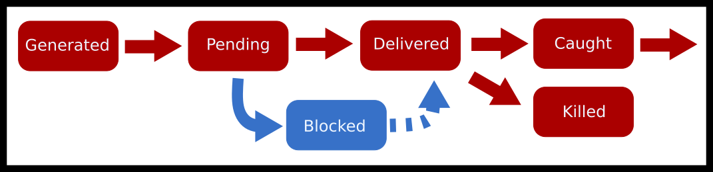

---
bibliography:
- signals/signals.bib
link-citations: true
title: "**CS341 系统编程课程手册**"
---

- [[#^signals|信号]]
  - [[#^the-deep-dive-of-signals|信号深入解析]]
  - [[#^sending-signals|发送信号]]
  - [[#^handling-signals|处理信号]]
    - [[#^sigaction|sigaction]]
  - [[#^blocking-signals|阻塞信号]]
    - [[#^sigwait|sigwait]]
  - [[#^signals-in-child-processes-and-threads|子进程与线程中的信号]]
  - [[#^topics|主题]]
  - [[#^questions|问题]]


# 信号 ^signals

**这就是个信号，Jerry，这就是个信号！\[又打了个响指\] 信号！** — **George Costanza（《宋飞正传》）**

信号是一种便捷的机制，用来传递低优先级信息，也用来在其他手段失效时（例如标准输入被冻结）与用户程序交互。它们让程序能在某个事件发生时进行清理或执行某种动作。程序也可以选择忽略大多数信号，但 `SIGKILL` 和 `SIGSTOP` 是永远无法被捕获、阻塞或忽略的。由于信号被处理的方式，把信号用好的程序并不好写。因此，信号通常只用于终止和清理，极少用于程序逻辑。

对于有体系结构背景的你们：这里说的中断并不是硬件产生的中断。那类中断几乎总是由内核处理的，因为它们需要更高的权限。我们这里讨论的是由内核产生的软件中断——尽管它们可能是对某个硬件事件（比如 SIGSEGV）的响应。

如何读取一个已经退出或已被信号结束的进程（`WIFSIGNALED`、`WTERMSIG` 等）的退出状态，在进程章节的第 <a href="#sec:waiting_and_executing">#sec:waiting_and_executing</a> 节中已有讲解。本章将深入探讨信号究竟是什么、内核如何处理一个信号，以及进程在有无线程的情况下处理信号的各种方式。

## 信号深入解析 ^the-deep-dive-of-signals

信号让一个进程可以异步地向另一个进程发送一个事件或消息。如果那个进程愿意接收该信号，它就可以接收；随后，对大多数信号而言，它还可以决定拿这个信号怎么办。

先说一点术语。信号处置方式（signal disposition）是一个**按进程**划分的属性，它决定信号在被**投递**之后该如何处理。你可以把它想成一张“信号—动作”对照表。完整讨论见
<a href="http://man7.org/linux/man-pages/man7/signal.7.html">http://man7.org/linux/man-pages/man7/signal.7.html</a>。
这些动作是

1.  `TERM`，终止进程

2.  `IGN`，忽略

3.  `CORE`，生成一个 core dump

4.  `STOP`，停止进程

5.  `CONT`，继续进程

6.  执行一个自定义函数。

信号掩码（signal mask）决定某个特定信号是否被投递。内核发送一个信号的完整流程如下。

1.  如果还没有任何信号到达，进程可以安装自己的信号处理程序。这是在告诉内核：当该进程收到信号 X 时，应当跳转到函数 Y。

2.  一个信号被创建之后，处于“已产生”（generated）状态。

3.  从信号产生、到内核能够套用掩码规则之间的这段时间，称为“待处理”（pending）状态。

4.  接着内核检查进程的信号掩码。如果掩码说该进程的所有线程都阻塞了这个信号，那么这个信号当前处于阻塞状态，在某个线程解除阻塞之前什么也不会发生。

5.  如果有任意一个线程能够接收该信号，内核就执行处置表中的那个动作。如果该动作是默认动作，那么就不需要暂停任何线程。

6.  否则，内核通过停下某个线程*当前正在做的任何事情*来投递信号，并把该线程跳转到信号处理程序。信号此时进入已投递（delivered）阶段。现在可以继续产生更多信号，但在信号处理程序完成之前它们无法被投递，处理程序完成时也就是已投递阶段的结束。

7.  最后，如果信号投递之后进程依然完好，我们就认为这个信号被捕获（caught）了。

画成流程图就是

<figure data-latex-placement="H">
<p></p>
<figcaption>信号生命周期图</figcaption>
</figure>

下面是一些你会经常见到的常见信号。

<div class="center">

| 名称 | 可移植编号 | 默认动作 | 常见用途 |
|:--:|:--:|:--:|:--:|
| SIGINT | 2 | 终止（可捕获） | 友好地停止一个进程 |
| SIGQUIT | 3 | 终止（可捕获） | 强硬地停止一个进程 |
| SIGTERM | 15 | 终止进程 | 更强硬地停止一个进程 |
| SIGSTOP | N/A | 停止进程（不可捕获） | 挂起一个进程 |
| SIGCONT | N/A | 继续进程 | 在停止之后恢复运行 |
| SIGKILL | 9 | 终止进程（不可捕获） | 你希望这个进程消失 |

POSIX 信号

</div>

我们最常讲的一个例子是，出于种种原因，绝不要使用 `kill -9`。下面摘自 <u>Useless Use of Kill -9</u>
<a href="http://porkmail.org/era/unix/award.html">http://porkmail.org/era/unix/award.html</a>。

> 不不不。别用 kill -9。
>
> 它不会给进程一个机会去干净地：
>
> 1\) 关闭套接字连接
>
> 2\) 清理临时文件
>
> 3\) 通知它的子进程它要走了
>
> 4\) 重置它的终端属性
>
> 如此等等等等。
>
> 通常来说，先发 15，等上一两秒；如果不管用，就发 2；如果还不管用，就发 1。要是连这也不行，就把那个二进制文件**删掉**吧，因为这个程序行为恶劣！
>
> 别用 kill -9。不要为了收拾一个花盆，就把联合收割机给搬出来。

不过在极端场景下——进程必须立刻消失时——我们仍然保留 `kill -9`。

## 发送信号 ^sending-signals

信号可以有多种产生方式。

1.  用户可以发送信号。例如你在终端上按 `CTRL-C`。也可以用内置的 `kill` 发送任意信号。

2.  系统可以发送一个事件。例如，如果一个进程访问了它不该访问的页面，硬件会产生一个中断，内核会拦截它。内核找出引发该中断的进程，并发送一个软件中断信号 `SIGSEGV`。还有其他内核事件，比如创建了子进程，或者某个进程需要被恢复运行。

3.  最后，另一个进程也可以发送消息。这可以用于进程之间低风险的事件通知。如果你打算依赖信号来驱动你的程序，那么你应该重新审视自己的应用设计。用 POSIX／实时信号做异步通信有很多弊端。处理进程间通信的最佳办法，说到底，还是使用专门为手头任务设计的进程间通信机制。

你或其他进程可以通过给一个运行中的进程发送 `SIGSTOP` 信号来临时暂停它。如果成功，该进程就会被冻结，不会再获得任何 CPU 时间。要让一个进程恢复执行，给它发送 SIGCONT 信号即可。例如，下面这个程序每秒慢慢打印一个点，最多打印到 59 个点。

``` objectivec
#include <unistd.h>
#include <stdio.h>
int main() {
  printf("My pid is %d\n", getpid() );
  int i = 60;
  while(--i) {
    write(1, ".",1);
    sleep(1);
  }
  write(1, "Done!",5);
  return 0;
}
```

我们先在后台启动该进程（注意末尾的 &）。然后在 shell 进程中用 kill 命令给它发送一个信号。

``` bash
$ ./program &
My pid is 403
...
$ kill -SIGSTOP 403
$ kill -SIGCONT 403
...
```

在 C 中，程序可以用 `kill` 这个 POSIX 调用给子进程发送信号，

``` objectivec
kill(child, SIGUSR1); // Send a user-defined signal
kill(child, SIGSTOP); // Stop the child process (the child cannot prevent this)
kill(child, SIGTERM); // Terminate the child process (the child can prevent this)
kill(child, SIGINT); // The equivalent to CTRL-C (by default closes the process)
```

正如上面所见，shell 中还提供了 `kill` 命令。另一个命令 `killall` 的工作方式完全相同，只不过它不是按 PID 查找，而是尝试匹配进程名。`ps` 是一个很有用的工具，可以帮你找到某个进程的 pid。

``` bash
# First let's use ps and grep to find the process we want to send a signal to
$ ps au | grep myprogram
angrave  4409   0.0  0.0  2434892    512 s004  R+    2:42PM   0:00.00 myprogram 1 2 3

#Send SIGINT signal to process 4409 (The equivalent of `CTRL-C`)
$ kill -SIGINT 4409

# Send SIGKILL (terminate the process)
$ kill -SIGKILL 4409
$ kill -9 4409
# Use kill all instead to kill a process by executable name
$ killall firefox
```

要向运行中的进程发送信号，使用 `raise` 或 `kill`，配合 `getpid()`。

``` objectivec
raise(sig); // Send a signal to myself!
kill(getpid(), sig); // Same as above
```

对于非 root 进程，信号只能发给同一用户的进程。你不能对任意进程都 SIGKILL！更多细节见 `man 2 kill`。

## 处理信号 ^handling-signals

信号处理程序内部可执行的代码有着严格的限制。大多数库函数和系统调用都是 `async-signal-unsafe`，也就是说它们不能用在信号处理程序里，因为它们不是可重入（re-entrant）的。可重入安全意味着你的函数可能在任何一点被冻结、然后又被执行一次。你能保证自己的函数不会出问题吗？来看下面这个例子

``` objectivec
void func(const char *str) {
  static char buffer[200];
  strncpy(buffer, str, 199);
  // Here is where we get paused
  printf("%s\n", buffer);
}
```

1.  我们执行 `func("Hello")`

2.  字符串被完整地复制到缓冲区中（strcmp(buffer, "Hello") == 0）

3.  一个信号被投递，函数状态被冻结；我们同时停止接受任何新信号，直到处理程序结束（这么做只是为了方便）

4.  我们执行 `func("World")`

5.  此时（strcmp(buffer, "World") == 0），缓冲区被打印出来，是 "World"。

6.  我们恢复被中断的函数，现在又一次打印出缓冲区内容 "World"，而不是这次函数调用原本想要的 "Hello"

想保证你的函数是信号处理程序安全的，光是移除共享缓冲区是不够的。你还必须考虑多线程和同步——我把同一把互斥锁锁两次会怎样？你还必须确保每次函数调用都是可重入安全的。假设你原来的程序在执行 `malloc` 的库代码时被中断了，那么 malloc 所用的内存结构就会处于不一致状态。此时调用 `printf`（它把 `malloc` 作为信号处理程序的一部分）是不安全的，会导致**未定义行为**。避免这种行为的一种安全做法，是设置一个变量、让程序恢复正常运行之后再处理。这个设计模式同时也有助于我们设计那些能两次收到信号并依然正确工作的程序。

``` objectivec
int pleaseStop ; // See notes on why "volatile sig_atomic_t" is better

void handle_sigint(int signal) {
  pleaseStop = 1;
}

int main() {
  signal(SIGINT, handle_sigint);
  pleaseStop = 0;
  while (!pleaseStop) {
    /* application logic here */
  }
  /* clean up code here */
}
```

上面的代码看起来在纸面上是正确的。然而，我们需要给编译器和将要执行 `main()` 循环的 CPU 核心一些提示。我们必须阻止编译器优化。表达式 `!pleaseStop` 在循环体内并不会改变，所以某些编译器会把它优化成 `true` TODO: **citation needed**。其次，我们需要确保 `pleaseStop` 的值不被缓存在 CPU 寄存器里，而始终从主存读取并写回主存。`sig_atomic_t` 类型意味着该变量的所有位可以被整体读取或修改，作为一个 `atomic operation`——一个不可中断的单次操作。你不可能读到一个由部分新位值和部分旧位值拼合起来的值。

通过用正确的类型 `volatile sig_atomic_t` 指定 `pleaseStop`，我们就能写出可移植的代码，使得主循环会在信号处理程序返回后退出。`sig_atomic_t` 类型在大多数现代平台上可以大到 `int`，但在嵌入式系统上也可能小到 `char`。C 标准只保证：若为有符号类型，则能容纳 -127 到 127；若为无符号类型，则能容纳 0 到 255。

``` objectivec
volatile sig_atomic_t pleaseStop;
```

这种模式有两个例子可以在 `COMP` 中找到，那是一台基于终端的 1Hz 4bit 计算机（<a href="#ref-Sorn_2015">[3]</a>）。它使用了两个布尔标志：一个用来标记 `SIGINT`（CTRL-C）的投递并优雅地关闭程序，另一个用来标记 `SIGWINCH` 信号，以检测终端尺寸变化并重绘整个显示。

你也可以选择异步或同步地处理待处理信号。要安装一个信号处理程序以异步处理信号，使用 `sigaction`。要同步地捕获一个待处理信号，使用 `sigwait`，它会阻塞直到有信号被投递；或者使用 `signalfd`，它同样会阻塞，并提供一个可以被 `read()` 的文件描述符，用来获取待处理的信号。

### sigaction ^sigaction

你应该使用 `sigaction` 而不是 `signal`，因为前者的语义定义得更好。`signal` 在不同操作系统上会做不同的事情，这是**坏事**。`sigaction` 更具可移植性，而且在线程方面的语义定义更清晰。你可以用系统调用 `sigaction` 来设置某个信号当前的处理程序和处置方式，或者读取某个特定信号当前的处理程序。

``` objectivec
int sigaction(int signum, const struct sigaction *act, struct sigaction *oldact);
```

sigaction 结构体包含两个回调函数（我们只看 ‘handler’ 版本）、一个信号掩码和一个标志字段——

``` objectivec
struct sigaction {
  void     (*sa_handler)(int);
  void     (*sa_sigaction)(int, siginfo_t *, void *);
  sigset_t   sa_mask;
  int        sa_flags;
};
```

假设你偶然碰到一段使用 `signal` 的遗留代码。下面这段代码把 `myhandler` 安装为 SIGALRM 处理程序。

``` objectivec
signal(SIGALRM, myhandler);
```

等价的 `sigaction` 代码是：

``` objectivec
struct sigaction sa;
sa.sa_handler = myhandler;
sigemptyset(&sa.sa_mask);
sa.sa_flags = 0;
sigaction(SIGALRM, &sa, NULL);
```

不过，我们通常还会设置掩码和标志字段。这个掩码是在信号处理程序执行期间使用的临时信号掩码。如果处理信号的线程在某个系统调用中途被打断，那么 `SA_RESTART` 标志会自动重启那些原本会以 EINTR 错误提前返回的系统调用。后者的好处是，我们可以让代码的其余部分稍微简化一些，因为不再需要重启循环了。

``` objectivec
sigfillset(&sa.sa_mask);
sa.sa_flags = SA_RESTART; /* Restart functions if interrupted by handler */
```

不过考虑到这个标志的选择性，通常更好的做法还是让代码自己检查错误并自行重启。

## 阻塞信号 ^blocking-signals

要阻塞信号，就用 `sigprocmask`！借助 sigprocmask，你可以设置新的掩码、向进程掩码中新增要阻塞的信号，以及解除当前被阻塞的信号。你也可以通过为 oldset 传入一个非空值来确定（并留存）已有的掩码。

``` objectivec
int sigprocmask(int how, const sigset_t *set, sigset_t *oldset);
```

下面是 Linux sigprocmask 手册页中 `how` 的可能取值 TODO: **cite**。

- `SIG_BLOCK`。阻塞信号集合是当前集合与 set 参数的并集。

- `SIG_UNBLOCK`。set 中的信号会从当前阻塞信号集合中移除。尝试解除一个并未被阻塞的信号是允许的。

- `SIG_SETMASK`。阻塞信号集合被设为参数集合。

sigset 类型的行为就像一个集合。常见错误是：在往集合中添加之前忘了先初始化这个信号集合。

``` objectivec
sigset_t set, oldset;
sigaddset(&set, SIGINT); // Ooops!
sigprocmask(SIG_SETMASK, &set, &oldset);
```

正确的做法是把集合初始化为全开或全关。例如，

``` objectivec
sigfillset(&set); // all signals
sigprocmask(SIG_SETMASK, &set, NULL); // Block all the signals which can be blocked

sigemptyset(&set); // no signals
sigprocmask(SIG_SETMASK, &set, NULL); // set the mask to be empty again
```

如果你用 `sigprocmask` 或 `pthread_sigmask` 阻塞了某个信号，那么用 `sigaction` 注册的处理程序就不会被投递，除非显式地对它 `sigwait'ed`（TODO: **cite**）。

### sigwait ^sigwait

sigwait 可以用来每次读取一个待处理信号。`sigwait` 用于同步地等待信号，而不是在回调中处理它们。下面展示了 sigwait 在多线程程序中的一个典型用法。注意，线程信号掩码是先设置好的（并且会被新线程继承）。该掩码阻止信号被*投递*，因此它们会一直保持待处理状态，直到调用 sigwait。还要注意，同一个集合变量 `sigset_t` 也被 sigwait 使用——只不过它不是用来设置阻塞信号集合，而是作为 sigwait 能够捕获并返回的信号集合。

写一个自定义的信号处理线程（如下例），而不是用回调函数，有一个好处：你现在可以安全地使用多得多的 C 库函数和系统函数。

基于 sigmask 的代码
（<a href="#ref-pthread_sigmask">[2]</a>）

``` objectivec
static sigset_t signal_mask; /* signals to block */

int main(int argc, char *argv[]) {
  pthread_t sig_thr_id; /* signal handler thread ID */
  sigemptyset (&signal_mask);
  sigaddset (&signal_mask, SIGINT);
  sigaddset (&signal_mask, SIGTERM);
  pthread_sigmask (SIG_BLOCK, &signal_mask, NULL);

  /* New threads will inherit this thread's mask */
  pthread_create (&sig_thr_id, NULL, signal_thread, NULL);

  /* APPLICATION CODE */
  ...
}

void *signal_thread(void *arg) {
  int sig_caught;

  /* Use the same mask as the set of signals that we'd like to know about! */
  sigwait(&signal_mask, &sig_caught);
  switch (sig_caught) {
    case SIGINT:
    ...
    break;
    case SIGTERM:
    ...
    break;
    default:
    fprintf (stderr, "\nUnexpected signal %d\n", sig_caught);
    break;
  }
}
```

## 子进程与线程中的信号 ^signals-in-child-processes-and-threads

这是对进程章节的回顾。fork 之后，子进程会继承父进程信号处置方式的一份副本，以及父进程信号掩码的一份副本。如果你在 fork 之前安装了 SIGINT 处理程序，那么当 SIGINT 被投递给子进程时，子进程也会调用该处理程序。如果 `SIGINT` 在父进程中被阻塞，那么在子进程中同样被阻塞。注意，子进程的待处理信号在 fork 过程中*不会*被继承。但在 `exec` 之后，就只有信号掩码和待处理信号会被带过去（<a href="#ref-execute">[1]</a>）。信号处理程序会被重置为它们原本的动作，因为原有的处理程序代码可能已经随旧进程一起消失了。

每个线程都有自己的掩码。新线程会继承调用它的那个线程的掩码的一份副本。在初始化时，调用线程的掩码与进程的掩码完全相同。然而新线程创建之后，进程的信号掩码就变成了一个灰色地带。内核更愿意把进程看作一组线程的集合，每个线程都可以设定自己的信号掩码并接收信号。要开始设置你的掩码，你可以使用

``` objectivec
pthread_sigmask(...); // set my mask to block delivery of some signals
pthread_create(...); // new thread will start with a copy of the same mask
```

在多线程程序中，阻塞信号与单线程程序类似，只是要做如下替换。

1.  用 `pthread_sigmask` 代替 `sigprocmask`

2.  在所有线程中阻塞一个信号，以阻止它被异步投递

要确保某个信号在所有线程中都被阻塞，最简单的办法是在创建新线程之前，先在主线程中设置好信号掩码。

``` objectivec
sigemptyset(&set);
sigaddset(&set, SIGQUIT);
sigaddset(&set, SIGINT);
pthread_sigmask(SIG_BLOCK, &set, NULL);

// this thread and the new thread will block SIGQUIT and SIGINT
pthread_create(&thread_id, NULL, myfunc, funcparam);
```

正如我们在 `sigprocmask` 中看到的，`pthread_sigmask` 包含一个 ‘how’ 参数，用来定义信号集合该如何使用：

``` objectivec
pthread_sigmask(SIG_SETMASK, &set, NULL) - replace the thread's mask with given signal set
pthread_sigmask(SIG_BLOCK, &set, NULL) - add the signal set to the thread's mask
pthread_sigmask(SIG_UNBLOCK, &set, NULL) - remove the signal set from the thread's mask
```

于是一个信号就可以被投递给任何愿意接收它的线程。如果有两个或更多线程都能接收该信号，那么究竟哪个线程被打断就是任意的！一种常见做法是设置一个能接收所有信号的线程；或者如果某个特定信号需要特殊逻辑，就为多个信号分别设置多个线程。虽然程序外部无法向特定线程发送信号，但你在内部可以用 `pthread_kill(pthread_t thread, int sig)` 做到这一点。在下面这个例子中，新创建的线程在执行 `func` 时会被 `SIGINT` 打断。

``` objectivec
pthread_create(&tid, NULL, func, args);
pthread_kill(tid, SIGINT);
pthread_kill(pthread_self(), SIGKILL); // send SIGKILL to myself
```

提醒一句：`pthread_kill(threadid, SIGKILL)` 会杀掉**整个进程**。虽然单个线程可以设置信号掩码，但信号处置方式是*按进程*而非*按线程*的。这意味着 `sigaction` 可以从任意线程调用，因为你设置的是整个进程中所有线程共用的信号处理程序。

Linux 手册页在第 2 节讨论信号相关的系统调用。第 7 节还有一篇更长的文章（不过 OSX/BSD 上没有）：

``` objectivec
man -s7 signal
```

## 主题 ^topics

- 信号

- 信号处理程序安全性

- 信号处置方式

- 信号的状态

- fork/exec 时的待处理信号

- fork/exec 时的信号处置方式

- 在 C 中产生信号

- 在多线程程序中产生信号

## 问题 ^questions

- 什么是信号？

- 在 UNIX 下信号是如何被服务的？（加分项：Windows 呢？）

- 一个函数是“信号处理程序安全的”意味着什么？可重入呢？

- 什么是进程的信号处置方式？它与掩码有何不同？

- 在单线程程序中，用哪个函数改变信号处置方式？在多线程程序中呢？

- 使用信号有哪些缺点？

- 异步和同步地捕获一个信号分别有哪些方式？

- fork 之后待处理信号会怎样？exec 之后呢？那么我的信号掩码呢？信号处置方式呢？

- 内核让一个进程从创建到投递／阻塞，要经历哪些阶段？

<div id="refs" class="references csl-bib-body hanging-indent">

<div id="ref-execute" class="csl-entry">

“Executing a File.” n.d. In *Executing a File (The GNU C Library)*. GNU
Project.
<a href="https://www.gnu.org/software/libc/manual/html_node/Executing-a-File.html#Executing-a-File">https://www.gnu.org/software/libc/manual/html_node/Executing-a-File.html#Executing-a-File</a>.

</div>

<div id="ref-pthread_sigmask" class="csl-entry">

“Pthread_sigmask.” n.d. In *Pthread_sigmask*. IEEE.
<a href="http://pubs.opengroup.org/onlinepubs/009695399/functions/pthread_sigmask.html">http://pubs.opengroup.org/onlinepubs/009695399/functions/pthread_sigmask.html</a>.

</div>

<div id="ref-Sorn_2015" class="csl-entry">

Šorn, Jure. 2015. “Gto76/Comp-Cpp.” In *GitHub*.
<a href="https://github.com/gto76/comp-cpp/blob/1bf9a77eaf8f57f7358a316e5bbada97f2dc8987/src/output.c">https://github.com/gto76/comp-cpp/blob/1bf9a77eaf8f57f7358a316e5bbada97f2dc8987/src/output.c</a>.

</div>

</div>
