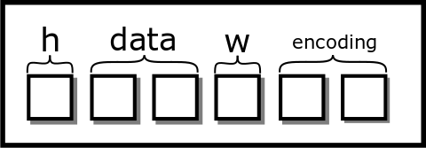
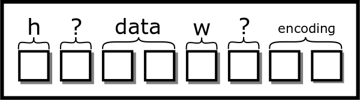

---
bibliography:
- appendix/appendix.bib
link-citations: true
title: "**CS341 系统编程课程手册**"
---

- [[#^appendix|附录]]
  - [[#^shell|Shell]]
    - [[#^shell-tricks-and-tips|Shell 技巧与提示]]
    - [[#^whats-a-terminal|什么是终端？]]
    - [[#^common-utilities|常用工具]]
    - [[#^syntactic|语法糖]]
    - [[#^what-are-environment-variables|什么是环境变量？]]
  - [[#^stack-smashing|栈溢出攻击]]
  - [[#^compiling-and-linking|编译与链接]]
  - [[#^bankers-algorithm|银行家算法]]
  - [[#^cleandirty-forks-chandymisra-solution|干净／脏的分叉（Chandy/Misra
    解法）]]
  - [[#^actor-model|Actor 模型]]
  - [[#^includes-and-conditionals|包含与条件编译]]
    - [[#^thread-scheduling|线程调度]]
  - [[#^threads-h|threads.h]]
  - [[#^modern-filesystems|现代文件系统]]
    - [[#^cutting-edge-file-systems|前沿文件系统]]
  - [[#^linux-scheduling|Linux 调度]]
    - [[#^implementing-software-mutex|实现软件互斥锁]]
  - [[#^the-curious-case-of-spurious-wakeups|虚假唤醒的奇案]]
  - [[#^condition-wait-example|条件变量等待示例]]
  - [[#^implementing-cvs-with-mutexes-alone|仅用互斥锁实现条件
    变量]]
  - [[#^higher-order-models-of-synchronization|同步的高阶
    模型]]
    - [[#^sequentially-consistent|顺序一致]]
    - [[#^relaxed|宽松]]
    - [[#^acquirerelease|获取／释放]]
    - [[#^consume|消费]]
  - [[#^actor-model-and-goroutines|Actor 模型与 goroutine]]
  - [[#^sec-scheduling-conceptually|从概念上理解调度]]
    - [[#^first-come-first-served|先来先服务]]
    - [[#^round-robin-or-processor-sharing|时间片轮转或处理机
      共享]]
    - [[#^non-preemptive-priority|非抢占式优先级]]
    - [[#^shortest-job-first|短作业优先]]
    - [[#^preemptive-priority|抢占式优先级]]
    - [[#^preemptive-shortest-job-first|抢占式短作业优先]]
  - [[#^networking-extra|网络补充]]
    - [[#^in-depth-ipv4-specification|深入理解 IPv4 规范]]
    - [[#^routing|路由]]
    - [[#^fragmentationreassembly|分片／重组]]
    - [[#^ip-multicast|IP 组播]]
    - [[#^kqueue|kqueue]]
  - [[#^assorted-man-pages|各类 man 手册页面]]
    - [[#^man-malloc|Malloc]]
  - [[#^system-programming-jokes|系统编程笑话]]
    - [[#^light-bulb-jokes|换灯泡笑话]]
    - [[#^groaners|冷笑话]]
    - [[#^system-programmer-definition|系统程序员（定义）]]


# 附录 ^appendix

## Shell ^shell

shell 其实就是你将要与系统交互的方式。
在用户友好的操作系统出现之前，计算机启动之后你
唯一能用的就是一个 shell。这意味着你所有的命令和
编辑都得用这种方式完成。如今我们的计算机以
桌面模式启动，但你仍然可以用终端
访问 shell。

``` bash
(Stuff) $
```

它已经准备好接收你的下一条命令了！你可以输入很多 Unix
工具，比如 `ls`、`echo Hello`，shell 会执行它们并
把结果告诉你。其中一些就是所谓的
`shell-builtins`，意思是这些代码就在 shell 程序本身里。
另一些则是你运行的编译好的程序。shell 只会查看一个
叫作 PATH 的特殊变量，它包含一份用冒号
分隔的路径列表，用来按名字查找可执行文件，下面是一个
PATH 的例子。

``` bash
$ echo $PATH
/usr/local/sbin:/usr/local/bin:/usr/sbin:
/usr/bin:/sbin:/bin:/usr/games:/usr/local/games
```

所以当 shell 执行 `ls` 时，它会遍历所有那些
目录，找到 `/bin/ls` 并执行它。

``` bash
$ ls
...
$ /bin/ls
```

你随时可以用完整路径来调用。这也就解释了为什么在
以前的课程中，如果你想在终端上运行某个东西，
你不得不写 `./exe`，因为通常你当前所在的
目录并不在 `PATH` 变量里。`.` 会展开成
你当前的目录，于是你的 shell 执行 `<current_dir>/exe`，这是一个合法的命令。

### Shell 技巧与提示 ^shell-tricks-and-tips

- 向上箭头会调出你最近一条命令

- `ctrl-r` 会搜索你之前运行过的命令

- `ctrl-c` 会中断你 shell 当前的进程

- `!!` 会执行上一条命令

- `!<num>` 会回退那么多条命令并运行它

- `!<prefix>` 会运行具有该前缀的最后一条命令

- `!$` 是上一条命令的最后一个参数

- `!*` 是上一条命令的所有参数

- `p̂atŝub` 取出上一条命令，并把模式 pat 替换为
  替换串 sub

- `cd -` 回到上一个目录

- `pushd <dir>` 把当前目录压入栈并切换过去

- `popd` 切换到栈顶的目录

### 什么是终端？ ^whats-a-terminal

终端是一个显示 shell 输出的应用程序。
你可以有你的默认终端、基于 quake 的终端、terminator，
选择多得数不清！

### 常用工具 ^common-utilities

1.  `cat` 拼接多个文件。它经常被用来把
    文件内容打印到终端上，但它最初的用途是
    拼接。

    ``` bash
    $ cat file.txt
    ...
    $ cat shakespeare.txt shakespeare.txt > two_shakes.txt
    ```

2.  `diff` 告诉你两个文件有什么不同。如果什么都没
    打印出来，就返回零，意思是两个文件逐字节
    相同。否则会打印出最长公共子序列的差异

    ``` bash
    $ cat prog.txt
    hello
    world
    $ cat adele.txt
    hello
    it's me
    $ diff prog.txt prog.txt
    $ diff shakespeare.txt shakespeare.txt
    2c2
    < world
    ---
    > it's me
    ```

3.  `grep` 告诉你文件或标准输入中哪些行匹配某个
    POSIX 模式。

    ``` bash
    $ grep it adele.txt
    it's me
    ```

4.  `ls` 告诉你当前目录下有哪些文件。

5.  `cd` 这是一个 shell 内建命令，但它会切换到
    相对或绝对目录

    ``` bash
    $ cd /usr
    $ cd lib/
    $ cd -
    $ pwd
    /usr/
    ```

6.  `man` 每个系统程序员最喜欢的命令，能告诉你更多
    关于你那些最爱的函数的信息！

7.  `make` 按照 makefile 执行程序。

### 语法糖 ^syntactic

shell 有很多好用的工具，比如用重定向 `>` 把
一些输出保存到文件。这会从开头覆盖该文件。如果
你只是想把内容追加到文件末尾，可以用 `>>`。Unix 还允许
文件描述符交换。这意味着你可以把送往某个
文件描述符的输出，看起来像是从另一个
描述符里出来的。最常见的是 `2>&1`，意思是取
stderr 并让它看起来像是从 standard out 里出来的。这一点很重要，
因为当你使用 `>` 和 `>>` 时，它们只写文件的标准输出。
下面有一些例子。

``` bash
$ ./program > output.txt # To overwrite
$ ./program >> output.txt # To append
$ ./program 2>&1 > output_all.txt # stderr & stdout
$ ./program 2>&1 > /dev/null # don't care about any output
```

管道运算符有一段迷人的历史。UNIX 哲学是
写小程序并把它们串起来，从而做出新的、
有趣的东西。在早期，硬盘空间很有限，
写入速度也很慢。Brian Kernighan 想在不
使用占用硬盘空间的中间文件的前提下
坚持这一哲学。于是 UNIX 管道诞生了。管道取左侧程序的
`stdout`，喂给右侧程序的 `stdin`。考虑命令 `tee`。
它可以用来替代重定向运算符，因为 tee 既会写入文件，
又会输出到 standard out。它还有一个额外好处：
它不必是命令列表中的最后一条。也就是说，
你可以写下一个中间结果，然后继续你的管道。

``` bash
$ ./program | tee output.txt # Overwrite
$ ./program | tee -a output.txt # Append
$ head output.txt | wc | head -n 1 # Multi pipes
$ ((head output.txt) | wc) | head -n 1 # Same as above
$ ./program | tee intermediate.txt | wc
```

`&&` 和 `||` 运算符顺序执行命令。`&&` 只在
上一条命令成功时才执行下一条，而 `||`
只在上一条命令失败时才执行下一条。

``` bash
$ false && echo "Hello!"
$ true && echo "Hello!"
$ false || echo "Hello!"
```

### 什么是环境变量？ ^what-are-environment-variables

每个进程都会得到自己的一份环境变量字典，并
被复制给子进程。也就是说，如果父进程修改了
它们的环境变量，这个修改不会传给子进程，反之
亦然。如果你想用与父进程（或
其他任何进程）不同的环境变量来 exec 一个程序，
那么在 fork-exec-wait 这套组合里这一点很重要。

例如，你可以写一个 C 程序，遍历所有
时区并执行 `date` 命令，把所有 locale 下的日期和
时间都打印出来。环境变量被各种
程序使用，所以修改它们很重要。

#### 结构体打包 ^struct-packing

结构体可能需要某种叫作
<a href="http://www.catb.org/esr/structure-packing/">http://www.catb.org/esr/structure-packing/</a>
的东西（教程）。**本课程不要求你们对结构体做打包，只需知道
编译器会替你做**。这是因为在早期（甚至
现在），把一个地址加载到内存中是以 32 位或 64 位的块
为单位的。这也意味着被请求的地址必须是块大小的
整数倍。

``` objectivec
struct picture{
  int height;
  pixel** data;
  int width;
  char* encoding;
}
```

你以为这个结构体长这样。一个盒子就是四字节。

<figure id="fig:clean_struct" data-latex-placement="H">
<p></p>
<figcaption>六个盒子的结构体</figcaption>
</figure>

不过有了结构体打包之后，概念上它会长这样：

``` objectivec
struct picture{
  int height;
  char slop1[4];
  pixel** data;
  int width;
  char slop2[4];
  char* encoding;
}
```

在视觉上，我们会在这张图里加上两个额外的盒子

<figure id="fig:sloppy_struct" data-latex-placement="H">
<p></p>
<figcaption>八个盒子的结构体，两个盒子的空隙</figcaption>
</figure>

这种填充在 64 位系统上很常见。有时候，处理器
支持非对齐访问，于是编译器就可以自由地打包结构体。
这是什么意思？我们可以让一个变量从非 64 位
边界开始。处理器会自己搞定剩下的部分。要启用
这一点，就设置一个属性。

``` objectivec
struct __attribute__((packed, aligned(4))) picture{
  int height;
  pixel** data;
  int width;
  char* encoding;
}
```

现在我们的图就会长得像图 <a href="#fig:clean_struct">#fig:clean_struct</a> 中那个干净的结构体。
但现在，每当处理器需要访问 `data` 或 `encoding` 时，都需要
两次内存访问。另一种可能的做法是重新排列结构体。

``` objectivec
struct picture{
  int height;
  int width;
  pixel** data;
  char* encoding;
}
```

## 栈溢出攻击 ^stack-smashing

每个线程都使用一块栈内存。栈是"向下增长"的——
如果一个函数调用另一个函数，栈就会向更小的
内存地址扩展。栈内存包括非静态的自动（临时）
变量、参数值以及返回地址。如果某个缓冲区对于
某些数据（例如来自用户的输入值）来说太小了，
那么其他栈变量甚至返回地址
都很有可能被覆盖。栈内容的精确布局以及
自动变量的顺序依赖于体系结构和编译器。
只要做一点调查性的工作，我们就能学会如何针对特定
体系结构蓄意破坏栈。

下面的例子演示了返回地址是如何存储在
栈上的。对于某个特定的 32 位体系结构
<a href="http://cs-education.github.io/sys/">http://cs-education.github.io/sys/</a>，
我们确定返回地址存储在自动变量地址之上两个
指针（8 字节）的位置。代码故意修改
栈上的值，使得当输入函数
返回时，它不是在 main 方法内部继续，而是跳转到
exploit 函数。

``` objectivec
// Overwrites the return address on the following machine:
// http://cs-education.github.io/sys/
#include <stdio.h>
#include <stdlib.h>
#include <unistd.h>

void breakout() {
  puts("Welcome. Have a shell...");
  system("/bin/sh");
}
void input() {
  void *p;
  printf("Address of stack variable: %p\n", &p);
  printf("Something that looks like a return address on stack: %p\n", *((&p)+2));
  // Let's change it to point to the start of our sneaky function.
  *((&p)+2) = breakout;
}
int main() {
  printf("main() code starts at %p\n",main);

  input();
  while (1) {
    puts("Hello");
    sleep(1);
  }

  return 0;
}
```

计算机绕过这一点的
方式有
<a href="https://en.wikipedia.org/wiki/Stack_buffer_overflow">https://en.wikipedia.org/wiki/Stack_buffer_overflow</a>
种。

## 编译与链接 ^compiling-and-linking

这是一个高层次概览：从你编译程序
到运行程序。我们都知道编译程序
很容易：你在 IDE 或终端里跑一下程序，它就
好了。

``` bash
$ cat main.c
#include <stdio.h>

int main() {
    printf("Hello World!\n");
    return 0;
}
$ gcc main.c -o main
$ ./main
Hello World!
$
```

下面是 gcc 编译的大致阶段。

1.  预处理：预处理器展开所有预处理指令。

2.  解析：编译器解析这个文本文件中的函数
    声明、变量声明等等。

3.  汇编生成：编译器在（如果启用了）做一些优化之后，
    为所有函数生成汇编代码。

4.  汇编：汇编器把汇编变成 0 和 1，并
    创建一个目标文件。这个目标文件把名字映射到
    代码片段。

5.  静态链接：链接器随后拿一系列目标文件和静态
    库，解析一个目标文件到另一个目标文件的
    变量和函数引用。链接器然后找到 main 方法，
    把它作为入口点。链接器还会
    注意到某个函数是要被动态链接的。
    编译器还会在可执行文件里创建一个节，告诉
    操作系统这些函数在运行前需要地址。

6.  动态链接：当程序准备被执行时，
    操作系统查看程序需要哪些库，
    并把那些函数链接到动态库上。

7.  程序被运行。

后面的课程会教你关于解析和汇编的内容——
预处理只是解析的延伸。不过大多数课程不会教你
这两种不同的链接方式。静态链接一个
库类似于把目标文件合并起来。要创建一个静态
库，编译器会把不同的目标文件合并成一个
可执行文件。静态库实际上就是一份目标文件的归档。
当你想让可执行文件更安全（你清楚
哪些代码被包含了进去）、并且可移植（所有
代码都打包在你的可执行文件里，意味着不需要
额外安装）时，这些库就很有用。

另一种是动态库。通常动态库是
按用户或按系统安装的，大多数程序都能
访问。动态库中的函数会在它们运行前
被填入。这有很多好处。

- C 标准库这类常用库的代码占用更小

- 后期绑定意味着更通用的代码，以及对特定
  行为的依赖更少。

- 差异化意味着共享库可以在保持
  可执行文件不变的情况下被更新。

它也有不少缺点。

- 所有代码不再打包进你的程序。这意味着
  用户必须安装别的东西。

- 别的代码里可能存在安全漏洞，从而导致
  你的程序被安全利用。

- 标准 Linux 允许你"替换"动态库，这可能导致
  社会工程攻击。

- 这给你的应用增加了额外复杂度。两个相同
  的二进制文件配上不同的共享库，可能
  产生不同的结果。

#### Fork-FILE 问题详解 ^explanation-of-the-fork-file-problem

要解析
<a href="http://pubs.opengroup.org/onlinepubs/9699919799.2008edition/functions/V2_chap02.html">http://pubs.opengroup.org/onlinepubs/9699919799.2008edition/functions/V2_chap02.html</a>，
我们得深入到这些术语里。那句定下基调的话
是下面这句

> 任何涉及某一个句柄（"活动句柄"）的函数调用的结果
> 在 POSIX.1-2008 的本卷中另有定义，但如果
> 使用了两个或更多句柄，且其中任意一个是流，那么
> 应用必须确保它们的动作按下文所述
> 相互协调。如果不这样做，结果是未定义的。

这意味着，如果我们在跨进程使用两个指向同一
文件描述的文件描述符时没有严格遵守 POSIX，
就会得到未定义行为。严格地说，文件
描述符必须有一个"位置"，也就是说它需要
像文件那样有开头和结尾，而不是像任意的字节流。
接着 POSIX 引入了"活动句柄"的概念，其中
句柄可以是文件描述符，也可以是 `FILE*` 指针。文件句柄
没有一个叫"活动"的标志。活动文件描述符是指
当前正被用于读写和其他操作（比如 `exit`）的那个。
标准规定，在 `fork` 之前，
*应用*（也就是你的代码）必须执行一系列步骤来准备
文件的状态。简化地说，该描述符需要被
关闭、刷新，或者被读到末尾——那些血腥的细节
稍后再讲。

> 为使一个句柄成为活动句柄，应用必须确保
> 在最后一次使用该句柄（当前的活动句柄）
> 与第一次使用第二个句柄（未来的活动句柄）
> 之间执行了下面这些动作。此后第二个句柄就成为
> 活动句柄。应用在第一个句柄上所有影响文件
> 偏移的活动都应被挂起，直到它再次成为
> 活动文件句柄为止。（如果某个流函数的
> 底层函数会影响文件偏移，则应认为该流函数
> 影响了文件偏移。）

总而言之，如果两个进程都主动使用指向同一
打开文件描述的句柄，结果就是未定义的。另一条
注意事项是：fork 之后，库代码必须准备好
文件描述符，就仿佛另一个进程随时都可能
使该文件成为活动的一样。最后一条
注意事项讲的是在我们的场景中
一个进程如何准备文件描述符。

> 如果该流以允许读的模式打开，且
> 底层的打开文件描述指向一个能够
> seek 的设备，那么应用应当执行一次 fflush()，或者
> 关闭该流。

文档说子进程需要执行 fflush 或
关闭该流，因为文件描述符需要做好准备，
以防父进程需要使它成为活动句柄。如果 glibc
关闭了一个父进程可能期望仍然打开的文件描述符，
它就陷入了无解的境地，因此它选择在退出时
执行 fflush，因为按 POSIX 术语，exit 就算
访问文件。这就意味着这一条款对我们的父
进程来说会被触发。

> 如果先前任何活动句柄都被一个
> 明确改变了文件偏移的函数使用过——除了上面
> 为第一个句柄所要求的情形之外——那么应用应当
> 执行一次 lseek() 或 fseek()（视句柄类型而定）
> 移到一个合适的位置。

由于子进程调用了 fflush 而父进程没有做准备，
操作系统就自行决定把文件重置到哪里。不同的文件
系统会有不同的做法，而标准都支持这些做法。
操作系统可能查看修改时间并断定文件没有
变化因而无需重置；也可能断定 exit 表示有
变化，于是需要把文件倒回开头。

## 银行家算法 ^bankers-algorithm

我们可以从单一资源的银行家算法开始。设想一位
银行家，她手上有有限的钱。只要钱是有限的，
她就愿意放贷，并最终把钱收回来。假设
我们有一组 $$ n $$ 个人，每个人都有一个
定好的额度或上限 $$ a_i $$（$$ i $$ 是第 $$ i $$ 个
进程），他们必须先拿到这些额度才能开始工作。
银行家记录着她已经给了每个人多少 $$ l_i $$。
她始终在自己手上保留一笔钱 $$ p $$。人们
要申请资金时，会做如下的事：考虑系统在
$$ (A=\{a_1, a_2, ...\}, L_t=\{l_{t,1}, l_{t,2}, ...\}, p) $$，发生在时刻 $$ t $$。一个前置条件是
我们手上有 $$ p ≥min(A) $$，也就是说我们有
足够的钱满足至少一个人。另外，每个人都会工作
有限的一段时间并把钱还给我们。

- 某个人 $$ j $$ 向我申请 $$ m $$

  - 如果 $$ m ≥p $$，就拒绝他。

  - 如果 $$ m + l_j > a_i $$，也拒绝他

  - 假装我们进入了一个新状态
    $$ (A, L_{t+1}=\{.., l_{t+1, j} = l_{t, j} + m, ...\}, p - m) $$
    其中该进程获得了资源。

- 如果现在某个人 $$ j $$ 要么已经满足（$$ l_{t+1,j} == a_j $$），要么
  $$ min(a_i - l_{t+1, i}) ≤p $$。换句话说，我们有足够的钱
  再满足一个人。如果是其中之一，就认为这笔交易是安全的，
  把钱给他们。

这为什么行得通？一开始我们处在一个安全状态——
其定义是我们有足够的钱满足至少一个人。每一次
这样的"放贷"都会得到一个安全状态。如果我们耗尽了
准备金，就有一个人在工作，他会还给我们一笔
大于或等于之前那笔"放贷"的钱，从而让我们
再次回到安全状态。既然我们总能
再走一步，系统就永远不会死锁。不过，
无法保证系统不会活锁。如果我们希望
某个进程来申请东西却始终不来，那么就不会有任何工作
被完成—— 但这不是死锁。这个类比可以扩展到更高数量级，
但它要求要么一个进程能完全完成它的工作，
要么存在一个进程，其资源组合能够被满足，
这让算法稍微复杂了一点（多一个 for 循环），
但也不算太糟。它有一些明显的缺点。

- 程序首先需要知道每个进程需要多少
  某种资源。很多时候这是不可能的，或者进程会申请
  错误的数量，因为程序员没有预见到这一点。

- 系统可能活锁。

- 我们知道在大多数系统中资源是有差异的，比如
  管道和套接字。这意味着对拥有数百万种资源的
  系统，该算法的运行时间可能很慢。

- 此外，它无法跟踪那些时有时无的资源。
  一个进程可能把删除某个资源作为副作用，或者创建某个资源。
  该算法假定分配是静态的，并且每个进程
  执行的操作都是非破坏性的。

## 干净／脏的分叉（Chandy/Misra 解法） ^cleandirty-forks-chandymisra-solution

还有许多更高级的解法。其中一个是 Chandy
和 Misra 提出的
（<a href="#ref-Chandy:1984:DPP:1780.1804">[1]</a>）。
这不是餐 philosophers 问题（哲学家进餐问题）的真正解法，
因为它有着哲学家之间能够互相说话这一
要求。它是一个针对某种"公平"含义
保证公平的解法。本质上，它定义了一系列
轮次：一位哲学家在进入下一轮之前，必须在
给定的轮次里完成进食。

我们不会在这里详述证明，因为它稍微复杂一些，
但你可以自行阅读更多内容。

## Actor 模型 ^actor-model

actor 模型是另一种同步形式，它不必
去协商锁或等待。想法很简单。每个
actor 可以执行工作、创建更多 actor、发送消息，或者
响应消息。每当一个 actor 需要从另一个
actor 那里得到什么，它就发一条消息。最重要的是，
一个 actor 只对一件事负责。如果我们
要实现一个真实世界的应用，可能会
有一个负责数据库的 actor，一个
负责入站连接的 actor，一个为这些连接
提供服务的 actor，等等。这些 actor 会
互相传递消息，比如入站连接 actor
向服务 actor 发送"有一个新连接"。
服务 actor 可能向数据库
actor 发送一条数据请求消息，然后回来一条数据响应消息。

虽然这看起来是完美的方案，但也有缺点。
第一个是实际的通信库需要被同步。
如果你没有一个已经做这件事的框架——比如 Message
Passing Interface，或用于高性能计算的 MPI——那么
这个框架就得自己造，而且高效地造出它
很可能和直接同步一样费劲。此外，每条
消息都得由发送方序列化、由接收方反序列化——
或者至少要被复制进出邮箱。而最后
一个缺点是，一个 actor 可能要花任意长的时间
才回复一条消息，这就催生了对"影子 actor"的需求，
由它们来处理同样的工作。

如前所述，有一些框架，比如
<a href="https://en.wikipedia.org/wiki/Message_Passing_Interface">https://en.wikipedia.org/wiki/Message_Passing_Interface</a>，
它在一定程度上基于 actor 模型，并让高性能计算中的
分布式系统得以高效运作，但效果如何
因人而异。如果你想进一步了解这个模型，
可以随意看看下面列出的维基百科页面。
<a href="https://en.wikipedia.org/wiki/Actor_model">https://en.wikipedia.org/wiki/Actor_model</a>

## 包含与条件编译 ^includes-and-conditionals

预处理器另一个 include 相关的构造就是 `#include` 指令和
条件编译。include 指令将通过例子来解释。

``` objectivec
// foo.h
int bar();
```

这是我们未经预处理的 `bar.c` 文件。

``` objectivec
#include "foo.h"
int bar() {
}
```

预处理之后，编译器看到的是这样

``` objectivec
// foo.c unpreprocessed
int bar();

int bar() {

}
```

另一个工具是预处理器条件编译。如果某个宏已定义
或为真，就会走那个分支。

``` objectivec
int main() {
  #ifdef __GNUC__
  return 1;
  #else
  return 0;
  #endif
}
```

使用 `gcc`，你的编译器会把源码预处理成下面这样。

``` objectivec
int main() {
  return 1;
}
```

使用 `clang`，你的编译器会预处理成这样。

``` objectivec
int main() {
  return 0;
}
```

### 线程调度 ^thread-scheduling

拆分工作的方式有几种。这些在 OpenMP 框架
（<a href="#ref-silberschatz2005operating">[4]</a>）中很常见。

- `static scheduling` 把问题拆成固定大小的块
  （预先确定），并让每个线程处理每个块。当
  各子问题耗时大致相同时，这种方式效果很好，
  因为没有额外开销。你要做的只是写一个
  循环，把 map 函数作用于每个子数组。

- `dynamic scheduling` 一旦有新问题可用，就让一个
  线程去处理它。当你不确定调度要花
  多久时这很有用。

- `guided scheduling` 这是上面两者的混合，兼有两者的
  优点和取舍。你从静态调度开始，必要时
  慢慢转向动态调度。

- `runtime scheduling` 你完全不知道这些问题
  要花多久。与其自己决定，不如让程序
  来决定该做什么！

不过这些调度例程你不必记住。OpenMP 是
一个标准，是 pthreads 的替代方案。例如，下面是把
一个 for 循环并行化的方法

``` objectivec
#pragma omp parallel for
for (int i = 0; i < n; i++) {
  // Do stuff
}

// Specify the scheduling as follows
// #pragma omp parallel for scheduling(static)
```

静态调度会把问题划分成固定大小的块。
动态调度会在循环结束后给出一个作业。引导
调度是带分块的动态调度。运行时调度则是一团乱麻。

## threads.h ^threads-h

我们在补充章节里讨论过很多线程库。我们有
标准的 POSIX 线程、OpenMP 线程，还有一个
内置于标准之中的全新 C11
线程库。这个库提供的功能是受限的。

为什么要用受限的功能？关键在名字。既然这是
C 标准库，它就必须在所有符合标准的
操作系统中实现，而那基本上就是所有操作系统。
这意味着使用线程时有一等的可移植性。

我们不会逐一罗列这些函数。它们大多本来就是
pthread 函数的改名。如果你问我们为什么不教这些，
有几个原因

1.  它们相当新。尽管这个标准大约在
    2011 年就发布了，POSIX 线程却一直存在。
    它们大量的怪异之处都已经被磨平了。

2.  你会损失表达力。这是我们会在
    后面章节讨论的一个概念，但当你把某样东西做成
    可移植的，你也就相对于宿主硬件损失了一部分
    表达力。这意味着 threads.h
    库相当简陋。要设置 CPU 亲和性很难。
    把线程调度到一起。为了性能原因
    高效地查看其内部实现。

3.  大量遗留代码已经是照着 POSIX 线程来写的。
    OpenMP、CUDA、MPI 这些其他库要么使用 POSIX
    进程，要么使用 POSIX 线程，只是很不情愿地移植到 Windows。

## 现代文件系统 ^modern-filesystems

尽管多年来大多数文件系统的 API 在 POSIX 上
一直保持不变，但文件系统本身提供了许多
重要特性。

- 数据完整性。文件系统使用日志，有时也用校验和，来
  确保写入的数据是有效的。日志是一个很简单的
  发明：文件系统把一次操作写入日志。如果
  文件系统在操作完成之前崩溃，它可以在
  再次启动时利用部分完成的日志恢复该
  操作。

- 缓存。Linux 把文件系统操作（比如
  查找 inode）缓存得很好。这让磁盘操作看起来几乎是瞬时的。如果你想
  看看慢的系统，去看看用 FAT/NTFS 的 Windows。磁盘
  操作需要由应用来缓存，否则它会烧光
  CPU。

- 速度。在机械硬盘机器上，靠近金属盘片
  外缘的数据转得更快（角速度离
  中心更远）。一些程序会利用这一点来减少
  在视频编辑软件中加载电影这类大文件的
  时间。SSD 没有这个
  问题，因为没有旋转的磁盘，但它们会划出一部分
  空间用作文件的"交换空间"。

- 并行性。拥有多个磁头（对物理硬盘而言）
  或多个控制器（对 SSD 而言）的文件系统
  可以通过在 PCIe 插槽上多路复用数据来利用并行性，
  只要有可能就始终为应用
  提供一些数据。

- 加密。数据可以用一个或多个密钥加密。一个很好的
  例子是 Apple 的 APFS 文件系统。

- 冗余。有时数据可以被复制到多个块上，以确保
  数据始终可用。

- 高效备份。我们很多人的数据出于某种原因
  无法存到云上。当一个文件系统
  被用作备份介质、或者是备份的源时，
  能够高效地算出变化了什么、压缩
  文件，并在外部硬盘之间同步，这是很有用的。

- 完整性与可启动性。文件系统需要对
  比特翻转有韧性。大多数读者把操作系统
  和他们用来做各种操作的文件系统装在同一个
  分区上。文件系统需要确保一次意外读写
  不会破坏引导扇区—— 也就是说你的电脑
  不能再启动。

- 碎片。正像内存分配器一样，为一个
  文件分配空间会同时产生内部碎片和外部碎片。当单个文件的磁盘块
  彼此相邻时，同样的缓存收益也会出现。
  文件系统需要在低碎片、高碎片
  以及可能存在碎片的使用场景下都表现良好。

- 分布式。有时文件系统应当在单机层面具备
  容错能力。Hadoop 和其他分布式文件系统让你
  能够做到这一点。

### 前沿文件系统 ^cutting-edge-file-systems

如今有一些真正处于前沿的文件系统硬件技术。
我们想简要介绍的是 AMD 的 StoreMI。我们
并不是在推销 AMD 芯片组，但 StoreMI 的
功能集值得一谈。

StoreMI 是一块硬件微控制器，它分析操作系统
如何访问文件，并搬动文件／块以缩短加载
时间。可以想象的一种常见用法是：有一块
快速但容量小的 SSD 和一块较慢、容量大的 HDD。为了让
所有文件看起来都在 SSD 上，StoreMI 会匹配文件访问的模式。
如果你在启动 Windows，Windows 往往会
以相同的顺序访问许多文件。StoreMI 会注意到这一点，
当微控制器发现系统正在启动时，它会在操作系统
请求之前把文件从 HDD 移到
SSD。等操作系统需要它们时，它们已经在 SSD 上了。
StoreMI 对其他应用也会这么做。这项技术
仍然有很多不足之处，但它是数据与模式匹配
在文件系统上一个有趣的交叉。

## Linux 调度 ^linux-scheduling

截至 2016 年 2 月，Linux 默认使用*完全公平
调度器*做 CPU 调度，并用预算公平调度“BFQ”做
I/O 调度。合适的调度对
吞吐量和延迟都有显著影响。延迟对交互式
和软实时的应用（比如音频和视频流）很重要。更多信息请见
下面的讨论和对比基准测试
<a href="https://lkml.org/lkml/2014/5/27/314">https://lkml.org/lkml/2014/5/27/314</a>。

下面是 CFS 的调度方式

- CPU 创建一棵红黑树，键是进程的虚拟运行时间
  （运行时间 / nice_value）以及睡眠者公平标志—— 如果进程正在
  等待某件事，那么等它等完之后就把 CPU 给它。

- nice 值是内核用来给某些
  进程赋予优先级的手段，nice 值越低优先级越高。

- 内核根据这个指标选出最小的一个，调度
  该进程下一步运行，把它从队列中取出。由于红黑
  树是自平衡的，这个操作保证是 $$ O(log(n)) $$
  的（选出最小进程是同样的运行时间）

尽管它叫公平调度器，但它还是有相当多的
问题。

- 被调度的进程组负载可能不均衡，因此
  调度器只是粗略地分摊负载。当另一个 CPU 空闲
  时，它只能看某个组的平均调度负载，而不是
  单个核心。所以只要平均值还行，那个空闲的 CPU
  可能就不会去接手某个正在满负荷运转的 CPU 的工作。

- 如果一组进程运行在不相邻的核心上，那就
  是个 bug。如果两个核心相隔超过一跳，负载均衡
  算法甚至不会考虑那个核心。也就是说，如果某个 CPU 空闲
  而某个干更多活的 CPU 离它超过一跳，它不会去接
  那份工作（可能已经打了补丁）。

- 当一个线程在某个核心子集上睡去后，醒来时
  它只能被调度到它当初睡着的那些核心上。如果那些
  核心现在很忙，线程就只能在上面干等，浪费了
  使用其他空闲核心的机会。

- 想更多了解公平调度器的问题，请阅读
  <a href="https://blog.acolyer.org/2016/04/26/the-linux-scheduler-a-decade-of-wasted-cores">https://blog.acolyer.org/2016/04/26/the-linux-scheduler-a-decade-of-wasted-cores</a>。

### 实现软件互斥锁 ^implementing-software-mutex

像 Peterson 算法这样的纯软件互斥锁，在真实
系统中会被用到吗？会！稍加搜索就能发现，
今天的某些简单移动处理器上，Peterson 算法
就用在生产环境中。Peterson 算法被用来
实现 Tegra 移动处理器（Nvidia 的一个片上系统，
集成了 ARM 处理器和 GPU 核心）上 Linux 内核的
底层锁
<a href="https://android.googlesource.com/kernel/tegra.git/+/android-tegra-3.10/arch/arm/mach-tegra/sleep.S#58">https://android.googlesource.com/kernel/tegra.git/+/android-tegra-3.10/arch/arm/mach-tegra/sleep.S#58</a>

总的来说，CPU 和 C 编译器可以重排 CPU 指令，
或者使用 CPU 核心本地的、可能已被其他核心
更新共享变量后失效的缓存值。因此，一份
从伪代码到 C 实现的简单转换对大多数平台来说
都太天真了。警告，前方有龙！把这个进阶而棘手的话题
当作一个挑战来考虑，但（剧透警告）
结局是圆满的。考虑下面这段代码，

``` objectivec
while(flag2) { /* busy loop - go around again */
```

一个高效的编译器会推断出 `flag2` 变量在循环内部
从不会被改变，于是那次测试可以被优化成 `while(true)`。使用
`volatile` 可以在一定程度上阻止这类编译器优化。

假设我们通过告诉编译器不要优化来解决这个问题。
独立的指令可能被优化编译器重排，
或者在运行时被 CPU 的乱序执行优化重排。

一个相关的挑战是，CPU 核心包含一块数据缓存，用来
保存最近读或写过的主内存值。被修改的值可能
不会立即写回主内存，也不会立即从内存重新读入。因此
数据的变化，比如上面例子中某个标志和
turn 变量的状态，可能不会在两个 CPU 核心之间共享。

不过结局是圆满的。现代硬件用"内存栅栏"
（也叫内存屏障）来解决这些问题。这能防止
指令被排到屏障之前或之后。这会带来
性能损失，但正确运行的程序需要它！

此外，还有一些 CPU 指令能确保主内存与
CPU 缓存处于合理且一致的状态。更高层次的
同步原语，比如 `pthread_mutex_lock`，会在其实现中
调用这些 CPU 指令。因此在实践中，
用互斥锁的加锁和解锁调用把临界区包起来，
就足以忽略这些更底层的问题。

如需进一步阅读，我们推荐下面这篇博文，
它讨论了在 x86 处理器上实现 Peterson 算法，
以及 Linux 关于内存屏障的
文档。

1.  <a href="http://bartoszmilewski.com/2008/11/05/who-ordered-memory-fences-on-an-x86/">http://bartoszmilewski.com/2008/11/05/who-ordered-memory-fences-on-an-x86/</a>

2.  <a href="https://www.kernel.org/doc/Documentation/memory-barriers.txt">https://www.kernel.org/doc/Documentation/memory-barriers.txt</a>

## 虚假唤醒的奇案 ^the-curious-case-of-spurious-wakeups

条件变量需要一把互斥锁，原因有几个。一个很简单的原因是，
需要互斥锁来同步*条件变量*在各个线程之间的
变化。想象一下，条件变量必须提供自己的
内部同步以确保其数据结构正确工作。
我们常常用互斥锁来同步代码的其他部分，
那为什么要让使用条件变量的成本翻倍呢？另一个例子
与高优先级系统有关。让我们看看一段代码。

``` objectivec
// Thread 1
while (answer < 42) pthread_cond_wait(cv);

// Thread 2
answer = 42
pthread_cond_signal(cv);
```

<div class="center">

|       线程 1        |        线程 2         |
|:---------------------:|:-----------------------:|
|  while(answer \< 42)  |                         |
|                       |        answer++         |
|                       | pthread_cond_signal(cv) |
| pthread_cond_wait(cv) |                         |

不加互斥锁的发信号

</div>

这里的问题在于，程序员以为发信号会唤醒
等待的线程。由于在没有互斥锁时指令允许被交错，
这就产生了一种让应用设计者困惑的
交错。请注意，从技术上讲条件变量的 API
是满足的。wait 调用*happens-after*对 signal 的调用，
而 signal 只被要求释放至多一个其 wait 调用
*happened-before*的线程。

另一个问题是需要满足实时调度的要求，
这里只做概述。在时间关键型应用中，那个
*优先级最高*的等待线程应当被允许先继续。
要满足这一要求，在调用
`pthread_cond_signal` 或 `pthread_cond_broadcast` 之前互斥锁也必须已被锁上。好奇的话，
可以看看 <a href="https://groups.google.com/forum/?hl=ky#!msg/comp.programming.threads/wEUgPq541v8/ZByyyS8acqMJ">https://groups.google.com/forum/?hl=ky#!msg/comp.programming.threads/wEUgPq541v8/ZByyyS8acqMJ</a>。

## 条件变量等待示例 ^condition-wait-example

`pthread_cond_wait` 这个调用会执行三个动作：

1.  解锁互斥锁。互斥锁必须处于加锁状态。

2.  睡眠，直到在同一个条件
    变量上调用 `pthread_cond_signal`。

3.  在返回之前给互斥锁加锁。

条件变量*总是*配合互斥锁使用。在调用
*wait* 之前，互斥锁必须已被锁上，而且 *wait* 必须
包在一个循环里。

``` objectivec
pthread_cond_t cv;
pthread_mutex_t m;
int count;

// Initialize
pthread_cond_init(&cv, NULL);
pthread_mutex_init(&m, NULL);
count = 0;

// Thread 1
pthread_mutex_lock(&m);
while (count < 10) {
  pthread_cond_wait(&cv, &m);
  /* Remember that cond_wait unlocks the mutex before blocking (waiting)! */
  /* After unlocking, other threads can claim the mutex. */
  /* When this thread is later woken it will */
  /* re-lock the mutex before returning */
}
pthread_mutex_unlock(&m);

//later clean up with pthread_cond_destroy(&cv); and mutex_destroy


// Thread 2:
while (1) {
  pthread_mutex_lock(&m);
  count++;
  pthread_cond_signal(&cv);
  /* Even though the other thread is woken up it cannot return */
  /* from pthread_cond_wait until we have unlocked the mutex. This is */
  /* a good thing! In fact, it is usually the best practice to call */
  /* cond_signal or cond_broadcast before unlocking the mutex */
  pthread_mutex_unlock(&m);
}
```

这是个相当天真的例子，但它展示了我们可以用一种
标准化的方式告诉线程醒来。在下一节里，我们会用这些
来实现高效的阻塞数据结构。

## 仅用互斥锁实现条件变量 ^implementing-cvs-with-mutexes-alone

只用互斥锁来实现条件变量并不简单。下面
是我们可能怎么做的一份草图。

``` objectivec
typedef struct cv_node_ {
  pthread_mutex_t *dynamic;
  int is_awoken;
  struct cv_node_ *next;
} cv_node;

typedef struct {
  cv_node_ *head
} cond_t

void cond_init(cond_t *cv) {
  cv->head = NULL;
  cv->dynamic = NULL;
}

void cond_destroy(cond_t *cv) {
  // Nothing to see here
  // Though may be useful for the future to put pieces
}

static int remove_from_list(cond_t *cv, cv_node *ptr) {
  // Function assumes mutex is locked
  // Some sanity checking
  if (ptr == NULL) {
    return
  }

  // Special case head
  if (ptr == cv->head) {
    cv->head = cv->head->next;
    return;
  }

  // Otherwise find the node previous
  for (cv_node *prev = cv->head; prev->next; prev = prev->next) {
    // If we've found it, patch it through
    if (prev->next == ptr) {
      prev->next = prev->next->next;
      return;
    }
    // Otherwise keep walking
    prev = prev->next;
  }

  // We couldn't find the node, invalid call

}
```

这些全是枯燥的定义性内容。有意思的部分
在下面。

``` objectivec
void cond_wait(cond_t *cv, pthread_mutex_t *m) {
  // See note (dynamic) below
  if (cv->dynamic == NULL) {
    cv->dynamic = m
  } else if (cv->dynamic != m) {
    // Error can't wait with a different mutex!
    abort();
  }
  // mutex is locked so we have the critical section right now
  // Create linked list node _on the stack_
  cv_node my_node;
  my_node.is_awoken = 0;
  my_node.next = cv->head;
  cv->head = my_node.next;
  pthread_mutex_unlock(m);

  // May do some cache busting here
  while(my_node == 0) {
    pthread_yield();
  }

  pthread_mutex_lock(m);
  remove_from_list(cv, &my_node);

  // The dynamic binding is over
  if (cv->head == NULL) {
    cv->dynamic = NULL;
  }
}

void cond_signal(cond_t *cv) {
  for (cv_node *iter = cv->head; iter; iter = iter->next) {
    // Signal makes sure one thread that has not woken up
    // is woken up
    if (iter->is_awoken == 0) {
      // DON'T remove from the linked list here
      // There is no mutual exclusion, so we could
      // have a race condition
      iter->is_awoken = 1;
      return;
    }
  }

  // No more threads to free! No-op
}

void cond_broadcast(cond_t *cv) {
  for (cv_node *iter = cv->head; iter; iter = iter->next) {
    // Wake everyone up!
    iter->is_awoken = 1;
  }
}
```

那么这是怎么工作的？我们不去分配空间
（那可能导致死锁），而是把数据结构
或链表节点放在每个线程自己的栈上。wait 函数中的链表
是在**线程持有互斥锁时创建的**。
这一点很重要，因为我们在插入和删除上可能有
竞态条件。一个更健壮的实现
会为每个条件变量配一把互斥锁。

关于 (dynamic) 那条注释是什么意思？在 pthread 的
man 手册中，wait 会创建一个与互斥锁的
运行时绑定。这意味着在第一次调用之后，
只要仍有线程在某个条件变量上等待，
该条件变量就与一把互斥锁关联。每个新
进来的线程都必须使用同一把互斥锁，并且它必须已被锁上。
因此，wait 的开头和结尾（除 while 循环之外的一切）
是互斥的。最后一个线程离开之后，也就是 head 为
NULL 时，这个绑定就解除了。

signal 和 broadcast 函数只是分别告诉
一个线程或所有线程它们应当被唤醒。**它不会修改
这些链表，因为没有互斥锁来防止两个
线程调用 signal 或 broadcast 时造成的破坏。**

现在讲一个进阶的点。你能看出在这种情况下
broadcast 怎么会引起一次虚假唤醒吗？考虑下面这
一连串事件。

1.  多于 2 个线程开始等待

2.  另一个线程调用 broadcast。

3.  调用 broadcast 的那个线程在唤醒任何
    线程之前被停住了。

4.  另一个线程在该条件变量上调用 wait 并把自己
    加入队列。

5.  Broadcast 遍历并释放了所有线程。

在高性能互斥锁中，*何时*调用了 broadcast、
线程*何时*被加入，是没有任何保证的。防止这种
行为的办法是引入 Lamport 时间戳，或者要求调用 broadcast 时
必须持有相关的那把互斥锁。这样一来，
*happens-before* broadcast 调用的东西就不会在其后被发信号。
对 signal 也有同样的论证。

你还注意到别的了吗？**这就是为什么我们要求你
在解锁之前 signal 或 broadcast**。如果你在解锁
之后才 broadcast，broadcast 花费的时间可能是无限的！

1.  在一个等待线程的队列上调用 Broadcast

2.  第一个线程被释放，调用 broadcast 的线程被冻结。由于互斥锁
    已解锁，它就加锁并继续。

3.  它继续运行了非常久，久到又调用了一次 broadcast。

4.  用我们这种条件变量实现，这会
    终止。但如果你有一个往链表尾部追加、
    并从头遍历到尾部的实现，这可能无限
    地重复下去。

在高性能系统中，我们希望确保每个调用 wait 的线程
不会因为另一个调用 wait 的线程而被越过。用
我们现有的 API，无法保证这一点。我们只能要求用户
传入一把互斥锁，或者使用一把全局互斥锁。取而代之，
我们告诉程序员永远要在解锁之前 signal 或 broadcast。

## 同步的高阶模型 ^higher-order-models-of-synchronization

使用原子操作时，你需要指定正确的同步
模型以确保程序行为正确。你可以读更多
关于它们的内容
<a href="https://gcc.gnu.org/wiki/Atomic/GCCMM/AtomicSync">https://gcc.gnu.org/wiki/Atomic/GCCMM/AtomicSync</a>
下面的例子改编自该文。

### 顺序一致 ^sequentially-consistent

顺序一致是最简单、最不易出错、也
最昂贵的模型。这个模型说，存在一个所有操作的
单一全序，它与每个线程的程序序一致，
并且所有线程都认同它。

假设 `x` 是原子的，`y` 是一个普通变量，两者都从
0 开始。

        Thread 1                    Thread 2
        1.1 y = 1;                  2.1 if (atomic_load(x) == 2)
        1.2 atomic_store(x, 2);     2.2    assert(y == 1);

这个 assert 永远不会中止。这是因为要么这次存储发生在
线程 2 的 if 语句之前且 y == 1，要么这次存储发生在
其之后且 x 不等于 2。

### 宽松 ^relaxed

宽松是一种简单的内存序，提供了更多优化空间。
这意味着只有某一个特定操作需要是原子的。
可以有陈旧的读和写，但在读到新值之后，它不会再变回
旧值。

        -Thread 1-              -Thread 2-
        atomic_store(x, 1);     printf("%d\n", x) // 1
        atomic_store(x, 0);     printf("%d\n", x) // could be 1 or 0
                                printf("%d\n", x) // could be 1 or 0

但这意味着之前的加载和存储不需要影响其他
线程。如果上面顺序一致的例子使用宽松
排序，那么代码现在可能失败：线程 2 可能看到 `x` == 2，却仍然
读到旧值 `y` == 0，于是 assert 可能中止。

### 获取／释放 ^acquirerelease

原子变量之间的顺序不需要一致—— 也就是说，如果
原子变量 y 被赋值为 1、原子变量 x 被赋值为 2，这些也不需要
传播，某个线程可能读到陈旧的值。不过非原子变量
必须在所有线程中都被更新。

### 消费 ^consume

想象与上面相同，只是非原子变量不需要在
所有线程中都被更新。引入这个模型是为了让
人们能有一个获取／释放／消费模型，而不必混入宽松
语义，因为消费与宽松很相似。

## Actor 模型与 goroutine ^actor-model-and-goroutines

除了本书描述的之外，还有*大量*其他并发
方法。POSIX 线程是最细粒度的线程构造，
可以对线程和 CPU 进行紧密控制。
其他语言有各自的
抽象。我们会讲一门在简洁性和设计
上与 C 相似的语言：Go（或 golang）。想要 5 分钟
入门的话，可以随意阅读
<a href="https://learnxinyminutes.com/docs/go/">https://learnxinyminutes.com/docs/go/</a>
上的 Go 介绍。下面是在 Go 里创建一个"线程"的方式。

``` go
func hello(out) {
    fmt.Println(out);
}

func main() {
    to_print := "Hello World!"
    go hello(to_print)
}
```

这实际上创建的是所谓的 goroutine。goroutine 可以
被看作一个轻量级线程。在内部，它是一个
线程工作池，负责执行所有正在运行的 goroutine 的指令。当一个
goroutine 需要被停止时，它会被冻结并被"上下文切换"到
另一个线程。上下文切换之所以加引号，是因为这是在
运行时层面完成的，而真正的上下文切换是在
操作系统层面完成的。

gofunc 的优点几乎是不言自明的。没有
样板代码，没有 join，也没有奇怪的强制转换 `void *`。

我们仍然可以在 Go 里使用互斥锁来达到我们
想要的结果。像之前一样考虑计数示例。

``` go
var counter = 0;
var mut sync.Mutex;
var wg sync.WaitGroup;
 
func plus() {
  mut.Lock()
  counter += 1
  mut.Unlock()
  wg.Done()
}

func main() {
  num := 10
  wg.Add(num);
  for i := 0; i < num; i++ {
    go plus()
  }

  wg.Wait()

  fmt.Printf("%d\n", counter);

}
```

但那很无聊而且容易出错。不如我们改用 actor 模型。
我们指定两个 actor。一个是执行主指令集的
主 actor。另一个 actor 则是
计数器。计数器负责把数字加到一个内部
变量上。我们想在相加并查看数值时
就在这些 actor 之间发送消息。

``` go
const (
  addRequest = iota;
  outputRequest = iota;
)

func counterActor(requestChannel chan int, outputChannel chan int) {
  counter := 0

  for {
    req := <- requestChannel;
    if req == addRequest {
      counter += 1
    } else if req == outputRequest {
      outputChannel <- counter
    }
  }
}

func main() {
  // Set up the actor
  requestChannel := make(chan int)
  outputChannel := make(chan int)
  go counterActor(requestChannel, outputChannel)

  num := 10
  for i := 0; i < num; i++ {
    requestChannel <- addRequest
  }
  requestChannel <- outputRequest
  new_count := <- outputChannel
  fmt.Printf("%d\n", new_count);
}
```

虽然样板代码多了一些，但我们不再需要互斥锁
了！如果我们想扩展这个操作，做诸如
按某个数递增、或者写入文件之类的事情，可以让那个特定的
actor 来负责。这种职责的分化
对确保你的设计能良好扩展很重要。甚至还有一些库
能把所有样板代码也一并处理掉。

## 从概念上理解调度 ^sec-scheduling-conceptually

**本节对于喜欢从数学上分析这些
算法的人可能有用**

如果你的同事问你该用哪种调度算法，你可能
没有分析每种算法的工具。所以，让我们在高层次上
思考调度算法，并按时间把它们拆解开来。
我们会在随机进程
时序的背景下进行评估，也就是说每个进程
都需要一段随机但有限的时间才能完成。

简单复习一下，下面是这些术语。

<div class="center">

| 概念 | 含义 |
|:--:|:--:|
| 开始时间 | 调度器首次开始工作的时间 |
| 结束时间 | 调度器完成该进程的时刻 |
| 到达时间 | 作业首次到达调度器的时刻 |
| 运行时间 | 在没有抢占的情况下进程运行所需的时间 |

调度变量

</div>

下面是我们要优化的度量。

<div class="center">

|     度量     |                  公式                   |
|:---------------:|:------------------------------------------:|
|  响应时间  |       开始时间减去到达时间        |
| 周转时间 |        结束时间减去到达时间         |
|    等待时间    | 结束时间减去到达时间减去运行时间 |

调度的效率度量

</div>

不同的使用场景稍后再讨论。设 $$ T $$ 是进程运行的
最大时长；每个进程都在有限时间内结束。我们
还假定任一时刻运行的进程数量是有限的 $$ c $$。下面是一些
你需要知道的排队论概念，它们会帮助简化
各个理论。

1.  排队论涉及一个控制
    到达间隔时间—— 或者说两个不同进程
    到达之间的时间—— 的随机变量。我们不会给这个
    随机变量命名，但我们假定
    进程以速率 $$ λ $$ 的泊松过程到达，
    也就是说平均每单位时间到达 $$ λ $$ 个进程。这意味着
    到达间隔时间服从均值为
    $$ \frac{1}{λ} $$ 的指数分布：下一个进程在上一个之后
    $$ t $$ 个时间单位到达的概率密度是 $$ λe^{-λt} $$。

2.  我们将用 $$ S $$ 表示服务时间，并推导
    等待时间 $$ W $$ 以及响应时间 $$ R $$；更
    准确地说，是所有这些变量的期望值
    $$ E[S] $$，而推导周转时间只需 $$ S + W $$。为
    了清晰起见，我们再引入一个变量 $$ N $$，它是
    当前队列中的人数。排队论中有一个著名的
    结果叫 Little 定律，它指出 $$ E[N] = λE[W] $$，意思是
    等待的人数等于到达率乘以期望
    等待时间（假定队列处于稳态）。

3.  除了每个进程运行
    需要有限时间之外，我们不会对运行时间做太多
    假设—— 否则几乎无法评估。我们将用
    两个变量表示：$$ \frac{1}{μ} $$ 是服务时间的均值
    （所以 $$ μ $$ 是服务率），而变异系数
    $$ C $$ 定义为 $$ C^2 = \frac{var(S)}{E[S]^2} $$，用来
    帮助我们控制那些需要较长时间才能完成的过程。一个
    重要说明是，当 $$ C > 1 $$ 时，我们说该进程的运行
    时间变化很大。下面我们会指出，这会让 FCFS 的等待
    和响应时间按二次方式飙升。

4.  $$ ρ= \frac{λ}{μ} < 1 $$ 否则我们的队列就会变得
    无限长

5.  我们假定只有一个处理器。在排队论中这被称为
    M/G/1 队列。

6.  我们把服务时间留作一个期望 $$ S $$，否则我们
    可能会在代数运算中陷入过度简化。而且用共同的服务时间
    因子来比较不同的排队纪律也
    更方便。

### 先来先服务 ^first-come-first-served

所有结果都出自 Jorma Virtamo 关于这一主题的
讲义
（<a href="#ref-virtamo">[5]</a>）。

1.  第一个是期望等待时间。
    $$ E[W] = \frac{(1 + C^2)}{2}\frac{ρ}{(1 - ρ)} * E[S] $$

    What does this say? When given as $$ ρ→1 $$ or the mean job arrival
    rate equals the mean job processing rate, then the wait times get
    long. Also, as the variance of the job increases, the wait times go
    up.

2.  接着是期望响应时间

    $$ E[R] = E[N] * E[S] = λ* E[W] * E[S] $$ The response time is
    simple to calculate, it is the expected number of people ahead of
    the process in the queue times the expected time to service each of
    those processes. From Little’s Law above, we can substitute that for
    this. Since we already know the value of the waiting time, we can
    reason about the response time as well.

3.  对这些结果的一段讨论展示了 Conway 等人
    发现的一个很酷的东西
    （<a href="#ref-conway1967theory">[2]</a>）。任何
    非抢占式、且不考虑进程运行时间
    或优先级的调度纪律，都会有相同的
    等待时间、响应时间和周转时间。我们经常
    用它作为基线。

### 时间片轮转或处理机共享 ^round-robin-or-processor-sharing

从概率意义上看，时间片轮转很难分析，
因为它太依赖状态了。调度器调度的下一个作业
要求它记住之前的作业。排队论研究者
作出了这样一个假设：时间量子大致为零——
忽略上下文切换之类的开销。这就引出了
处理机共享。许多
不同的任务可以同时被处理，但都会
经历减速。所有这些证明都改编自 Harchol-Balter 的书
（<a href="#ref-harchol2013performance">[3]</a>）。
如果你感兴趣，我们强烈推荐去看看那本书。这些
证明对没有排队论背景的人来说
很直观。

1.  在跳到答案之前，让我们先推理一下。借助我们的
    新抽象，我们本质上得到一个 FCFS 队列，只不过
    处理每个作业会比之前稍慢一些。
    由于我们总是在处理某个作业

    $$ E[W] = 0 $$

    Under a non-strict analysis of processor sharing though, the number
    of times that the scheduler waits is best approximated by the number
    of times the scheduler needs to wait. You’ll need
    $$ \frac{E[S]}{Q} $$ service periods where $$ Q $$ is the quanta,
    and you’ll need about $$ E[N] * Q $$ time in between those periods.
    Leading to an average time of $$ E[W] = E[S] * E[N] $$

    The reason this proof is non-rigorous is that we can’t assume that
    there will always be $$ E[N] * Q $$ time on average in between
    cycles because it depends on the state of the system. This means we
    need to factor in various variations in processing delay. We also
    can’t use Little’s Law in this case because there is no real steady
    state of the system. Otherwise, we’d be able to prove some weird
    things.

    Interestingly, we don’t have to worry about the convoy effect or any
    new processes coming in. The total wait time remains bounded by the
    number of people in the queue. For those of you familiar with tail
    inequalities since processes arrive according to a Poisson
    distribution, the probability that we’ll get many processes drops
    off exponentially due to Chernoff bounds (all arrivals are
    independent of other arrivals). Meaning roughly we can assume low
    variance on the number of processes. As long as the service time is
    reasonable on average, the wait time will be too.

2.  期望响应时间是 $$ E[R] = 0 $$

    Under strict processor sharing, it is 0 because all jobs are worked
    on. In practice, the response time is. $$ E[R] = E[N] * Q $$

    Where $$ Q $$ is the quanta. Using Little’s Law again, we can find
    out that $$ E[R] = λE[W] * Q $$

3.  另一个变量是服务时间量；把
    处理机共享的服务时间定义为 $$ S_{PS} $$。减速
    是 $$ E[S_{PS}] = \frac{E[S]}{1 - ρ} $$，这意味着当平均
    到达率等于平均处理时间时，作业完成所需的时间会
    渐近地变得很长。在处理机共享的非严格分析中，
    我们假定
    $$ E[S_{RR}] = E[S] + Q * ϵ, ϵ> 0 $$，$$ ϵ $$ 是一次
    上下文切换所花的时间。

4.  这自然引出了比较：哪个更好？比较非严格版本时
    响应时间大致相同，等待
    时间也大致相同，但要注意，这里完全没有
    考虑作业的差异性。那是因为 RR 不必
    处理护航效应（convoy effect）及其带来的任何方差，
    否则在严格意义上 FCFS 更快。它还让
    作业花费更多时间完成，但在高
    方差负载下整体周转时间更低。

### 非抢占式优先级 ^non-preemptive-priority

我们将引入这样的记号：有 $$ k $$ 种不同的
优先级，而 $$ ρ_i > 0 $$ 是优先级
$$ i $$ 的平均负载贡献。我们受到
$$ \sum\limits_{i=0}^k ρ_i = ρ $$ 的约束。我们还将用
$$ ρ(x) = \sum\limits_{i=0}^x ρ_i $$ 来表示直到
$$ x $$ 为止所有更高及同等优先级进程的负载贡献。记号的
    最后一部分是：我们假定拿到优先级为
    $$ i $$ 的进程的概率是 $$ p_i $$，自然地
    有 $$ \sum\limits_{j=0}^k p_j = 1 $$

1.  如果 $$ E[W_i] $$ 是优先级为 $$ i $$ 的等待时间，
    $$ E[W_x] = \frac{(1 + C)}{2}\frac{ρ}{(1 - ρ(x))*( 1 - ρ(x-1))} * E[S_i] $$
    完整推导一如既往地在书里。一个更有用的
    不等式是下面这个。

    $$ E[W_x] ≤\frac{1 + C}{2}* \frac{ρ}{(1 - ρ(x))^2} * E[S_i] $$
    because the addition of $$ ρ_x $$ can only increase the sum,
    decrease the denominator or increase the overall function. This
    means that if one is priority 0, then a process only needs to wait
    for the other P0 processes which there should be $$ ρC/ (1 - ρ_0) $$
    P0 processes arrived before to process in FCFS order. Then the next
    priority has to wait for all the others and so on and so forth.

    The expected overall wait time is now

    $$ E[W] = \sum\limits_{i=0}^k E[W_i] * p_i $$

    Now that we have notational soup, let’s factor out the important
    terms.

    $$ \sum\limits_{i=0}^k \frac{p_i}{(1-ρ(i))^2} $$

    Which we compare with FCFS’ model of

    $$ \frac{1}{1-ρ} $$

    In words – you can work this out with experimenting distributions –
    if the system has a lot of low priority processes who don’t
    contribute a lot to the average load, your average wait time becomes
    much lower.

2.  每个进程的平均响应时间是

    $$ E[R_i] = \sum\limits_{j = 0}^i E[N_j] * E[S_j] $$

    Which says that the scheduler needs to wait for all jobs with a
    higher priority and the same to go before a process can go. Imagine
    a series of FCFS queues that a process needs to wait through before
    it gets its turn. Using Little’s Law for different colored jobs and
    the formula above we can simplify this

    $$ E[R_i] = \sum\limits_{j=0}^i λ_j E[W_j] * E[S_j] $$

    And we can find the average response time by looking at the
    distribution of jobs

    $$ E[R] = \sum\limits_{i=0}^k p_i [\sum\limits_{j=0}^k λ_j E[W_j] * E[S_j] ] $$

    Meaning that we are tied to wait times and service times of all
    other processes. If we break down this equation, we see again if we
    have a lot of high priority jobs that don’t contribute a lot to the
    load then our entire sum goes down. We won’t make too many
    assumptions about the service time for a job because that would
    interfere with our analysis from FCFS where we left it as an
    expression.

3.  至于与 FCFS 在平均情形下的比较，假定我们有一个
    平滑的概率分布，它通常表现得
    更好—— 也就是说，拿到任何特定优先级的概率都为零。在
    我们所有的公式中，我们仍然会把一些概率质量放到
    低优先级进程上，从而把期望拉低。这个
    说法对所有平滑分布并不成立，但对大多数
    真实世界中经过平滑的分布（它们往往是平滑的）是成立的。

4.  更别提还有效用这个概念了。效用是指：
    如果某些作业完成能让你获得一定的幸福感，
    那么优先级和抢占式优先级会在平衡
    其他效率度量的同时最大化它。

### 短作业优先 ^shortest-job-first

这是一个极妙的归约到优先级的做法。我们不再
使用离散优先级，而是引入一个需要 $$ S_t $$ 时间
才能获得服务的进程。和之前一样，$$ T $$ 是一个
进程可以运行的最长时间，因为我们的进程不可能
无限运行。这意味着
下面这些定义成立，它们覆盖了优先级一节中
先前的定义

1.  设 $$ ρ(x) = \int_0^x ρ_u du $$
    为到此为止的平均负载贡献。

2.  $$ \int_0^k p_u du = 1 $$ 概率约束。

3.  依此类推，把上面所有求和都换成积分

4.  唯一的记号差别是我们不必对
    作业的服务时间作任何
    假设，因为它们是用带下标的服务时间表示的，
    其余分析完全相同。

5.  这意味着如果你想要比 FCFS 更低的平均等待时间，
    你的分布必须是右偏的。

### 抢占式优先级 ^preemptive-priority

我们会在同一节里描述优先级和 SJF 的
抢占版本，因为它本质上与我们上面展示的相同。我们
沿用之前的记号。我们还会引入一个额外的
项 $$ C_i $$，它表示某一特定类别之间的
差异

$$ C_i = \frac{var(S_i)}{E[S_i]} $$

1.  响应时间。先提醒一句，这不会好看。
    $$ E[R_i] = \frac{\sum\limits_{j=0}^i\frac{(1 + C_j)}{2}}{(1 - ρ(x))*( 1 - ρ(x-1))} * E[S_i] $$

    If this looks familiar it should. This is the average wait time in
    the nonpreemptive case with a small change. Instead of using the
    variance of the entire distribution, we are looking at the variance
    of each job coming in. The whole response times are

    $$ E[R] = \sum\limits_{i = 0}^k p_i * E[R_i] $$

    If lower priority jobs come in at a higher service time variance,
    that means our average response times could go down, unless they
    make up most of the jobs that come in. Think of the extreme cases.
    If 99% of the jobs are high priority and the rest make up the other
    percent, then the other jobs will get frequently interrupted, but
    high priority jobs will make up most of the jobs, so the expectation
    is still low. The other extreme is if one percent of jobs are high
    priority and they come in at a low variance. That means the chances
    of the system getting a high priority job that will take a long time
    is low, thus making our response times lower on average. We only run
    into trouble if high priority jobs make up a non-negligible amount,
    and they have a high variance in service times. This brings down
    response times as well as wait times.

2.  等待时间 $$ E[W_i] = E[R_i] + \frac{E[S_i]}{1 - ρ(i)} $$

    Taking the expectation among all processes we get

    $$ E[W] = \sum\limits_{i = 0}^k p_i (E[R_i] + \frac{E[S_i]}{1 - ρ(i)}) $$

    We can simplify to

    $$ E[W] = E[R] + \sum\limits_{i=0}^k \frac{E[S_i]p_i}{(1 - ρ(i))} $$

    We incur the same cost on response time and then we have to suffer
    an additional cost based on what the probabilities are of lower
    priority jobs coming in and taking this job out. That is what we
    call the average interruption time. This follows the same laws as
    before. Since we have a variable, pyramid summation if we have a lot
    of jobs with small service times then the wait time goes down for
    both additive pieces. It can be analytically shown that this is
    better given certain probability distributions. For example, try
    with the uniform versus FCFS or the non preemptive version. What
    happens? As always the proof is left to the reader.

3.  周转时间与公式 $$ E[T] = E[S] + E[W] $$ 相同。这
    意味着，给定一个如上所述等待时间很低的作业
    分布，我们也会得到很低的周转时间—— 我们无法控制
    服务时间的分布。

### 抢占式短作业优先 ^preemptive-shortest-job-first

遗憾的是，我们没法再用同样的技巧了，因为一个
无穷小的点并没有受控的方差。不过请把
这些比较想象成与上一节相同。

## 网络补充 ^networking-extra

### 深入理解 IPv4 规范 ^in-depth-ipv4-specification

互联网协议负责路由、分片以及分片的
重组。数据报格式如下

<figure data-latex-placement="H">
<p></p>
<figcaption>IP 数据报的可整除性</figcaption>
</figure>

1.  头四位是版本号，对 IPv4 来说是 4。

2.  接下来的四位补满第一个八位组，是首部
    长度（IHL），以 4 个八位组的字为单位计数。虽然
    首部看起来大小是固定的，但你可以加入可选参数
    来扩充所走的路径或其他指令。

3.  接下来的两个八位组指定数据报的总长度。这
    意味着首部、数据、尾部以及填充都在其中。
    它以八位组的倍数给出，也就是说值 20
    表示 20 个八位组。

4.  接下来两个是标识（Identification）号。IP 负责处理那些
    大到无法通过物理链路发送的
    报文并把它们切块。因此这个编号标识出
    该分片原本属于哪个数据报。

5.  接下来的三位是可以置位的标志，比如"不要
    分片"和"还有更多分片"。

6.  接下来的十三位补满那两个八位组，是
    分片偏移。如果这个报文被分片过，它说明这个
    分片的数据在原数据报中应处的位置，以
    8 个八位组为单位计数。

7.  下一个八位组是生存时间。所以这就是一个报文被允许
    走过的"跳"数（在链路上传输的次数）。之所以要有它，
    是因为不同的路由协议可能让报文陷入循环，
    报文必须在某处被丢弃。

8.  下一个八位组是协议号。虽然不同层之间的协议
    按理说都应该是黑盒，但这个字段还是
    被包含进来，好让硬件能高效地窥视底层的
    协议。举个例子，比如 IP over IP（是的，
    你真能这么干！）。你的 ISP 会把从你计算机
    发往 ISP 的 IPv4 报文再用一层 IP 包起来，然后
    把报文发出去投递给网站。在回程中，
    报文被"解包"，原始的 IP 数据报被送到你的计算机。
    之所以这么做是因为
    我们的 IP 地址用完了，这会增加额外开销，
    但它是必要的补救措施。其他常见的协议还有 TCP、UDP 等。

9.  接下来的两个八位组是互联网校验和。这是一个为
    检测各种比特错误而计算的 CRC。

10. 源地址就是人们通常所说的 IP
    地址。这一点没有任何校验，因此一台主机可以
    假装成任何可能的 IP 地址。

11. 目的地址是你希望报文被发送到的
    地方。目的地址对路由过程至关重要。

12. 附加选项：附加选项的主机，这部分大小可变。

13. 尾部：一点填充，用来确保你的数据是 4 个
    八位组的整数倍。

14. 之后：你的数据！所有高层协议的数据都
    放在首部之后。

### 路由 ^routing

互联网协议的路由是理论与应用的一个
惊人交叉。我们可以把整个互联网想象成一组图。大多数
对等点连接着我们称作"对等点"的东西——
就是你在家里、在工作场所和在
公共场合见到的那些 WiFi 路由器和以太网端口。
这些对等点又连接到一个由
路由器、交换机和服务器组成的有线网络上，它们各自都在
转发。在高层次上有两类路由

1.  内部路由协议。内部协议是为
    某个 ISP 内部网络而设计的路由协议。这些协议
    意在快速，而且更受信任，因为所有
    计算机、交换机和路由器都属于同一个
    ISP。常见的例子是 OSPF 和 IS-IS，它们是
    链路状态协议：每台路由器都学到该 ISP 网络的
    整张地图，并计算出到每个目的地的最短路径。

2.  外部路由协议。这些通常是 ISP 到 ISP 的
    协议。某些路由器被指定为边界路由器。这些
    路由器与策略不同的其他 ISP 的路由器通信。
    如果某个邪恶的 ISP 想把全部
    网络流量都倾倒到你的 ISP 上，就是这些路由器来处理。
    这些协议还要负责把关于
    外部世界的信息收集给每台路由器。今天
    互联网的外部路由协议是 BGP，即边界网关协议。BGP 路由器
    不是计算最短路径，而是通告它们
    能到达哪些网络，"外来"网络的信息
    就是这样传播给每个 ISP 的。然后每个 ISP 再按照
    自己的策略在通告的路由中挑选。

这两类协议必须彼此良好配合，才能
确保报文大多能被送达。此外，各 ISP 之间
也需要互相善待。理论上，一个 ISP 可以把
所有报文都转发给另一个 ISP，从而处理更小的负载。
如果人人都这么做，那么
一个报文都送不出去，用户肯定不会满意。
这两种协议必须是公平的，结果才有意义。

如果你想进一步了解这个，看看这里
路由的维基百科页面
<a href="https://en.wikipedia.org/wiki/Routing">https://en.wikipedia.org/wiki/Routing</a>。

### 分片／重组 ^fragmentationreassembly

WiFi 和以太网这样的底层有最大传输
尺寸限制。原因是

1.  一台主机不该过长地霸占传输介质

2.  如果发生了错误，我们希望有某种"进度条"显示
    通信进行到哪里，而不是重传整个
    流。

3.  存在物理限制，在光学器件中让激光束
   持续工作可能会导致比特错误。

如果互联网协议收到的报文超过了最大尺寸，
它就必须把它切块。TCP 会计算
构造一个报文需要多少个数据报，并确保它们全部
被传输、并在接收端被重建。我们
几乎不用这个特性的原因是：只要任何
一个分片丢失，整个
报文就丢了。假定每个分片独立地以
相同概率丢失，那么随着报文尺寸增大，
成功发送一个报文的概率会指数级下降。

因此，TCP 会对自己的报文做切片，使其能装进
一个 IP 数据报。唯一适用这种情况的时候
是发送过大的 UDP 报文，但大多数使用 UDP 的人
也会做优化并设置同样的报文
尺寸。

### IP 组播 ^ip-multicast

一个鲜为人知的特性是：使用 IP 协议可以
把一个数据报发给连接到某台路由器的
所有设备，这叫做组播。组播也可以
按组配置，因此可以高效地把所有已连接的
路由器划分成组，并向它们全部高效地发送
一条信息。要在更高层
协议中使用它，你需要用 UDP 并指定更多选项。注意
这会给网络带来不必要的压力，所以一连串组播
很快就会淹没网络。

### kqueue ^kqueue

说到事件驱动的 IO，关键就是快。
多一次系统调用就算慢。OpenBSD 和 FreeBSD 基于
kqueue 模型，有一套可以说更好的异步 IO 模型。Kqueue
是 BSD 系和 macOS 独有的一个系统调用。它允许你
在一个统一的接口下、于单次调用中既修改
文件描述符事件，又读取文件描述符。那么好处是什么？

1.  不再需要区分文件描述符和内核对象。
    在 epoll 一节里，我们不得不讨论这种区分，
    否则你可能会疑惑为什么已关闭的文件描述符
    还会被 epoll 返回。这里没有这个问题。

2.  你有多常需要调用 epoll 读文件描述符、拿到一个服务器
    套接字、然后又要添加另一个文件描述符？在一个
    高性能服务器里，这每秒钟轻易就能发生上千次。
    因此，用一次系统调用完成注册和获取事件，
    省下了一次系统调用的开销。

3.  所有类型统一的系统调用。kqueue 在最纯粹的意义上
    是与描述符无关的。你可以往里加文件、套接字、管道，
    并获得完整或接近完整的性能。你也可以把同样的东西
    加到 epoll 上，但 Linux 整个异步文件输入输出
    生态都被 `aio` 搞得一团糟，这意味着由于
    没有统一接口，你会遇到奇怪的边界情况。

## 各类 man 手册页面 ^assorted-man-pages

### Malloc ^man-malloc

<div class="center">

    Copyright (c) 1993 by Thomas Koenig (ig25@rz.uni-karlsruhe.de)
    %%%LICENSE_START(VERBATIM)
    Permission is granted to make and distribute verbatim copies of this
    manual provided the copyright notice and this permission notice are
    preserved on all copies.

    Permission is granted to copy and distribute modified versions of this
    manual under the conditions for verbatim copying, provided that the
    entire resulting derived work is distributed under the terms of a.
    permission notice identical to this one.

    Since the Linux kernel and libraries are constantly changing, this
    manual page may be incorrect or out-of-date.  The author(s) assume no
    responsibility for errors or omissions, or for damages resulting from
    the use of the information contained herein.  The author(s) may not
    have taken the same level of care in the production of this manual,
    which is licensed free of charge, as they might when working
    professionally.

    Formatted or processed versions of this manual, if unaccompanied by
    the source, must acknowledge the copyright and authors of this work.
    %%%LICENSE_END

    MALLOC(3)            Linux Programmer's Manual                MALLOC(3) 

    NAME
           malloc, free, calloc, realloc - allocate and free dynamic memory

    SYNOPSIS
           #include <stdlib.h>

           void *malloc(size_t size);
           void free(void *ptr);
           void *calloc(size_t nmemb, size_t size);
           void *realloc(void *ptr, size_t size);
           void *reallocarray(void *ptr, size_t nmemb, size_t size);

       Feature Test Macro Requirements for glibc (see feature_test_macros(7)):

           reallocarray():
               _GNU_SOURCE

    DESCRIPTION
           The malloc() function allocates size bytes and returns a
           pointer to the allocated memory. The memory is not initialized.
           If size is 0, then malloc() returns either NULL, or     
           a unique pointer value that can later be successfully passed
           to free().

           The free() function frees the memory space pointed to by ptr,
           which must have been returned by a previous call to malloc(),
           calloc(), or realloc().  Otherwise, or if free(ptr)     
           has already been called before, undefined behavior occurs.
           If ptr is NULL, no operation is performed.

           The calloc() function allocates memory for an array of nmemb
           elements of size bytes each and returns a pointer to the
           allocated memory. The memory is set to zero. If nmemb or size
           is 0, then calloc() returns either NULL, or a unique pointer
           value that can later be successfully passed to free().

           The realloc() function changes the size of the memory block
           pointed to by ptr to size bytes. The contents will be unchanged
           in the range from the start of the region up to the minimum of
           the old and new sizes. If the new size is larger than the old
           size, the added memory will not be initialized. If ptr is NULL,
           then the call is equivalent to malloc(size), for all values of
           size; if size is equal to zero, and ptr is not NULL, then the
           call is equivalent to free(ptr). Unless ptr is NULL, it must
           have been returned by an earlier call to malloc(), calloc(), or
           realloc(). If the area pointed to was moved, a free(ptr) is done.

           The reallocarray() function changes the size of the memory block
           pointed to by ptr to be large enough for an array of nmemb
           elements, each of which is size bytes. It is equivalent to
           the call

                   realloc(ptr, nmemb * size);

           However, unlike that realloc() call, reallocarray() fails
           safely in the case where the multiplication would overflow.
           If such an overflow occurs, reallocarray() returns NULL,
           sets errno to ENOMEM, and leaves the original block of memory
           unchanged.

    RETURN VALUE
           The  malloc()  and  calloc() functions return a pointer to the
           allocated memory, which is suitably aligned for any built-in
           type. On error, these functions return NULL. NULL may also be
           returned by a successful call to malloc() with a size of zero,
           or by a successful call to calloc() with nmemb or size equal
           to zero.

           The free() function returns no value.

           The realloc() function returns a pointer to the newly allocated
           memory, which is suitably aligned for any built-in type and may
           be different from ptr, or NULL if the request fails. If size
           was equal to 0, either NULL or a pointer suitable to be passed
           to free() is returned. If realloc() fails, the original block is
           left untouched; it is not freed or moved.

           On success, the reallocarray() function returns a pointer to the
           newly allocated memory. On failure, it returns NULL and the
           original block of memory is left untouched.

    ERRORS
           calloc(), malloc(), realloc(), and reallocarray() can fail with
           the following error:

           ENOMEM Out of memory. Possibly, the application hit the
           RLIMIT_AS or RLIMIT_DATA limit described in getrlimit(2).

    ATTRIBUTES
           For an explanation of the terms used in this section, see
           attributes(7).

           +---------------------+---------------+---------+
           |Interface            | Attribute     | Value   |
           |-----------------------------------------------|
           |malloc(), free(),    | Thread safety | MT-Safe |
           |calloc(), realloc()  |               |         |
           +---------------------+---------------+---------+

    CONFORMING TO
           malloc(), free(), calloc(), realloc(): POSIX.1-2001,
           POSIX.1-2008, C89, C99.

           reallocarray() is a nonstandard extension that first appeared in
           OpenBSD 5.6 and FreeBSD 11.0.

    NOTES
           By default, Linux follows an optimistic memory allocation
           strategy. This means that when malloc() returns non-NULL there
           is no guarantee that the memory is available. In case it
           turns out that the system is out of memory, one or more
           processes will be killed by the OOM killer. For more
           information, see the description of /proc/sys/vm/over-    
           commit_memory and /proc/sys/vm/oom_adj in proc(5), and the
           Linux kernel source file Documentation/vm/overcommit-accounting.

           Normally, malloc() allocates memory from the heap, and adjusts
           the size of the heap as required, using sbrk(2). When
           allocating blocks of memory larger than MMAP_THRESHOLD bytes,
           the glibc malloc() implementation allocates the memory as a
           private anonymous mapping using mmap(2).  MMAP_THRESHOLD is 128
           kB by default, but is adjustable using mallopt(3). Prior to
           Linux 4.7 allocations performed using mmap(2) were unaffected
           by the RLIMIT_DATA resource limit; since Linux 4.7, this limit
           is also enforced for allocations performed using mmap(2). 

           To avoid corruption in multithreaded applications, mutexes are
           used internally to protect the memory-management data structures
           employed by these functions. In a multithreaded application in
           which threads simultaneously allocate and free memory, there
           could be contention for these mutexes. To scalably handle
           memory allocation in multithreaded applications, glibc creates
           additional memory allocation arenas if mutex contention is
           detected. Each arena is a large region of memory that is
           internally allocated by the system (using brk(2) or mmap(2)),
           and managed with its own mutexes. 

           SUSv2 requires malloc(), calloc(), and realloc() to set errno to
           ENOMEM upon failure. Glibc assumes that this is done (and the
           glibc versions of these routines do  this); if you use a private
           malloc implementation that does not set errno, then certain
           library routines may fail without having a reason in errno.

           Crashes in malloc(), calloc(), realloc(), or free() are almost
           always related to heap corruption, such as overflowing an
           allocated chunk or freeing the same pointer twice. 

           The malloc() implementation is tunable via environment
           variables; see mallopt(3) for details. 

    SEE ALSO
           valgrind(1), brk(2), mmap(2), alloca(3), malloc_get_state(3),
           malloc_info(3), malloc_trim(3), malloc_usable_size(3),
           mallopt(3), mcheck(3), mtrace(3), posix_memalign(3)

</div>

## 系统编程笑话 ^system-programming-jokes

`0x43 0x61 0x74 0xe0 0xf9 0xbf 0x5f 0xff 0x7f 0x00`

警告：作者对由这些"笑话"导致的任何神经细胞凋亡
概不负责。—— 允许冷笑话。

### 换灯泡笑话 ^light-bulb-jokes

问：换一只灯泡需要多少个系统程序员？

答：一个就行，但他们会不停地换，直到它返回零。

答：不需要，他们更喜欢空着的灯座。

答：嗯，你先从一个人开始，但实际上它在等
一个子进程去做所有的工作。

### 冷笑话 ^groaners

为什么那个系统程序员婴儿喜欢他那条崭新的
彩色小毯子？因为它是多线程的。

为什么你的程序这么精细柔软？我只用
400 线程数或更高的程序。

学渣 shell 进程死后会去哪里？去 fork 地狱。

为什么 C 程序员都这么乱？他们把所有东西
都塞进一个大堆里。

### 系统程序员（定义） ^system-programmer-definition

系统程序员是……

一个知道 `sleepsort` 是个坏主意、却依然幻想着
找个借口去用它的人。

一个从不让自己代码死锁的人…… 但真死锁时，它造成的
问题比别人加起来还多。

一个相信僵尸真的存在的人。

一个不信任自己的进程能在不做测试的情况下正确运行的人
—— 测试还要用同样的数据、内核、编译器、内存、文件系统大小、文件系统
格式、硬盘品牌、核心数、CPU 负载、天气、磁通量、
朝向、pixie dust、星座、墙面颜色、墙面光泽和
反射率、主板、震动、光照、备用电池、一天中的
时间、温度、湿度、月亮位置、日月同现、co-position……

一个系统程序……

不断演化，直到它能发邮件。

不断演化，直到它有潜力去创建、连接和杀死其他
程序，并占满所有设备上一切可能的 CPU、内存、网络…… 资源，
但选择不去。今天。

<div id="refs" class="references csl-bib-body hanging-indent">

<div id="ref-Chandy:1984:DPP:1780.1804" class="csl-entry">

Chandy, K. M., and J. Misra. 1984. “The Drinking Philosophers Problem.”
*ACM Trans. Program. Lang. Syst.* (New York, NY, USA) 6 (4): 632–46.
<a href="https://doi.org/10.1145/1780.1804">https://doi.org/10.1145/1780.1804</a>.

</div>

<div id="ref-conway1967theory" class="csl-entry">

Conway, R. W., W. L. Maxwell, and L. W. Miller. 1967. *Theory of
Scheduling*. Addison-Wesley Pub. Co.
<a href="https://books.google.com/books?id=CSozAAAAMAAJ">https://books.google.com/books?id=CSozAAAAMAAJ</a>.

</div>

<div id="ref-harchol2013performance" class="csl-entry">

Harchol-Balter, M. 2013. *Performance Modeling and Design of Computer
Systems: Queueing Theory in Action*. Performance Modeling and Design of
Computer Systems: Queueing Theory in Action. Cambridge University Press.
<a href="https://books.google.com/books?id=75SbigDGK0kC">https://books.google.com/books?id=75SbigDGK0kC</a>.

</div>

<div id="ref-silberschatz2005operating" class="csl-entry">

Silberschatz, A., P. B. Galvin, and G. Gagne. 2005. *Operating System
Concepts*. Wiley.
<a href="https://books.google.com/books?id=FH8fAQAAIAAJ">https://books.google.com/books?id=FH8fAQAAIAAJ</a>.

</div>

<div id="ref-virtamo" class="csl-entry">

Virtamo, Jorma. n.d. “38.3143 Queueing Theory / TheM/g/1/Queue.” In
*38.3143 Queueing Theory / TheM/G/1/Queue*. Aalto University.
<a href="https://www.netlab.tkk.fi/opetus/s383143/kalvot/E_mg1jono.pdf">https://www.netlab.tkk.fi/opetus/s383143/kalvot/E_mg1jono.pdf</a>.

</div>

</div>
